# ROS2K v6.7 — Multi-Modal GUI
## Discussion Document: Roles, Tasks, Means

> **Status:** Phase 1 — Topics & role overview (for review)
> **Purpose:** Prepare the team discussion; print + whiteboard
> **Form:** linear · visuals dominant · text abbreviated
> **In scope:** everything up to v6.7 · **Out of scope:** technical details, session logs, Ubuntu 22 vs 24
> **Edge case:** one glance beyond v6.7 (last page)

**How to use:** every section ends with a **WHITEBOARD card** (question + options).
Cut out the cards, cluster them on the whiteboard, photograph the result = decision log.

---

# PART I — ROLES (central spread + one page per role)

## B0 — The Role Matrix

| Role | Core tasks | Tools today | GUI wish (core) | ◆ LLM integration |
|---|---|---|---|---|
| **LLM Designer** (chief programmer) | Prompt design, fragment maintenance, latency budget | fragment files (editor), `dump_prompt.py`, traces | Prompt viewer per status · file browser (view/edit) · XAI panel | Change assistant with brittleness warning · prompt diff |
| **Experimentation** | Probes, live tests, inter-lingua, benchmarks | `probe_*.py`, `benchmark.sh`, corpora | Scenario picker · 3 views (world model / score / LLM stream) · A/B runner · probe browser | Corpus & predicate generation |
| **QA** | Regression, KPI acceptance | pytest (2 tiers), `kpi_targets.json`, `analyze_trace` | KPI dashboard (traffic lights) · test pyramid · suite trigger | Test case generation |
| **Administration** | Branches, knowledge base, onboarding | git, power files, SESSION_CHANGELOG | Router search · KB map · session digest | Knowledge assistant, changelog digest |
| **Support** | Demo/calibration, K1 deployment, ROS 2 monitoring | `calib_cli.py`, `launch_r2k.sh`, rqt/RViz2 | Demo guide · K1 checklist · embedded ROS 2 views | Diagnosis assistant |
| **Freshmen** | Onboarding | — (nothing role-specific today) | Guided tour · glossary tooltips | Proactive LLM-in-the-loop (opencode) |

> **→ ANNEX (2026-08-25):** HTML feasibility checked — ~80% of the "GUI wish" widgets
> above are file-bus-native (no ROS in the browser); Spotify-style docked panels +
> role sidebar are feasible. Embedding matrix: see ANNEX, N1.

---

## B1 — LLM Designer

**Tasks:** compose the 3B prompt (rules, few-shot samples, kicker identities, goalie anchors) · keep the latency budget · iterate behavior (probe → edit → probe)

**File map — what is worth viewing/editing?**

| File | Type | View | Edit |
|---|---|---|---|
| `strategy/fragments/*` | **source of truth** | ✓ | ✓ (only with probe coupling) |
| `ai_tactics/system_prompt.txt` | boot artifact (dry-run only) | ✓ | – |
| `ai_tactics/active_relay.json`, `active_scenario.json` | transient (boot) | ✓ | – |
| `shared_state/Worldstate.json` | runtime 10 Hz | ✓ | – |
| `shared_state/current_strategy.json` | runtime ~1.5 Hz | ✓ | – (debug: ✓) |
| `shared_state/waypoints.json`, `task_input.json` | demo runtime | ✓ | ✓ |
| `relay/*.json`, `scenario/*.json` | configuration | ✓ | ✓ |
| `logs/llm_trace_*.jsonl`, `world_trace_*.jsonl` | observability | ✓ | – |

**[MOCKUP] Explainable-AI panel (EXPLAIN mode)**

```
┌─ XAI — Run 3vs3_default_…1825 ─ t=63.2s ─────────────┐
│ analysis    "Red presses left; blue_3 free right"    │
│ oracle      "Pass to blue_3 at (3.0, -1.0)"          │
│ assignments blue_2: Kick → (3.0,-1.0)                │
│             blue_3: Move (3.5,-1.0) · blue_1: Move…  │
│ ΔScore ±2s: +0.8 · latency 658ms · cache: hit/miss   │
└───────────────────────────────────────────────────────┘
```

> **WHITEBOARD B1 — Where is the LLM designer's edit boundary in the GUI?**
> **A)** fragments editable, rest read-only · **B)** runtime files too (debug) · **C)** ◆LLM as co-editor — assistant writes, human reviews

---

## B2 — Experimentation

**Scenario data — what is each datum for?**

| Datum in `scenario/` | Use |
|---|---|
| `scenario.json` (entities) | start state, targeted situations (crisis, counter …) |
| `kpi_targets.json` | target corridor for regression |
| `analysis.md` (Expert/Oracle) | ground truth, humanoid reference |
| traces (`logs/`) | replay, behavior analysis, KPI extraction |

**A scenario package on disk (terminal)**

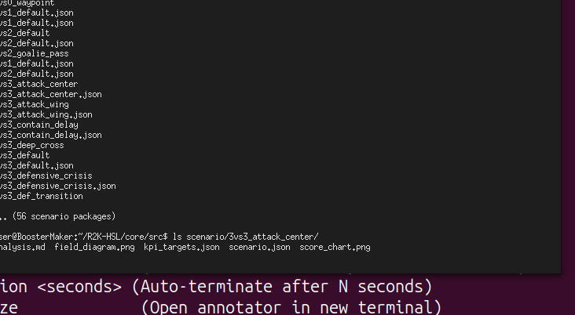
*56 scenario packages; each contains scenario.json, kpi_targets.json, analysis.md, field_diagram.png, score_chart.png.*

**Scenario visuals (from a package: `3vs3_attack_center`)**

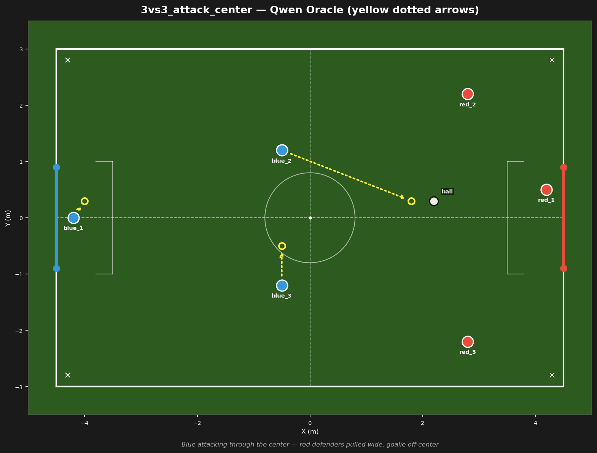
*`field_diagram.png` — the start situation with per-bot intent arrows.*

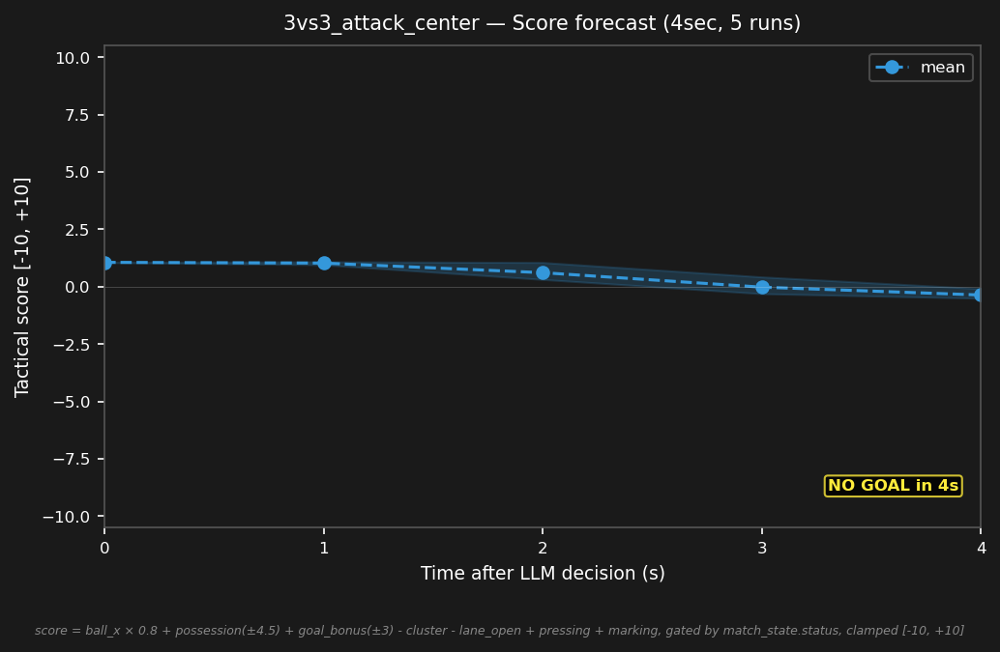
*`score_chart.png` — score forecast/trajectory for the scenario.*

**Three views (mockup)**

```
┌ World model ───────┐ ┌ Score delta ─────┐ ┌ LLM stream ─────────┐
│ field + bots + ball│ │ score over time  │ │ assignments as text │
│ LLM intents (arrow)│ │ event markers    │ │ + prompt hash + lat │
│ click: bot info    │ │ (goal, foul, …)  │ │ filter: bot/status  │
└────────────────────┘ └──────────────────┘ └─────────────────────┘
```

**Notes**
- Visualizer modes today: `--live`, `--replay` (f/b/SPACE/arrows), annotation overlay, waypath overlay (demo)
- Yellow arrows = LLM **intent** — the bridge overrides some targets (goalie blending) → make the difference visible
- A/B runner: arm = fragment set + match list + KPI merge (like `s1_live_eval.sh`)
- Probe browser: corpus × variant × predicate success (tables like the S1 report)

**Today's reality — the visualizer (replay mode)**

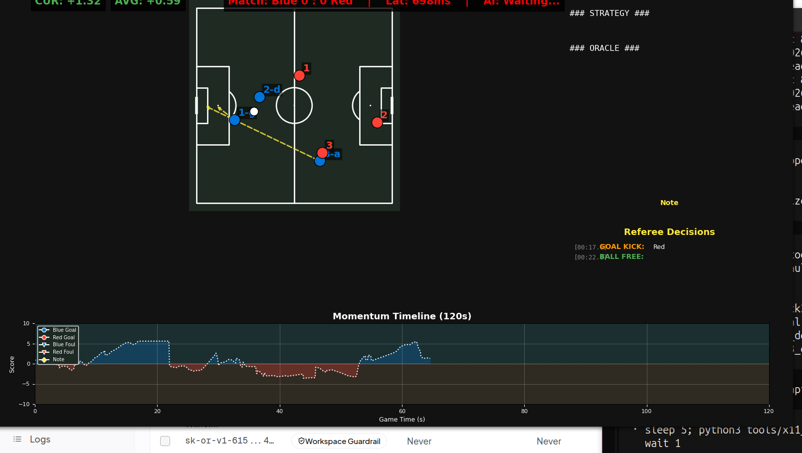
*`r2k_visualizer.py --replay <run_id>` — pitch, bots, ball, LLM intent arrows, score/momentum timeline (bottom), referee events (right). This is the "world model view" the GUI builds on.*

> **WHITEBOARD B2 — The experimenter's default working view?**
> **A)** world model first · **B)** LLM stream first · **C)** configurable layout split

---

## B3 — QA

**[MOCKUP] KPI dashboard with traffic lights**

```
┌─ QA dashboard — Run 3vs3_default_… ────────────────┐
│ goals B:R        1:1      ●  (target ≥0.6 B/match)│
│ possession       58%      ●                        │
│ goalie_tactical  96%      ●  (≥60%)                │
│ latency p50      658ms    ◐  (≤750)                │
│ cluster          25%      ◐  (≤26)                 │
│ parse_err        0.2%     ●  (<1%)                 │
│ Suite: [Fast ▶] [Slow ▶]  last run: green          │
└────────────────────────────────────────────────────┘
```

**Test pyramid**

```
        ▲  live eval (10+ matches, A/B arms)
       ▲▲  slow suite (real 120s matches, KPI asserts)
      ▲▲▲  fast tier (~500 unit tests, 2s)
     ▲▲▲▲  text probe (predicate corpus, proxy — no Gazebo)
```

**Notes:** static = code-based functional + text probe · dynamic = slow-suite regression + KPI thresholds from `kpi_targets.json` · ◆LLM: test case generation from observed failures

**KPI extraction in the terminal**

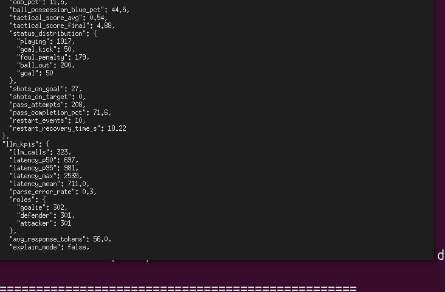
*`analyze_trace.py --run-id <run_id>` — offline KPI extraction joining llm_trace + world_trace. This output is what the QA dashboard visualizes.*

> **WHITEBOARD B3 — Who sees the QA dashboard?**
> **A)** QA only · **B)** all roles (transparency) · **C)** auto-post into the session digest

---

## B4 — Administration

**[FIGURE] Router as search index** (META_KNOWLEDGE_ROUTER = inverted index symptom → power file)

```
┌ GUI search: "goalie leaves goal" ───────────────┐
│ → 8_C3_SOCCER_KNOWLEDGE §V1 (V1 samples)        │
│ → 3_AI_LOGIC §V6.1 (goalie blending)            │
│ → SESSION_CHANGELOG 2026-08-22 (B13 fix)        │
│ [◆ hand context to LLM ▶]                       │
└──────────────────────────────────────────────────┘
```

**Notes:** KB map (power files 1–8 + router + rulebook) · branch/scenario registry status · session digest (changelog → 5 lines) · jump start for new team members

> **WHITEBOARD B4 — Access to the knowledge base?**
> **A)** GUI search + read-only · **B)** + LLM answers grounded in the power files · **C)** + handoff to an opencode session with context preloaded

---

## B5 — Support

**Notes**
- **Demo/calibration mode:** waypoint editor, fast path (stop/resume/home), waypath display; appearances at fairs & events, edge-computing showcase
- **K1 deployment checklist:** booster_msgs built? RPC reachable? calibrated? abort path tested?
- **ROS 2 monitoring:** rqt_graph / topic echo / RViz2 (see A4) — launch buttons up to full embedding
- **SAFETY (added):** the 0.2s watchdog + kinematic freeze + hard kill end EVERY session — the GUI shows the emergency state and never bypasses teardown
- New bot types: Yahboom as trailer for A0 frames (beyond v6.7)

**Demo mode in practice**

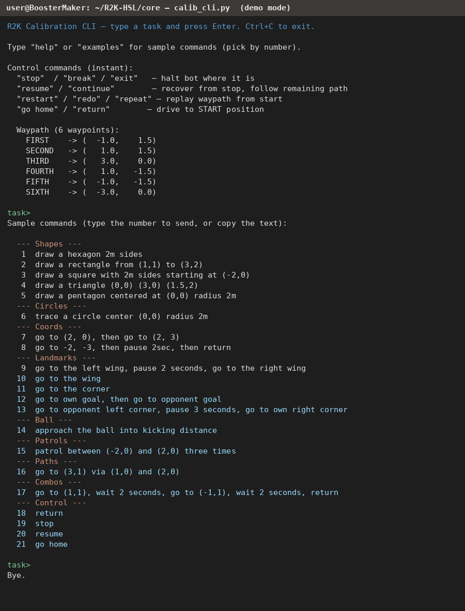
*`calib_cli.py` — the interactive demo/calibration CLI: fast-path control commands (stop/resume/restart/go home) and 21 numbered sample tasks (waypoints, patrols, paths, combos).*

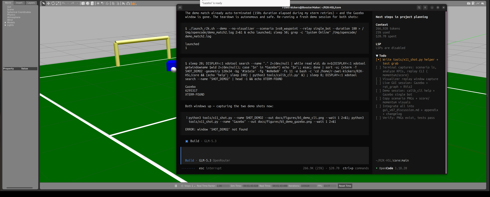
*Demo mode in Gazebo: a single bot on the field (`1vs0_waypoint`, relay `single_bot`) — calibration without soccer opponents.*

> **WHITEBOARD B5 — Replace demo operation with the GUI?**
> **A)** CLI stays, GUI only monitors · **B)** GUI leads (guide + start/stop) · **C)** guest mode (start/stop only, no edits)

---

## B6 — Freshmen

**[FIGURE] Guided tour — stations**

```
Station 1: watch a match (what is happening here?)
   ↓
Station 2: world state & prompt (where does the LLM decide?)
   ↓
Station 3: change a fragment + probe (what happens?)
   ↓
Station 4: replay & annotation (how to analyze)
   ↓
Station 5: knowledge base & router (where is what written?)
```

**Notes:** glossary tooltips from the vocabulary dictionary (inter-lingua!) · ◆proactive LLM-in-the-loop: opencode text interface embedded, context from the router · show first, then let them do

> **WHITEBOARD B6 — Onboarding: curated or LLM-guided?**
> **A)** fixed tour (stations above) · **B)** free LLM Q&A · **C)** hybrid: tour + assistant alongside

---

# PART II — WORKFLOWS (Phase 2 fills in the details)

| # | Workflow | Roles | Trigger | Core visual (Phase 3) |
|---|---|---|---|---|
| C1 | **Play a match** (live sim, LLM blue vs. Python red) | all + demo | show/explain | flow diagram: start → scenario/strategy → match → debrief |
| C2 | **Calibration/demo** (fairs, drives, K1) | Support | fair/development | waypoint flow + K1 checklist |
| C3 | **Match debrief** (replay, annotation, console, ◆LLM interaction) | Experimentation, QA | after a match | replay controls + annotation view |
| C4 | **Benchmark & scientific documentation** (which variants, why successful) | QA + Experimentation | release/iteration | A/B arm diagram + KPI comparison |
| C5 | **Knowledge work** (router search, opencode, jump start) | Admin + all | ongoing | router index schema |
| C6 | **Test case authoring** (static: functional + text probe · dynamic: regression + KPI) | QA | before merge | test pyramid |

**Candidates** (Phase 2 decides promotion to standalone workflows):
C7 fragment iteration (probe → edit → re-probe — currently hidden in B1/C4) · C8 regression gate before merge (QA slice of C6) · C9 freshmen onboarding (B6 as a flow) · C10 fault diagnosis (watchdog, latency triage, GPU)

**Fact cards belonging to C1 (print):** Why 3B? (latency ~570–660ms p50 on a consumer GPU, local, 2 GB VRAM) · RoboCup rules & auto-referee (rulebook-close, no offside, kick-in instead of throw-in) · strategy/scenario: what for (controlled situations, KPI corridors)

---

## C3 deep dive — score & momentum visuals (today's tools)

**Tactical score + momentum over a full match**

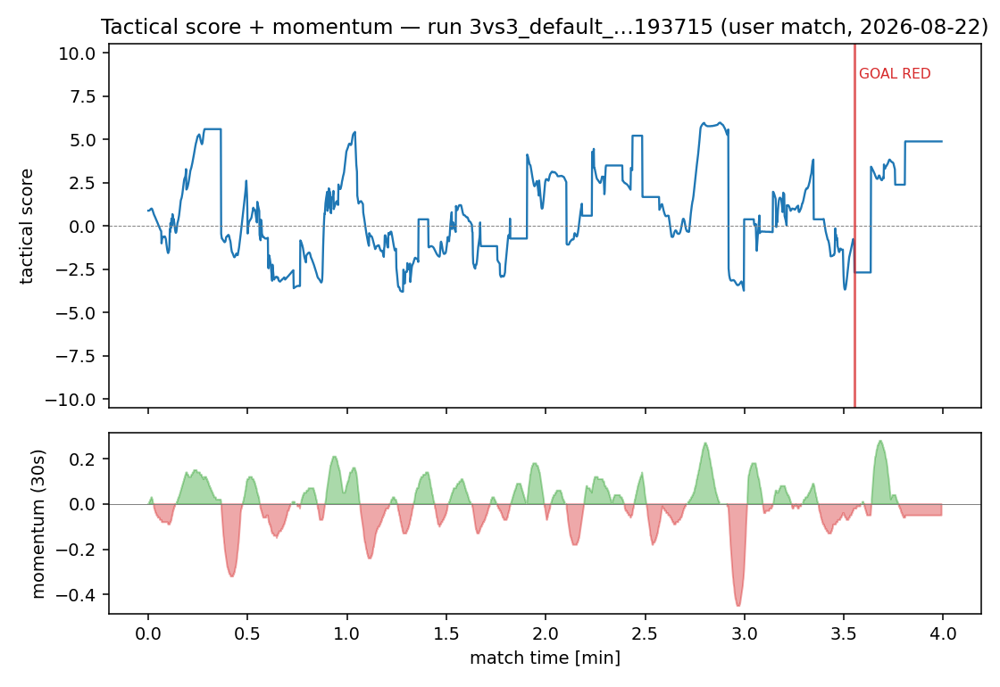
*Score timeline (top, clamped ±10) with goal markers and momentum (bottom, 30s window, green = blue-positive) — generated offline from `world_trace`. This is the "score delta view" of B2, today.*

**Replay review in the terminal**

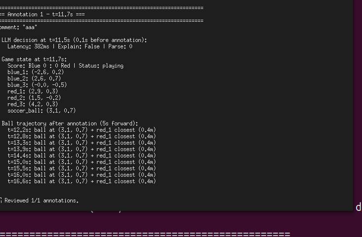
*`replay_trace.py --run-id <run_id>` — post-match annotation review in the terminal. The visualizer replay (B2) covers the same material visually.*

---

# PART III — FOUNDATION (what every GUI must reflect)

## A1 — Prompt Assembly: from Fragments to Behavior

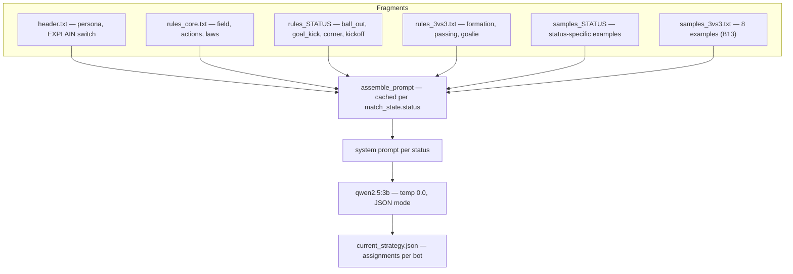

**Notes**
- Fragments instead of a monolith: rules + few-shot samples + status fragments (additive)
- **Kicker identities & goalie anchors in the examples are load-bearing** (S1: 71%→11% over-kick purely via example identities)
- Prompt brittleness: single edits flip distant behaviors → every change must be re-tested
- EXPLAIN mode: `analysis`/`oracle` in addition to `assignments`

**[MOCKUP] Prompt viewer — active fragments per status as colored bands**

```
┌─ Prompt viewer ───────────── status: ball_out ─┐
│ header.txt      ████████████████████████  45 tok │
│ rules_core      ██████████████████        98 tok │
│ rules_ball_out  ████     ← status-specific (add.)│
│ rules_3vs3      ███████████████           81 tok │
│ samples_3vs3    █████████████████████████ 640 tok│
│ Σ ~2,800 tok · prompt hash ff9359a · cache hit   │
└───────────────────────────────────────────────────┘
```

> **WHITEBOARD A1 — The prompt in the GUI: view only or editable?**
> **A)** read-only viewer (safe) · **B)** fragment editor with versioning · **C)** editor + probe coupling (edit → text probe runs automatically)

---

## A2 — Relay, Phantom Kick, Eye-in-the-Sky, K1

**Relay profile — original file `src/relay/hardware_mirror.json`**

```json
{
  "relay_id": "hardware_mirror",
  "requires_hardware_sync": true,
  "mapping": {
    "blue_1": {"hardware_type": "virtual", "topic": "/blue_1/cmd_vel"},
    "blue_2": {"hardware_type": "virtual", "topic": "/blue_2/cmd_vel"},
    "bot1": {"hardware_type": "yahboom", "topic": "/bot1/cmd_vel", "mirror_of": "blue_1"},
    "k1_bot": {"hardware_type": "k1", "topic": "/Kev1n/LocoApiTopicReq", "mirror_of": "blue_1"}
  }
}
```

**How to read it:** each line maps a bot name to a hardware type + topic. `hardware_type` ∈ {`virtual`, `yahboom`, `k1`} selects the bridge's command path (Twist / Twist / RPC). `mirror_of` mirrors a strategy bot onto real hardware — the same instruction goes to Gazebo AND the physical bot in parallel (live Sim2Real).

**Hardware capability matrix (condensed — what it means for kicking)**

| Bot | Can kick? | Mechanism | Abort needed? | Special |
|---|---|---|---|---|
| Gazebo (virtual) | yes | phantom kick (velocity reset via `set_entity_state`) | no | instant, full range |
| Booster K1 | yes | kShoot/kVisualKick — **autonomous chase** | **yes** (kChangeMode 2000) | chases the ball forever if not aborted |
| Yahboom | try | metal push bar at the front | no | short, untested |
| Trailer | no | — | — | candidate: Yahboom as trailer for A0 frames |

**Notes**
- Eye-in-the-sky: `/gazebo/model_states` = absolute ground truth — no `/odom`, no TF2
- K1 ignores `cmd_vel`: RPC 2001 (move), 2000 (failsafe/lock) on the LocoApi topic
- Relay profiles mix hardware types (testing); tournaments forbid mixed teams → per-bot `can_kick` flag (beyond v6.7)

> **WHITEBOARD A2 — Depth of the hardware representation?**
> **A)** status traffic light per bot · **B)** per-bot parameters & diagnostics · **C)** deployment wizard (especially K1)

---

## A3 — Referee, Score, KPI Landscape

**[FIGURE] Field with referee zones** (reuse `referee_rulebook.md`; print version to be generated separately)

```
Y+3 ┌────────────────────────────────────────────────┐
    │   GOAL AREA          CENTER       GOAL AREA     │
Y+1 │  ┌──────┐          X=0             ┌──────┐     │
    │══│ GOAL │                           │ GOAL │══   │ ← goal mouth ±0.9
Y 0 │══│±0.9  │            ●              │ ±0.9 │══   │
    │  └──────┘                           └──────┘     │
Y-1 │   goal area ±3.5/±1.0              goal area    │
    │   corner flags ±4.3/±2.8 (4 corners)             │
Y-3 └────────────────────────────────────────────────┘
  X=-4.5 BLUE defends                    X=+4.5 RED
```

**All KPIs (original names from `analyze_trace.py`; thresholds from `kpi_targets.json`, current top-level level)**

| Group | KPI (original name) | min | max | Direction |
|---|---|---|---|---|
| Outcome | `goals_for_blue` | 0.0 | – | higher is better |
| | `goals_for_red` (info) | – | – | lower is better |
| Structure | `ball_possession_blue_pct` | 6.3 | 100 | higher |
| | `pass_completion_pct` | 36.1 | 100 | higher |
| | `cluster_pct` | 0 | 54.5 | lower |
| | `oob_pct` | 0 | 31.6 | lower |
| Goalie | `goalie_tactical_pct` | 75.6 | 100 | higher |
| | `goalie_idle_pct` | 0 | 100 | lower |
| Attack | `shots_on_goal` | 0 | – | higher |
| | `shots_on_target` | 0 | – | higher |
| | `restart_recovery_time_s` | 0 | 42.1 | lower |
| Tactics | `tactical_score_avg` | −1.6 | – | higher |
| | `composite_score` | 0.25 | 1.0 | higher |
| Latency/parse | `latency_p50` | 0 | 871 (ms) | lower |
| | `parse_error_rate` | 0 | 0.0 | lower |
| Raw data (not asserted) | `latency_p95`, `latency_max`, `latency_mean`, `pass_attempts`, `restart_events`, `status_distribution`, `llm_calls`, `avg_response_tokens`, `duration_s`, `frames` | – | – | info |

*Versioning note:* `kpi_targets.json` preserves earlier threshold levels as blocks (`v63_thresholds`, `v65_u22_preparse`, `v65_u24_postparse`) — the GUI should show threshold history, not just the current value.

**The score function (from `score_node.py` — original constants; "V7f" is the formula's internal revision label, not the ROS2K system version — current system: v6.7)**

```
score = clamp(±10,
      ball_x · 0.8                                        (BALL_POSITION_GAIN)
    + (max(0, 4.5−d_blue) − max(0, 4.5−d_red)) · 1.0      (POSSESSION, ref 4.5m)
    + max(0, 3.0 − d_blue) · 1.0                          (PRESSING, ref 3.0m)
    + [red closer to ball] max(0, 3.0 − d(blue↔red)) · 0.5 (MARKING, nearest blue-red dist)
    − max(0, 2.0 − min_pair_dist) · 1.5                   (CLUSTER penalty, ref 2.0m)
    − [ball in own half ∧ no blocker] up to 1.5           (LANE-OPEN penalty)
    ± 3.0 per goal                                        (GOAL_BONUS, only when status=playing)
)
```

**Editable?** — No, not via configuration: all weights are named module constants in `score_node.py` (code change required). The **thresholds** in `kpi_targets.json` ARE editable (JSON file). Composite separately: the formula lives in `test_non_functional.py::compute_composite` — also code.

**Notes**
- Set-piece flow: foul/ball out → freeze → countdown → restart team takes it
- Composite (benchmark): 0.4·goal diff + 0.3·tactics + 0.2·possession + 0.1·latency

> **WHITEBOARD A3 — Which KPIs earn dashboard space?**
> **A)** 3 core KPIs large (goals, possession, latency) · **B)** configurable per role · **C)** scenario-dependent from `kpi_targets.json`

> **WHITEBOARD A3b — Make the score weights configurable?**
> **A)** no, code stays the source of truth · **B)** move weights into a config file (GUI-editable, versionable) · **C)** display-only of the current weights in the GUI

---

## A4 — ROS 2 Toolbox (external + own nodes)

**Own nodes (mini ROS graph)**

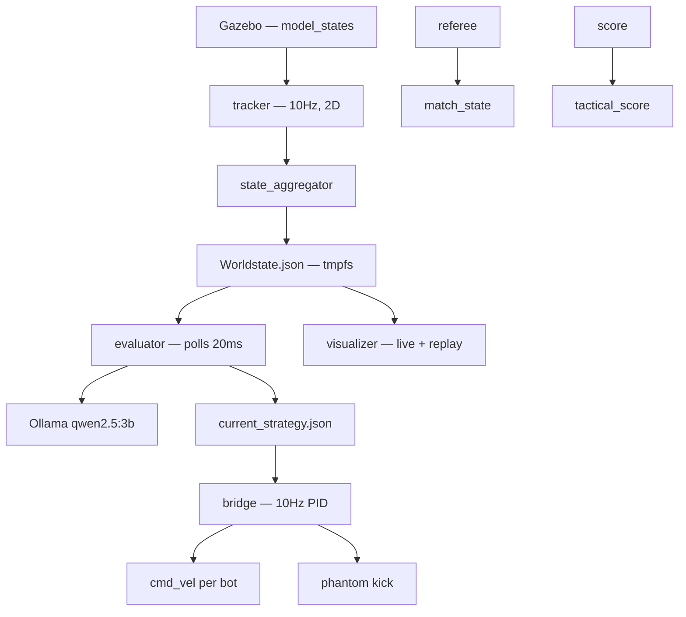

**External tools (embed screenshots)**

| Tool | What for | Screenshot |
|---|---|---|
| rqt_graph | live node/topic overview | captured live below |
| ros2 topic echo | inspect raw messages | `/match_state` excerpt |
| RViz2 | 3D visualization | sample below |
| Gazebo GUI | sim view, camera window | captured live below |

**Captured tools (live session, 2026-08-22)**

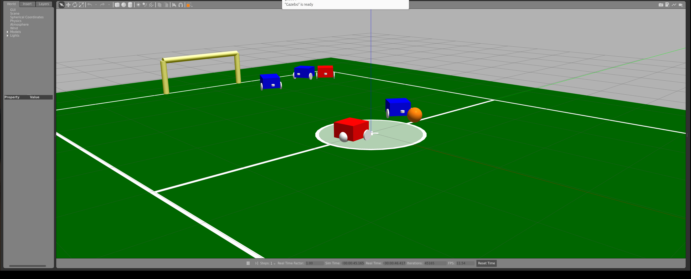
*Gazebo during a live `3vs3_default` match — the sim view with camera window.*

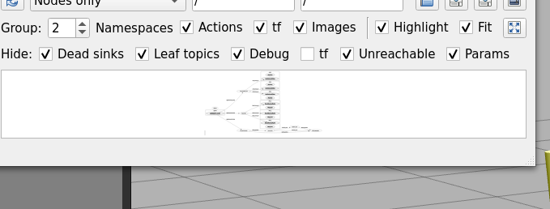
*rqt_graph live: the ROS 2 node/topic graph of a running match (tracker, state_aggregator, referee, score, bridge, evaluator).*

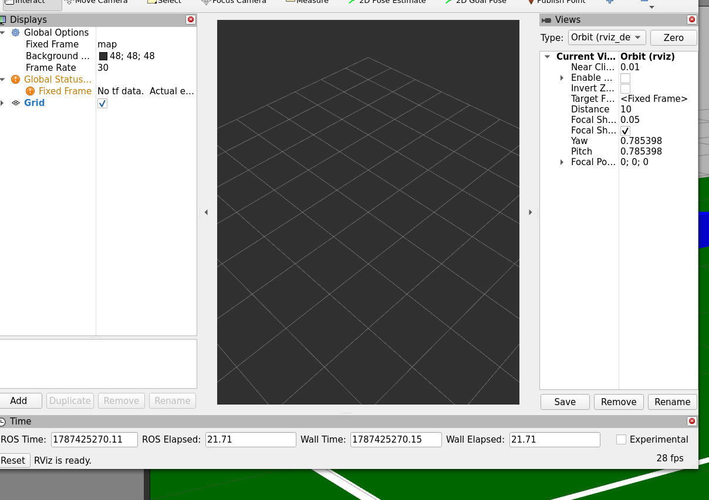
*RViz2 sample — deliberately shown near-empty: ROS2K publishes no TF frames today, so RViz2 has nothing to anchor. This gap is itself a GUI discussion point (what would we need to publish to make RViz2 useful?).*

> **WHITEBOARD A4 — Embed external tools or build a custom graph view?**
> **A)** references/launch buttons only · **B)** embedded (rqt/RViz2 as panels) · **C)** custom simplified graph view

> **→ ANNEX:** feasibility check done — iframes make option B concrete for Gazebo
> (GZWeb) and the camera (MJPEG); a custom simplified graph view covers rqt_graph;
> RViz2 deferred (no TF today). Embedding matrix: see ANNEX, N1.

---

## A5 — Concept Checklist: what the GUI must reflect

| # | Concept | GUI consequence |
|---|---|---|
| 1 | `match_state.status` drives the prompt | status bar everywhere; prompt viewer per status |
| 2 | Two-tier tests (fast ~500 unit / slow live match) | suite trigger in the GUI; traffic lights against `kpi_targets.json` |
| 3 | Text probe = validated proxy (ff 71% text ↔ 91% live) | probe results prominent — "dry dock" for prompt changes |
| 4 | R2K_RUN_ID observability (llm_trace + world_trace) | tie everything to the run ID; replay & analysis |
| 5 | Relay profiles (virtual/yahboom/k1 mixed) | hardware matrix per bot; type visible |
| 6 | Watchdog/safety (0.2s, kinematic freeze) | the GUI NEVER bypasses teardown; emergency stop visible |
| 7 | Knowledge base: power files + META-ROUTER (inverted index) | search via the router index; LLM context-loaded |
| 8 | Demo/calibration mode (own prompt, no soccer knowledge) | own GUI mode, waypoints + fast path |
| 9 | EXPLAIN mode (analysis/oracle) | XAI panel |
| 10 | Inter-lingua (coordinates instead of jargon — jargon does not steer) | glossary tooltips; vocabulary check on fragment edit |

---

# EDGE — A GLANCE BEYOND v6.7 (one page)

| Topic | GUI seam |
|---|---|
| K1 image recognition | world model becomes multi-source → the view must mix sources |
| TeamCaptain (CPU planner at 10Hz) beside the LLM (1.5Hz) | make two decision levels visible — who has control right now? |
| Robot↔robot / LLM communication | message stream as its own view |
| STT in demo mode | voice input channel in the demo guide |

**Message:** plan the GUI to be extensible at these seams — the world model and the decision sources are already the natural integration points today.

---

# ANNEX — HTML GUI FEASIBILITY (added 2026-08-25)

> **Status:** feasibility round done — answers the *technical* half of the open
> questions (A4 embed question, one-GUI-vs-family). The *team decision* half stays
> open. Trigger: user requirement "Spotify-style GUI with widgets" — docked panels,
> role sidebar, everything in the browser.
> Cross-referenced from B0 (role matrix) and A4 (external tools).

## N1 — Verdict & Embedding Matrix

**Verdict: feasible — and cheaper than it looks.** ~80% of the wished widgets (B0–B5)
need **zero ROS in the browser**: they ride the tmpfs file bus. The two Gazebo views
embed via proven web mechanisms (GZWeb iframe, MJPEG). Only rqt_graph / topic echo /
RViz2 would need a ROS bridge — and all three have cheaper answers.

| Widget (source) | Data source | Embedding | ROS in browser? |
|---|---|---|---|
| World model view (B2) | `Worldstate.json` 10 Hz | native canvas/SVG re-render | no |
| LLM stream (B2) | `current_strategy.json` + `llm_trace` | native text panel | no |
| Score/momentum timeline (B2/C3) | `world_trace` | native chart | no |
| Prompt viewer (A1/B1) | fragments + trace `sys_prompt_hash` | native panel | no |
| XAI panel (B1) | `llm_trace` (EXPLAIN records) | native panel | no |
| KPI dashboard (B3) | `analyze_trace.py` / `kpi_targets.json` | native panel | no |
| Replay + annotations (C3) | `world_trace` + `llm_trace` | native canvas + controls | no |
| Router search / KB map (B4) | power files + router | native panel | no |
| Demo guide (B5) | `waypoints.json`, `task_input.json` | native panel | no |
| **Gazebo 3D sim view (A4)** | gzserver scene | **GZWeb iframe** (native web client for Gazebo Classic) | no — GZWeb brings its own WebSocket |
| **Gazebo camera (A4)** | camera sensor topic | **MJPEG via `web_video_server`** (cheap alternative) | no — plain `` tag |
| rqt_graph (A4) | ROS graph | custom simplified view (the A4 mermaid is 90% of it) or defer | barely |
| ros2 topic echo (A4) | any topic | `rosbridge_suite` — only if needed later | yes (that is its purpose) |
| RViz2 (A4) | TF + markers | **defer** — ROS2K publishes no TF today (see A4 screenshot) | — |

**Do NOT stream the visualizer.** Re-render natively in the browser (canvas/SVG from
`Worldstate.json`) — streaming matplotlib frames over the network wastes exactly the
bandwidth the visualizer already struggles with. The existing `r2k_visualizer.py`
stays for screenshots and offline replay; the GUI re-draws, it does not re-stream.

## N2 — The File-Bus Insight (~80% need zero ROS)

ROS2K's decoupling axiom (agent axiom 3: LLM ↔ strategy via tmpfs file polling)
**is already a message bus**:

```
Worldstate.json          10 Hz      (state_aggregator, atomic rename)
current_strategy.json    ~1.5 Hz    (evaluator: assignments + latency + model)
llm_trace_*.jsonl        per call   (prompt, response, timings)
world_trace_*.jsonl      10 Hz      (entities + match_state + score)
```

A GUI needs only a **small WebSocket backend on the host** (Python, CPU,
observe-only): tail the files (mtime poll + content hash — the evaluator's own
pattern), push deltas to the browser. The GUI inherits the architecture instead of
fighting it. Bonus: the same backend serves replay (traces are append-only JSONL) —
live view and replay view become the same widget with different clocks.

## N3 — Chosen Architecture: Hybrid, Three Layers

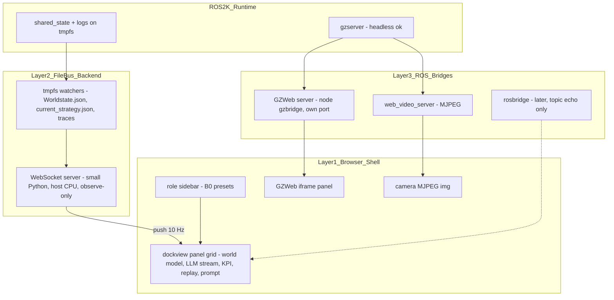

- **Shell (browser):** custom dockview shell — Spotify-style docked panels + role
  sidebar. One shell, docked modes (see N6).
- **File-bus backend (host, CPU):** observes only; no ROS imports needed.
- **ROS bridges (opt-in):** each is an iframe/embed with its own port — GZWeb, MJPEG
  camera, rosbridge later. None sits in the shell's data path.
- Docker note: the Gazebo container already runs `network_mode: host` — every bridge
  port is directly reachable from the host browser, no port mapping needed.

## N4 — GZWeb PoC = Gate 1 (before any widget) — **PASSED 2026-08-26**

The hardest embedding problem gets validated **first**: if the 3D scene cannot reach
the browser, the architecture shrinks to file-bus shell + MJPEG — a different product.
Better to know after 2 hours than after 2 weeks of widget building.

**PoC result (executed on U24, container `core_gazebo`, Gazebo 11.10.2):**

| Check | Result |
|---|---|
| GZWeb build on jammy (source, osrf/gzweb `93b6a6f`) | ✅ apt: no gzweb package (as predicted); source build works — deps `nodejs`/`npm` (jammy), `libjansson-dev`, `imagemagick`; `libgazebo-dev` already in image |
| Build time | ~10 min (npm install dominates; grunt + cmake + node-gyp all clean) |
| gzbridge → gzserver connection | ✅ native Gazebo transport, no ROS needed |
| Scene over websocket (`~/scene`) | ✅ all 19 models (field, lines, goals, ball, 6 bots) with poses |
| Live poses over websocket (`~/pose/info`) | ✅ only moving entities stream; blue_1 arc-drive verified (-4.0,0)→(-3.1,3.1) |
| Scene render in browser | ✅ headless-Chrome screenshot: green field 24.8% of frame, blue/red bots + goal posts as color clusters |
| Moving bots in browser scene graph | ✅ blue_2 position in the client's THREE.js scene updates live (verified via CDP probe: 7m in 12s) |
| Known upstream limitation found + fixed | GZWeb renders inline SDF materials WHITE (only material *scripts* are parsed) — **patched**: `tools/gzweb_inline_material.patch` (parseMaterial falls back to inline ambient/diffuse/specular) |
| Known headless test artifact | `Page.captureScreenshot`/`readPixels` do not capture animated WebGL frames under software GL (SwiftShader) — animation proof uses the live scene-graph probe instead; real browsers render via rAF normally |

**Codified:** Dockerfile carries the apt deps; `tools/setup_gzweb.sh` (idempotent:
clone → patch → deploy `-m local`). Run inside the container; server start:
`docker exec -d core_gazebo bash -c 'cd /opt/gzweb/gzbridge && ./server.js 8080'`
→ http://localhost:8080 (host browser; container runs `network_mode: host`).

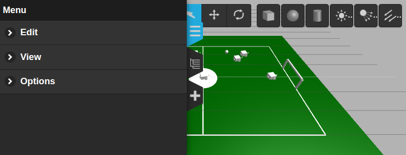
*Headless-Chrome capture of the live GZWeb client after the inline-material patch:
green pitch, goal posts, 6 bots. (Time widget mid-update at top.)*

**Fallbacks not needed:** camera-plugin MJPEG and noVNC remain documented options
(for K1 camera views etc.) but GZWeb itself works.

**PoC plan (original):**
1. Extend the Docker image: **GZWeb** (osrf/gzweb — the native web client for Gazebo
   Classic 11). Built from source; **apt availability on jammy to be verified in the
   PoC**.
2. Fallbacks, in order: (a) camera-plugin **MJPEG** — needs a world-file camera
   sensor (colcon rebuild) + `web_video_server`; (b) **noVNC of gzclient on :1** —
   works today via X11, clunky, zero new dependencies.
3. **Acceptance:** live scene visible in the browser with moving bots (GZWeb's
   native mode is headless gzserver — bonus: it also covers `--headless` matches).
4. Est. **1–2h**.

Plausibility argument: gzclient already runs with `LIBGL_ALWAYS_SOFTWARE=1` (software
GL in the container) — GZWeb moves rendering into the *browser's* GPU and only
streams scene updates. The laptop plausibly gets lighter, not heavier.

## N5 — Safety Constraints (non-negotiable)

- **The GUI observes only** (PoC and first releases): the file-bus backend reads
  tmpfs + logs, never writes production files.
- **Watchdog/teardown stays authoritative:** the 0.2s watchdog + kinematic freeze +
  hard kill remain the ONLY teardown path (A5 concept 6). The GUI shows the
  emergency state; it never bypasses teardown.
- **Stack control goes through a `launch_r2k.sh` wrapper** (subprocess) — even if the
  GUI later leads start/stop (whiteboard B5 B/C), the watchdog path stays intact.
- Write paths (fragment editor B1, demo `task_input.json` B5) are separate later
  gates with their own review — explicitly out of scope here.

## N6 — Two Whiteboard Cards Pre-Answered (evidence, not decisions)

> **A4 — "embed external tools or build a custom graph view?"**
> Iframes make **option B concrete**: GZWeb runs as a docked iframe panel next to
> custom panels. A (launch buttons) and B (embedded) stop being either/or.

> **"One GUI vs. a family of GUIs"** (raised in the discussion round)
> The dockview shell answers it architecturally: **one shell, docked modes** — the
> role sidebar (B0) switches panel presets (freshmen get the tour layout, QA the
> dashboard layout). Both options become the same codebase; the team only picks the
> default layouts.

*These are noted as evidence for the discussion, not as decisions.*

## N7 — Frontend Choice (recorded)

- **Now: no-build vanilla HTML/ES modules + dockview (MIT) via CDN.** Team-runnable
  with zero toolchain — matches ROS2K's flat-file philosophy; every member can run
  and modify it with a browser.
- **Growth path: React + Vite** (documented, not started). Switch when no-build ES
  modules start hurting — the data plumbing (file bus), not view complexity, is this
  GUI's bottleneck, so a toolchain buys nothing at PoC size.

---

# APPENDIX — VISUAL PRODUCTION LIST

| # | Visual | Type | Status |
|---|---|---|---|
| 1 | Prompt assembly layers (A1) | mermaid | **done** (vertical, code above) |
| 2 | Prompt viewer mockup (A1) | ASCII→graphic | draft above |
| 3 | Relay JSON `hardware_mirror.json` (A2) | code block | **done** (original file) |
| 4 | Hardware capability matrix (A2) | table | done |
| 5 | Field + referee zones (A3) | figure | ASCII above |
| 6 | Complete KPI table with thresholds (A3) | table | **done** (original data) |
| 7 | Score function (A3) | formula block | **done** (original constants) |
| 8 | ROS graph (A4) | mermaid | **done** (vertical, code above) |
| 9 | Gazebo GUI live | screenshot | **done** — `figures/a4_gazebo.png` |
| 10 | rqt_graph live | screenshot | **done** — `figures/a4_rqt_graph.png` |
| 11 | RViz2 sample | screenshot | **done** — `figures/a4_rviz2.png` (near-empty by design — no TF today, discussion point) |
| 12 | Concept checklist (A5) | table (10 items) | done |
| 13 | Role matrix (B0) | spread table | done |
| 14 | File map (B1) | table | done |
| 15 | XAI panel (B1) | mockup | draft above |
| 16 | Scenario package listing | terminal screenshot | **done** — `figures/b2_scenario_pkg.png` |
| 17 | Field diagram (scenario pkg) | PNG | **done** — `figures/b2_field_diagram.png` (copied from `3vs3_attack_center`) |
| 18 | Score chart (scenario pkg) | PNG | **done** — `figures/b2_score_chart.png` (copied from `3vs3_attack_center`) |
| 19 | Visualizer replay window | screenshot | **done** — `figures/b2_visualizer_replay.png` |
| 20 | KPI dashboard (B3) | mockup | draft above |
| 21 | Test pyramid (B3) | graphic | draft above |
| 22 | analyze_trace terminal output | terminal screenshot | **done** — `figures/b3_analyze.png` |
| 23 | Router search (B4) | mockup | draft above |
| 24 | Tour stations (B6) | graphic | draft above |
| 25 | Demo CLI (calib_cli) | terminal screenshot | **done** — `figures/b5_demo_cli.png` |
| 26 | Demo Gazebo (single bot) | screenshot | **done** — `figures/b5_demo_gazebo.png` |
| 27 | Score + momentum over a match | matplotlib chart | **done** — `figures/c3_score_momentum.png` |
| 28 | Replay CLI | terminal screenshot | **done** — `figures/c3_replay_cli.png` |
| 29 | Whiteboard cards (12) | print cards | text above, layout Phase 3 |
| 30 | Workflow diagrams C1–C6 | flow diagrams | **Phase 2/3** |
| 31 | GUI three-layer architecture (ANNEX N3) | mermaid | **done** (vertical, annex above) |
| 32 | GZWeb PoC screenshot (ANNEX N4) | screenshot | **done** — `figures/n4_gzweb_colored.png` (gate 1 passed 2026-08-26) |

> **Rendering note:** this document is taken into Obsidian — mermaid blocks render natively there; embed `docs/figures/` alongside the markdown so the relative image paths resolve; export to PDF for the print version (A4 portrait). The mermaid diagrams are vertical (`graph TD`) and compact for single-column print. All screenshots were captured live on the U24 machine (X11 `DISPLAY=:1`, 2026-08-22).
