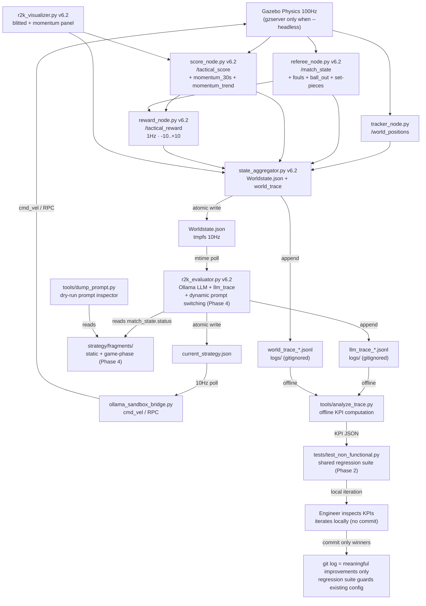

# ROS2K v6.2 — Unified Technical Specification

> [!abstract] Scope
> 3vs3 Gazebo simulation. No relay. Three models under test. Ten tactical scenarios.
> Automated evaluation pipeline with foul detection, momentum tracking, reward scoring,
> trace-based KPI measurement, and a bottom-up prompt engineering methodology.
>
> **v6.2 changelog (updated 2026-07-22):** Unifies the v6.1 infrastructure spec with
> the completed prompt engineering study (Phases 0-1). Drops the 5 named prompt variants
> (superseded by B-study). Adopts **trial-and-error optimization with shared regression
> tests**: engineers iterate locally (no commits per experiment), run a shared test suite
> of pre-defined scenarios, and commit only the final winning config. The shared test
> suite grows over time and guards against regressions. No external experiment-tracking
> framework (W&B, DSPy, Optuna) — uses tools students already know (pytest, git).

---

## 0. Management Summary

**What:** Optimize LLM soccer behavior by systematically comparing system prompts against
model choices, measured by objective KPIs in automated Gazebo runs.

**Why:** Current system had no quantitative feedback loop. v6.1 built the measurement
infrastructure. v6.2 uses it to run a bottom-up prompt study, consolidate findings, and
compare models — with regression protection so improvements don't accidentally revert.

**How:** Trial-and-error optimization with shared regression tests. 6 phases.
Phases 0-1 are complete. Phase 2 is the immediate next step.

**The paradigm — trial-and-error with shared regression tests:**

Optimization is **local**: an engineer edits fragments, runs the shared test suite,
inspects KPIs, iterates. No commit per experiment — only the **final winning config**
is committed. The shared test suite (`tests/test_non_functional.py`) is a set of
pre-defined scenarios with KPI thresholds. It grows over time as the team learns which
scenarios matter. Before committing a change, the engineer runs the full suite as a
regression check: "will this new design decision do harm to the existing config?"

- **Local iteration:** Edit fragments → run test suite → inspect KPIs → repeat (no commits)
- **Commit only winners:** When KPIs show improvement → commit the final config with KPI delta
- **Shared test suite:** `tests/test_non_functional.py` — pre-defined scenarios, KPI thresholds, grows over time
- **Regression protection:** Before commit, run full suite. If any threshold drops → don't commit.
- **Project roadmap:** `git log` shows only meaningful improvements (not every experiment)
- **No external framework:** Uses pytest + git, which students already know

> [!warning] Accepted limitation: local minima
> This approach may end in local minima — an engineer's trial-and-error may miss better
> configs that a systematic sweep would find. This is accepted: the team values
> **thoughtful engineering** over automated search. If manual iteration becomes a
> bottleneck, a prompt optimization framework (DSPy, Optuna) can be added later (Phase 5.9).

```
Local iteration (no commit):  edit fragment → run test suite → inspect KPIs → repeat
Commit only winners:           KPIs improved → run full regression suite → commit final config
Regression check:              new design decision → run shared test suite → no harm to existing?
```

| Phase | What | Status | Runs | Time |
|-------|------|--------|------|------|
| 0 | Foundation: infrastructure, set-pieces, instrumentation, prompt disentanglement | ✅ **DONE** | — | — |
| 1 | Prompt Engineering Study (B1-B7b, RQ1-RQ3) | ✅ **DONE** | 33 | ~1h |
| 2 | Goalie fix + shared test suite + 27-run baseline + threshold calibration | ⬜ **Next** | 27 | ~45min |
| 3 | Model Comparison (consolidated prompt × 9 scenarios × 3 models × 5 runs) | ⬜ Blocked | 135 | ~2.5h |
| 4 | Dynamic prompt injection + game-phase fragments + production commit | ⬜ Blocked | 45 | ~45min |
| 5 | Future Work (Kalman, predictive model, watchdog, failsafe, sim-to-real) | ⬜ Research | — | — |

**Total new compute:** 207 runs, ~4.5h.

**Outcome:** A shared regression test suite that guards performance. A git history of
meaningful improvements (not every experiment). A config map saying "for scenario X,
use strategy Y with model Z" backed by data. Plus a research roadmap for the next
architecture evolution.

**Key metrics (14 KPIs via `tools/analyze_trace.py`):**

| KPI | Source | Target |
|-----|--------|--------|
| Goal differential (blue - red) | world_trace | > 0 |
| Tactical score avg | world_trace | > -1.0 |
| Cluster % | world_trace | < 10% |
| Goalie idle % | world_trace | < 80% (structural limit — see §4.5) |
| OOB % | world_trace | < 10% |
| Ball possession (blue) | world_trace | > 50% |
| Latency p50 | llm_trace | < 1000ms |
| Parse error rate | llm_trace | < 5% |
| Role diversity | llm_trace | > 2 |

**Composite score:** `0.4×goal_diff_norm + 0.3×tac_score_norm + 0.2×possession + 0.1×latency_factor`

---

## 1. Architecture Overview



> **V6.1 trace logging layer:** Two JSONL files (`llm_trace_*.jsonl`, `world_trace_*.jsonl`)
> written during every run. Non-blocking, append-only, gitignored. Consumed offline by
> `analyze_trace.py`. Correlated via `R2K_RUN_ID` env var. See
> `1_CORE_ARCHITECTURE_AND_SYNC.md` §V6.1 Addendum and `6_DATA_SCHEMAS_AND_LIFECYCLE.md` §V6.1 Addendum.

---

## 2. Component Specifications (Reference)

> [!info] Full specifications in the referenced files
> v6.2 does not re-spec components from v6.1. The following are authoritative references.

### 2.1 Referee Node v6.2 (`referee_node.py`)
- **Authoritative reference:** `core/docs/referee_rulebook.md` (700-line rulebook with field
  diagrams, state machine, all thresholds, visualizer labels)
- **Summary:** `2_ROS2_PROTOCOLS_AND_FRAMES.md` §V6 Addendum
- **Key features:** Foul detection (pushing, blocking), ball-out, last-touch tracking,
  unified set-pieces (goal kick, corner kick-in, kickoff with 5s countdown), early
  restart termination on ball touch (0.3m), opponent warp (1.5m radius → 2m away)

### 2.2 Score Node v6.2 (`score_node.py`)
- Momentum: `deque(maxlen=300)` (30s at 10Hz), OLS linear regression, trend classification
- Output: `current_numerical_score`, `average_numerical_score`, `momentum_30s`, `momentum_trend`

### 2.3 Reward Node v6.2 (`reward_node.py`)
- 1Hz fixed update rate, -10..+10 scale, foul penalty -1.0
- Two code paths: mtime-polling (decision rewards) + `/match_state` subscription (foul penalties)

### 2.4 Shared Regression Suite (`tests/test_non_functional.py`) — **NEW (Phase 2)**

> [!warning] Not yet implemented
> `tests/test_non_functional.py` does not exist yet. It is the primary deliverable
> of Phase 2. See §7 Phase 2 for implementation details.

**Purpose:** A shared set of pre-defined test cases (scenarios) with KPI thresholds.
Engineers run this suite locally during trial-and-error optimization. Before committing
a change, the full suite acts as a regression check. The suite grows over time as the
team learns which scenarios and KPIs matter.

**Two modes of use:**

| Mode | When | What it does |
|------|------|-------------|
| **Single-scenario check** | During local iteration | Run one scenario, get KPIs fast (~140s). Engineer inspects: did my fragment change help or hurt? |
| **Full regression suite** | Before commit | Run all scenarios, assert all thresholds. If any KPI drops below threshold → don't commit. |

**Test structure:**
```python
# tests/test_non_functional.py
BASELINE = {
    "composite_score": 0.50,  # calibrated from Phase 2c baseline run
    "oob_pct": 10.0,
    "cluster_pct": 10.0,
    "latency_p50": 1000,
}

@pytest.mark.slow
def test_attack_center_performance():
    """Composite score on attack_center must not drop below baseline."""
    kpis = run_match_headless("3vs3_attack_center", duration=120)
    composite = compute_composite(kpis)
    assert composite >= BASELINE["composite_score"]
```

**Growing over time:** The suite starts with 1-3 scenarios (Phase 2). As the team
identifies worst scenarios (Phase 2d), new test cases are added. When game-phase
fragments are introduced (Phase 4), set-piece-specific tests are added. Each new
test case is a commit to the shared suite.

**CI integration — two speed tiers:**

`@pytest.mark.slow` is a label on tests that run real 120s Gazebo matches (~140s each).
`--skip-slow` is a pytest flag to skip all slow-labeled tests, running only fast unit tests.

| Tier | What runs | Duration | When |
|------|-----------|----------|------|
| **Fast** (`--skip-slow`) | Unit tests only (rule logic, parsing, set-piece math) | ~2 seconds | After every code change |
| **Slow** (default) | Non-functional tests (real matches with KPI assertions) | ~21 min for 9 scenarios | Before commit, nightly, or manual |

No CI infrastructure (GitHub Actions) needed — the engineer runs `pytest --skip-slow`
manually after editing code, and `pytest` (or specific slow tests) before committing a
config change.

### 2.5 Visualizer v6.2 (`r2k_visualizer.py`)
- Blitted artist updates (no `fig.clf`), ~30 FPS target
- Momentum sub-panel, referee decision panel, kickoff popup
- **Not yet tested with live ROS 2 + Gazebo** (only headless with stubbed rclpy)

### 2.6 Team Red v6.2 (`rule_evaluator_red.py`)
- Aggression factor 0.15, smoothstep + low-pass filter hysteresis
- V6.1 improvements: freeze bug fix (`restart_team` check), P1 boundary clamp (±1.0m
  restart / ±0.5m normal), P3 all-bots-hold-midfield, P4 blocking avoidance, P5 aggression
  guard during freeze
- See `3_AI_LOGIC_AND_EDGE_CASES.md` §V6.1 Addendum

### 2.7 Trace Instrumentation v6.2
- `r2k_evaluator.py:19-42`: LLM trace logger (one JSONL line per LLM call)
- `state_aggregator.py:28-71`: World-state trace logger (one JSONL line per 10Hz write)
- `tools/analyze_trace.py`: Offline KPI analyzer (14 KPIs from both trace files)
- `R2K_RUN_ID` env var: `launch_r2k.sh:82`, propagated to Docker via `docker exec -e`
- See `6_DATA_SCHEMAS_AND_LIFECYCLE.md` §V6.1 Addendum for schemas

### 2.8 `batch_evaluator.py` — **DEPRECATED (kept for reference)**

> [!info] No longer the primary optimization mechanism
> `batch_evaluator.py` was the v6.1 headless orchestrator. Its KPI collection was
> broken (`batch_evaluator.py:91` has `# TODO: Subscribe to ROS topics`). The v6.2
> paradigm replaces it with `tests/test_non_functional.py` (shared regression suite)
> + manual `launch_r2k.sh` + `analyze_trace.py` for local data collection. The file is
> kept for reference but is not required for any phase.

---

## 3. Test Scenarios

> [!info] Focus modes: 3vs3 (primary test matrix) and 2vs2 (secondary, faster iteration).
> 5vs5 scale-up is Phase 5.10 (future research).

### 3.1 Scenario Package Structure

Each test scenario is a **package** — a folder containing the scenario JSON, a field
visualization, analysis text, and KPI target ranges. This makes scenarios self-contained:
an engineer can look at one folder and understand the tactical situation, what the LLM
should do, and what KPIs to expect.

```
scenario/
├── 3vs3_attack_center/
│   ├── scenario.json          # entity positions, mode, tactical_situation
│   ├── field_diagram.png      # 2D field visualization (world model depiction)
│   ├── analysis.md            # oracle + expert analysis text
│   └── kpi_targets.json       # acceptable KPI ranges for this scenario
├── 3vs3_defensive_crisis/
│   ├── scenario.json
│   ├── field_diagram.png
│   ├── analysis.md
│   └── kpi_targets.json
├── 2vs2_default/
│   ├── scenario.json
│   ├── field_diagram.png
│   ├── analysis.md
│   └── kpi_targets.json
└── ...
```

**`scenario.json`** — entity positions + metadata (current schema, extended with `time_index`):

```json
{
  "scenario_name": "3vs3_attack_center",
  "mode": "3vs3",
  "tactical_situation": "Midfield, even formation — baseline decision quality",
  "time_index": 0,
  "entities": {
    "soccer_ball": { "x": 0.0, "y": 0.0 },
    "blue_1": { "x": -4.2, "y": 0.0 },
    "blue_2": { "x": -1.5, "y": 1.5 },
    "blue_3": { "x": -1.5, "y": -1.5 },
    "red_1": { "x": 4.2, "y": 0.0 },
    "red_2": { "x": 1.5, "y": 1.5 },
    "red_3": { "x": 1.5, "y": -1.5 }
  }
}
```

**`time_index`** — game time in seconds since match start (0 = kickoff). Game time is a
strategic input to the LLM: late-game decisions differ from early-game (urgency, risk-taking).
The `time_index` is injected into the world state so the LLM can reason about time pressure.
For static test scenarios, `time_index` is the starting time. For dynamic scenarios (future),
it advances with the simulation clock.

**`field_diagram.png`** — 2D top-down field visualization showing entity positions at
scenario start. Generated from `scenario.json` via a simple matplotlib script. Helps
engineers visualize the tactical situation without running a match.

**`analysis.md`** — human-authored analysis text with two sections:

- **Oracle** (strategic): what should happen in this scenario from a soccer tactics
  perspective. "Blue should exploit the central gap, push blue_2 and blue_3 forward
  while blue_1 holds the defensive line. Quick passing through midfield is key."
- **Expert** (technical): what the LLM should do technically. "Blue LLM should assign
  goalie role to blue_1 at X=-4.0, striker role to the bot closest to the ball, and
  supporter role to the third bot. Expect 2-3 role switches as the ball moves."

This text is NOT fed to the LLM — it's for the engineer to judge whether the LLM's
decisions make sense. The `oracle` and `expert` labels match the `--explain` output
keys (analysis/oracle/assignments) so engineers can compare LLM reasoning against
human analysis.

**`kpi_targets.json`** — acceptable KPI ranges for this scenario:

```json
{
  "scenario_name": "3vs3_attack_center",
  "composite_score": { "min": 0.45, "max": 1.0, "note": "baseline scenario, expect mid-range" },
  "oob_pct": { "min": 0.0, "max": 10.0, "note": "STAY INSIDE rule should keep this low" },
  "cluster_pct": { "min": 0.0, "max": 10.0, "note": "anti-clustering samples should help" },
  "goalie_idle_pct": { "min": 0.0, "max": 70.0, "note": "MUST be fixed in Phase 2a before baseline — 80-100% idle biases all score KPIs" },
  "latency_p50": { "min": 0, "max": 1000, "note": "qwen2.5-coder:3b on GPU" },
  "ball_possession_blue_pct": { "min": 45.0, "max": 100.0, "note": "even scenario, ~50% expected" },
  "goals_for_blue": { "min": 0, "max": 10, "note": "directional, high variance" }
}
```

The shared regression suite (`test_non_functional.py`) reads these per-scenario targets
instead of a global `BASELINE` dict — different scenarios have different acceptable ranges.

### 3.2 Test Matrix: 3vs3 (Primary) — Scenario-by-Scenario

Each scenario is presented with its field diagram, tactical analysis (oracle + expert),
and KPI target ranges. Field diagrams show colorized bots (blue = `#3498db`, red =
`#e74c3c`), goal posts (colored markers at ±0.9m Y), goal areas (±3.5m X, ±1.0m Y),
and the ball (white).

Diagrams are generated by `tools/gen_field_diagrams.py` from `scenario.json`.

---

**TC-01: Attack Center** — `3vs3_attack_center/`


- **Tactical situation:** Midfield, even formation — baseline decision quality
- **Oracle:** Blue should exploit the central gap between red bots. Push blue_2 and
  blue_3 forward through midfield while blue_1 holds the defensive line. Quick central
  passing is key — the even formation means whoever controls the center controls the game.
- **Expert:** Blue LLM should assign goalie to blue_1 at X=-4.0, striker to the bot
  closest to the ball, and supporter to the third. Expect 2-3 role switches as the ball
  moves. Central positioning and short passes should dominate.
- **KPI targets:** composite 0.40–1.0 · OOB < 10% · cluster < 10% · goalie_idle < 70% ·
  latency_p50 < 1000ms · possession 40–100%

---

**TC-02: Attack Wing** — `3vs3_attack_wing/`


- **Tactical situation:** Crossing, wing play
- **Oracle:** Blue should exploit the wing space. Cross from the side toward the center
  where a teammate can receive. Wing play stretches the red defense and creates gaps in
  the center. Blue_2 or blue_3 should drive down the sideline and cross.
- **Expert:** Blue LLM should route one bot wide (high |Y|), keep one central for the
  cross reception, and one defensive. Watch for OOB on the wing — STAY INSIDE rule is
  critical here. Crossing requires timing the Move targets.
- **KPI targets:** composite 0.35–1.0 · OOB < 15% · cluster < 12% · goalie_idle < 70% ·
  latency_p50 < 1000ms · possession 40–100%

---

**TC-03: Defensive Crisis** — `3vs3_defensive_crisis/`


- **Tactical situation:** Emergency clear, own zone
- **Oracle:** Blue is under pressure in own zone. Emergency clear — kick the ball away
  from own goal, toward the sidelines or upfield. Don't attempt fancy passes. Survival
  is the priority; regain shape after the clear.
- **Expert:** Blue LLM should assign Kick to the bot closest to the ball immediately.
  Other bots should fall back to defensive positions. Expect high tactical score
  volatility — defensive clears are low-quality but necessary.
- **KPI targets:** composite 0.25–0.80 · OOB < 10% · cluster < 15% · goalie_idle < 60% ·
  latency_p50 < 1000ms · possession 20–80%

---

**TC-04: Fast Counter** — `3vs3_fast_counter/`


- **Tactical situation:** Transition speed, open space
- **Oracle:** Blue should exploit open space with speed. As soon as possession is gained,
  push forward fast — one bot drives toward goal, one supports, one trails. The counter
  must be faster than red's recovery.
- **Expert:** Blue LLM should assign Move targets deep in red's half (X > 2.0). Striker
  should go for goal directly. Supporter trails at midfield. Speed matters — minimize
  role switches, keep assignments stable.
- **KPI targets:** composite 0.40–1.0 · OOB < 12% · cluster < 10% · goalie_idle < 70% ·
  latency_p50 < 1000ms · possession 40–100%

---

**TC-05: Pressing Trap** — `3vs3_pressing_trap/`


- **Tactical situation:** Breaking pressure, spacing
- **Oracle:** Blue is under high pressure from red. Maintain spacing — don't cluster.
  Short, safe passes to escape the press. If trapped on the sideline, play back to the
  goalie rather than forcing forward.
- **Expert:** Blue LLM should keep bots spread (anti-clustering). Short Move targets
  (< 2m) between bots. Watch for cluster_pct spike — if two bots converge, the press
  wins. Patience over speed.
- **KPI targets:** composite 0.30–0.80 · OOB < 15% · cluster < 15% · goalie_idle < 70% ·
  latency_p50 < 1000ms · possession 30–80%

---

**TC-06: Long Shot** — `3vs3_long_shot/`


- **Tactical situation:** Shot selection, goalie exploit
- **Oracle:** Blue should exploit distance — if red's goalie is out of position, a
  long-range shot can score. Look for opportunities where the ball is in open space at
  X > 1.0 and the red goal is exposed.
- **Expert:** Blue LLM should assign Kick when the ball is in shooting range (X > 0.5,
  |Y| < 1.5). Accuracy is low at distance but the element of surprise matters.
  Supporter should follow up for rebounds.
- **KPI targets:** composite 0.35–0.90 · OOB < 10% · cluster < 10% · goalie_idle < 70% ·
  latency_p50 < 1000ms · possession 40–100%

---

**TC-07: Contain & Delay** — `3vs3_contain_delay/`


- **Tactical situation:** Zone defense, force turnover
- **Oracle:** Blue should zone-defend: don't chase the ball, block passing lanes. Force
  red into a mistake. Patience is key — delay the attack, wait for red to make an error,
  then counter.
- **Expert:** Blue LLM should position bots between ball and own goal (defensive
  shadowing). Move targets should mirror red's movement. Low possession expected —
  the KPI focus is defensive solidity, not attack.
- **KPI targets:** composite 0.30–0.75 · OOB < 10% · cluster < 10% · goalie_idle < 70% ·
  latency_p50 < 1000ms · possession 25–70%

---

**TC-08: Defensive Transition** — `3vs3_def_transition/`


- **Tactical situation:** Recovery, counter-press
- **Oracle:** Blue just lost possession and must recover. Fall back quickly, re-form the
  defensive line, then counter-press. The transition from attack to defense is the most
  chaotic moment — communication and role clarity are essential.
- **Expert:** Blue LLM should immediately reassign roles: closest bot presses the ball,
  others fall back. Expect role diversity to spike (rapid switching). Transition
  scenarios test the LLM's adaptability.
- **KPI targets:** composite 0.30–0.85 · OOB < 12% · cluster < 15% · goalie_idle < 65% ·
  latency_p50 < 1000ms · possession 30–80%

---

**TC-09: High Line** — `3vs3_high_line/`


- **Tactical situation:** Offside trap, goalie sweep
- **Oracle:** Blue plays a high defensive line, pressing red offside. The goalie sweeps
  behind the line. Risky — if red breaks the line, the goalie is exposed. Reward:
  compresses the game, forces red into errors.
- **Expert:** Blue LLM should keep defensive bots at high X (near midfield). Goalie
  should be active (sweeper). Watch for breakaways — if red gets behind, the goalie must
  intercept. High risk, high reward.
- **KPI targets:** composite 0.35–0.95 · OOB < 10% · cluster < 10% · goalie_idle < 50% ·
  latency_p50 < 1000ms · possession 40–100%

---

**TC-10: Kick-In** — `3vs3_kick_in/` (Phase 4, not yet created)

- **Tactical situation:** Restart protocol, receiver positioning
- **Oracle:** Blue must execute a kick-in after ball-out. Position one bot to receive
  the kick, one to support, one to cover defensively. Restart quality determines
  possession recovery.
- **Expert:** Blue LLM needs dynamic prompt injection (Phase 4a) to recognize
  `match_state.status = "ball_out"` and switch to restart-specific fragments. Tests
  the game-phase fragment library.
- **KPI targets:** TBD (calibrated after Phase 4 implementation)

### 3.3 Test Matrix: 2vs2 (Secondary, Faster Iteration)

2vs2 scenarios run faster (fewer bots = less physics load) and have simpler decision
spaces (2 bots vs 3). Useful for rapid prompt iteration during local trial-and-error.
The 2vs2 mode uses `rules_2vs2.txt` + `samples_2vs2.txt` fragments.

---

**TC-11: Default 2vs2** — `2vs2_default/`


- **Tactical situation:** Baseline 2-bot, simpler decisions
- **Oracle:** Simple 2-bot scenario. One bot attacks, one defends. With only 2 bots,
  role clarity is critical — there's no third bot to cover mistakes. Possession and
  quick transitions are key.
- **Expert:** Blue LLM should assign one goalie (X=-4.0) and one striker. The striker
  does everything: attack, defend, support. Expect high role diversity (the striker
  switches between roles frequently). Simpler decision space — good for prompt iteration.
- **KPI targets:** composite 0.35–0.90 · OOB < 10% · cluster < 15% · goalie_idle < 70% ·
  latency_p50 < 800ms · possession 40–100%

---

**TC-12: Attack 2vs2** — `2vs2_attack/` (future)
**TC-13: Defend 2vs2** — `2vs2_defend/` (future)

To be created when the team needs additional 2vs2 test cases for specific tactical
situations. Package structure same as TC-11.

### 3.4 Scenario Package Generation

Scenario packages are generated by `tools/gen_field_diagrams.py`:

```bash
# Generate all diagrams
python3 tools/gen_field_diagrams.py --all --output-dir scenario/

# Generate one scenario
python3 tools/gen_field_diagrams.py --scenario 3vs3_attack_center
```

The script reads `scenario.json`, draws a 2D field with colorized bots, goal posts,
goal areas, and the ball, and writes `field_diagram.png` to the scenario package folder.

**Current state:** 10 scenario packages created (TC-01..09 + TC-11). Each contains:
- `scenario.json` (copied from legacy flat file)
- `field_diagram.png` (generated by `gen_field_diagrams.py`)
- `analysis.md` (oracle + expert text, human-authored)
- `kpi_targets.json` (acceptable KPI ranges, pre-calibration — will be refined in Phase 2e)

Legacy flat files (`0vs1_default.json`, `1vs0_default.json`, etc.) are retained for
backward compatibility but are not part of the test matrix. `setup_r2k.py` reads from
flat files currently — Phase 2d updates it to read from package folders with fallback.

---

## 4. Prompt Architecture

> [!info] Replaces v6.1 §4 "Prompt Variant Specifications"
> v6.1 defined 5 named variants (Minimalist, Role-first, Anti-clustering, Latency-optimized,
> Hybrid). These were **never created** — the bottom-up B-study used different dimensions
> and superseded them. v6.2 drops the 5 variants and documents the actual architecture.

### 4.1 Fragment Assembly (`setup_r2k.py:111-136`)

The system prompt is assembled at boot from text fragments in `strategy/fragments/`:

```
header.txt          → ACT_ON_BOTS line + MODE line + {{EXPLAIN_INSTRUCTION}}
rules_core.txt      → field limits, valid actions, strict laws, kick-in exception
rules_{strat}.txt   → strategy-specific rules (overrides rules_{mode}.txt if exists)
samples_{strat}.txt → strategy-specific samples (overrides samples_{mode}.txt if exists)
```

**Override logic (v6.1 fix):** Strategy-specific fragments take precedence over mode
fragments. If `rules_default.txt` exists, it replaces `rules_3vs3.txt`. If
`samples_recover.txt` exists, it replaces `samples_3vs3.txt`. Previously both were
appended, sending contradictory signals.

**Verification tool:** `tools/dump_prompt.py` — assembles fragments identically to
`setup_r2k.py` without requiring ROS or Ollama. Usage:
```bash
python3 tools/dump_prompt.py --scenario 3vs3_attack_center --strategy strat_default --no-explain
```

**No build artifacts:** `strat_*.txt` files are no longer written by `setup_r2k.py`.
They are gitignored and removed from version control. The fragments are the sole source
of truth.

### 4.2 Fragment Taxonomy (static + game-phase)

Phase 4 introduces game-phase fragments for dynamic prompt injection. The taxonomy:

| Type | When it loads | When it swaps | Examples |
|------|--------------|---------------|---------|
| **Static** | Boot, stays for entire match | Never | `header.txt`, `rules_core.txt` |
| **Game-phase** | Runtime, when `match_state.status` changes | On status transition | `rules_<status>.txt`, `samples_<status>.txt` |

Game-phase fragment mapping to referee statuses:

| `match_state.status` | Game-phase fragment | When |
|----------------------|--------------------|----|
| `playing` | `rules_playing.txt` + `samples_playing.txt` | Normal play (majority of match) |
| `ball_out` | `rules_ball_out.txt` + `samples_ball_out.txt` | Ball crossed sideline, kick-in awarded |
| `goal_kick` | `rules_goal_kick.txt` + `samples_goal_kick.txt` | Ball crossed goal line, attacker last touched |
| `corner_kick_in` | `rules_corner_kick_in.txt` + `samples_corner_kick_in.txt` | Ball crossed goal line, defender last touched |
| `kickoff` | `rules_kickoff.txt` + `samples_kickoff.txt` | After goal, restart from center |
| `foul_penalty` | `rules_foul_penalty.txt` + `samples_foul_penalty.txt` | After foul detected |

**Backward compatibility:** If `rules_<status>.txt` doesn't exist → fall back to
`rules_playing.txt` (or current `rules_<mode>.txt`). If no game-phase fragments at
all → current behavior (static prompt from `system_prompt.txt`).

**Dynamic injection mechanism:** `r2k_evaluator.py` already reads `Worldstate.json`
every 20ms (contains `match_state.status`) and sends `sys_prompt` in every Ollama
API call (Ollama is stateless — doesn't cache system prompt). Dynamic injection is
~20 lines: stop caching `sys_prompt` at startup, re-assemble from fragments when
`match_state.status` changes. No new module needed.

### 4.3 B-Study Findings (Phase 1 — Completed)

11 experiments (B1-B7b) × 3 runs × 120s on `3vs3_attack_center` with `qwen2.5-coder:3b`.

| Exp | Variable | Goals B:R | Cluster% | OOB% | Lat p50 | Key finding |
|-----|----------|-----------|----------|------|---------|-------------|
| A (baseline) | 3 samples, current rules | 0.7:1.0 | 15.7% | 30.6% | 827ms | High variance |
| B1 | +2 anti-cluster samples | 0.7:1.7 | 6.9% | 9.3% | 834ms | Less cluster, more conceded |
| B2 | B1 samples, no rule | 0.7:0.3 | 17.8% | 39.8% | 825ms | Within noise |
| B3 | +match_state injection | 0.7:1.0 | 21.5% | 13.1% | 814ms | No improvement |
| B4a | Goalie x=-4.0 | 0.0:0.3 | 1.6% | 19.0% | 815ms | Fewer conceded |
| B4b | Goalie x=-4.5 | 0.0:1.0 | 6.7% | 20.2% | 811ms | Worse than -4.0 |
| B5 | --explain (600 tokens) | 0.3:1.3 | 24.4% | 1.9% | 1190ms | OOB fixed, latency +44% |
| B6a | 1 sample only | 1.7:1.0 | 2.6% | 16.4% | 742ms | **Best scorer** |
| B6b | 6 samples | 0.3:1.7 | 18.7% | 15.2% | 792ms | Diminishing returns |
| B7a | Rules-only, 0 samples | 0.0:2.0 | 0% | 0% | 320ms | **Total failure** |
| B7b | Samples-only, empty rules | 0.0:1.0 | 4.3% | 46.3% | 744ms | OOB explosion |

**Research conclusions:**

- **RQ1 (rules vs. samples):** Both are necessary. Without samples (B7a), the 3B model
  produces empty/degenerate JSON. Without mode rules (B7b), bots leave the field (46% OOB).
  Samples provide format; rules provide boundaries.
- **RQ2 (sample-count plateau):** 1 sample (B6a) is the sweet spot. More samples dilute
  focus and increase latency without improving behavior. The 3B model copies one pattern;
  it doesn't learn from diversity.
- **RQ3 (alternatives):** Explain mode (B5) reduces OOB to 1.9% via explicit reasoning,
  but costs 44% latency. Adding explicit "STAY INSIDE FIELD" text to rules achieves similar
  OOB reduction without the latency cost (applied in consolidated v6.2 prompt).

> [!warning] High variance
> Within-experiment OOB spread up to 50 percentage points across 3 runs. 3 runs gives
> directional insight only; 10+ runs needed for statistical confidence (see D8 experiment).

### 4.4 Consolidated v6.2 Prompt

Based on B-study findings. Current `strategy/fragments/` already matches this spec:

**`rules_core.txt` (13 lines):**
- FIELD LIMITS, Opponent/Own Goal, VALID ACTIONS (Move + Kick)
- STAY INSIDE FIELD AT ALL TIMES (added in consolidation — addresses 30% OOB in baseline)
- NO OWN GOALS
- DYNAMIC GOALIE TRACKING at X=-4.0 (B4a better than B4b's -4.5)
- KICK-IN EXCEPTION (1m outside boundary for restart approaches)

**`samples_3vs3.txt` (9 lines, 1 sample):**
- Midfield passing example, goalie at X=-4.0, no analysis/oracle keys (--no-explain)
- 1 sample only (B6a finding: 1 sample > 3 samples > 6 samples)

**Runtime:**
- `--no-explain` default (150 token cap, assignments-only output)
- `temperature: 0.0`, `num_ctx: 4096` (hardcoded in `r2k_evaluator.py`)

### 4.5 Goalie Idle — Structural Limitation (MUST FIX in Phase 2a)

> [!danger] Critical bias — fix before any baseline measurement
> Goalie idle rate is 80-100% across ALL experiments. This is structural, not a prompt issue.
> **A non-functional goalie biases every score-based KPI**: goal differential (red scores
> too easily), tactical score (defensive failures), composite score (all weights distorted).
> Running the Phase 2 baseline with a broken goalie would calibrate thresholds against a
> broken system — every subsequent regression test would guard a broken baseline.
> **Fix this FIRST in Phase 2a, before any baseline run.**
>
> **Root cause:** The bridge PD controller treats the goalie like any other bot — it
> chases the LLM's target Y, which is a stale (~800ms) ball-Y setpoint. Ball position
> noise + latency = micro-oscillations with no positional progress. The bridge has no
> goalie-specific logic: no deadband, no angle-blocking, no tactical positioning.
>
> **The fix is NOT a prompt change.** The goalie's tactical behavior must be implemented
> in the bridge (code), not in the prompt (text). See Phase 2a for the full tactical
> positioning rules and implementation approaches.
>
> **Goalie is not a static sentinel.** For small teams (2vs2, 3vs3), the goalie should
> actively angle-block when the ball is far, act as a passing buddy when the team is in
> possession, and track ball Y when the ball is near the goal. For large teams (5vs5+),
> the goalie is more passive but still adapts Y to the ball position.
>
> See `3_AI_LOGIC_AND_EDGE_CASES.md` §V6.1 Addendum for full documentation.

---

## 5. KPI Specification

### 5.1 Primary KPIs (`tools/analyze_trace.py`)

| KPI                        | Calculation                                 | Source      | Target             |
| -------------------------- | ------------------------------------------- | ----------- | ------------------ |
| `goals_for_blue`           | Score delta count                           | world_trace | > `goals_for_red`  |
| `goals_for_red`            | Score delta count                           | world_trace | < `goals_for_blue` |
| `tactical_score_avg`       | Mean `average_numerical_score`              | world_trace | > -1.0             |
| `tactical_score_final`     | Last `current_numerical_score`              | world_trace | > -2.0             |
| `cluster_pct`              | % frames min pairwise blue distance < 1.5m  | world_trace | < 10%              |
| `goalie_idle_pct` | % frames goalie moved < 0.1m | world_trace | < 70% (after Phase 2a fix) |
| `goalie_tactical_pct` | % frames goalie in tactically useful position (angle-block or goal-line) | world_trace | > 60% (after Phase 2a fix) |
| `oob_pct`                  | % frames any blue bot > 0.5m outside bounds | world_trace | < 10%              |
| `ball_possession_blue_pct` | % frames closest bot to ball is blue        | world_trace | > 50%              |
| `latency_p50`              | 50th percentile LLM latency                 | llm_trace   | < 1000ms           |
| `latency_p95`              | 95th percentile                             | llm_trace   | < 2000ms           |
| `parse_error_rate`         | % LLM calls with `parse_code > 0`           | llm_trace   | < 5%               |
| `role_diversity`           | Count of distinct role strings              | llm_trace   | > 2                |
| `status_distribution`      | Counter of `match_state.status`             | world_trace | —                  |
| `avg_response_tokens`      | Mean `len(raw_response) / 4`                | llm_trace   | < 100              |

### 5.2 Composite Score

```
composite = 0.4 × goal_diff_norm + 0.3 × tac_score_norm
          + 0.2 × possession_norm + 0.1 × latency_factor

where:
  goal_diff_norm = (goals_blue - goals_red) / 10    (clamped 0..1)
  tac_score_norm = (tactical_score_avg + 10) / 20   (clamped 0..1)
  possession_norm = ball_possession_blue_pct / 100
  latency_factor = max(0, 1 - latency_p50 / 3000)
```

### 5.3 Measurement Protocol

1. `launch_r2k.sh` exports `R2K_RUN_ID` → trace files named with run ID
2. Run completes (duration timeout or CTRL+C)
3. `python3 tools/analyze_trace.py --run-id <ID> --output results/kpis_<ID>.json`
4. KPI JSON contains `world_kpis` + `llm_kpis` dicts
5. Shared regression suite calls `analyze_trace.py` and asserts thresholds (Phase 2+)
6. Local iteration: engineer runs `launch_r2k.sh` + `analyze_trace.py`, inspects KPIs, iterates

---

## 6. Experiment Catalog

### 6.1 B-Series: Prompt Engineering Study ✅ DONE

11 experiments, 33 runs, 120s each, `3vs3_attack_center`, `qwen2.5-coder:3b`.

See §4.3 for results table and conclusions. Full data in `src/results/kpis_*.json` (36 files).

### 6.2 C-Series: Stretch Experiments (Deferred, Optional)

> [!info] Priority
> C-series is optional. Run only if Phase 2-3 consolidated prompt results are disappointing.
> Each experiment: 3 scenarios (worst from Phase 2d) × 3 runs × 120s = 9 runs.
> Experiments are run locally (no commit). Only the winning config is committed.

| Exp | Name | Variable | Question |
|-----|------|----------|----------|
| C1 | Chain-of-thought | Explicit "Think step by step" in prompt | Does explicit CoT improve quality more than B5's `--explain`? |
| C2 | Retrieval-augmented | RAG retrieves relevant samples based on game state | Does context-aware sample retrieval beat static samples? |
| C3 | Constrained decoding | Ollama grammar-guided JSON enforcement | Does forced valid JSON eliminate parse errors without latency cost? |
| C4 | Hierarchical prompting | Two-level: tactical mode → mode-specific actions | Does explicit mode classification improve decision quality? |
| C5 | Role-specific prompts | Separate LLM call per bot role | Does role-focused context improve per-bot decisions (vs 5× latency)? |

### 6.3 D-Series: New Experiments

> [!info] Priority
> D1-D3 are Phase 3 candidates. D4-D8 are Phase 2-4 enrichment. D8 is highest priority
> (statistical confidence for the B-study's directional findings).

| Exp | Name | Variable | Question | Runs |
|-----|------|----------|----------|------|
| D1 | Model size scaling | 1.5b vs 3b vs 7b | Does a larger model improve soccer reasoning or just add latency? | 3×3=9 |
| D2 | Temperature sweep | 0.0 vs 0.3 vs 0.7 | Does temperature >0 improve role diversity or just add noise? | 3×3=9 |
| D3 | Context window | num_ctx 2048 vs 4096 vs 8192 | Does larger context help (requires temporal history in prompt)? | 3×3=9 |
| D4 | Dynamic prompt switching | match_state-driven fragment selection | Does gamestate-aware prompting improve restart behavior? | 3×3=9 |
| D5 | Opponent adaptation | AGGRESSION_FACTOR 0.0/0.15/0.30/0.50 | How does red aggression level affect blue performance? | 4×3=12 |
| D6 | Scenario difficulty | All 9 scenarios, consolidated prompt | Which scenarios does the LLM perform worst on? (Phase 2c) | 9×3=27 |
| D7 | Temporal context | 0 vs 3 vs 10 history frames in prompt | Does including past states improve motion understanding? | 3×3=9 |
| D8 | 10× confidence | Re-run B6a and A with 10 repeats | Confirm B6a > A with statistical confidence | 2×10=20 |
| D9 | Goalie blending parameters | `GOALIE_TACTICAL_WEIGHT` 0.5/0.7/0.9, `GOALIE_FAR_GOAL_DIST` 3.0/4.0/5.0, `GOALIE_FORWARD_LIMIT` -2.0/-2.5/-3.0 | Which blending parameters produce the best `goalie_tactical_pct` without hurting `composite_score`? | 3×3=9 |

### 6.4 Commit Convention for Winning Configs

When an engineer's local iteration produces a config that improves KPIs, the **final
winning config** is committed (not every experiment). The commit includes the KPI delta:

```
feat: <description of the winning change>

KPI before: composite=X.XX, oob=Y.Y%, cluster=Z.Z%, latency_p50=WWWms
KPI after:  composite=X.XX, oob=Y.Y%, cluster=Z.Z%, latency_p50=WWWms
Delta:      +Δ composite, -Δ oob, -Δ cluster, ±Δ latency

Files:
- <list of files changed (final config only)>
```

This keeps `git log` focused on meaningful improvements, not every experiment that
was tried and discarded.

---

## 7. Implementation Phases

### Phase 0: Foundation ✅ DONE

> [!success] Checkpoint 2026-07-15: Complete

All infrastructure from v6.1 Phase 0 plus:
- Unified set-pieces (goal kick, corner kick-in, kickoff with countdown, early termination)
- Referee rulebook (`core/docs/referee_rulebook.md`)
- Team red P1-P5 improvements (freeze bug fix, boundary clamp, blocking avoidance)
- Visualizer blitting refactor (not yet live-tested)
- Prompt disentanglement (`strat_*.txt` removed, sample-override logic, `dump_prompt.py`)
- Trace instrumentation (`llm_trace`, `world_trace`, `analyze_trace.py`, `R2K_RUN_ID`)
- Headless Gazebo (`gzserver` only, `--headless` flag)

**Known gaps (non-blocking):**
- Visualizer blitting untested with live ROS 2 + Gazebo
- All work committed and pushed to origin (was "nothing committed" in v6.1 — resolved)

### Phase 1: Prompt Engineering Study ✅ DONE

> [!success] Checkpoint 2026-07-15: Complete

33 runs (11 experiments × 3 × 120s) on `3vs3_attack_center`. See §4.3 for results.

**What was learned:**
- Rules + samples both needed (B7a, B7b)
- 1 sample is the sweet spot (B6a)
- `--explain` fixes OOB but +44% latency (B5)
- Goalie idle is structural (80-100% everywhere)
- High variance (3 runs = directional only)

### Phase 2: Goalie Fix + Shared Test Suite + Baseline ⬜ NEXT

> [!danger] This is the immediate next phase — goalie fix is a HARD prerequisite
> **Goalie idle MUST be fixed FIRST (2a)** — 80-100% idle rate across all experiments
> creates a strong bias in all score-based KPIs. If the goalie doesn't move, every
> composite score, goal differential, and tactical score is distorted. Running the
> baseline with a broken goalie would calibrate thresholds against a broken system.
> Every subsequent regression test would guard a broken baseline. **Do not run the
> baseline (2e) until the goalie fix (2a) is committed.**

**2a: Fix goalie idle bias** ⬜ (critical prerequisite, before any baseline)

The goalie idle problem (§4.5) is structural — the bridge PD controller treats the
goalie like any other bot, chasing a stale, jittery ball-Y setpoint from the LLM. The
fix must be **in the bridge or a goalie-specific control layer**, not in the prompt.

**Goalie tactical positioning rules (implemented in code, not prompt):**

The goalie is not a static defender. Its behavior depends on the game situation:

- **Ball far from own goal, opponent in possession:** Goalie assumes a tactical
  position optimizing the distance from the ball to the own goal — move forward to
  narrow the shooting angle, position on the line between ball and goal center. This
  is NOT idle; it's active angle-blocking.
- **Ball far from own goal, own team in possession:** Goalie acts as a passing buddy —
  moves to a position where it can receive a back-pass to switch the team's lineup to
  a free area. Acts as a support option, not a static sentinel.
- **Ball near own goal (any possession):** Goalie stays close to the goal line, adapts
  Y-position to the ball's Y-position. Classic goalkeeping.
- **Large teams (5+ bots, future 5vs5):** Goalie is more passive — stays close to own
  goal, adapts Y to ball Y, but does not venture forward. The defensive line is held
  by other bots.

**Implementation approaches (no prompt changes):**

| Approach | Where | What | Lines |
|----------|-------|------|-------|
| **A — Bridge goalie logic** | `ollama_sandbox_bridge.py` | Detect which bot is the goalie (read `role` from strategy JSON). Override its target with tactical positioning logic based on ball position + possession. Full possession-aware behavior. | ~40 lines |
| **B — Goalie interceptor module** | New `goalie_logic.py` (called by bridge) | Separate module that computes the optimal goalie position given ball position, opponent positions, and team size. Bridge calls it before applying PID. | ~60 lines |
| **C — Smooth blending (recommended)** | `ollama_sandbox_bridge.py` | Read `role` from strategy JSON. Smoothly blend between goal-line positioning and angle-blocking based on ball distance. LLM keeps partial influence. Deadband eliminates micro-oscillations. No hardcoded if/else thresholds. | ~25 lines |

**Recommended:** Start with **Approach C** (smooth blending, ~25 lines). The blending
parameters are named constants at the top of the bridge file — they are part of the
optimization task (tuned via trial-and-error, same as prompt fragments). If it reduces
idle below 70% → commit. If not, escalate to **Approach A** (full tactical positioning
with possession detection). **Approach B** is the clean long-term solution but is more
code — defer to Phase 5.1 (Kalman filter) when velocity estimates are available.

**Important:** The Phase 2a goalie fix is a **temporary crutch**. The root cause is bad
data — the LLM sees a stale (~800ms), noisy ball position. Once Phase 5.1 (Kalman filter)
gives the LLM filtered positions + velocity + predictions, the bridge-side goalie logic
is removed entirely (see Phase 5.1, Option C). The LLM makes all goalie decisions with
good data. No thresholds, no blending, no bridge override.

**Approach C detail (smooth blending):**

The bridge currently reads `current_strategy.json` and gets `{x, y, action}` per bot.
It does not read the `role` field. Two changes:

1. **Read `role` from strategy JSON** (~3 lines in `read_llm_strategy()`):
   ```python
   # In read_llm_strategy(), add role to targets dict:
   role = task.get('role', '')
   self.targets[bot] = {'x': float(task['x']), 'y': float(task['y']),
                        'action': action, 'role': role}
   ```

2. **Goalie blending parameters** (named constants at top of file, tunable via
   trial-and-error — part of the optimization task, see D9 experiment):

   ```python
   # === Goalie blending parameters (tunable, part of optimization task) ===
   GOALIE_NEAR_GOAL_DIST = 1.0    # ball within this = full goal-line mode
   GOALIE_FAR_GOAL_DIST = 4.0     # ball beyond this = full angle-block mode
   GOALIE_TACTICAL_WEIGHT = 0.7   # how much bridge overrides LLM target
   GOALIE_LLM_WEIGHT = 0.3        # how much LLM target is preserved
   GOALIE_Y_DAMP_NEAR = 0.5       # Y-tracking dampening when ball near goal
   GOALIE_Y_DAMP_FAR = 0.3        # Y-tracking dampening when ball far (angle-block)
   GOALIE_FORWARD_LIMIT = -2.5    # max forward X for small teams (2vs2, 3vs3)
   GOALIE_FORWARD_LIMIT_LARGE = -4.0  # max forward X for large teams (5vs5+, future)
   GOALIE_DEADBAND = 0.1          # don't move if change < this (meters)
   ```

   These constants follow the anti-pattern rule (§3 cheat page): named module constants
   at file top, not magic numbers in code. Engineers tune them locally, run the shared
   regression suite, commit only winning values.

3. **Goalie smooth blending in the PID loop** (~20 lines, after reading target):

   ```python
   def smoothstep(t):
       """0 when t<=0, 1 when t>=1, S-curve between (same as rule_evaluator_red.py)."""
       t = max(0.0, min(1.0, t))
       return t * t * (3 - 2 * t)

   is_goalie = target.get('role', '') == 'goalie'

   if is_goalie:
       ball_dist_to_goal = math.hypot(self.ball_pos.x + 4.5, self.ball_pos.y)

       # Smooth transition: 0 when ball near goal, 1 when ball far
       far_weight = smoothstep((ball_dist_to_goal - GOALIE_NEAR_GOAL_DIST) /
                               (GOALIE_FAR_GOAL_DIST - GOALIE_NEAR_GOAL_DIST))

       # Goal-line position (ball near): stay at X=-4.3, damped Y
       goal_line_x = -4.3
       goal_line_y = max(-1.5, min(1.5, self.ball_pos.y * GOALIE_Y_DAMP_NEAR))

       # Angle-block position (ball far): on ball-goal line, forward, damped Y
       ratio = min(0.5, 2.0 / max(ball_dist_to_goal, 0.1))
       angle_x = max(-4.5 + (self.ball_pos.x + 4.5) * ratio, GOALIE_FORWARD_LIMIT)
       angle_y = self.ball_pos.y * GOALIE_Y_DAMP_FAR

       # Blend between goal-line (near) and angle-block (far)
       tactical_x = goal_line_x * (1 - far_weight) + angle_x * far_weight
       tactical_y = goal_line_y * (1 - far_weight) + angle_y * far_weight

       # Blend: tactical correction + LLM's own target (LLM keeps partial influence)
       target_x = tactical_x * GOALIE_TACTICAL_WEIGHT + target_x * GOALIE_LLM_WEIGHT
       target_y = tactical_y * GOALIE_TACTICAL_WEIGHT + target_y * GOALIE_LLM_WEIGHT

       # Deadband: don't issue movement if change < threshold
       if math.hypot(target_x - cx, target_y - cy) < GOALIE_DEADBAND:
           target_x, target_y = cx, cy  # hold position
   ```

This gives the goalie:
- **Smooth transition** between goal-line and angle-block (no hard if/else threshold)
- **LLM keeps 30% influence** on the final target — the LLM is still involved in the
  decision, the bridge corrects for stale/noisy data
- **Deadband** to eliminate micro-oscillations
- **All parameters are tunable** — named constants, not magic numbers. Part of the
  optimization task (D9 experiment).

**For 2vs2/3vs3 (small teams):** `GOALIE_FORWARD_LIMIT = -2.5` — goalie ventures
forward when ball is far, acting as angle-blocker and potential passing buddy.

**For 5vs5+ (large teams, future):** `GOALIE_FORWARD_LIMIT_LARGE = -4.0` — goalie
stays close to goal. Other bots hold the defensive line. Switch based on bot count.

**Possession detection (optional, for Approach A escalation):** determine possession by
checking which team's bot is closest to the ball. If blue is closest → own possession →
goalie acts as passing buddy (move toward open space). If red is closest → opponent
possession → angle-block. This requires reading bot positions, which the bridge already
has from `/gazebo/model_states`.

**KPI correction in `analyze_trace.py`** (~15 lines, do alongside 2a):

The current `goalie_idle_pct` computes idle as "goalie moved < 0.05m between frames."
With angle-blocking, the goalie IS moving — just not toward the ball. Add a
`goalie_tactical_pct` KPI that checks if the goalie is in a tactically useful position:
- Ball far from goal: goalie should be on the ball-goal line (not at X=-4.5)
- Ball near goal: goalie should be near the goal line (X < -4.0) and tracking ball Y

This distinguishes "goalie is tactically positioning" from "goalie is stuck." The
`goalie_idle_pct` KPI is kept for backward comparison, but `goalie_tactical_pct`
becomes the primary goalie quality metric.

**Test locally:** Run `3vs3_attack_center` with the goalie fix. Check:
- `goalie_idle_pct` drops from 95% to < 70%
- `goalie_tactical_pct` > 60% (goalie is in useful positions)
- `composite_score` improves (goalie now contributes to defense)
- No regression in other KPIs (OOB, cluster, latency)
- Commit only if all thresholds pass:

```
fix: goalie tactical positioning + deadband in bridge

KPI before: goalie_idle_pct=95.9%, composite=0.50, goalie_tactical_pct=N/A
KPI after:  goalie_idle_pct=62.1%, composite=0.58, goalie_tactical_pct=68%
Delta: -33.8pp idle, +0.08 composite (goalie now angle-blocks + tracks ball)
```

**2b: Write `tests/test_non_functional.py`** ⬜ (depends on 2a)
- `run_match_headless(scenario, duration)` helper — calls `launch_r2k.sh --headless` +
  `analyze_trace.py`, returns KPI dict
- `compute_composite(kpis)` — composite score formula from §5.2
- `load_kpi_targets(scenario_name)` — reads `kpi_targets.json` from scenario package
- `test_attack_center_performance()` — assert composite score within scenario's kpi_targets range
- `test_oob_threshold()` — assert OOB within range
- `test_cluster_threshold()` — assert cluster within range
- `test_latency_threshold()` — assert latency p50 within range
- `test_goalie_idle_threshold()` — assert goalie idle within range (after 2a fix)
- `@pytest.mark.slow` marker — skippable in fast CI
- Start with 1-3 scenarios (not all 9). Suite grows over time.
- Reads per-scenario KPI targets from `kpi_targets.json` (not a global BASELINE dict)
- Estimated: ~100 lines

**2c: Configure pytest markers** ⬜
- Register `slow` marker in `pytest.ini` or `setup.cfg`
- `--skip-slow` flag for fast CI (unit tests only, ~2s)
- Nightly/Manual: full suite including slow tests (~140s per test)

**2d: Migrate scenarios to package structure** ⬜ (depends on 2b)
- Create `scenario/<name>/` folders for 3vs3 and 2vs2 scenarios
- Move JSON files, generate field diagrams, author analysis.md texts
- Create `kpi_targets.json` per scenario (conservative ranges initially)
- Update `setup_r2k.py` to read from package folders (fallback to flat files)
- Commit: `refactor: migrate test scenarios to package structure with field diagrams and KPI targets`

**2e: Run 9-scenario baseline** ⬜ (depends on 2a, 2b, 2c, 2d)
- 9 scenarios × consolidated prompt × `qwen2.5-coder:3b` × 3 runs = 27 runs
- Duration: 120s per run (matching B-study)
- Collect KPIs via `analyze_trace.py` → `results/kpis_*.json`
- Calibrate `kpi_targets.json` per scenario from real data
- Add worst scenarios as new test cases to the shared suite
- Commit: `test: calibrate shared regression thresholds from 27-run baseline (post-goalie-fix)`

**2f: Identify 3 worst scenarios** ⬜ (depends on 2e)
- Rank scenarios by composite score (worst first)
- Select bottom 3 → ensure they have test cases in `test_non_functional.py`
- These become the focus for future optimization iteration
- Commit: `test: add 3 worst scenarios to shared regression suite`

### Phase 3: Model Comparison ⬜ BLOCKED BY PHASE 2

**3a:** `ollama pull cosmos`

**3b:** Run: consolidated prompt × 9 scenarios × {`qwen2.5-coder:3b`, `cosmos`, `nemotron-3-nano:4b`} × 5 runs = 135 runs (~2.5h)

**3c:** Models compared locally (no commits per model). Run shared regression suite
with each model. Inspect which model passes thresholds and by how much.

**3d:** Commit the winning model as default:
```
feat: switch default model to cosmos for attack scenarios

KPI before (qwen2.5-coder:3b): composite=0.55, attack_center
KPI after (cosmos):            composite=0.68, attack_center
Delta: +0.13 composite
```

**Output:** One commit with the winning model config. Regression suite updated if needed.

### Phase 4: Dynamic Prompt Injection + Production ⬜ BLOCKED BY PHASE 3

**4a: Implement dynamic prompt switching in `r2k_evaluator.py`** (~20 lines)
- Stop caching `sys_prompt` at startup
- Read `match_state.status` from `Worldstate.json` each poll
- On status change: re-assemble prompt from fragments (static + game-phase)
- Fallback to `rules_playing.txt` if game-phase fragment missing
- Test locally with shared regression suite before committing

**4b: Create game-phase fragment library** (content authoring task, local iteration)
- `rules_playing.txt` + `samples_playing.txt` (rename current `rules_3vs3.txt` + `samples_3vs3.txt`)
- `rules_ball_out.txt` + `samples_ball_out.txt` (new)
- `rules_goal_kick.txt` + `samples_goal_kick.txt` (new)
- `rules_corner_kick_in.txt` + `samples_corner_kick_in.txt` (new)
- `rules_kickoff.txt` + `samples_kickoff.txt` (new)
- `rules_foul_penalty.txt` + `samples_foul_penalty.txt` (new)
- Iterate locally: write fragment → run test suite → inspect KPIs → refine
- Commit only when the full set of game-phase fragments passes the regression suite

**4c: Create TC-10 (`3vs3_kick_in.json`)** — referee logic exists, JSON doesn't

**4d: Add set-piece test case to shared suite**
- `test_kick_in_scenario()` in `test_non_functional.py`
- Asserts set-piece recovery KPIs (restart time, ball possession after restart)

**4e: Commit production config**
- Run full regression suite with all game-phase fragments + TC-10
- If all thresholds pass → commit:
  ```
  feat: game-phase-aware prompt switching + fragment library

  KPI before: composite=0.55, oob=8.1%, corner_kick_in recovery=4.2s
  KPI after:  composite=0.62, oob=8.1%, corner_kick_in recovery=2.1s
  Delta: +0.07 composite, -2.1s recovery
  ```

### Phase 5: Future Work ⬜ RESEARCH

> [!info] Research directions, not implementation plans
> Each item is a research direction that would need its own design phase before
> implementation. Each feature is developed locally (trial-and-error), tested against
> the shared regression suite, and committed only when it passes. New test cases are
> added to the shared suite to guard the feature's KPIs against future regressions.

#### 5.1 Kalman Filter World Model (and goalie fix completion)

Replace raw `/gazebo/model_states` positions with Kalman-filtered estimates. Smooth noisy
ball/bot tracking, derive velocity estimates without finite-difference noise amplification.
Foundation for 5.2 and 5.3.

**Implementation target:** `tracker_node.py` — add Kalman filter per entity, publish filtered
positions + velocities on `/world_positions`. The `state_aggregator.py` and downstream
consumers see the same topic, no interface change.

**Option C — remove bridge goalie logic (the long-term fix):**

The Phase 2a goalie fix (smooth blending in the bridge) is a **temporary crutch**. The
root cause of goalie idle is bad data: the LLM sees a stale (~800ms), noisy ball position
and produces bad goalie targets. The bridge blending corrects for this by overriding 70%
of the LLM's target with tactical positioning logic.

Once the Kalman filter provides:
- **Filtered ball position** (no noise → no jitter → no micro-oscillations)
- **Ball velocity** (direction + speed → LLM can reason about motion)
- **Predicted ball position** (where the ball will be in 800ms → LLM's targets are
  no longer stale)

...the LLM's goalie targets will be good on their own. The bridge-side goalie blending
logic (Approach C from Phase 2a) is **removed entirely**. The `GOALIE_*` blending
constants are deleted. The LLM makes all goalie decisions with good data — no thresholds,
no blending, no bridge override.

**Migration path:**
1. Implement Kalman filter in `tracker_node.py`
2. Verify filtered positions reduce noise (regression test: `test_kalman_smoothing`)
3. Disable bridge goalie blending (set `GOALIE_TACTICAL_WEIGHT = 0.0`,
   `GOALIE_LLM_WEIGHT = 1.0` — LLM has full control)
4. Run regression suite — if KPIs hold or improve → commit removal of blending logic
5. If KPIs drop → Kalman filter alone is insufficient, keep blending at reduced weight
   (e.g. `GOALIE_TACTICAL_WEIGHT = 0.3`) until Phase 5.2 (predictive model) is ready

**Regression test:** `test_kalman_no_regression` — assert KPIs don't drop when Kalman
filter is enabled. `test_kalman_smoothing` — assert position noise is reduced.
`test_goalie_without_bridge_override` — assert goalie KPIs hold when
`GOALIE_TACTICAL_WEIGHT = 0.0` (LLM has full control with Kalman-filtered data).

#### 5.2 Predictive World Model (Latency Compensation)

Forward-simulate world state by N ms (matching measured LLM latency ~800ms). Feed the LLM
the *predicted* future state, so its decisions apply to the world as it will be, not as it
was. Reduces effective latency from the LLM's perspective to near-zero.

**Implementation target:** New node `predictor_node.py` or extension of `state_aggregator.py`.
Requires velocity estimates (5.1). Forward simulation: simple kinematic extrapolation
(`pos += vel * dt`) for N steps, or a physics-based predictor for ball-bot collisions.

**Regression test:** `test_predictor_no_regression` — assert KPIs with predictor ≥ without.
`test_predictor_latency_compensation` — assert effective latency (decision-to-action) reduced.

#### 5.3 Deviation Watchdog

Compare predicted world state against actual at each 10Hz tick. If deviation exceeds
threshold (e.g. ball position off by >0.5m, bot position off by >1.0m) → flag anomaly.
Useful for detecting simulation instabilities (bots flying, ball warping), LLM command
failures (bots not moving toward targets), and model drift.

**Implementation target:** Extension of `state_aggregator.py` or new `watchdog_node.py`.
Publishes on a new `/model_deviation` topic. High deviation → trigger 5.4 fallback.

**Regression test:** `test_watchdog_detection` — inject a deliberate deviation, assert
watchdog flags it within N ticks.

#### 5.4 Failsafe Fallback

If LLM latency > N ms (e.g. 5000ms) or parse error rate > X% (e.g. 20%) or deviation
watchdog (5.3) flags critical anomaly → switch blue team to rule-based behavior (mirror
`rule_evaluator_red.py` with blue goals). Ensures the system never hangs, never produces
dangerous commands, and always has a functional opponent even if the LLM fails.

**Implementation target:** `r2k_evaluator.py` — monitor own latency/parse stats, switch to
fallback mode. Or `ollama_sandbox_bridge.py` — detect stale `current_strategy.json` mtime,
publish rule-based commands directly.

**Regression test:** `test_failsafe_activation` — simulate LLM timeout, assert blue team
switches to rule-based behavior within N seconds. `test_failsafe_recovery` — assert blue
team switches back to LLM when latency returns to normal.

#### 5.5 Sim-to-Real Transfer Validation

Test consolidated prompt on K1/Yahboom hardware via `--relay hardware_mirror`. Validate
that sim-trained behavior transfers to physical robots. Known limitations:
- K1 ignores `cmd_vel` for freeze (set-piece freezes sim-only)
- Physical slip, motor lag, and sensor noise introduce variance not present in sim
- Latency budget tighter (real-time control, no headless batching)

**Goal:** Run 5 hardware matches with consolidated v6.2 prompt, compare KPIs to sim
baseline. Each field test is run locally. The final validated config is committed:

```
feat: field-validated prompt for K1 hardware

Sim KPI:  composite=0.62, oob=8.1%, latency_p50=828ms
Field KPI: composite=0.48, oob=15.2%, latency_p50=1200ms
Sim-to-real gap: -0.14 composite, +7.1pp oob, +372ms latency

Adapted prompt: simpler instructions, smaller num_ctx for K1 latency budget.
```

**Implementation target:** `--relay hardware_mirror` in `launch_r2k.sh`. KPI collection
via `analyze_trace.py` works on hardware (reads JSON traces, not ROS2 topics).
Semi-automated: human places robots + ball, system runs match + collects KPIs.

#### 5.6 Opponent Adaptation (Curriculum Learning)

Red team that adjusts `AGGRESSION_FACTOR` based on blue's performance. If blue is winning
→ red increases aggression; if blue is losing → red decreases. Creates a curriculum
effect: blue faces progressively harder opponents.

**Implementation target:** `rule_evaluator_red.py` — read `match_state.blue` and
`match_state.red` scores, adjust `AGGRESSION_FACTOR` dynamically. Or a new
`difficulty_manager.py` that publishes aggression levels on a topic.

**Research question:** Does curriculum training transfer to fixed-opponent performance?
Or does blue overfit to the adaptive opponent?

**Regression test:** `test_curriculum_no_regression` — assert fixed-opponent KPIs don't
drop after curriculum training.

#### 5.7 Temporal Reasoning (History in Prompt)

Include last N world states (1-3s history) in the LLM prompt, not just current snapshot.
Lets the LLM reason about ball/bot motion, not just static positions. "The ball is moving
right at 2 m/s" is more useful than "the ball is at (1.5, 0.3)".

**Tradeoff:** Larger prompt → higher latency. Must balance history depth against
latency budget. D7 experiment tests this.

**Implementation target:** `r2k_evaluator.py` — read last N entries from `world_trace`
(logs are already written), append to `min_ents` as a `history` array. Requires larger
`num_ctx` (D3 experiment).

**Regression test:** `test_temporal_no_latency_regression` — assert latency p50 stays
below 1500ms with history frames enabled.

#### 5.8 Active Learning Loop

After each batch, identify scenarios where the LLM performs worst (lowest composite score).
Generate synthetic scenarios in those failure modes (e.g. variations of the worst
scenario with different ball/bot positions). Re-run with the new scenarios → progressive
improvement. Closes the loop between evaluation and scenario design.

**Implementation target:** New `scenario_generator.py` — takes a failing scenario + KPI
profile, produces N variations (perturb positions, swap team roles, shift ball location).
Automates the scenario design that is currently manual.

**Research question:** Can automated scenario generation discover failure modes that
manual design misses?

#### 5.9 Automated Prompt Optimization (Future Framework, Conditional)

If manual trial-and-error iteration becomes a bottleneck for the team, consider adopting
a prompt optimization framework:

- **DSPy + GEPA** (Stanford NLP): Automated prompt mutation via reflection LM. Generates
  prompt variants, evaluates against metric, keeps best. The reflection LM (e.g. Qwen3 235B
  via Uni Mainz) analyzes why a prompt failed and proposes improvements. Would replace
  manual fragment editing with automated compilation. Requires wrapping `r2k_evaluator.py`
  as a DSPy module (~300 lines glue code). See session changelog 2026-07-21 for full
  evaluation.
- **Optuna**: Black-box optimization for parameter sweeps (temperature, num_ctx, model
  selection). Better fit than W&B for non-ML workflows. Built-in dashboard. Can sweep
  discrete variant dirs via `suggest_categorical`.

**When to adopt:** Only if (a) the team is generating >10 manual variants per month,
(b) a 6-month intern takes on prompt optimization as their primary task, or (c) sim-to-real
transfer requires re-optimizing prompts per model (DSPy's strength).

**Until then:** pytest + git + local trial-and-error is sufficient. Engineers iterate
locally, run the shared regression suite, commit only winners. No framework needed.

#### 5.11 LLM Output Quality Evaluation (Oracle/Expert Comparison)

Currently, the scenario packages contain `analysis.md` with **oracle** (strategic) and
**expert** (technical) texts. These are human reference material — the engineer reads them
to judge whether the LLM's behavior makes tactical sense, complementing the quantitative
KPIs.

When running with `--explain`, the LLM outputs `analysis` + `oracle` + `assignments` keys.
The naming deliberately matches the `analysis.md` sections, enabling direct comparison:
did the LLM's reasoning match the human's reasoning?

**Current usage (manual, during local iteration):**
- Engineer reads `analysis.md` before running a scenario
- Runs with `--explain` to get LLM reasoning output
- Compares LLM's `analysis`/`oracle` against human-authored oracle/expert
- Judges: did the LLM do what a soccer tactician would expect?

**Future automation (Phase 5.11):**
- Automated comparison of LLM `--explain` output against `analysis.md` oracle/expert
- Could use a separate LLM as judge (e.g. Qwen3 235B via Uni Mainz) to score reasoning
  quality: "does the LLM's analysis align with the oracle's tactical intent?"
- Produces a `reasoning_quality_score` KPI (0..1) per scenario
- Added to the composite score or as a standalone quality metric

**Deferred to Phase 5 because:**
- Requires `--explain` mode (44% latency cost — not suitable for production runs)
- LLM-as-judge is circular (using an LLM to evaluate an LLM) — needs careful design
- Manual comparison is sufficient for the current team size and iteration speed
- The quantitative KPIs (composite score, OOB, cluster) are the primary optimization
  targets; reasoning quality is a secondary, qualitative dimension

**Implementation target:** New `tools/eval_reasoning.py` — reads `llm_trace` (with
`--explain` output) + `analysis.md`, calls a judge LLM to compare, outputs
`reasoning_quality_score`. Added to `analyze_trace.py` as an optional 15th KPI.

#### 5.10 Scale Up to 5vs5

The current test matrix focuses on 3vs3 (primary) and 2vs2 (secondary, faster iteration).
Scaling to 5vs5 introduces new challenges:

- **Prompt complexity:** 5 blue bots require 5 role assignments per LLM call. The prompt
  must define more roles (goalie, left-back, right-back, midfielder, striker) and the
  sample must show 5-bot coordination.
- **Latency:** More bots → larger JSON output → higher latency. May require `--no-explain`
  and 1-sample only (B-study findings become critical).
- **Fragment library:** New `rules_5vs5.txt` + `samples_5vs5.txt` fragments needed.
  Game-phase fragments (Phase 4) must cover 5-bot set-piece situations.
- **Scenario packages:** New `5vs5_*` scenario packages with field diagrams, analysis
  texts, and KPI targets calibrated for 5-bot dynamics.
- **Referee:** Foul detection thresholds may need adjustment for 5 bots in a larger
  formation (more blocking, more pushing opportunities).
- **Red team:** `rule_evaluator_red.py` must handle 5 red bots — aggression factor,
  blocking avoidance, and freeze logic all scale.

**Implementation target:** New `5vs5_*` scenario packages, `rules_5vs5.txt` +
`samples_5vs5.txt` fragments, referee threshold tuning. Test locally with shared
regression suite (new 5vs5 test cases added).

**Research question:** Does the 3B model handle 5-bot coordination, or does it need a
larger model (7B)? Does per-bot LLM (Phase 5.9 + `OLLAMA_NUM_PARALLEL≥5`) become
necessary at 5vs5 scale?

**Regression test:** `test_5vs5_no_regression` — assert 3vs3 KPIs don't drop when
5vs5 fragments are added (fragment override logic must not affect 3vs3 scenarios).

---

## 8. Run Budget

| Phase | Runs | Duration/run | Total time |
|-------|------|---------------|-----------|
| 1 (done) | 33 | 120s | ~1.1h |
| 2 Baseline | 27 | 120s | ~54min |
| 3 Models | 135 | 120s | ~4.5h |
| 4 Validation | 45 | 120s | ~1.5h |
| **Total new** | **207** | — | **~7.5h** |

Optional C/D series:

| Series | Runs | Time |
|--------|------|------|
| C1-C5 (stretch) | 45 | ~1.5h |
| D1-D8 (new) | 104 | ~3.5h |
| **Optional total** | **149** | **~5h** |

Per run: 120s match + ~15s startup + ~5s teardown = ~140s wall clock

---

## 9. Data Format

### 9.1 KPI JSON (`results/kpis_<run_id>.json`)

Written by `tools/analyze_trace.py`. One file per run.

```json
{
  "run_id": "3vs3_attack_center_strat_default_20260715_122720",
  "llm_trace_file": ".../logs/llm_trace_*.jsonl",
  "world_trace_file": ".../logs/world_trace_*.jsonl",
  "world_kpis": {
    "frames": 1299,
    "duration_s": 129.8,
    "goals_for_blue": 0,
    "goals_for_red": 2,
    "cluster_pct": 2.1,
    "goalie_idle_pct": 95.9,
    "oob_pct": 32.1,
    "ball_possession_blue_pct": 50.0,
    "tactical_score_avg": -2.23,
    "tactical_score_final": -3.9,
    "status_distribution": {"playing": 892, "foul_penalty": 59, ...}
  },
  "llm_kpis": {
    "llm_calls": 155,
    "latency_p50": 828,
    "latency_p95": 872,
    "latency_max": 927,
    "parse_error_rate": 0.0,
    "role_diversity": 4,
    "roles": {"goalie": 155, "striker": 155, "supporter": 128, "midfielder": 27},
    "avg_response_tokens": 76.0,
    "explain_mode": false,
    "model": "qwen2.5-coder:3b"
  }
}
```

### 9.2 Trace Files (`logs/*.jsonl`)

See `6_DATA_SCHEMAS_AND_LIFECYCLE.md` §V6.1 Addendum for full schemas.

- `llm_trace_<run_id>.jsonl`: one JSON line per LLM call (world snapshot, raw response,
  parse_code, latency, model, explain flag)
- `world_trace_<run_id>.jsonl`: one JSON line per 10Hz world-state write (entities,
  match_state, tactical_score)
- Gitignored, NOT wiped on boot, accumulate across runs

### 9.3 Experiment Log = Git History (Winners Only)

No separate experiment-tracking database. The git log shows only committed improvements:

```bash
# View committed improvements (not every experiment)
git log --oneline --grep="KPI"

# View KPI deltas of committed changes
git log --format="%h %s%n%b" --grep="KPI before"
```

Local experiments that didn't improve KPIs are not committed — they exist only in the
engineer's local trace files (`logs/*.jsonl`) and KPI JSONs (`results/kpis_*.json`),
which are gitignored.

---

## 10. Related Files

| File | Role | v6.2 Status |
|------|------|-------------|
| `src/referee_node.py` | Foul + ball-out + set-piece referee | ✅ v6.2 (unified set-pieces, early termination) |
| `src/score_node.py` | Momentum (OLS, deque, trend) | ✅ v6.2 |
| `src/reward_node.py` | 1Hz reward, foul penalty | ✅ v6.2 |
| `src/state_aggregator.py` | Worldstate + world_trace logger | ✅ v6.2 |
| `src/ai_tactics/r2k_evaluator.py` | LLM driver + llm_trace logger | ✅ v6.2 (dynamic prompt switching: Phase 4) |
| `src/ai_tactics/ollama_sandbox_bridge.py` | HAL (cmd_vel / RPC) | ✅ v5 (unchanged) |
| `src/r2k_visualizer.py` | Blitted visualizer + momentum | ✅ v6.2 (untested live) |
| `src/rule_evaluator_red.py` | Team red + P1-P5 | ✅ v6.2 |
| `src/setup_r2k.py` | Prompt compiler (fragments only) | ✅ v6.2 (strat_*.txt removed) |
| `src/ai_tactics/batch_evaluator.py` | Headless orchestrator (deprecated) | ⬜ Deprecated — replaced by shared regression suite |
| `src/strategy/fragments/rules_core.txt` | Core rules + STAY INSIDE + goalie -4.0 | ✅ v6.2 consolidated |
| `src/strategy/fragments/samples_3vs3.txt` | 1 sample, no --explain | ✅ v6.2 consolidated |
| `src/tools/analyze_trace.py` | Offline KPI analyzer (14 KPIs) | ✅ v6.2 |
| `src/tools/dump_prompt.py` | Dry-run prompt inspector | ✅ v6.2 |
| `src/tools/swap_fragments.sh` | Experiment fragment swapper | ✅ v6.2 |
| `src/tools/run_experiment.sh` | Experiment runner (3 repeats) | ✅ v6.2 |
| `src/experiments/` | B-study experiment dirs (baseline + B1-B7b) | ✅ v6.2 |
| `src/results/` | KPI JSONs + console logs + prompt dumps | ✅ (36 KPI files) |
| `src/scenario/3vs3_*/` | TC-01..09 scenario packages (JSON + diagram + analysis + KPI targets) | ✅ v6.2 (packages created, diagrams generated) |
| `src/scenario/2vs2_*/` | 2vs2 scenario packages (secondary test matrix) | ✅ v6.2 (TC-11 created, TC-12/13 future) |
| `src/scenario/3vs3_*.json` | Legacy flat scenario JSONs (backward compat) | ✅ v6.2 (TC-10 missing, Phase 4c) |
| `src/tools/gen_field_diagrams.py` | Field diagram generator for scenario packages | ✅ v6.2 |
| `launch_r2k.sh` | Entry point + headless + R2K_RUN_ID | ✅ v6.2 |
| `tests/test_*.py` | Unit + integration tests (6 files) | ✅ v6.2 (62 tests pass) |
| `tests/test_non_functional.py` | Shared regression suite (KPI thresholds) | ⬜ **NEW (Phase 2a)** |
| `docs/referee_rulebook.md` | Authoritative referee rulebook | ✅ v6.2 |
| `docs/optimization_spec_v6.md` | Predecessor spec (v6.1) | Superseded by this file |
| `docs/optimization_spec_v6.2.md` | This file | ✅ v6.2 |

---

## 11. Open Questions

> [!check] Resolved decisions (2026-07-15)

| # | Question | Decision | Rationale |
|---|----------|----------|----------|
| 1 | Phase 2 baseline scope | **Reduced 27-run** (9 scenarios × consolidated × 3b × 3 runs) | B-study already tested strategies; don't waste runs on obsolete strategies |
| 2 | Phase 3 model selection | **Pull cosmos** (3b + cosmos + nemotron-4b) | Follows spec intent; 3 models gives cross-family comparison |
| 3 | v6.1's 5 named variants | **Dropped** | B-study superseded them with different dimensions and better methodology |
| 4 | B6a vs current fragments | **Keep current** (STAY INSIDE + goalie -4.0) | STAY INSIDE addresses 30% OOB; -4.0 safer than -4.5; both are improvements over B6a |

> [!check] Resolved decisions (2026-07-22)

| # | Question | Decision | Rationale |
|---|----------|----------|----------|
| 5 | Dynamic prompt switching | **`r2k_evaluator.py` runtime** — monitor `match_state.status`, re-assemble prompt on status change | Ollama is stateless (sends sys_prompt per call). ~20 lines. No new module needed. |
| 6 | Experiment tracking framework | **pytest + git + local trial-and-error** — no W&B, no DSPy, no Optuna | Uses tools students already know. Optimization is local (no commit per experiment). Shared regression suite guards existing config. Only winning configs are committed. Accepted limitation: may end in local minima, requires thoughtful engineering. Add DSPy/Optuna later only if manual iteration becomes a bottleneck (Phase 5.9). |
| 7 | Run duration | **120s** (matching B-study) | Consistent with Phase 1 data. 60s was too short for set-piece situations to develop. |

> [!question] Remaining decisions

| # | Question | When |
|---|----------|------|
| 8 | Should `strat_aggro` and `strat_recover` be kept or removed? | Phase 4e — only relevant if multi-strategy comparison is run |
| 9 | Statistical confidence: assert single-run KPI or mean-of-N-runs? | Phase 2a — single-run is faster but stochastic. Mean-of-3 is more stable but 3× slower. |
| 10 | CI strategy: nightly full suite or on-demand only? | Phase 2b — depends on whether CI is available (GitHub Actions) or manual. |
| 11 | When to adopt DSPy/Optuna (Phase 5.9)? | Only if manual trial-and-error becomes a bottleneck for the team. |