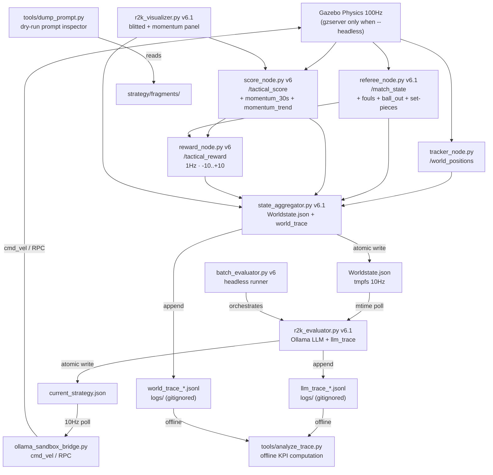

# ROS2K v6.2 — Unified Technical Specification

> [!abstract] Scope
> 3vs3 Gazebo simulation. No relay. Three models under test. Ten tactical scenarios.
> Automated evaluation pipeline with foul detection, momentum tracking, reward scoring,
> trace-based KPI measurement, and a bottom-up prompt engineering methodology.
>
> **v6.2 changelog:** Unifies the v6.1 infrastructure spec with the completed prompt
> engineering study (Phases 0-1). Drops the 5 named prompt variants (superseded by B-study).
> Adds Phase 5 Future Work (Kalman, predictive model, watchdog, GUI). Consolidates all
> work from sessions 2026-07-13 through 2026-07-15.

---

## 0. Management Summary

**What:** Optimize LLM soccer behavior by systematically comparing system prompts against
model choices, measured by objective KPIs in automated Gazebo runs.

**Why:** Current system had no quantitative feedback loop. v6.1 built the measurement
infrastructure. v6.2 uses it to run a bottom-up prompt study, consolidate findings, and
compare models.

**How:** 6 phases. Phases 0-1 are complete. Phase 2 is the immediate next step.

| Phase | What | Status | Runs | Time |
|-------|------|--------|------|------|
| 0 | Foundation: infrastructure, set-pieces, instrumentation, prompt disentanglement | ✅ **DONE** | — | — |
| 1 | Prompt Engineering Study (B1-B7b, RQ1-RQ3) | ✅ **DONE** | 33 | ~1h |
| 2 | Consolidation & Baseline (fix batch_evaluator, 27-run baseline, identify worst scenarios) | ⬜ **Next** | 27 | ~45min |
| 3 | Model Comparison (consolidated prompt × 9 scenarios × 3 models × 5 runs) | ⬜ Blocked | 135 | ~2.5h |
| 4 | Cross-Optimization & Production (per-scenario best, TC-10, dynamic prompts, commit) | ⬜ Blocked | 45 | ~45min |
| 5 | Future Work (Kalman, predictive model, watchdog, GUI, sim-to-real) | ⬜ Research | — | — |

**Total new compute:** 207 runs, ~4.5h.

**Outcome:** A config map saying "for scenario X, use strategy Y with model Z" backed by data,
plus a research roadmap for the next architecture evolution.

**Key metrics (14 KPIs via `tools/analyze_trace.py`):**

| KPI | Source | Target |
|-----|--------|--------|
| Goal differential (blue - red) | world_trace | > 0 |
| Tactical score avg | world_trace | > -1.0 |
| Cluster % | world_trace | < 10% |
| Goalie idle % | world_trace | < 80% (structural limit — see §4.3) |
| OOB % | world_trace | < 10% |
| Ball possession (blue) | world_trace | > 50% |
| Latency p50 | llm_trace | < 1000ms |
| Parse error rate | llm_trace | < 5% |
| Role diversity | llm_trace | > 2 |

**Composite score:** `0.4×goal_diff_norm + 0.3×tac_score_norm + 0.2×possession + 0.1×latency_factor`

---

## 1. Architecture Overview



> **V6.1 trace logging layer:** Two JSONL files (`llm_trace_*.jsonl`, `world_trace_*.jsonl`)
> written during every run. Non-blocking, append-only, gitignored. Consumed offline by
> `analyze_trace.py`. Correlated via `R2K_RUN_ID` env var. See
> `1_CORE_ARCHITECTURE_AND_SYNC.md` §V6.1 Addendum and `6_DATA_SCHEMAS_AND_LIFECYCLE.md` §V6.1 Addendum.

---

## 2. Component Specifications (Reference)

> [!info] Full specifications in the referenced files
> v6.2 does not re-spec components from v6.1. The following are authoritative references.

### 2.1 Referee Node v6.1 (`referee_node.py`)
- **Authoritative reference:** `core/docs/referee_rulebook.md` (700-line rulebook with field
  diagrams, state machine, all thresholds, visualizer labels)
- **Summary:** `2_ROS2_PROTOCOLS_AND_FRAMES.md` §V6 Addendum
- **Key features:** Foul detection (pushing, blocking), ball-out, last-touch tracking,
  unified set-pieces (goal kick, corner kick-in, kickoff with 5s countdown), early
  restart termination on ball touch (0.3m), opponent warp (1.5m radius → 2m away)

### 2.2 Score Node v6 (`score_node.py`)
- Momentum: `deque(maxlen=300)` (30s at 10Hz), OLS linear regression, trend classification
- Output: `current_numerical_score`, `average_numerical_score`, `momentum_30s`, `momentum_trend`

### 2.3 Reward Node v6 (`reward_node.py`)
- 1Hz fixed update rate, -10..+10 scale, foul penalty -1.0
- Two code paths: mtime-polling (decision rewards) + `/match_state` subscription (foul penalties)

### 2.4 Batch Evaluator v6 (`batch_evaluator.py`) — **NEEDS FIX (Phase 2b)**

> [!warning] KPI collection broken
> `batch_evaluator.py:91` has `# TODO: Subscribe to ROS topics during run`. The batch
> pipeline executes but produces no KPI data. **Fix in Phase 2b** by calling
> `tools/analyze_trace.py --run-id <R2K_RUN_ID>` after each run and injecting KPIs into
> the results JSON.

**CLI:**
```bash
python3 batch_evaluator.py \
    --scenarios 3vs3_attack_center,3vs3_defensive_crisis \
    --strategies strat_default \
    --models qwen2.5-coder:3b \
    --runs 3 \
    --duration 120 \
    --output eval_results_baseline_v6.2.json
```

### 2.5 Visualizer v6.1 (`r2k_visualizer.py`)
- Blitted artist updates (no `fig.clf`), ~30 FPS target
- Momentum sub-panel, referee decision panel, kickoff popup
- **Not yet tested with live ROS 2 + Gazebo** (only headless with stubbed rclpy)

### 2.6 Team Red v6.1 (`rule_evaluator_red.py`)
- Aggression factor 0.15, smoothstep + low-pass filter hysteresis
- V6.1 improvements: freeze bug fix (`restart_team` check), P1 boundary clamp (±1.0m
  restart / ±0.5m normal), P3 all-bots-hold-midfield, P4 blocking avoidance, P5 aggression
  guard during freeze
- See `3_AI_LOGIC_AND_EDGE_CASES.md` §V6.1 Addendum

### 2.7 Trace Instrumentation v6.1
- `r2k_evaluator.py:19-42`: LLM trace logger (one JSONL line per LLM call)
- `state_aggregator.py:28-71`: World-state trace logger (one JSONL line per 10Hz write)
- `tools/analyze_trace.py`: Offline KPI analyzer (14 KPIs from both trace files)
- `R2K_RUN_ID` env var: `launch_r2k.sh:82`, propagated to Docker via `docker exec -e`
- See `6_DATA_SCHEMAS_AND_LIFECYCLE.md` §V6.1 Addendum for schemas

---

## 3. Test Scenarios (10 × 3vs3)

> Scenarios TC-01 through TC-09 are unchanged from v6.1. TC-10 is new in Phase 4.

| TC | File | Name | Tactical Situation | Phase |
|----|------|------|--------------------|-------|
| 01 | `3vs3_attack_center.json` | Attack Center | Baseline, even formation | 0-4 |
| 02 | `3vs3_attack_wing.json` | Attack Wing | Crossing, wing play | 0-4 |
| 03 | `3vs3_defensive_crisis.json` | Defensive Crisis | Emergency clear, own zone | 0-4 |
| 04 | `3vs3_fast_counter.json` | Fast Counter | Transition speed, open space | 0-4 |
| 05 | `3vs3_pressing_trap.json` | Pressing Trap | Breaking pressure, spacing | 0-4 |
| 06 | `3vs3_long_shot.json` | Long Shot | Shot selection, goalie exploit | 0-4 |
| 07 | `3vs3_contain_delay.json` | Contain & Delay | Zone defense, force turnover | 0-4 |
| 08 | `3vs3_def_transition.json` | Defensive Transition | Recovery, counter-press | 0-4 |
| 09 | `3vs3_high_line.json` | High Line | Offside trap, goalie sweep | 0-4 |
| 10 | `3vs3_kick_in.json` | Kick-In | Restart protocol, receiver positioning | 4 |

> [!warning] TC-10 requires Phase 4
> `3vs3_kick_in.json` does not exist yet. The referee logic for ball-out/restart is
> implemented (v6.1), but the scenario JSON must be created in Phase 4b. The blue LLM
> also needs dynamic prompt selection (Phase 4c) to respond to restart statuses.

Scenario JSONs and 2D field diagrams are in `optimization_spec_v6.md` §3 (unchanged).

---

## 4. Prompt Architecture

> [!info] Replaces v6.1 §4 "Prompt Variant Specifications"
> v6.1 defined 5 named variants (Minimalist, Role-first, Anti-clustering, Latency-optimized,
> Hybrid). These were **never created** — the bottom-up B-study used different dimensions
> and superseded them. v6.2 drops the 5 variants and documents the actual architecture.

### 4.1 Fragment Assembly (`setup_r2k.py:111-136`)

The system prompt is assembled at boot from text fragments in `strategy/fragments/`:

```
header.txt          → ACT_ON_BOTS line + MODE line + {{EXPLAIN_INSTRUCTION}}
rules_core.txt      → field limits, valid actions, strict laws, kick-in exception
rules_{strat}.txt   → strategy-specific rules (overrides rules_{mode}.txt if exists)
samples_{strat}.txt → strategy-specific samples (overrides samples_{mode}.txt if exists)
```

**Override logic (v6.1 fix):** Strategy-specific fragments take precedence over mode
fragments. If `rules_default.txt` exists, it replaces `rules_3vs3.txt`. If
`samples_recover.txt` exists, it replaces `samples_3vs3.txt`. Previously both were
appended, sending contradictory signals.

**Verification tool:** `tools/dump_prompt.py` — assembles fragments identically to
`setup_r2k.py` without requiring ROS or Ollama. Usage:
```bash
python3 tools/dump_prompt.py --scenario 3vs3_attack_center --strategy strat_default --no-explain
```

**No build artifacts:** `strat_*.txt` files are no longer written by `setup_r2k.py`.
They are gitignored and removed from version control. The fragments are the sole source
of truth.

### 4.2 B-Study Findings (Phase 1 — Completed)

11 experiments (B1-B7b) × 3 runs × 120s on `3vs3_attack_center` with `qwen2.5-coder:3b`.

| Exp | Variable | Goals B:R | Cluster% | OOB% | Lat p50 | Key finding |
|-----|----------|-----------|----------|------|---------|-------------|
| A (baseline) | 3 samples, current rules | 0.7:1.0 | 15.7% | 30.6% | 827ms | High variance |
| B1 | +2 anti-cluster samples | 0.7:1.7 | 6.9% | 9.3% | 834ms | Less cluster, more conceded |
| B2 | B1 samples, no rule | 0.7:0.3 | 17.8% | 39.8% | 825ms | Within noise |
| B3 | +match_state injection | 0.7:1.0 | 21.5% | 13.1% | 814ms | No improvement |
| B4a | Goalie x=-4.0 | 0.0:0.3 | 1.6% | 19.0% | 815ms | Fewer conceded |
| B4b | Goalie x=-4.5 | 0.0:1.0 | 6.7% | 20.2% | 811ms | Worse than -4.0 |
| B5 | --explain (600 tokens) | 0.3:1.3 | 24.4% | 1.9% | 1190ms | OOB fixed, latency +44% |
| B6a | 1 sample only | 1.7:1.0 | 2.6% | 16.4% | 742ms | **Best scorer** |
| B6b | 6 samples | 0.3:1.7 | 18.7% | 15.2% | 792ms | Diminishing returns |
| B7a | Rules-only, 0 samples | 0.0:2.0 | 0% | 0% | 320ms | **Total failure** |
| B7b | Samples-only, empty rules | 0.0:1.0 | 4.3% | 46.3% | 744ms | OOB explosion |

**Research conclusions:**

- **RQ1 (rules vs. samples):** Both are necessary. Without samples (B7a), the 3B model
  produces empty/degenerate JSON. Without mode rules (B7b), bots leave the field (46% OOB).
  Samples provide format; rules provide boundaries.
- **RQ2 (sample-count plateau):** 1 sample (B6a) is the sweet spot. More samples dilute
  focus and increase latency without improving behavior. The 3B model copies one pattern;
  it doesn't learn from diversity.
- **RQ3 (alternatives):** Explain mode (B5) reduces OOB to 1.9% via explicit reasoning,
  but costs 44% latency. Adding explicit "STAY INSIDE FIELD" text to rules achieves similar
  OOB reduction without the latency cost (applied in consolidated v6.2 prompt).

> [!warning] High variance
> Within-experiment OOB spread up to 50 percentage points across 3 runs. 3 runs gives
> directional insight only; 10+ runs needed for statistical confidence (see D8 experiment).

### 4.3 Consolidated v6.2 Prompt

Based on B-study findings. Current `strategy/fragments/` already matches this spec:

**`rules_core.txt` (13 lines):**
- FIELD LIMITS, Opponent/Own Goal, VALID ACTIONS (Move + Kick)
- STAY INSIDE FIELD AT ALL TIMES (added in consolidation — addresses 30% OOB in baseline)
- NO OWN GOALS
- DYNAMIC GOALIE TRACKING at X=-4.0 (B4a better than B4b's -4.5)
- KICK-IN EXCEPTION (1m outside boundary for restart approaches)

**`samples_3vs3.txt` (9 lines, 1 sample):**
- Midfield passing example, goalie at X=-4.0, no analysis/oracle keys (--no-explain)
- 1 sample only (B6a finding: 1 sample > 3 samples > 6 samples)

**Runtime:**
- `--no-explain` default (150 token cap, assignments-only output)
- `temperature: 0.0`, `num_ctx: 4096` (hardcoded in `r2k_evaluator.py`)
- `R2K_INCLUDE_MATCH_STATE` not set by default (B3 inconclusive)

### 4.4 Goalie Idle — Structural Limitation

> [!warning] Not fixable via prompt engineering
> Goalie idle rate is 80-100% across ALL experiments. This is structural, not a prompt issue.
>
> **Root cause:** The bridge PD controller chases a jittery ball-Y setpoint. The LLM outputs
> a goalie Y target, but the bridge's `smooth_membership` + low-pass filter overreacts to
> ball position noise, producing micro-oscillations that keep the goalie "moving" without
> positional progress.
>
> **Implication:** Do NOT attempt to fix goalie behavior by changing prompt text, role
> descriptions, or goalie position parameters. The fix must be in the bridge's goalie PD
> controller tuning (smoothing factor, deadband) — see Phase 5.1 (Kalman filter).
>
> See `3_AI_LOGIC_AND_EDGE_CASES.md` §V6.1 Addendum for full documentation.

---

## 5. KPI Specification

### 5.1 Primary KPIs (`tools/analyze_trace.py`)

| KPI | Calculation | Source | Target |
|-----|-------------|--------|--------|
| `goals_for_blue` | Score delta count | world_trace | > `goals_for_red` |
| `goals_for_red` | Score delta count | world_trace | < `goals_for_blue` |
| `tactical_score_avg` | Mean `average_numerical_score` | world_trace | > -1.0 |
| `tactical_score_final` | Last `current_numerical_score` | world_trace | > -2.0 |
| `cluster_pct` | % frames min pairwise blue distance < 1.5m | world_trace | < 10% |
| `goalie_idle_pct` | % frames goalie moved < 0.1m | world_trace | < 80% (structural) |
| `oob_pct` | % frames any blue bot > 0.5m outside bounds | world_trace | < 10% |
| `ball_possession_blue_pct` | % frames closest bot to ball is blue | world_trace | > 50% |
| `latency_p50` | 50th percentile LLM latency | llm_trace | < 1000ms |
| `latency_p95` | 95th percentile | llm_trace | < 2000ms |
| `parse_error_rate` | % LLM calls with `parse_code > 0` | llm_trace | < 5% |
| `role_diversity` | Count of distinct role strings | llm_trace | > 2 |
| `status_distribution` | Counter of `match_state.status` | world_trace | — |
| `avg_response_tokens` | Mean `len(raw_response) / 4` | llm_trace | < 100 |

### 5.2 Composite Score

```
composite = 0.4 × goal_diff_norm + 0.3 × tac_score_norm
          + 0.2 × possession_norm + 0.1 × latency_factor

where:
  goal_diff_norm = (goals_blue - goals_red) / 10    (clamped 0..1)
  tac_score_norm = (tactical_score_avg + 10) / 20   (clamped 0..1)
  possession_norm = ball_possession_blue_pct / 100
  latency_factor = max(0, 1 - latency_p50 / 3000)
```

### 5.3 Measurement Protocol

1. `launch_r2k.sh` exports `R2K_RUN_ID` → trace files named with run ID
2. Run completes (duration timeout or CTRL+C)
3. `python3 tools/analyze_trace.py --run-id <ID> --output results/kpis_<ID>.json`
4. KPI JSON contains `world_kpis` + `llm_kpis` dicts
5. `batch_evaluator.py` (after Phase 2b fix) calls this automatically after each run

---

## 6. Experiment Catalog

### 6.1 B-Series: Prompt Engineering Study ✅ DONE

11 experiments, 33 runs, 120s each, `3vs3_attack_center`, `qwen2.5-coder:3b`.

See §4.2 for results table and conclusions. Full data in `src/results/kpis_*.json` (36 files).

### 6.2 C-Series: Stretch Experiments (Deferred, Optional)

> [!info] Priority
> C-series is optional. Run only if Phase 2-3 consolidated prompt results are disappointing.
> Each experiment: 3 scenarios (worst from Phase 2d) × 3 runs × 120s = 9 runs.

| Exp | Name | Variable | Question |
|-----|------|----------|----------|
| C1 | Chain-of-thought | Explicit "Think step by step" in prompt | Does explicit CoT improve quality more than B5's `--explain`? |
| C2 | Retrieval-augmented | RAG retrieves relevant samples based on game state | Does context-aware sample retrieval beat static samples? |
| C3 | Constrained decoding | Ollama grammar-guided JSON enforcement | Does forced valid JSON eliminate parse errors without latency cost? |
| C4 | Hierarchical prompting | Two-level: tactical mode → mode-specific actions | Does explicit mode classification improve decision quality? |
| C5 | Role-specific prompts | Separate LLM call per bot role | Does role-focused context improve per-bot decisions (vs 5× latency)? |

### 6.3 D-Series: New Experiments

> [!info] Priority
> D1-D3 are Phase 3 candidates. D4-D8 are Phase 2-4 enrichment. D8 is highest priority
> (statistical confidence for the B-study's directional findings).

| Exp | Name | Variable | Question | Runs |
|-----|------|----------|----------|------|
| D1 | Model size scaling | 1.5b vs 3b vs 7b | Does a larger model improve soccer reasoning or just add latency? | 3×3=9 |
| D2 | Temperature sweep | 0.0 vs 0.3 vs 0.7 | Does temperature >0 improve role diversity or just add noise? | 3×3=9 |
| D3 | Context window | num_ctx 2048 vs 4096 vs 8192 | Does larger context help (requires temporal history in prompt)? | 3×3=9 |
| D4 | Dynamic prompt switching | match_state-driven fragment selection | Does gamestate-aware prompting improve restart behavior? | 3×3=9 |
| D5 | Opponent adaptation | AGGRESSION_FACTOR 0.0/0.15/0.30/0.50 | How does red aggression level affect blue performance? | 4×3=12 |
| D6 | Scenario difficulty | All 9 scenarios, consolidated prompt | Which scenarios does the LLM perform worst on? (Phase 2c) | 9×3=27 |
| D7 | Temporal context | 0 vs 3 vs 10 history frames in prompt | Does including past states improve motion understanding? | 3×3=9 |
| D8 | 10× confidence | Re-run B6a and A with 10 repeats | Confirm B6a > A with statistical confidence | 2×10=20 |

---

## 7. Implementation Phases

### Phase 0: Foundation ✅ DONE

> [!success] Checkpoint 2026-07-15: Complete

All infrastructure from v6.1 Phase 0 plus:
- Unified set-pieces (goal kick, corner kick-in, kickoff with countdown, early termination)
- Referee rulebook (`core/docs/referee_rulebook.md`)
- Team red P1-P5 improvements (freeze bug fix, boundary clamp, blocking avoidance)
- Visualizer blitting refactor (not yet live-tested)
- Prompt disentanglement (`strat_*.txt` removed, sample-override logic, `dump_prompt.py`)
- Trace instrumentation (`llm_trace`, `world_trace`, `analyze_trace.py`, `R2K_RUN_ID`)
- Headless Gazebo (`gzserver` only, `--headless` flag)

**Known gaps (non-blocking):**
- `batch_evaluator.py` KPI collection broken (Phase 2b)
- Visualizer blitting untested with live ROS 2 + Gazebo
- Nothing committed (all on `feature/ros2k_behavior_optimization`)

### Phase 1: Prompt Engineering Study ✅ DONE

> [!success] Checkpoint 2026-07-15: Complete

33 runs (11 experiments × 3 × 120s) on `3vs3_attack_center`. See §4.2 for results.

**What was learned:**
- Rules + samples both needed (B7a, B7b)
- 1 sample is the sweet spot (B6a)
- `--explain` fixes OOB but +44% latency (B5)
- Goalie idle is structural (80-100% everywhere)
- High variance (3 runs = directional only)

### Phase 2: Consolidation & Baseline ⬜ NEXT

> [!warning] This is the immediate next phase

**2a: Finalize consolidated v6.2 prompt** ⬜ (partially done)
- Keep current `rules_core.txt` (STAY INSIDE FIELD + goalie x=-4.0)
- Keep current `samples_3vs3.txt` (1 sample, no --explain)
- Snapshot current fragments as `experiments/v6.2_consolidated/fragments/`
- Verify with `dump_prompt.py`
- Status: fragments already match — just needs snapshot + label

**2b: Fix `batch_evaluator.py` KPI collection** ⬜ (critical blocker, TBD)
- After each `run_single_config()` call, extract `R2K_RUN_ID` from the run's console log
- Call `python3 tools/analyze_trace.py --run-id <ID> --output results/kpis_<ID>.json`
- Read KPI JSON, inject into `results["results"][scenario][strategy][model]["runs"][]`
- Add `momentum_series` from `world_trace` (optional)
- Test: single run produces KPIs in `eval_results.json`
- **TBD:** The manual batch loop in `7_05_CHEATPAGE_Experiment_Guide.md` §5 already works
  (shell script calls `analyze_trace.py` after each run). Consider whether `batch_evaluator.py`
  is still needed as a Python orchestrator, or if the manual shell approach is sufficient.
  If keeping `batch_evaluator.py`, it should wrap `analyze_trace.py` — not re-implement
  ROS topic subscriptions as the v6.1 spec originally intended.

**2c: Run 9-scenario baseline** ⬜ (depends on 2a, 2b)
- 9 scenarios × consolidated prompt × `qwen2.5-coder:3b` × 3 runs = 27 runs
- Duration: 120s per run (matching B-study)
- Output: `eval_results_baseline_v6.2.json`
- Also produces 27 KPI JSON files in `results/`

**2d: Identify 3 worst scenarios** ⬜ (depends on 2c)
- Rank scenarios by composite score (descending — worst first)
- Select bottom 3 for C-series stretch experiments
- Document in `results/phase2_summary.md`

### Phase 3: Model Comparison ⬜ BLOCKED BY PHASE 2

**3a:** `ollama pull cosmos`

**3b:** Run: consolidated prompt × 9 scenarios × {`qwen2.5-coder:3b`, `cosmos`, `nemotron-3-nano:4b`} × 5 runs = 135 runs (~2.5h)

**3c:** Generate composite score matrix (per scenario × model)

**3d:** Identify per-scenario model strengths and per-strategy model affinities

**Output:** `eval_results_models_v6.2.json`

### Phase 4: Cross-Optimization & Production ⬜ BLOCKED BY PHASE 3

**4a: Find optimal (strategy × model) per scenario** — 45 validation runs (~45min)

**4b: Create TC-10 (`3vs3_kick_in.json`)** — referee logic exists, JSON doesn't

**4c: Dynamic prompt selection (gamestate-aware)**
- Instead of one static prompt, switch fragment sets based on `match_state.status`:
  - `playing` → current `rules_3vs3.txt` + `samples_3vs3.txt`
  - `ball_out` / `goal_kick` / `corner_kick_in` → NEW `rules_restart.txt` + `samples_restart.txt`
  - `goal` → NEW `rules_kickoff.txt` + `samples_kickoff.txt`
- Implementation: `setup_r2k.py` pre-flight OR `r2k_evaluator.py` runtime switching
- This is a subset of Phase 5.5 (full dynamic prompt selection)

**4d: Integrate best config as production default** — update `strat_default` mapping

**4e: Document findings** — `docs/optimization_results.md`

**4f: Commit all work** — branch `feature/v6.2-consolidated-spec`

**4g: Full integration test** — TC-10 with referee (ball-out, restart, foul, set-piece)

### Phase 5: Future Work ⬜ RESEARCH

> [!info] Research directions, not implementation plans
> These are architecture-level improvements for the next major version. Each item is a
> research direction that would need its own design phase before implementation.

#### 5.1 Kalman Filter World Model

Replace raw `/gazebo/model_states` positions with Kalman-filtered estimates. Smooth noisy
ball/bot tracking, derive velocity estimates without finite-difference noise amplification.
Foundation for 5.2 and 5.3. Would also address the goalie idle problem (5.1 → smoother
ball-Y setpoint → less PD controller jitter).

**Implementation target:** `tracker_node.py` — add Kalman filter per entity, publish filtered
positions + velocities on `/world_positions`. The `state_aggregator.py` and downstream
consumers see the same topic, no interface change.

#### 5.2 Predictive World Model (Latency Compensation)

Forward-simulate world state by N ms (matching measured LLM latency ~800ms). Feed the LLM
the *predicted* future state, so its decisions apply to the world as it will be, not as it
was. Reduces effective latency from the LLM's perspective to near-zero.

**Implementation target:** New node `predictor_node.py` or extension of `state_aggregator.py`.
Requires velocity estimates (5.1). Forward simulation: simple kinematic extrapolation
(`pos += vel * dt`) for N steps, or a physics-based predictor for ball-bot collisions.

#### 5.3 Deviation Watchdog

Compare predicted world state against actual at each 10Hz tick. If deviation exceeds
threshold (e.g. ball position off by >0.5m, bot position off by >1.0m) → flag anomaly.
Useful for detecting simulation instabilities (bots flying, ball warping), LLM command
failures (bots not moving toward targets), and model drift.

**Implementation target:** Extension of `state_aggregator.py` or new `watchdog_node.py`.
Publishes on a new `/model_deviation` topic. High deviation → trigger 5.4 fallback.

#### 5.4 Failsafe Fallback

If LLM latency > N ms (e.g. 5000ms) or parse error rate > X% (e.g. 20%) or deviation
watchdog (5.3) flags critical anomaly → switch blue team to rule-based behavior (mirror
`rule_evaluator_red.py` with blue goals). Ensures the system never hangs, never produces
dangerous commands, and always has a functional opponent even if the LLM fails.

**Implementation target:** `r2k_evaluator.py` — monitor own latency/parse stats, switch to
fallback mode. Or `ollama_sandbox_bridge.py` — detect stale `current_strategy.json` mtime,
publish rule-based commands directly.

#### 5.5 Dynamic Prompt Selection (Full Vision)

Phase 4c is a subset (status-based fragment switching). The full vision includes:

- **Game phase detection:** attacking vs defending vs transitioning (based on ball position
  and possession)
- **Opponent behavior adaptation:** detect red team's strategy (aggressive pressing vs
  contain) and select counter-strategy prompts
- **Performance-based adaptation:** if blue is losing by 2+ goals, switch to aggressive
  prompt; if winning, switch to defensive prompt
- **Referee event awareness:** not just `match_state.status` but foul history, card count,
  momentum trend — all influence prompt selection

**Implementation target:** New `prompt_selector.py` module called by `r2k_evaluator.py`
before each LLM call. Reads `match_state`, `tactical_score`, and recent `world_trace` to
select the optimal fragment set. Fragment library expands to cover game phases.

#### 5.6 Optimization GUI (W&B-style Dashboard)

Local web dashboard for experiment tracking and visualization:

- **Run comparison table:** KPI matrix, sortable/filterable, color-coded by performance
- **KPI time series:** momentum, score, latency per run — line charts with run overlay
- **Prompt diff viewer:** compare fragment changes between runs (git diff style)
- **Scenario visualizer:** replay `world_trace` as 2D animation (bots + ball + trails)
- **Experiment grouping:** tag runs with experiment names, compare groups

**Implementation options:**
- **Option A (local):** Flask + Plotly/Chart.js. Reads from `results/kpis_*.json` + `logs/*.jsonl`.
  No external dependencies, no cloud upload. Fast to build, limited features.
- **Option B (W&B):** Weights & Biases integration. Richer features, cloud-hosted, requires
  account + `wandb` package. Uploads KPIs as custom metrics. Good for sharing.
- **Option C (Streamlit):** Middle ground. `streamlit` package, local web app, built-in
  data table + chart components. Less custom code than Flask, more control than W&B.

**Recommended:** Option C (Streamlit) — fastest path to a usable dashboard, no external
dependencies beyond `pip install streamlit`.

#### 5.7 Sim-to-Real Transfer Validation

Test consolidated prompt on K1/Yahboom hardware via `--relay hardware_mirror`. Validate
that sim-trained behavior transfers to physical robots. Known limitations:
- K1 ignores `cmd_vel` for freeze (set-piece freezes sim-only)
- Physical slip, motor lag, and sensor noise introduce variance not present in sim
- Latency budget tighter (real-time control, no headless batching)

**Goal:** Run 5 hardware matches with consolidated v6.2 prompt, compare KPIs to sim
baseline. Identify prompt changes needed for hardware (if any).

#### 5.8 Opponent Adaptation (Curriculum Learning)

Red team that adjusts `AGGRESSION_FACTOR` based on blue's performance. If blue is winning
→ red increases aggression; if blue is losing → red decreases. Creates a curriculum
effect: blue faces progressively harder opponents.

**Implementation target:** `rule_evaluator_red.py` — read `match_state.blue` and
`match_state.red` scores, adjust `AGGRESSION_FACTOR` dynamically. Or a new
`difficulty_manager.py` that publishes aggression levels on a topic.

**Research question:** Does curriculum training transfer to fixed-opponent performance?
Or does blue overfit to the adaptive opponent?

#### 5.9 Temporal Reasoning (History in Prompt)

Include last N world states (1-3s history) in the LLM prompt, not just current snapshot.
Lets the LLM reason about ball/bot motion, not just static positions. "The ball is moving
right at 2 m/s" is more useful than "the ball is at (1.5, 0.3)".

**Tradeoff:** Larger prompt → higher latency. Must balance history depth against
latency budget. D7 experiment tests this.

**Implementation target:** `r2k_evaluator.py` — read last N entries from `world_trace`
(logs are already written), append to `min_ents` as a `history` array. Requires larger
`num_ctx` (D3 experiment).

#### 5.10 Active Learning Loop

After each batch, identify scenarios where the LLM performs worst (lowest composite score).
Generate synthetic scenarios in those failure modes (e.g. variations of the worst
scenario with different ball/bot positions). Re-run with the new scenarios → progressive
improvement. Closes the loop between evaluation and scenario design.

**Implementation target:** New `scenario_generator.py` — takes a failing scenario + KPI
profile, produces N variations (perturb positions, swap team roles, shift ball location).
Automates the scenario design that is currently manual.

**Research question:** Can automated scenario generation discover failure modes that
manual design misses?

---

## 8. Run Budget

| Phase | Runs | Duration/run | Total time |
|-------|------|---------------|-----------|
| 1 (done) | 33 | 120s | ~1.1h |
| 2 Baseline | 27 | 120s | ~54min |
| 3 Models | 135 | 120s | ~4.5h |
| 4 Validation | 45 | 120s | ~1.5h |
| **Total new** | **207** | — | **~7.5h** |

Optional C/D series:

| Series | Runs | Time |
|--------|------|------|
| C1-C5 (stretch) | 45 | ~1.5h |
| D1-D8 (new) | 104 | ~3.5h |
| **Optional total** | **149** | **~5h** |

Per run: 120s match + ~15s startup + ~5s teardown = ~140s wall clock

---

## 9. Data Format

### 9.1 KPI JSON (`results/kpis_<run_id>.json`)

Written by `tools/analyze_trace.py`. One file per run.

```json
{
  "run_id": "3vs3_attack_center_strat_default_20260715_122720",
  "llm_trace_file": ".../logs/llm_trace_*.jsonl",
  "world_trace_file": ".../logs/world_trace_*.jsonl",
  "world_kpis": {
    "frames": 1299,
    "duration_s": 129.8,
    "goals_for_blue": 0,
    "goals_for_red": 2,
    "cluster_pct": 2.1,
    "goalie_idle_pct": 95.9,
    "oob_pct": 32.1,
    "ball_possession_blue_pct": 50.0,
    "tactical_score_avg": -2.23,
    "tactical_score_final": -3.9,
    "status_distribution": {"playing": 892, "foul_penalty": 59, ...}
  },
  "llm_kpis": {
    "llm_calls": 155,
    "latency_p50": 828,
    "latency_p95": 872,
    "latency_max": 927,
    "parse_error_rate": 0.0,
    "role_diversity": 4,
    "roles": {"goalie": 155, "striker": 155, "supporter": 128, "midfielder": 27},
    "avg_response_tokens": 76.0,
    "explain_mode": false,
    "model": "qwen2.5-coder:3b"
  }
}
```

### 9.2 Batch Results (`results/eval_results_*.json`)

Written by `batch_evaluator.py` (after Phase 2b fix). One file per batch.

```json
{
  "meta": {
    "version": "v6.2",
    "timestamp": "20260715_143022",
    "duration_per_run": 120,
    "runs_per_config": 3,
    "models": ["qwen2.5-coder:3b"],
    "strategies": ["strat_default"],
    "scenarios": ["3vs3_attack_center", "..."]
  },
  "results": {
    "3vs3_attack_center": {
      "strat_default": {
        "qwen2.5-coder:3b": {
          "runs": [
            {
              "run_id": "3vs3_attack_center_strat_default_20260715_122720",
              "elapsed_time": 125.3,
              "status": "completed",
              "world_kpis": { "goals_for_blue": 0, ... },
              "llm_kpis": { "latency_p50": 828, ... }
            }
          ]
        }
      }
    }
  }
}
```

### 9.3 Trace Files (`logs/*.jsonl`)

See `6_DATA_SCHEMAS_AND_LIFECYCLE.md` §V6.1 Addendum for full schemas.

- `llm_trace_<run_id>.jsonl`: one JSON line per LLM call (world snapshot, raw response,
  parse_code, latency, model, explain flag)
- `world_trace_<run_id>.jsonl`: one JSON line per 10Hz world-state write (entities,
  match_state, tactical_score)
- Gitignored, NOT wiped on boot, accumulate across runs

---

## 10. Related Files

| File | Role | v6.2 Status |
|------|------|-------------|
| `src/referee_node.py` | Foul + ball-out + set-piece referee | ✅ v6.1 (unified set-pieces, early termination) |
| `src/score_node.py` | Momentum (OLS, deque, trend) | ✅ v6 |
| `src/reward_node.py` | 1Hz reward, foul penalty | ✅ v6 |
| `src/state_aggregator.py` | Worldstate + world_trace logger | ✅ v6.1 |
| `src/ai_tactics/r2k_evaluator.py` | LLM driver + llm_trace logger | ✅ v6.1 (trace, R2K_INCLUDE_MATCH_STATE) |
| `src/ai_tactics/ollama_sandbox_bridge.py` | HAL (cmd_vel / RPC) | ✅ v5 (unchanged) |
| `src/r2k_visualizer.py` | Blitted visualizer + momentum | ✅ v6.1 (untested live) |
| `src/rule_evaluator_red.py` | Team red + P1-P5 | ✅ v6.1 |
| `src/setup_r2k.py` | Prompt compiler (fragments only) | ✅ v6.1 (strat_*.txt removed) |
| `src/ai_tactics/batch_evaluator.py` | Headless orchestrator | ⬜ **KPI collection broken (Phase 2b)** |
| `src/strategy/fragments/rules_core.txt` | Core rules + STAY INSIDE + goalie -4.0 | ✅ v6.2 consolidated |
| `src/strategy/fragments/samples_3vs3.txt` | 1 sample, no --explain | ✅ v6.2 consolidated |
| `src/tools/analyze_trace.py` | Offline KPI analyzer (14 KPIs) | ✅ v6.1 |
| `src/tools/dump_prompt.py` | Dry-run prompt inspector | ✅ v6.1 |
| `src/tools/swap_fragments.sh` | Experiment fragment swapper | ✅ v6.1 |
| `src/tools/run_experiment.sh` | Experiment runner (3 repeats) | ✅ v6.1 |
| `src/experiments/` | B-study experiment dirs (baseline + B1-B7b) | ✅ v6.1 |
| `src/results/` | KPI JSONs + console logs + prompt dumps | ✅ (36 KPI files) |
| `src/scenario/3vs3_*.json` | TC-01..09 scenario JSONs | ✅ TC-10 missing (Phase 4b) |
| `launch_r2k.sh` | Entry point + headless + R2K_RUN_ID | ✅ v6.1 |
| `tests/test_*.py` | Unit + integration tests (6 files) | ✅ v6 (62 tests pass) |
| `docs/referee_rulebook.md` | Authoritative referee rulebook | ✅ v6.1 |
| `docs/optimization_spec_v6.md` | Predecessor spec (v6.1) | Superseded by this file |
| `docs/optimization_spec_v6.2.md` | This file | ✅ v6.2 |

---

## 11. Open Questions

> [!check] Resolved decisions (2026-07-15)

| # | Question | Decision | Rationale |
|---|----------|----------|----------|
| 1 | Phase 2 baseline scope | **Reduced 27-run** (9 scenarios × consolidated × 3b × 3 runs) | B-study already tested strategies; don't waste runs on obsolete strategies |
| 2 | Phase 3 model selection | **Pull cosmos** (3b + cosmos + nemotron-4b) | Follows spec intent; 3 models gives cross-family comparison |
| 3 | v6.1's 5 named variants | **Dropped** | B-study superseded them with different dimensions and better methodology |
| 4 | B6a vs current fragments | **Keep current** (STAY INSIDE + goalie -4.0) | STAY INSIDE addresses 30% OOB; -4.0 safer than -4.5; both are improvements over B6a |

> [!question] Remaining decisions

| # | Question | When |
|---|----------|------|
| 5 | Dynamic prompt switching: `setup_r2k.py` pre-flight or `r2k_evaluator.py` runtime? | Phase 4c |
| 6 | Optimization GUI: Flask vs Streamlit vs W&B? | Phase 5.6 |
| 7 | Run duration: 120s (B-study) or 60s (v6.1 spec)? | Phase 2c — currently 120s |
| 8 | Should `strat_aggro` and `strat_recover` be kept or removed? | Phase 4d — only relevant if multi-strategy comparison is run |