> [!warning] SUPERSEDED by v6.2
> This spec is preserved for historical reference. The active specification is
> `core/docs/optimization_spec_v6.2.md`, which integrates all completed work
> (Phases 0-1) and adds Phase 5 Future Work. Do not use this file for planning.

# ROS2K v6.1 — Technical Specification

> [!abstract] Scope
> 3vs3 Gazebo simulation. No relay. Three models under test. Ten tactical scenarios. Automated evaluation pipeline with foul detection, momentum tracking, and reward scoring.
>
> **v6.1 changelog:** Checkpoint markers added to all phases reflecting verified implementation status as of 2026-07-13. TC-01 through TC-09 Mermaid diagrams redesigned as true 2D field layouts (X/Y coordinates) instead of 1D node chains. Phase 0 confirmed complete.

---

## Management Summary

**What:** Optimize LLM soccer behavior by systematically comparing system prompts against model choices, measured by objective KPIs in automated Gazebo runs.

**Why:** Current system has no quantitative feedback loop. We don't know which prompt structure, which model, or which strategy produces better soccer. This spec builds the measurement infrastructure and runs the experiments.

**How:** 6 phases over ~6h compute time (351 runs × 80s each):

| Phase | What | Runs | Time | Status (2026-07-13) |
|-------|------|------|------|---------------------|
| 0 | Build infrastructure (momentum, reward, fouls, referee, batch evaluator, 9 scenarios, tests) | — | — | ✅ **DONE** |
| 1 | Baseline: qwen only, all configs | 81 | 1.5h | ⬜ Not started |
| 2 | Prompt variants vs worst 3 scenarios | 90 | 1.5h | ⬜ Blocked by Phase 1 |
| 3 | Model comparison: best prompt × all scenarios × 3 models | 135 | 2.5h | ⬜ Blocked by Phase 2 |
| 4 | Cross-optimization: find best (strategy × model) per scenario | 45 | 45min | ⬜ Blocked by Phase 3 |
| 5 | Production: integrate best prompt, add kick-in referee, document | — | — | ⬜ Blocked by Phase 4 |

**Checkpoint 2026-07-13:** Phase 0 infrastructure fully implemented and smoke-tested. A single stub run (`results/eval_results_20260709_195609.json`) confirms the batch pipeline executes but contains no KPI data. Next actionable step: Phase 1 baseline (81 runs).

**Outcome:** A config map saying "for scenario X, use strategy Y with model Z" backed by data.

**Key metrics:** Goal differential, avg reward, positive decision rate. Composite score = 0.4×goal_diff + 0.3×avg_reward + 0.2×pos_rate + 0.1×latency_factor.

**New in v6 (vs v5):** Foul detection (pushing, blocking without ball → sideline warp), 1Hz reward node with -10..+10 scale, game momentum timeline chart, automated test suite.

---

## Implementation Hints

> [!tip] Where to start
> Phase 0 is the only blocking phase. Everything else depends on it. Start with `score_node.py` (momentum) and `reward_node.py` (1Hz reward), then `referee_node.py` (fouls + ball-out), then `batch_evaluator.py` (orchestrator).

> [!tip] File modification map
> - **New files:** `reward_node.py`, `batch_evaluator.py`, 7 scenario JSONs, 4 test files
> - **Modified files:** `score_node.py` (momentum), `referee_node.py` (fouls + ball-out), `state_aggregator.py` (reward topic), `launch_r2k.sh` (headless + duration flags), `r2k_visualizer.py` (momentum panel), `rule_evaluator_red.py` (aggression factor), `setup_r2k.py` (strategy rename)
> - **Not modified:** `r2k_evaluator.py`, `ollama_sandbox_bridge.py`, `tracker_node.py`

> [!tip] Dependency order
> 1. `score_node.py` (momentum) → needed by `reward_node.py` (uses `/tactical_score`)
> 2. `referee_node.py` (fouls) → needed by `reward_node.py` (foul penalty events)
> 3. `reward_node.py` (1Hz reward) → needed by `state_aggregator.py` (subscribes to `/tactical_reward`)
> 4. `batch_evaluator.py` → needs all above nodes running to collect metrics

> [!tip] Testing strategy
> - **Unit tests first:** `test_momentum.py`, `test_reward.py`, `test_referee.py`, `test_foul_detection.py`
> - **Then integration:** `test_integration_smoke.py` (15s headless run per scenario)
> - **Then batch:** `batch_evaluator.py` (60s runs, full metrics)

> [!tip] Common pitfalls
> - `reward_node.py` polls `current_strategy.json` mtime for strategy changes AND subscribes to `/match_state` for foul events — don't mix the two code paths
> - `referee_node.py` foul detection needs hysteresis (3 consecutive frames) to avoid false positives from position noise
> - Foul sideline warp uses `/gazebo/set_entity_state` — make sure the service is available before calling it
> - `batch_evaluator.py` must NOT kill `ollama` on teardown — only ROS nodes and Gazebo
> - Momentum ringbuffer (`deque(maxlen=300)`) resets on node restart — batch runs should account for cold-start in the first 3 seconds
> - All prompt variants must include both `Move` and `Kick` in VALID ACTIONS — don't accidentally remove them

> [!tip] Scenario creation
> Copy `3vs3_default.json` or `3vs3_def_transition.json` as templates. Keep field bounds: X ∈ [-4.5, 4.5], Y ∈ [-3.0, 3.0]. The `scenario_name` field is used by `batch_evaluator.py` for identification. The `tactical_situation` field is for documentation only.

> [!warning] Known constraints
> - TC-10 (kick-in) requires referee v6 with ball-out detection — defer to Phase 5
> - `cosmos` model must be pulled before Phase 3: `ollama pull cosmos`
> - Red team fouls depend on `rule_evaluator_red.py` aggression — tune `AGGRESSION_FACTOR` carefully (start at 0.15)
> - Foul sideline warp position: X = -4.0 (own baseline side), Y random in [-2.0, 2.0]

---

## 1. Architecture Overview

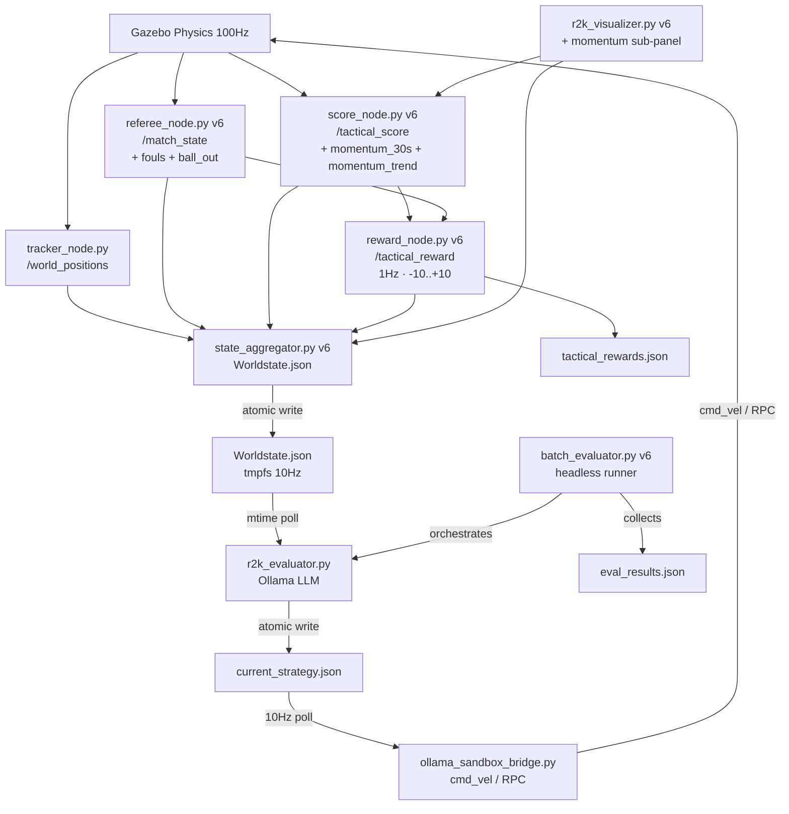
```mermaid
graph TD
    Gazebo["Gazebo Physics 100Hz"]
    Tracker["tracker_node.py<br/>/world_positions"]
    Referee["referee_node.py v6<br/>/match_state<br/>+ fouls + ball_out"]
    Scorer["score_node.py v6<br/>/tactical_score<br/>+ momentum_30s + momentum_trend"]
    Reward["reward_node.py v6<br/>/tactical_reward<br/>1Hz · -10..+10"]
    Aggregator["state_aggregator.py v6<br/>Worldstate.json"]
    Evaluator["r2k_evaluator.py<br/>Ollama LLM"]
    Bridge["ollama_sandbox_bridge.py<br/>cmd_vel / RPC"]
    Visualizer["r2k_visualizer.py v6<br/>+ momentum sub-panel"]
    Batch["batch_evaluator.py v6<br/>headless runner"]

    Gazebo --> Tracker
    Gazebo --> Referee
    Gazebo --> Scorer
    Tracker --> Aggregator
    Referee --> Aggregator
    Scorer --> Aggregator
    Scorer --> Reward
    Referee --> Reward
    Aggregator -->|atomic write| Worldstate["Worldstate.json<br/>tmpfs 10Hz"]
    Worldstate -->|mtime poll| Evaluator
    Evaluator -->|atomic write| Strategy["current_strategy.json"]
    Strategy -->|10Hz poll| Bridge
    Bridge -->|cmd_vel / RPC| Gazebo
    Reward --> Aggregator
    Reward --> RewardLog["tactical_rewards.json"]
    Visualizer --> Aggregator
    Visualizer --> Scorer
    Batch -->|orchestrates| Evaluator
    Batch -->|collects| EvalResults["eval_results.json"]
```

---

## 2. Component Specifications

### 2.1 Referee Node v6 (`referee_node.py`)

**Path:** `src/referee_node.py`

**Existing behavior:** Goal detection (ball x > ±4.5).

**New behavior:**

#### 2.1.1 Foul Detection

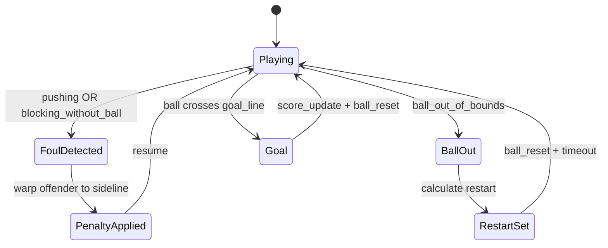
```mermaid
stateDiagram-v2
    [*] --> Playing
    Playing --> FoulDetected: pushing OR blocking_without_ball
    Playing --> BallOut: ball_out_of_bounds
    Playing --> Goal: ball crosses goal_line
    FoulDetected --> PenaltyApplied: warp offender to sideline
    PenaltyApplied --> Playing: resume
    BallOut --> RestartSet: calculate restart
    RestartSet --> Playing: ball_reset + timeout
    Goal --> Playing: score_update + ball_reset
```

**Pushing foul:**

```python
PUSHING_VELOCITY_THRESHOLD = 0.5  # m/s relative approach speed
PUSHING_DISTANCE_THRESHOLD = 0.3  # meters between bot centers
BALL_PROXIMITY_THRESHOLD = 0.8  # neither bot within this of ball

# Detect: two bots approach each other above threshold
# AND neither is within ball_proximity of the soccer ball
# AND relative velocity is toward each other (collision course)
```

**Blocking without ball foul:**

```python
BLOCKING_DISTANCE_THRESHOLD = 0.5  # meters
BALL_PROXIMITY_THRESHOLD = 0.8  # bot not near ball
OBSTRUCTION_ANGLE = 30  # degrees: bot in path of opponent-to-ball line

# Detect: a bot is between an opponent and the ball
# AND the blocking bot is NOT within ball_proximity of the ball
# AND the blocking bot is within obstruction_angle of the direct path
```

**Penalty:**

```python
FOUL_REWARD_PENALTY = -1  # 10% of -10..+10 scale
SIDELINE_X_OFFSET = -4.0   # own baseline side
SIDELINE_Y_RANGE = (-2.0, 2.0)  # random Y within this range

# On foul detection:
# 1. Warp offending bot to (SIDELINE_X_OFFSET, random_y)
# 2. Publish foul event on /match_state
# 3. Negative reward applied by reward_node
# 4. Resume play after 1s freeze
```

**Foul event schema (added to `/match_state`):**

```json
{
  "foul": {
    "type": "pushing",
    "offender": "blue_2",
    "victim": "red_1",
    "position": {"x": -1.5, "y": 0.3},
    "penalty": "sideline_warp"
  }
}
```

#### 2.1.2 Ball-out Detection

```python
FIELD_X_MIN = -4.5
FIELD_X_MAX = 4.5
FIELD_Y_MIN = -3.0
FIELD_Y_MAX = 3.0
GOAL_Y_MIN = -0.9  # goal width
GOAL_Y_MAX = 0.9
DEBOUNCE_FRAMES = 5  # 0.5s at 10Hz

# Sideline out: |ball_y| > FIELD_Y_MAX
# Goal line out (no goal): |ball_x| > FIELD_X_MAX and |ball_y| > GOAL_Y_MAX
```

#### 2.1.3 Last-touch Detection

```python
PROXIMITY_THRESHOLD = 0.8  # meters
HYSTERESIS_FRAMES = 3  # same bot must be closest for 3 consecutive frames

# Track closest bot to ball each frame
# On ball_out: last_toucher = bot with most frames closest to ball
```

#### 2.1.4 Restart Logic

```python
BALL_OUT_TIMEOUT = 3.0  # seconds before auto-transition to "playing"
RESTART_FREEZE_TIME = 1.0  # seconds offending team must hold position

# Sideline out: restart_team = opposite of last_toucher
# Goal line out (no goal): restart_team = defending team
# Ball reset to restart position via /gazebo/set_entity_state
```

#### 2.1.5 Updated `/match_state` Schema

```json
{
  "blue": 0,
  "red": 0,
  "status": "playing",
  "ball_out_event": null,
  "restart_team": null,
  "restart_pos": null,
  "last_toucher": null,
  "foul": null
}
```

Valid statuses: `"playing"`, `"goal"`, `"ball_out"`, `"foul_penalty"`

---

### 2.2 Score Node v6 (`score_node.py`)

**Path:** `src/score_node.py`

**New output schema:**

```json
{
  "current_numerical_score": -5.24,
  "average_numerical_score": -0.82,
  "momentum_30s": -2.1,
  "momentum_trend": "collapsing",
  "fact_label": "Red attacking",
  "ball_possession_fact": "Red Team"
}
```

**Momentum algorithm:**

```python
from collections import deque

class ScoreNode(Node):
    def __init__(self):
        # ... existing init ...
        self.momentum_window = deque(maxlen=300)  # 30s at 10Hz
        self.MOMENTUM_MIN_SAMPLES = 10
        self.MOMENTUM_SCALE_FACTOR = 10.0

    def _calculate_momentum(self):
        n = len(self.momentum_window)
        if n < self.MOMENTUM_MIN_SAMPLES:
            return 0.0, "stable"
        
        # OLS linear regression
        sum_x = sum(range(n))
        sum_y = sum(score for _, score in self.momentum_window)
        sum_xy = sum(i * score for i, (_, score) in enumerate(self.momentum_window))
        sum_x2 = sum(i * i for i in range(n))
        
        denominator = n * sum_x2 - sum_x * sum_x
        if abs(denominator) < 1e-9:
            return 0.0, "stable"
        
        slope = (n * sum_xy - sum_x * sum_y) / denominator
        momentum = max(-10.0, min(10.0, slope * self.MOMENTUM_SCALE_FACTOR))
        
        if momentum > 2.0: trend = "ascending"
        elif momentum > 0.5: trend = "improving"
        elif momentum > -0.5: trend = "stable"
        elif momentum > -2.0: trend = "declining"
        else: trend = "collapsing"
        
        return round(momentum, 2), trend
```

---

### 2.3 Reward Node v6 (`reward_node.py`)

**Path:** `src/reward_node.py`

**Key changes from v5.1 spec:**
- **1Hz fixed update rate** (not per-decision)
- **Scale: -10 to +10** (normalized)
- **Foul penalty: -1** (10% of scale)

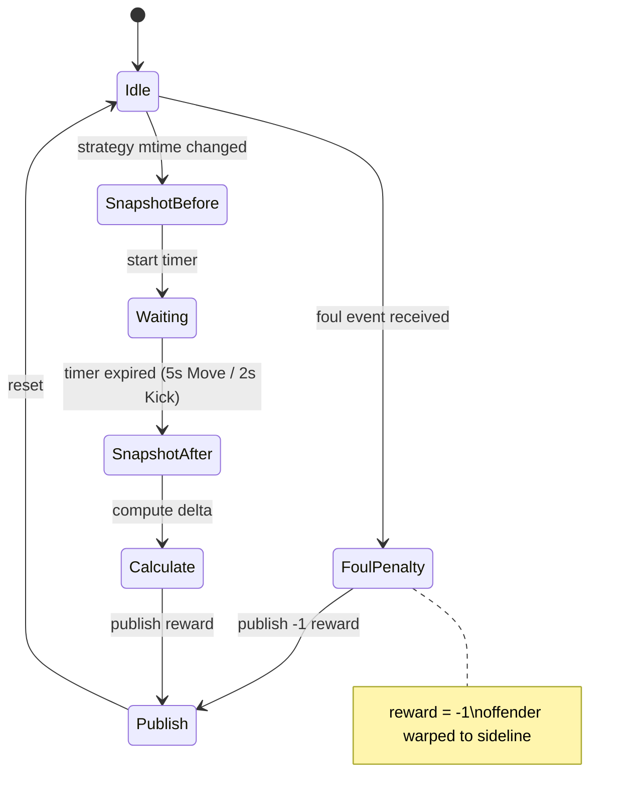
```mermaid
stateDiagram-v2
    [*] --> Idle
    Idle --> SnapshotBefore: strategy mtime changed
    SnapshotBefore --> Waiting: start timer
    Waiting --> SnapshotAfter: timer expired (5s Move / 2s Kick)
    SnapshotAfter --> Calculate: compute delta
    Idle --> FoulPenalty: foul event received
    FoulPenalty --> Publish: publish -1 reward
    Calculate --> Publish: publish reward
    Publish --> Idle: reset

    note right of FoulPenalty: reward = -1\noffender warped to sideline
```

**Output schema (`/tactical_reward`):**

```json
{
  "timestamp": 1782986654.74,
  "source": "decision",
  "action_type": "Move",
  "target_x": 2.3,
  "target_y": -1.1,
  "score_before": -6.5,
  "score_after": -4.2,
  "reward": 2.3,
  "classification": "positive",
  "bot_id": "blue_1"
}
```

```json
{
  "timestamp": 1782986655.10,
  "source": "foul",
  "action_type": "pushing",
  "target_x": null,
  "target_y": null,
  "score_before": -3.2,
  "score_after": null,
  "reward": -1.0,
  "classification": "negative",
  "bot_id": "blue_2"
}
```

**Classification thresholds:**

| reward | classification |
|--------|---------------|
| > +1.0 | positive |
| -1.0 to +1.0 | neutral |
| < -1.0 | negative |

**1Hz update implementation:**

```python
class RewardNode(Node):
    def __init__(self):
        super().__init__('reward_node')
        self.sub_score = self.create_subscription(String, '/tactical_score', self.score_callback, 10)
        self.sub_match = self.create_subscription(String, '/match_state', self.match_callback, 10)
        self.pub_reward = self.create_publisher(String, '/tactical_reward', 10)
        
        self.current_score = 0.0
        self.score_before = None
        self.last_strategy_mtime = 0
        self.action_start_time = None
        self.pending_action = None
        self.reward_history = []
        
        # 1Hz timer
        self.create_timer(1.0, self.tick)
        
        self.get_logger().info("Reward Node v6 Online: 1Hz · -10..+10 · Foul penalty -1")
    
    def tick(self):
        # Check for strategy change (decision reward)
        # Check for foul events (foul reward)
        # Publish at 1Hz
        pass
```

---

### 2.4 Batch Evaluator v6 (`batch_evaluator.py`)

**Path:** `src/ai_tactics/batch_evaluator.py`

**CLI:**

```bash
python3 batch_evaluator.py \
    --scenarios 3vs3_attack_center,3vs3_defensive_crisis,3vs3_fast_counter \
    --strategies strat_aggro,strat_recover,strat_default \
    --models qwen2.5-coder:3b,nemotron-3-nano:4b \
    --runs 5 \
    --duration 60 \
    --output eval_results_20260709.json
```

**Data collection (live ROS subscriptions in parallel thread):**

```python
# Subscribe to /tactical_score → momentum, score
# Subscribe to /tactical_reward → reward, classification, bot_id
# Subscribe to /match_state → goals, fouls, ball_out events
# Subscribe to /world_positions → bot positions (anti-clustering metric)
# All aggregated in memory, written once at end
```

---

### 2.5 Visualizer v6 (`r2k_visualizer.py` modification)

**New sub-panel: Momentum Chart**

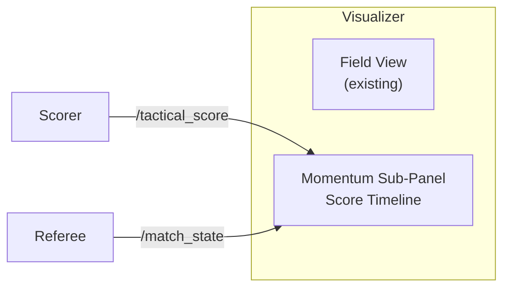
```mermaid
graph LR
    subgraph Visualizer
        Field["Field View<br/>(existing)"]
        Momentum["Momentum Sub-Panel<br/>Score Timeline"]
    end
    
    Scorer -->|/tactical_score| Momentum
    Referee -->|/match_state| Momentum
```

**Chart specification:**
- X axis: game time (0 to duration, in seconds)
- Y axis: score (-10 to +10)
- Two lines: blue team cumulative score, red team cumulative score
- Foul markers: red triangles on timeline where fouls occurred
- Goal markers: green circles where goals were scored
- Update rate: 1Hz (from `/tactical_score`)

**Implementation:** Add a matplotlib subplot below the field view, or a separate window toggled by keypress.

---

### 2.6 Red Team Foul Logic (`rule_evaluator_red.py` modification)

**Current behavior:** Deterministic algorithmic opponent, anti-clustering, boundary staging, phantom kicks.

**New behavior:** Red bots can also commit fouls (pushing, blocking without ball). When detected by referee, red bots get warped to sideline too.

**Implementation approach:**
- Keep existing `rule_evaluator_red.py` logic
- Add occasional "aggressive" behavior: red bots may approach opponents too closely
- The referee detects fouls regardless of team color
- Foul penalty applies equally to blue and red bots

```python
# In rule_evaluator_red.py, add aggressive proximity behavior:
AGGRESSION_FACTOR = 0.15  # 15% chance per decision to move toward opponent
# This creates realistic pushing scenarios without being too aggressive
```

---

## 3. Test Scenarios (10 × 3vs3)

### 3.1 Scenario Diagrams

#### TC-01: Attack Center — Baseline

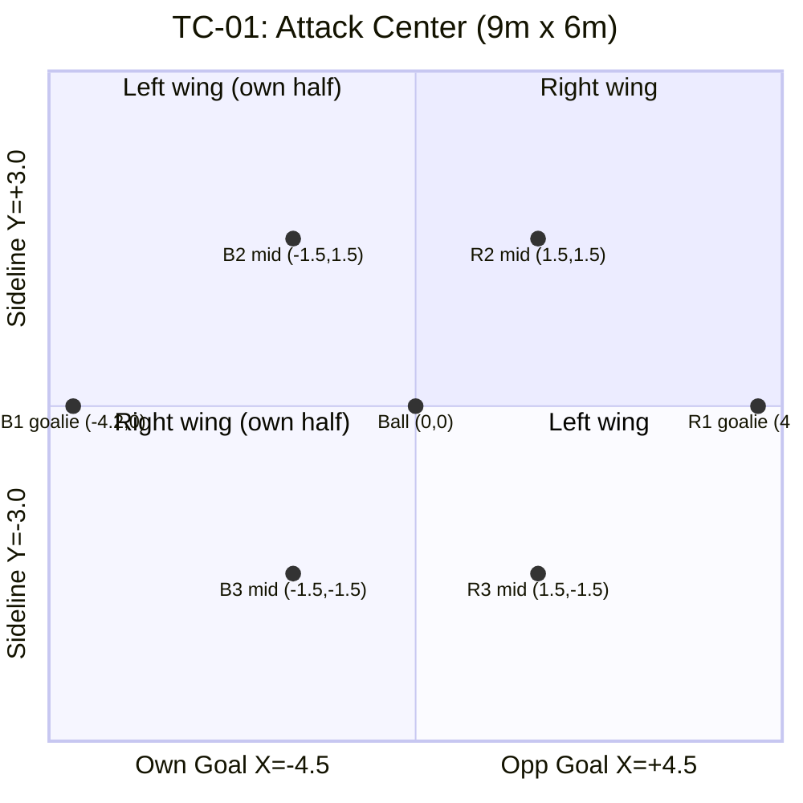
```mermaid
quadrantChart
    title TC-01: Attack Center (9m x 6m)
    x-axis "Own Goal X=-4.5" --> "Opp Goal X=+4.5"
    y-axis "Sideline Y=-3.0" --> "Sideline Y=+3.0"
    quadrant-1 "Right wing"
    quadrant-2 "Left wing (own half)"
    quadrant-3 "Right wing (own half)"
    quadrant-4 "Left wing"
    "Ball (0,0)": [0.5, 0.5]
    "B1 goalie (-4.2,0)": [0.033, 0.5]
    "B2 mid (-1.5,1.5)": [0.333, 0.75]
    "B3 mid (-1.5,-1.5)": [0.333, 0.25]
    "R1 goalie (4.2,0)": [0.967, 0.5]
    "R2 mid (1.5,1.5)": [0.667, 0.75]
    "R3 mid (1.5,-1.5)": [0.667, 0.25]
```

> **Tests:** Baseline role assignment, equal formation, central kickoff behavior.

#### TC-02: Attack Wing — Crossing Opportunity

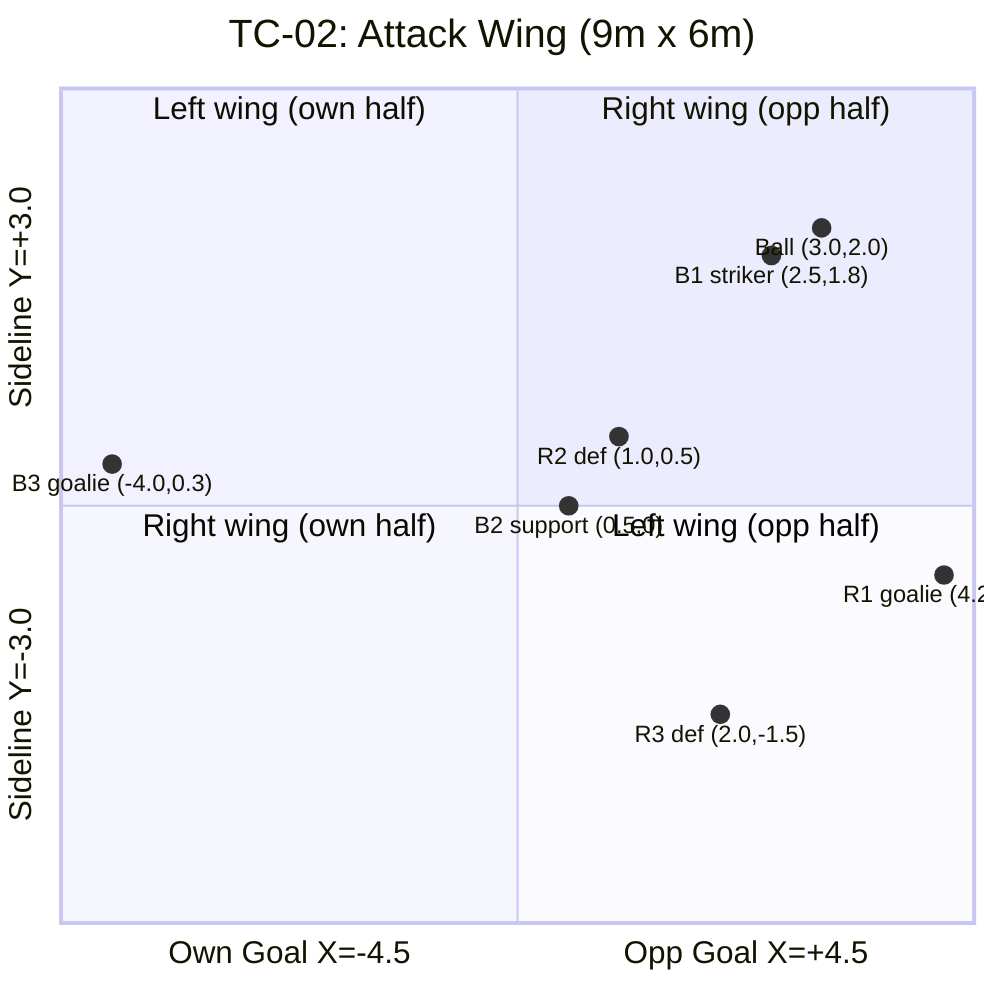
```mermaid
quadrantChart
    title TC-02: Attack Wing (9m x 6m)
    x-axis "Own Goal X=-4.5" --> "Opp Goal X=+4.5"
    y-axis "Sideline Y=-3.0" --> "Sideline Y=+3.0"
    quadrant-1 "Right wing (opp half)"
    quadrant-2 "Left wing (own half)"
    quadrant-3 "Right wing (own half)"
    quadrant-4 "Left wing (opp half)"
    "Ball (3.0,2.0)": [0.833, 0.833]
    "B1 striker (2.5,1.8)": [0.778, 0.8]
    "B2 support (0.5,0)": [0.556, 0.5]
    "B3 goalie (-4.0,0.3)": [0.056, 0.55]
    "R1 goalie (4.2,-0.5)": [0.967, 0.417]
    "R2 def (1.0,0.5)": [0.611, 0.583]
    "R3 def (2.0,-1.5)": [0.722, 0.25]
```

> **Tests:** Crossing, wing play, space exploitation. Ball deep in opponent right wing.

#### TC-03: Defensive Crisis — Emergency Clear

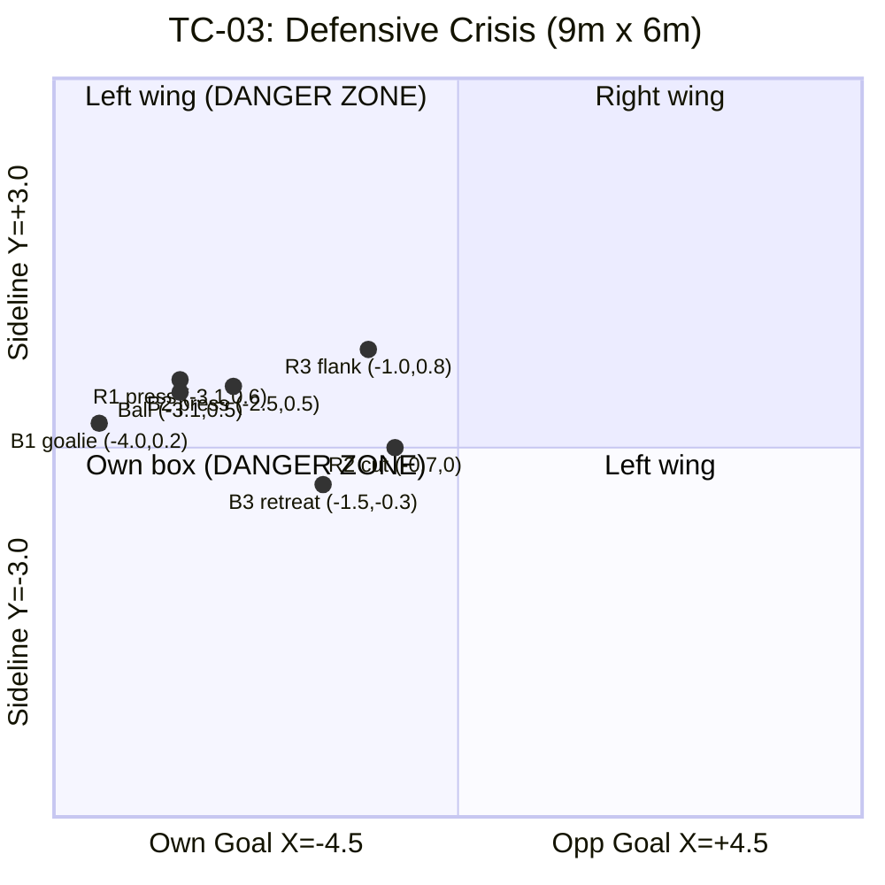
```mermaid
quadrantChart
    title TC-03: Defensive Crisis (9m x 6m)
    x-axis "Own Goal X=-4.5" --> "Opp Goal X=+4.5"
    y-axis "Sideline Y=-3.0" --> "Sideline Y=+3.0"
    quadrant-1 "Right wing"
    quadrant-2 "Left wing (DANGER ZONE)"
    quadrant-3 "Own box (DANGER ZONE)"
    quadrant-4 "Left wing"
    "Ball (-3.1,0.5)": [0.156, 0.575]
    "B1 goalie (-4.0,0.2)": [0.056, 0.533]
    "B2 press (-2.5,0.5)": [0.222, 0.583]
    "B3 retreat (-1.5,-0.3)": [0.333, 0.45]
    "R1 press (-3.1,0.6)": [0.156, 0.592]
    "R2 cut (-0.7,0)": [0.422, 0.5]
    "R3 flank (-1.0,0.8)": [0.389, 0.633]
```

> **Tests:** Emergency clear, goalie positioning, anti-cluster. Ball deep in own zone under heavy press.

#### TC-04: Fast Counter — Transition Speed

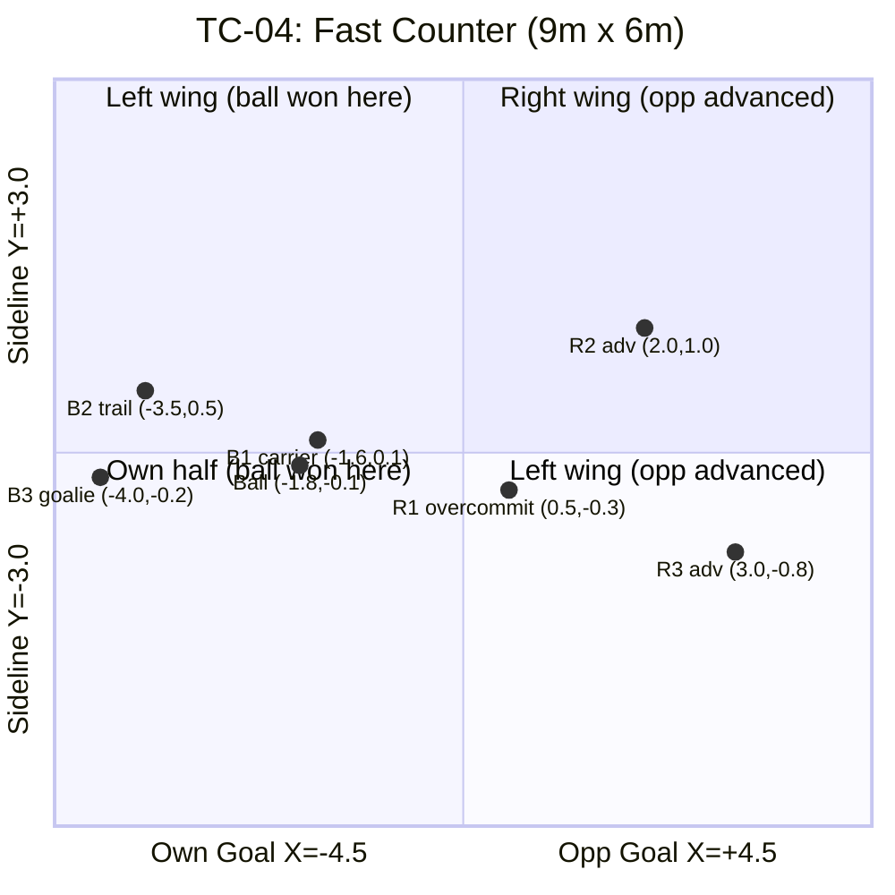
```mermaid
quadrantChart
    title TC-04: Fast Counter (9m x 6m)
    x-axis "Own Goal X=-4.5" --> "Opp Goal X=+4.5"
    y-axis "Sideline Y=-3.0" --> "Sideline Y=+3.0"
    quadrant-1 "Right wing (opp advanced)"
    quadrant-2 "Left wing (ball won here)"
    quadrant-3 "Own half (ball won here)"
    quadrant-4 "Left wing (opp advanced)"
    "Ball (-1.8,-0.1)": [0.3, 0.483]
    "B1 carrier (-1.6,0.1)": [0.322, 0.517]
    "B2 trail (-3.5,0.5)": [0.111, 0.583]
    "B3 goalie (-4.0,-0.2)": [0.056, 0.467]
    "R1 overcommit (0.5,-0.3)": [0.556, 0.45]
    "R2 adv (2.0,1.0)": [0.722, 0.667]
    "R3 adv (3.0,-0.8)": [0.833, 0.367]
```

> **Tests:** Transition speed, pass vs dribble, support runs. Red overcommitted, open space ahead.

#### TC-05: Pressing Trap — Breaking Pressure

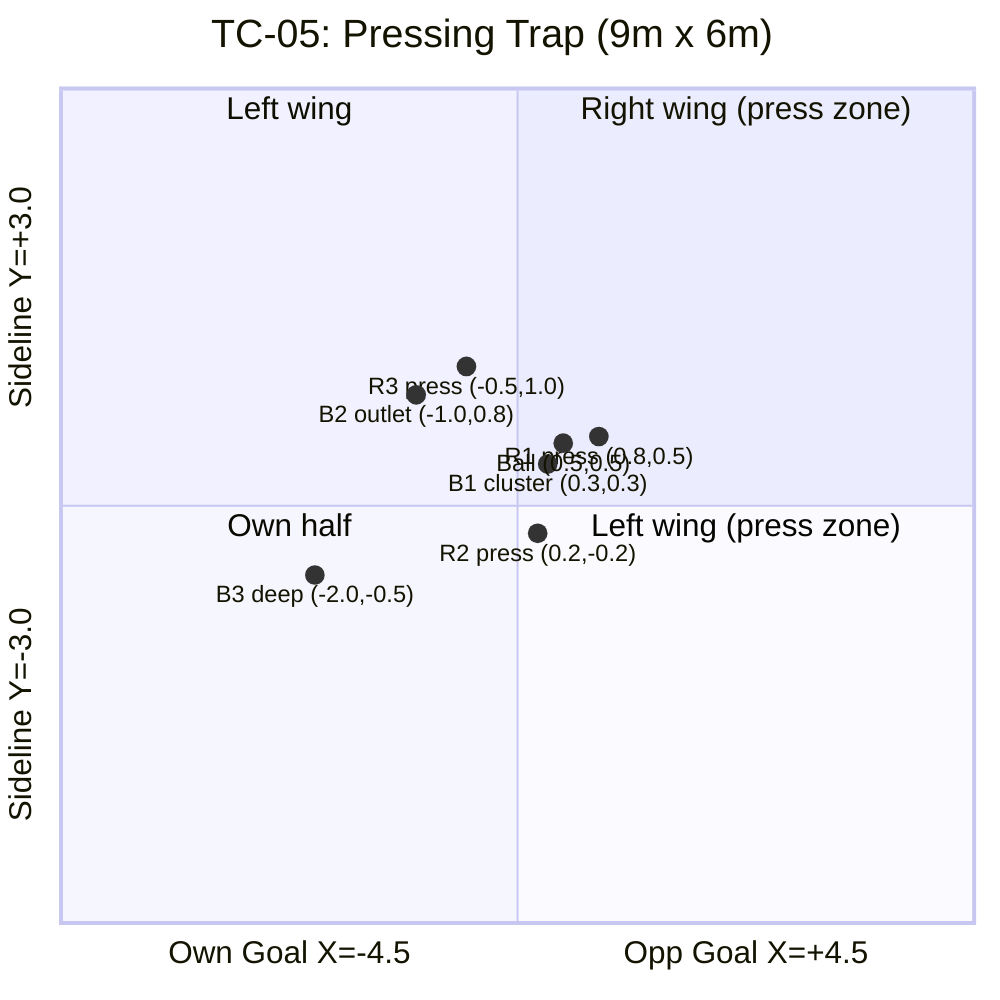
```mermaid
quadrantChart
    title TC-05: Pressing Trap (9m x 6m)
    x-axis "Own Goal X=-4.5" --> "Opp Goal X=+4.5"
    y-axis "Sideline Y=-3.0" --> "Sideline Y=+3.0"
    quadrant-1 "Right wing (press zone)"
    quadrant-2 "Left wing"
    quadrant-3 "Own half"
    quadrant-4 "Left wing (press zone)"
    "Ball (0.5,0.5)": [0.55, 0.575]
    "B1 cluster (0.3,0.3)": [0.533, 0.55]
    "B2 outlet (-1.0,0.8)": [0.389, 0.633]
    "B3 deep (-2.0,-0.5)": [0.278, 0.417]
    "R1 press (0.8,0.5)": [0.589, 0.583]
    "R2 press (0.2,-0.2)": [0.522, 0.467]
    "R3 press (-0.5,1.0)": [0.444, 0.667]
```

> **Tests:** Breaking pressure, spacing, outlet pass. Red pressing high, blue clustered near ball.

#### TC-06: Long Shot — Shot Selection

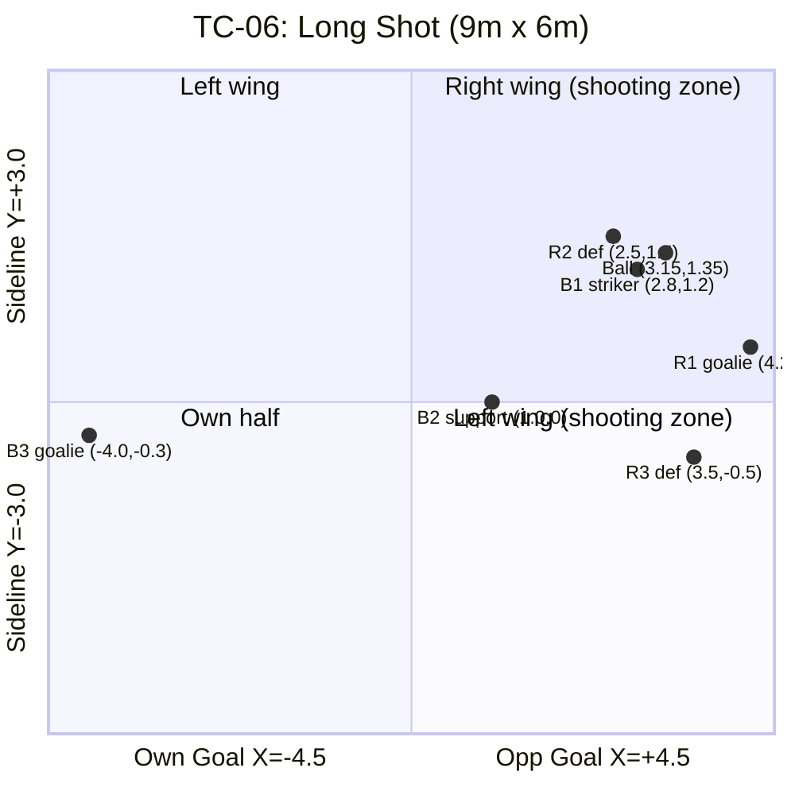
```mermaid
quadrantChart
    title TC-06: Long Shot (9m x 6m)
    x-axis "Own Goal X=-4.5" --> "Opp Goal X=+4.5"
    y-axis "Sideline Y=-3.0" --> "Sideline Y=+3.0"
    quadrant-1 "Right wing (shooting zone)"
    quadrant-2 "Left wing"
    quadrant-3 "Own half"
    quadrant-4 "Left wing (shooting zone)"
    "Ball (3.15,1.35)": [0.85, 0.725]
    "B1 striker (2.8,1.2)": [0.811, 0.7]
    "B2 support (1.0,0)": [0.611, 0.5]
    "B3 goalie (-4.0,-0.3)": [0.056, 0.45]
    "R1 goalie (4.2,0.5)": [0.967, 0.583]
    "R2 def (2.5,1.5)": [0.778, 0.75]
    "R3 def (3.5,-0.5)": [0.889, 0.417]
```

> **Tests:** Shot selection, goalie exploitation. Ball near opponent box, goalie off-center.

#### TC-07: Contain & Delay — Zone Defense

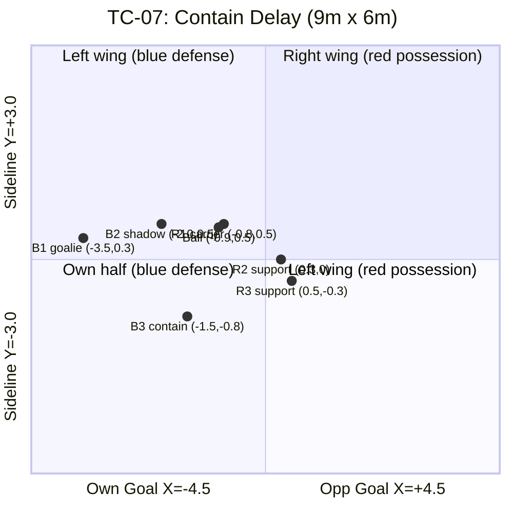
```mermaid
quadrantChart
    title TC-07: Contain Delay (9m x 6m)
    x-axis "Own Goal X=-4.5" --> "Opp Goal X=+4.5"
    y-axis "Sideline Y=-3.0" --> "Sideline Y=+3.0"
    quadrant-1 "Right wing (red possession)"
    quadrant-2 "Left wing (blue defense)"
    quadrant-3 "Own half (blue defense)"
    quadrant-4 "Left wing (red possession)"
    "Ball (-0.9,0.5)": [0.4, 0.575]
    "B1 goalie (-3.5,0.3)": [0.111, 0.55]
    "B2 shadow (-2.0,0.5)": [0.278, 0.583]
    "B3 contain (-1.5,-0.8)": [0.333, 0.367]
    "R1 carrier (-0.8,0.5)": [0.411, 0.583]
    "R2 support (0.3,0)": [0.533, 0.5]
    "R3 support (0.5,-0.3)": [0.556, 0.45]
```

> **Tests:** Delay tactics, zone defense, force turnover. Red has possession, blue outnumbered but structured.

#### TC-08: Defensive Transition — Recovery (EXISTS)

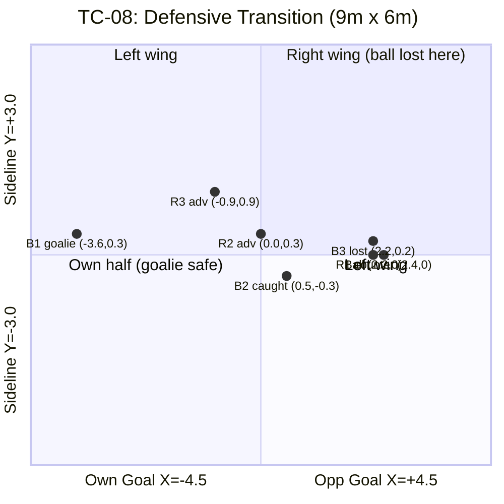
```mermaid
quadrantChart
    title TC-08: Defensive Transition (9m x 6m)
    x-axis "Own Goal X=-4.5" --> "Opp Goal X=+4.5"
    y-axis "Sideline Y=-3.0" --> "Sideline Y=+3.0"
    quadrant-1 "Right wing (ball lost here)"
    quadrant-2 "Left wing"
    quadrant-3 "Own half (goalie safe)"
    quadrant-4 "Left wing"
    "Ball (2.2,0)": [0.744, 0.5]
    "B1 goalie (-3.6,0.3)": [0.1, 0.55]
    "B2 caught (0.5,-0.3)": [0.556, 0.45]
    "B3 lost (2.2,0.2)": [0.744, 0.533]
    "R1 counter (2.4,0)": [0.767, 0.5]
    "R2 adv (0.0,0.3)": [0.5, 0.55]
    "R3 adv (-0.9,0.9)": [0.4, 0.65]
```

> **Tests:** Recovery, shape reset, counter-press. Blue caught forward after losing ball in opponent half.

#### TC-09: High Defensive Line — Offside Trap

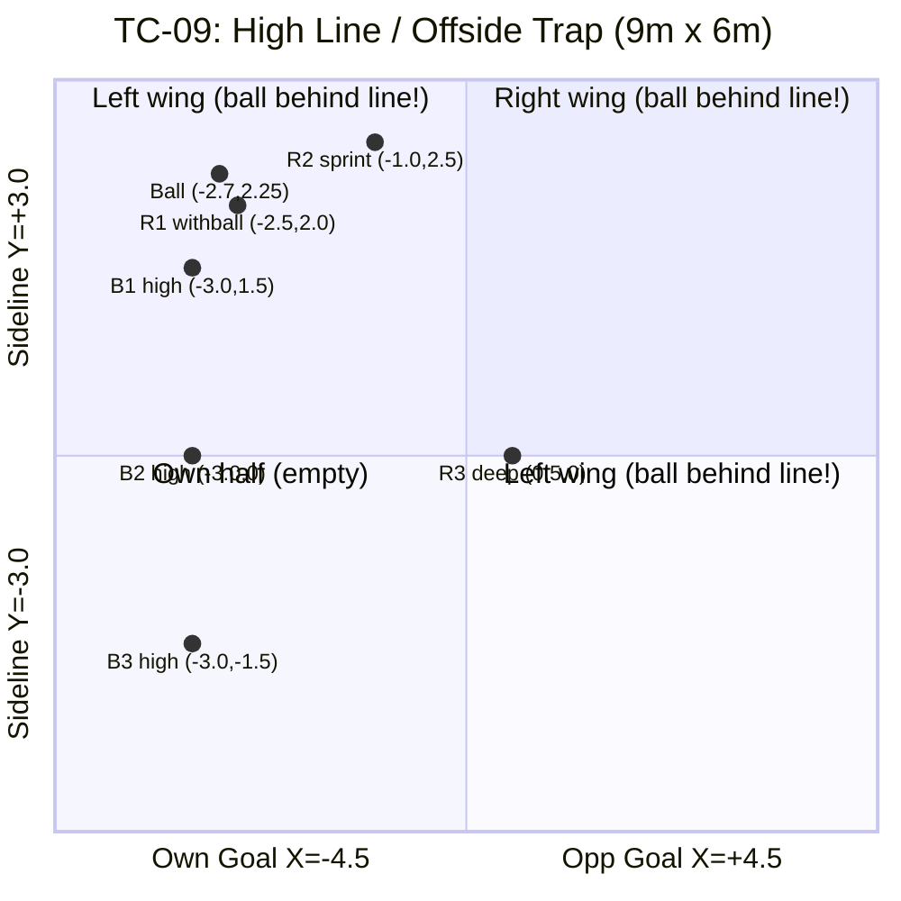
```mermaid
quadrantChart
    title TC-09: High Line / Offside Trap (9m x 6m)
    x-axis "Own Goal X=-4.5" --> "Opp Goal X=+4.5"
    y-axis "Sideline Y=-3.0" --> "Sideline Y=+3.0"
    quadrant-1 "Right wing (ball behind line!)"
    quadrant-2 "Left wing (ball behind line!)"
    quadrant-3 "Own half (empty)"
    quadrant-4 "Left wing (ball behind line!)"
    "Ball (-2.7,2.25)": [0.2, 0.875]
    "B1 high (-3.0,1.5)": [0.167, 0.75]
    "B2 high (-3.0,0)": [0.167, 0.5]
    "B3 high (-3.0,-1.5)": [0.167, 0.25]
    "R1 withball (-2.5,2.0)": [0.222, 0.833]
    "R2 sprint (-1.0,2.5)": [0.389, 0.917]
    "R3 deep (0.5,0)": [0.556, 0.5]
```

> **Tests:** Last-man decision, offside trap, goalie sweep. Ball behind the high defensive line.

#### TC-10: Kick-In — Restart Protocol (REQUIRES REFEREE)

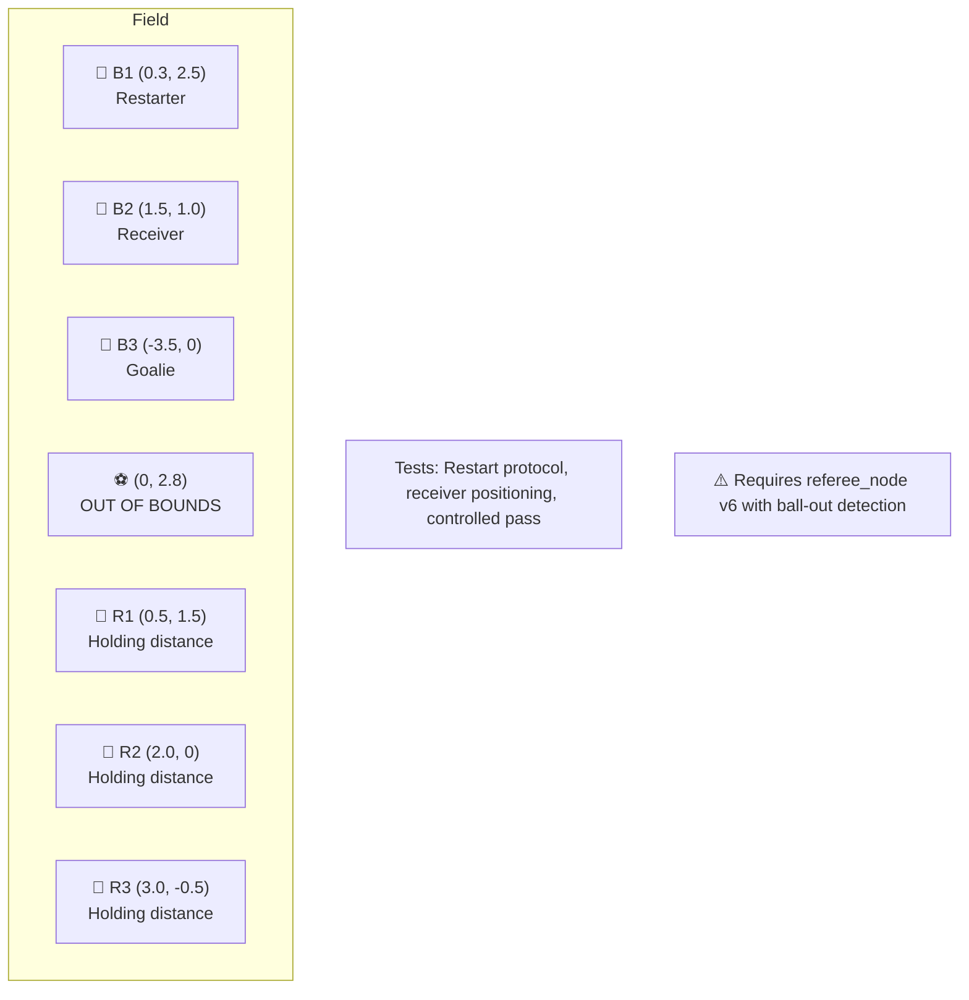
```mermaid
graph TD
    subgraph Field
        B1["🔵 B1 (0.3, 2.5)<br/>Restarter"]
        B2["🔵 B2 (1.5, 1.0)<br/>Receiver"]
        B3["🔵 B3 (-3.5, 0)<br/>Goalie"]
        Ball["⚽ (0, 2.8)<br/>OUT OF BOUNDS"]
        R1["🔴 R1 (0.5, 1.5)<br/>Holding distance"]
        R2["🔴 R2 (2.0, 0)<br/>Holding distance"]
        R3["🔴 R3 (3.0, -0.5)<br/>Holding distance"]
    end
    
    Test["Tests: Restart protocol, receiver positioning, controlled pass"]
    
    Note["⚠️ Requires referee_node v6 with ball-out detection"]
```

### 3.2 Scenario JSON Files

#### TC-01: `3vs3_attack_center.json`
```json
{
  "scenario_name": "3vs3_attack_center",
  "tactical_situation": "Midfield, even formation — baseline decision quality",
  "entities": {
    "soccer_ball": {"x": 0.0, "y": 0.0},
    "blue_1": {"x": -4.2, "y": 0.0},
    "blue_2": {"x": -1.5, "y": 1.5},
    "blue_3": {"x": -1.5, "y": -1.5},
    "red_1": {"x": 4.2, "y": 0.0},
    "red_2": {"x": 1.5, "y": 1.5},
    "red_3": {"x": 1.5, "y": -1.5}
  }
}
```

#### TC-02: `3vs3_attack_wing.json`
```json
{
  "scenario_name": "3vs3_attack_wing",
  "tactical_situation": "Ball on right wing near opponent goal — crossing opportunity",
  "entities": {
    "soccer_ball": {"x": 3.0, "y": 2.0},
    "blue_1": {"x": 2.5, "y": 1.8},
    "blue_2": {"x": 0.5, "y": 0.0},
    "blue_3": {"x": -4.0, "y": 0.3},
    "red_1": {"x": 4.2, "y": -0.5},
    "red_2": {"x": 1.0, "y": 0.5},
    "red_3": {"x": 2.0, "y": -1.5}
  }
}
```

#### TC-03: `3vs3_defensive_crisis.json`
```json
{
  "scenario_name": "3vs3_defensive_crisis",
  "tactical_situation": "Ball deep in own zone, under pressure — emergency clear",
  "entities": {
    "soccer_ball": {"x": -3.1, "y": 0.45},
    "blue_1": {"x": -4.0, "y": 0.2},
    "blue_2": {"x": -2.5, "y": 0.5},
    "blue_3": {"x": -1.5, "y": -0.3},
    "red_1": {"x": -3.1, "y": 0.55},
    "red_2": {"x": -0.7, "y": 0.0},
    "red_3": {"x": -1.0, "y": 0.8}
  }
}
```

#### TC-04: `3vs3_fast_counter.json`
```json
{
  "scenario_name": "3vs3_fast_counter",
  "tactical_situation": "Won ball in own half, open space ahead — transition opportunity",
  "entities": {
    "soccer_ball": {"x": -1.8, "y": -0.1},
    "blue_1": {"x": -1.6, "y": 0.1},
    "blue_2": {"x": -3.5, "y": 0.5},
    "blue_3": {"x": -4.0, "y": -0.2},
    "red_1": {"x": 0.5, "y": -0.3},
    "red_2": {"x": 2.0, "y": 1.0},
    "red_3": {"x": 3.0, "y": -0.8}
  }
}
```

#### TC-05: `3vs3_pressing_trap.json`
```json
{
  "scenario_name": "3vs3_pressing_trap",
  "tactical_situation": "Red team pressing high, no clear outlet — breaking pressure",
  "entities": {
    "soccer_ball": {"x": 0.45, "y": 0.45},
    "blue_1": {"x": 0.3, "y": 0.3},
    "blue_2": {"x": -1.0, "y": 0.8},
    "blue_3": {"x": -2.0, "y": -0.5},
    "red_1": {"x": 0.8, "y": 0.5},
    "red_2": {"x": 0.2, "y": -0.2},
    "red_3": {"x": -0.5, "y": 1.0}
  }
}
```

#### TC-06: `3vs3_long_shot.json`
```json
{
  "scenario_name": "3vs3_long_shot",
  "tactical_situation": "Ball near box, goalie slightly off-center — shot selection",
  "entities": {
    "soccer_ball": {"x": 3.15, "y": 1.35},
    "blue_1": {"x": 2.8, "y": 1.2},
    "blue_2": {"x": 1.0, "y": 0.0},
    "blue_3": {"x": -4.0, "y": -0.3},
    "red_1": {"x": 4.2, "y": 0.5},
    "red_2": {"x": 2.5, "y": 1.5},
    "red_3": {"x": 3.5, "y": -0.5}
  }
}
```

#### TC-07: `3vs3_contain_delay.json`
```json
{
  "scenario_name": "3vs3_contain_delay",
  "tactical_situation": "Red has possession, blue outnumbered — contain and delay",
  "entities": {
    "soccer_ball": {"x": -0.9, "y": 0.45},
    "blue_1": {"x": -3.5, "y": 0.3},
    "blue_2": {"x": -2.0, "y": 0.5},
    "blue_3": {"x": -1.5, "y": -0.8},
    "red_1": {"x": -0.8, "y": 0.5},
    "red_2": {"x": 0.3, "y": 0.0},
    "red_3": {"x": 0.5, "y": -0.3}
  }
}
```

#### TC-08: `3vs3_def_transition.json` (EXISTS)
```json
{
  "scenario_name": "3vs3_defensive_transition",
  "tactical_situation": "Lost ball in opponent half — recovery and counter-press",
  "entities": {
    "soccer_ball": {"x": 2.2, "y": 0.0},
    "blue_1": {"x": -3.6, "y": 0.3},
    "blue_2": {"x": 0.5, "y": -0.3},
    "blue_3": {"x": 2.2, "y": 0.2},
    "red_1": {"x": 2.4, "y": 0.0},
    "red_2": {"x": 0.0, "y": 0.3},
    "red_3": {"x": -0.9, "y": 0.9}
  }
}
```

#### TC-09: `3vs3_high_line.json`
```json
{
  "scenario_name": "3vs3_high_line",
  "tactical_situation": "Red threatening with through ball — high line decision",
  "entities": {
    "soccer_ball": {"x": -2.7, "y": 2.25},
    "blue_1": {"x": -3.0, "y": 1.5},
    "blue_2": {"x": -3.0, "y": 0.0},
    "blue_3": {"x": -3.0, "y": -1.5},
    "red_1": {"x": -2.5, "y": 2.0},
    "red_2": {"x": -1.0, "y": 2.5},
    "red_3": {"x": 0.5, "y": 0.0}
  }
}
```

#### TC-10: `3vs3_kick_in.json` (REQUIRES REFEREE v6)
```json
{
  "scenario_name": "3vs3_kick_in",
  "tactical_situation": "Sideline out, blue awarded kick-in — restart protocol",
  "entities": {
    "soccer_ball": {"x": 0.0, "y": 2.8},
    "blue_1": {"x": 0.3, "y": 2.5},
    "blue_2": {"x": 1.5, "y": 1.0},
    "blue_3": {"x": -3.5, "y": 0.0},
    "red_1": {"x": 0.5, "y": 1.5},
    "red_2": {"x": 2.0, "y": 0.0},
    "red_3": {"x": 3.0, "y": -0.5}
  }
}
```

> [!warning] TC-10 requires referee v6
> Ball-out detection, last-touch tracking, and restart protocol must be implemented before this scenario can function correctly. Create TC-01 through TC-09 for Phases 0-4, add TC-10 in Phase 5.

---

## 4. Prompt Variant Specifications

All variants MUST include both `Move` and `Kick` in the VALID ACTIONS section.

### Variant A: Minimalist (`rules_minimal.txt`)

```
FIELD LIMITS: X is between -4.5 and 4.5. Y is between -3.0 and 3.0.
Opponent Goal: X=4.5 (Always attack this direction).
Own Goal: X=-4.5 (Never shoot this way).

VALID ACTIONS:
1. {"action": "Move", "x": float, "y": float}
2. {"action": "Kick"}

STRICT LAWS:
- NO OWN GOALS: Never kick if you are between the ball and your own goal.
- Assign roles to ALL bots.
```

**No examples. No roles. No anti-clustering.** Tests if the model generates valid JSON with minimal guidance.

### Variant B: Role-first (`rules_rolefirst.txt`)

```
FIELD LIMITS: X is between -4.5 and 4.5. Y is between -3.0 and 3.0.
Opponent Goal: X=4.5. Own Goal: X=-4.5.

VALID ACTIONS:
1. {"action": "Move", "x": float, "y": float}
2. {"action": "Kick"}

ROLE ASSIGNMENT (MANDATORY FIRST):
Before choosing actions, assign exactly one role per bot:
- "striker": nearest to ball, attacks and kicks
- "supporter": covers passing lanes, positions for passes
- "goalie": defends X=-4.0, Y tracks ball

STEP 1: Identify ball position and closest blue bot.
STEP 2: Assign roles.
STEP 3: Output assignments.

STRICT LAWS:
- NO OWN GOALS.
- DYNAMIC GOALIE: Y coordinate MUST track ball.
```

**Explicit role-first reasoning. Tests if structured role assignment improves coordination.**

### Variant C: Anti-clustering (`rules_anticluster.txt`)

```
FIELD LIMITS: X is between -4.5 and 4.5. Y is between -3.0 and 3.0.
Opponent Goal: X=4.5. Own Goal: X=-4.5.

VALID ACTIONS:
1. {"action": "Move", "x": float, "y": float}
2. {"action": "Kick"}

ANTI-CLUSTERING RULE (CRITICAL):
Minimum pairwise distance between blue bots: 1.5 meters.
If two bots are within 1.5m, the non-striker MUST move away.
Preferred spread: one bot per sector (left/center/right).

STRICT LAWS:
- NO OWN GOALS.
- NO LAZY BOTS: Never use static Y coordinates.
- DYNAMIC GOALIE: Y MUST track ball position.
```

**Explicit spacing targets. Tests if anti-clustering rules reduce bot collision.**

### Variant D: Latency-optimized (`rules_latency.txt`)

```
You are a soccer AI. Output ONLY the 'assignments' key.
No analysis. No oracle. No conversational text.

FIELD LIMITS: X between -4.5 and 4.5. Y between -3.0 and 3.0.
Opponent Goal: X=4.5. Own Goal: X=-4.5.

VALID ACTIONS:
1. {"action": "Move", "x": float, "y": float}
2. {"action": "Kick"}

Assign roles: striker, supporter, goalie.
```

**Minimal output tokens. Tests if reduced latency improves decisions-per-minute without sacrificing quality.**

### Variant E: Hybrid

Assembled from best-performing fragments of A-D after Phase 2 analysis. Must include `Move` and `Kick` in VALID ACTIONS.

---

## 5. KPI Specification

### 5.1 Primary KPIs

| KPI | Calculation | Target |
|-----|-------------|--------|
| Goal differential | `blue_goals - red_goals` | > 0 |
| Avg reward | `mean(reward)` over all 1Hz samples | > 0 |
| Positive rate | `count(reward > +1.0) / count(all)` | > 40% |

### 5.2 Secondary KPIs

| KPI | Calculation | Target |
|-----|-------------|--------|
| Negative rate | `count(reward < -1.0) / count(all)` | < 25% |
| Foul rate | `count(foul events) / count(all decisions)` | < 10% |
| LLM latency | `mtime(current_strategy.json)` | < 2000ms |
| Decisions per run | `count(strategy mtime changes)` | > 5 |
| Avg bot distance | `mean pairwise distance` | > 1.5m |

### 5.3 Composite Score

```
composite = 0.4 × goal_diff_norm + 0.3 × avg_reward_norm
          + 0.2 × positive_rate + 0.1 × latency_factor

where:
  goal_diff_norm = goal_diff / max_reasonable (10)
  avg_reward_norm = (avg_reward + 10) / 20
  latency_factor = max(0, 1 - avg_latency_ms / 3000)
```

### 5.4 Momentum Visualization Data

Per-run time series included in `eval_results.json`:

```json
{
  "momentum_series": [
    {"time_s": 0.0, "blue_score": 0, "red_score": 0, "trend": "stable"},
    {"time_s": 10.0, "blue_score": 1.2, "red_score": -0.3, "trend": "improving"},
    {"time_s": 20.0, "blue_score": 0.5, "red_score": 0.8, "trend": "declining"}
  ]
}
```

Chart spec: X = time (0..duration), Y = score per team. Two lines. Foul markers as triangles. Goal markers as circles.

---

## 6. Automated Test Suite

### 6.1 Unit Tests (`tests/test_*.py`)

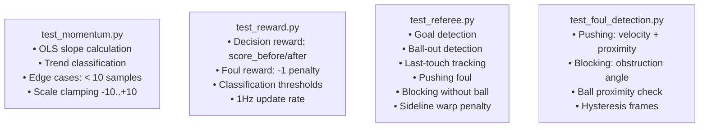
```mermaid
graph TD
    TestMomentum["test_momentum.py<br/>• OLS slope calculation<br/>• Trend classification<br/>• Edge cases: < 10 samples<br/>• Scale clamping -10..+10"]
    TestReward["test_reward.py<br/>• Decision reward: score_before/after<br/>• Foul reward: -1 penalty<br/>• Classification thresholds<br/>• 1Hz update rate"]
    TestReferee["test_referee.py<br/>• Goal detection<br/>• Ball-out detection<br/>• Last-touch tracking<br/>• Pushing foul<br/>• Blocking without ball<br/>• Sideline warp penalty"]
    TestFoul["test_foul_detection.py<br/>• Pushing: velocity + proximity<br/>• Blocking: obstruction angle<br/>• Ball proximity check<br/>• Hysteresis frames"]
```

**Test framework:** `pytest` with ROS 2 mock nodes.

```python
# tests/test_momentum.py
import pytest
from score_node import ScoreNode

class TestMomentum:
    def test_slope_positive(self):
        """Ascending scores should produce positive momentum."""
        node = ScoreNode()
        for i in range(50):
            node.momentum_window.append((i, float(i) * 0.1))
        momentum, trend = node._calculate_momentum()
        assert momentum > 0
        assert trend in ("improving", "ascending")
    
    def test_slope_negative(self):
        """Descending scores should produce negative momentum."""
        node = ScoreNode()
        for i in range(50):
            node.momentum_window.append((i, 5.0 - float(i) * 0.1))
        momentum, trend = node._calculate_momentum()
        assert momentum < 0
        assert trend in ("declining", "collapsing")
    
    def test_minimum_samples(self):
        """Less than 10 samples should return stable."""
        node = ScoreNode()
        for i in range(5):
            node.momentum_window.append((i, 5.0))
        momentum, trend = node._calculate_momentum()
        assert trend == "stable"
    
    def test_clamping(self):
        """Momentum should be clamped to -10..+10."""
        node = ScoreNode()
        # Extreme slope
        for i in range(300):
            node.momentum_window.append((i, float(i) * 10.0))
        momentum, trend = node._calculate_momentum()
        assert -10.0 <= momentum <= 10.0
```

```python
# tests/test_referee.py
import pytest

class TestFoulDetection:
    def test_pushing_foul(self):
        """Two bots colliding without ball = pushing."""
        # Bot A at (-1, 0), Bot B at (-1.2, 0), approaching at 0.6 m/s
        # Ball at (3, 0) - far away
        # Expected: foul detected, Bot B warped to sideline
        pass
    
    def test_blocking_without_ball(self):
        """Bot between opponent and ball without ball possession = blocking."""
        # Red bot between blue bot and ball, not near ball
        # Expected: blocking foul detected
        pass
    
    def test_no_foul_with_ball(self):
        """Bot with ball possession should NOT trigger pushing/blocking."""
        # Bot within 0.8m of ball, approaching opponent
        # Expected: no foul
        pass
    
    def test_sideline_warp(self):
        """Foul penalty should warp offender to own baseline sideline."""
        # Expected: offender.x = -4.0, offender.y in [-2.0, 2.0]
        pass
    
    def test_ball_out_sideline(self):
        """Ball crossing Y=3.0 or Y=-3.0 = sideline out."""
        pass
    
    def test_goal_line_out_no_goal(self):
        """Ball crossing X=4.5 but |Y| > 0.9 = goal line out, not goal."""
        pass
```

```python
# tests/test_reward.py
import pytest

class TestRewardNode:
    def test_positive_reward(self):
        """Score improving by >1.0 should classify as positive."""
        # score_before = -3.0, score_after = -1.5, reward = 1.5
        pass
    
    def test_negative_reward_foul(self):
        """Foul event should produce reward = -1.0."""
        pass
    
    def test_1hz_update_rate(self):
        """Reward node should publish at 1Hz, not per-decision."""
        pass
    
    def test_scale_clamping(self):
        """Reward values should be within -10..+10."""
        pass
```

### 6.2 Integration Tests (`tests/test_integration_*.py`)

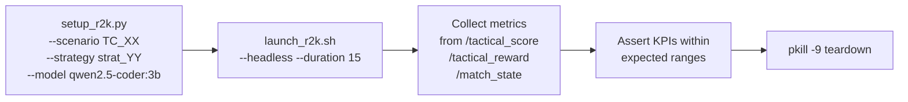
```mermaid
graph LR
    Setup["setup_r2k.py<br/>--scenario TC_XX<br/>--strategy strat_YY<br/>--model qwen2.5-coder:3b"]
    Launch["launch_r2k.sh<br/>--headless --duration 15"]
    Collect["Collect metrics<br/>from /tactical_score<br/>/tactical_reward<br/>/match_state"]
    Assert["Assert KPIs within<br/>expected ranges"]
    Teardown["pkill -9 teardown"]
    
    Setup --> Launch --> Collect --> Assert --> Teardown
```

**Fast integration tests (15-30s per test):**

```python
# tests/test_integration_smoke.py
import subprocess
import json
import time
import os

SCENARIOS_DIR = os.path.join(os.path.dirname(__file__), '..', 'src', 'scenario')

class TestIntegrationSmoke:
    def test_scenario_launches(self):
        """Each scenario JSON should parse and launch without error."""
        scenarios = [f for f in os.listdir(SCENARIOS_DIR) if f.startswith('3vs3_')]
        for scenario_file in scenarios:
            scenario_name = scenario_file.replace('.json', '')
            result = subprocess.run(
                ['python3', 'setup_r2k.py', '--scenario', scenario_name,
                 '--strategy', 'strat_aggro', '--model', 'qwen2.5-coder:3b',
                 '--relay', 'only_sim_bots'],
                capture_output=True, timeout=10
            )
            assert result.returncode == 0, f"Setup failed for {scenario_name}"
    
    def test_momentum_produces_values(self):
        """score_node should produce momentum_30s and momentum_trend."""
        # Launch 3vs3_attack_center for 15s
        # Check /tactical_score contains momentum fields
        pass
    
    def test_reward_produces_values(self):
        """reward_node should produce reward values at 1Hz."""
        # Launch 3vs3_attack_center for 15s
        # Check /tactical_reward has entries
        pass
    
    def test_foul_detection_works(self):
        """Referee should detect pushing when bots collide without ball."""
        # Use 3vs3_defensive_crisis (bots clustered near ball)
        # Run for 15s
        # Check /match_state for foul events
        pass
    
    def test_headless_duration(self):
        """--headless --duration 15 should auto-terminate after 15s."""
        # Launch with --headless --duration 15
        # Verify process exits within 20s
        pass
```

---

## 7. Implementation Phases

### Phase 0: Infrastructure & Scenario Creation

> [!success] Checkpoint 2026-07-13: ✅ PHASE 0 COMPLETE
> All 13 checklist items below are implemented and verified against the live `core/src/` tree.
> Smoke test (`results/eval_results_20260709_195609.json`) confirms batch pipeline executes.
> TC-10 (`3vs3_kick_in.json`) correctly deferred to Phase 5 — not a Phase 0 deliverable.

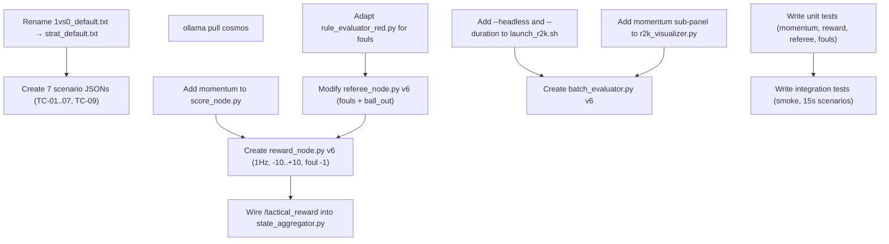
```mermaid
graph TD
    A1["Rename 1vs0_default.txt → strat_default.txt"]
    A2["Create 7 scenario JSONs (TC-01..07, TC-09)"]
    A3["ollama pull cosmos"]
    A4["Add momentum to score_node.py"]
    A5["Create reward_node.py v6 (1Hz, -10..+10, foul -1)"]
    A6["Modify referee_node.py v6 (fouls + ball_out)"]
    A7["Wire /tactical_reward into state_aggregator.py"]
    A8["Add --headless and --duration to launch_r2k.sh"]
    A9["Create batch_evaluator.py v6"]
    A10["Add momentum sub-panel to r2k_visualizer.py"]
    A11["Adapt rule_evaluator_red.py for fouls"]
    A12["Write unit tests (momentum, reward, referee, fouls)"]
    A13["Write integration tests (smoke, 15s scenarios)"]
    
    A4 --> A5 --> A7
    A6 --> A5
    A1 --> A2
    A8 --> A9
    A10 --> A9
    A11 --> A6
    A12 --> A13
```

**Checklist:**

- [x] ✅ Rename `1vs0_default.txt` → `strat_default.txt` — `strategy/strat_default.txt` exists
- [x] ✅ Update `setup_r2k.py` strategy mapping — default strategy = `strat_aggro` (line 81)
- [ ] ⬜ `ollama pull cosmos` — **deferred to Phase 3** (not needed until model comparison)
- [x] ✅ Create 7 scenario JSON files — **9 created** (TC-01..09 all present in `scenario/`)
- [x] ✅ Modify `score_node.py`: add momentum ringbuffer + OLS — `deque(maxlen=300)`, OLS slope, trend classification
- [x] ✅ Create `reward_node.py`: 1Hz, -10..+10 scale, foul penalty -1 — exists, 6260 bytes
- [x] ✅ Modify `referee_node.py`: pushing, blocking without ball, ball-out, last-touch, restart — all present (`_detect_fouls`, `_check_ball_out`, `last_toucher`, `foul_cooldown`)
- [x] ✅ Modify `state_aggregator.py`: subscribe to `/tactical_reward` — `reward_cb` at line 13
- [x] ✅ Modify `launch_r2k.sh`: `--headless`, `--duration`, add `reward_node.py` to boot — lines 48-49, 236 (native), 343 (Docker)
- [x] ✅ Modify `rule_evaluator_red.py`: add aggression factor — `AGGRESSION_FACTOR = 0.15` at line 25
- [x] ✅ Add momentum sub-panel to `r2k_visualizer.py` — `momentum_history`, `ax_momentum` subplot
- [x] ✅ Create `batch_evaluator.py`: headless orchestrator — exists, 7437 bytes, CLI with `--scenarios`/`--strategies`/`--models`/`--runs`/`--duration`/`--output`
- [x] ✅ Write unit tests: `tests/test_momentum.py`, `tests/test_reward.py`, `tests/test_referee.py`, `tests/test_foul_detection.py` — all present (+ bonus `test_kickoff_and_ballout.py`)
- [x] ✅ Write integration tests: `tests/test_integration_smoke.py` — present
- [x] ✅ Smoke test: 1 scenario × 1 strategy × 1 model × 15s — `results/eval_results_20260709_195609.json` (stub, no KPIs yet)

---

### Phase 1: Baseline — Measure Current State

> [!warning] Checkpoint 2026-07-13: ⬜ NOT STARTED
> No baseline runs executed. The only `eval_results` file is a Phase-0 smoke stub with no KPIs.
> **Next step:** run the 81-run baseline batch (requires live Ollama + Gazebo, ~1.5h compute).

- [ ] Run: 9 scenarios × 3 strategies × `qwen2.5-coder:3b` × 3 runs = **81 runs** (~1.5h)
- [ ] Collect: goal_diff, avg_reward, pos_rate, foul_rate, latency per config
- [ ] Identify: 3 worst scenarios, best strategy
- [ ] Verify momentum chart renders in visualizer

**Output:** `eval_results_baseline.json`

---

### Phase 2: Prompt Engineering (Worst 3 Scenarios Only)

> [!warning] Checkpoint 2026-07-13: ⬜ BLOCKED BY PHASE 1
> None of the 5 prompt variant fragment files exist (`rules_minimal.txt`, `rules_rolefirst.txt`,
> `rules_anticluster.txt`, `rules_latency.txt`, Variant E hybrid). Phase 2 cannot start until
> Phase 1 identifies the 3 worst scenarios.

Test 5 variants × 3 worst scenarios × 2 models × 3 runs = **90 runs** (~1.5h)

| Variant | Key Change |
|---------|-----------|
| A | Minimalist — rules only, no examples |
| B | Role-first — assign roles before actions |
| C | Anti-clustering — minimum 1.5m distance |
| D | Latency-optimized — pure `assignments` only |
| E | Hybrid — best of A-D |

- [ ] Create prompt fragment files
- [ ] Verify all variants include `Move` and `Kick` in VALID ACTIONS
- [ ] Run 90 runs
- [ ] Select best variant per model

**Output:** `eval_results_prompts.json`

---

### Phase 3: Model Comparison

> [!warning] Checkpoint 2026-07-13: ⬜ BLOCKED BY PHASE 2
> Requires `cosmos` model pulled (`ollama pull cosmos`) and Phase 2 output (best prompt variant).

- [ ] Run: best prompt × 9 scenarios × 3 models × 5 runs = **135 runs** (~2.5h)
- [ ] Generate composite score matrix
- [ ] Identify per-scenario model strengths
- [ ] Identify per-strategy model affinities

**Output:** `eval_results_models.json`

---

### Phase 4: Cross-Optimization

> [!warning] Checkpoint 2026-07-13: ⬜ BLOCKED BY PHASE 3

- [ ] Find optimal (strategy × model) per scenario
- [ ] Keep strategies fixed (no dynamic switching)
- [ ] Validation: best config × 9 × 5 = **45 runs** (~45min)

**Output:** `eval_results_final.json`

---

### Phase 5: Production & Kick-In

> [!warning] Checkpoint 2026-07-13: ⬜ BLOCKED BY PHASE 4
> `3vs3_kick_in.json` (TC-10) missing. `docs/optimization_results.md` missing.

- [ ] Integrate best prompt as `strat_default`
- [ ] Create TC-10 (`3vs3_kick_in.json`)
- [ ] Full integration test with referee (ball-out, restart, foul)
- [ ] Document findings in `docs/optimization_results.md`

---

## 8. Run Budget

| Phase | Runs | Time (N=5, D=60) |
|-------|------|--------------------|
| 1 Baseline | 81 | ~1.5h |
| 2 Prompts | 90 | ~1.5h |
| 3 Models | 135 | ~2.5h |
| 4 Validation | 45 | ~45min |
| **Total** | **351** | **~6h** |

Per run: 15s warmup + 60s data + 5s teardown = 80s

---

## 9. Data Format

Single file: `eval_results_{timestamp}.json`

```json
{
  "meta": {
    "version": "v6",
    "timestamp": "20260709_143022",
    "duration_per_run": 60,
    "runs_per_config": 5,
    "models": ["qwen2.5-coder:3b", "nemotron-3-nano:4b", "cosmos"],
    "strategies": ["strat_aggro", "strat_recover", "strat_default"],
    "scenarios": ["3vs3_attack_center", "..."]
  },
  "results": {
    "3vs3_defensive_crisis": {
      "strat_aggro": {
        "qwen2.5-coder:3b": {
          "runs": [
            {
              "goals_for": 1,
              "goals_against": 0,
              "avg_reward": 0.82,
              "positive_rate": 0.45,
              "negative_rate": 0.18,
              "foul_rate": 0.03,
              "avg_latency_ms": 950,
              "decisions": 8,
              "avg_bot_distance": 2.1
            }
          ],
          "aggregate": {
            "composite": 0.72,
            "consistency": 0.12,
            "win_rate": 0.8
          },
          "momentum_series": [
            {"time_s": 0, "blue_score": 0, "red_score": 0, "trend": "stable"},
            {"time_s": 10, "blue_score": 1.2, "red_score": -0.3, "trend": "improving"}
          ]
        }
      }
    }
  }
}
```

No per-run files. No `tactical_rewards.json` persistence. All metrics collected live via ROS topics.

---

## 10. Related Files

| File | Role | v6.1 Status |
|------|------|-------------|
| `src/score_node.py` | Momentum modification target | ✅ Implemented (OLS, deque, trend) |
| `src/referee_node.py` | Foul + ball-out modification target | ✅ Implemented (pushing, blocking, ball-out, last-touch) |
| `src/state_aggregator.py` | `/tactical_reward` subscription target | ✅ Implemented (`reward_cb`) |
| `src/reward_node.py` | NEW: 1Hz reward with foul penalty | ✅ Implemented (6260 bytes) |
| `src/ai_tactics/r2k_evaluator.py` | Prompt assembly, model selection | ✅ Unmodified (as spec required) |
| `src/setup_r2k.py` | Strategy fragment assembly | ✅ Default strategy = `strat_aggro` |
| `src/strategy/fragments/` | Prompt fragment files | ⬜ Phase 2 variants not yet created |
| `src/scenario/` | Scenario JSON files | ✅ TC-01..09 created; TC-10 deferred to Phase 5 |
| `launch_r2k.sh` | `--headless`, `--duration` flags | ✅ Implemented (lines 48-49, 236, 343) |
| `src/rule_evaluator_red.py` | Add aggression factor for fouls | ✅ Implemented (`AGGRESSION_FACTOR = 0.15`) |
| `src/r2k_visualizer.py` | Momentum sub-panel | ✅ Implemented (`ax_momentum`, `momentum_history`) |
| `src/ai_tactics/batch_evaluator.py` | NEW: Headless orchestrator | ✅ Implemented (7437 bytes, full CLI) |
| `tests/test_momentum.py` | Unit tests for momentum | ✅ Exists |
| `tests/test_reward.py` | Unit tests for reward | ✅ Exists |
| `tests/test_referee.py` | Unit tests for referee | ✅ Exists |
| `tests/test_foul_detection.py` | Unit tests for foul detection | ✅ Exists |
| `tests/test_integration_smoke.py` | Integration tests | ✅ Exists |
| `tests/test_kickoff_and_ballout.py` | Extra: kickoff + ball-out tests | ✅ Exists (bonus, beyond spec) |
| `src/strategy/strat_default.txt` | Renamed from `1vs0_default.txt` | ✅ Exists |
| `src/strategy/strat_aggro.txt` | Aggressive strategy | ✅ Exists |
| `src/strategy/strat_recover.txt` | Recovery strategy | ✅ Exists |

---

## 10a. Implementation Checkpoint Summary (2026-07-13)

> [!check] Phase 0 — Infrastructure: ✅ COMPLETE

| Spec requirement | Verified against | Status |
|------------------|------------------|--------|
| Momentum ringbuffer (deque maxlen=300) | `score_node.py:16` | ✅ |
| OLS slope + trend classification (-10..+10) | `score_node.py:22-45` | ✅ |
| 1Hz reward node (-10..+10, foul -1) | `reward_node.py` (6260 bytes) | ✅ |
| Pushing foul (0.3m + 0.5m/s + 0.8m ball prox) | `referee_node.py:_detect_fouls` | ✅ |
| Blocking without ball (0.5m + 30° + 0.8m ball prox) | `referee_node.py:_detect_fouls` | ✅ |
| Ball-out detection (±4.5 / ±3.0 / ±0.9 goal) | `referee_node.py:32-37, _check_ball_out` | ✅ |
| Last-touch tracking (hysteresis 3 frames) | `referee_node.py:last_toucher_frames` | ✅ |
| Foul cooldown / sideline warp | `referee_node.py:foul_cooldown` | ✅ |
| `/tactical_reward` wired into aggregator | `state_aggregator.py:13` | ✅ |
| `--headless` / `--duration` flags | `launch_r2k.sh:48-49` | ✅ |
| `reward_node.py` in boot sequence | `launch_r2k.sh:236, 343` | ✅ |
| Red aggression factor (0.15) | `rule_evaluator_red.py:25` | ✅ |
| Momentum sub-panel in visualizer | `r2k_visualizer.py:124-128` | ✅ |
| Batch evaluator CLI (6 args) | `batch_evaluator.py:163-174` | ✅ |
| 9 scenario JSONs (TC-01..09) | `scenario/3vs3_*.json` | ✅ |
| 6 test files (4 spec + 2 bonus) | `tests/test_*.py` | ✅ |
| Smoke test stub | `results/eval_results_20260709_195609.json` | ✅ (no KPIs yet) |

> [!warning] Remaining Phase 0 gap
> `ollama pull cosmos` — deferred to Phase 3 (not needed until model comparison). Not a blocking issue.

> [!warning] Known issues for Phase 1
> 1. The smoke test stub has `elapsed_time: 0.007s` and no KPI fields — the batch evaluator runs but does not yet collect ROS topic data into the results JSON. **Verify `batch_evaluator.py` subscribes to `/tactical_score`, `/tactical_reward`, `/match_state`, and `/world_positions` before launching the 81-run sweep.**
> 2. `ollama` was not reachable during this checkpoint — ensure the Ollama service is running user-space before Phase 1.

---

## 11. Open Questions

> [!question] Decisions
> 1. **Run duration:** 60s default, configurable via `--duration`
> 2. **Scenario focus Phase 2:** Worst 3 scenarios only
> 3. **Dynamic strategy:** Fixed strategies, no runtime switching
> 4. **Red team fouls:** Adapt `rule_evaluator_red.py` with 15% aggression factor
> 5. **Foul warp position:** Own baseline sideline, random Y in [-2.0, 2.0]
> 6. **Foul reward:** Fixed -1 (10% of scale)