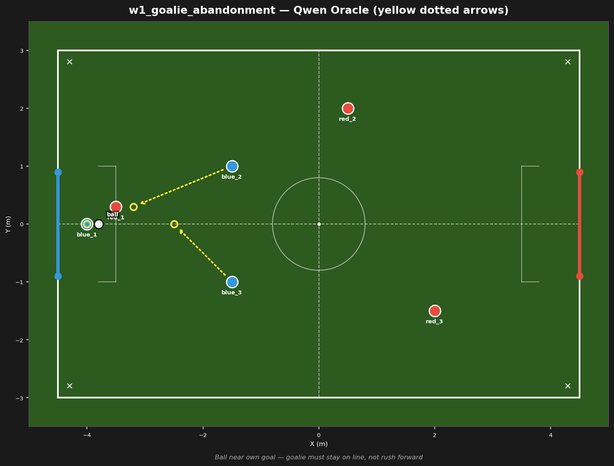

# w1_goalie_abandonment



## Failure mode
Goalie abandonment — LLM sends blue_1 forward to challenge, leaving goal open

## Expert (Analysis)
Ball at (-3.8, 0.0) deep in own half. red_1 at (-3.5, 0.3) is 0.3m from the ball — imminent shot. blue_1 at (-4.0, 0.0) is the goalie, 0.2m from the ball. blue_2 (-1.5, 1.0) and blue_3 (-1.5, -1.0) are 2.5m away. Defensive crisis — goalie must stay on the line and block, not abandon the goal.

## Oracle (Strategy)
To prevent a goal: red_1 is 0.3m from the ball with a clear shot. blue_1 must stay on the goal line at (-4.0, 0.0) to block the shot — do NOT rush forward. blue_2 and blue_3 sprint back to challenge red_1 and block the passing lane.

```
blue_1 cover the goal line at (-4.0, 0.0)
blue_2 move to (-3.2, 0.3)
blue_3 move to (-2.5, 0.0)
```

## Output to bridge

```
blue_1 move to (-4.0, 0.0)
blue_2 move to (-3.2, 0.3)
blue_3 move to (-2.5, 0.0)
```

## Score delta


