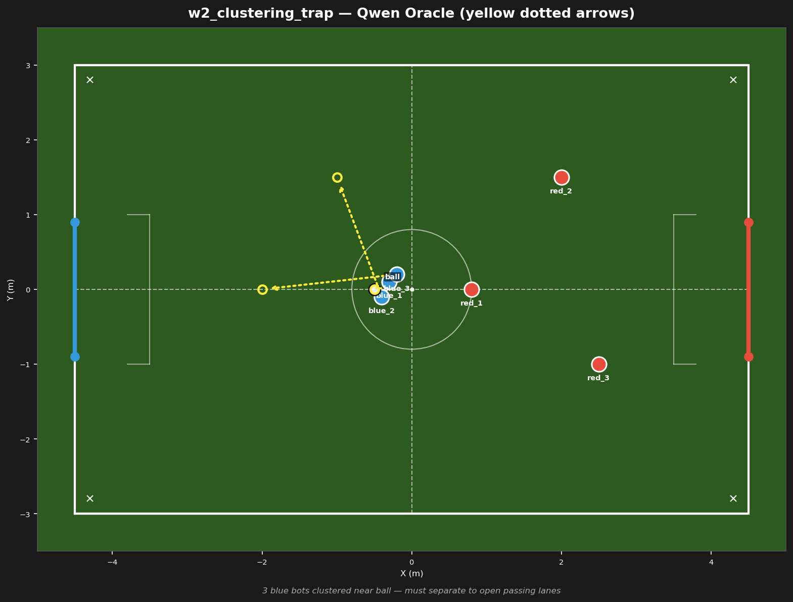

# w2_clustering_trap



## Failure mode
Clustering trap — LLM keeps all 3 bots near the ball, no spreading

## Expert (Analysis)
Ball at (-0.5, 0.0) at midfield. blue_1 (-0.3, 0.1), blue_2 (-0.4, -0.1), blue_3 (-0.2, 0.2) are all within 0.3m of each other — severe clustering. red_1 (0.8, 0.0) is 1.3m from the ball. Blue has 3 bots congested in a 0.3m radius — no passing lanes, no width.

## Oracle (Strategy)
To break the cluster: all 3 blue bots are within 0.3m — tactical congestion. blue_1 challenges the ball. blue_2 spreads wide left. blue_3 drops back to provide defensive depth. Open the formation.

```
blue_1 move to (-0.5, 0.0)
blue_2 move to (-1.0, 1.5)
blue_3 move to (-2.0, 0.0)
```

## Output to bridge

```
blue_1 move to (-0.5, 0.0)
blue_2 move to (-1.0, 1.5)
blue_3 move to (-2.0, 0.0)
```

## Score delta


