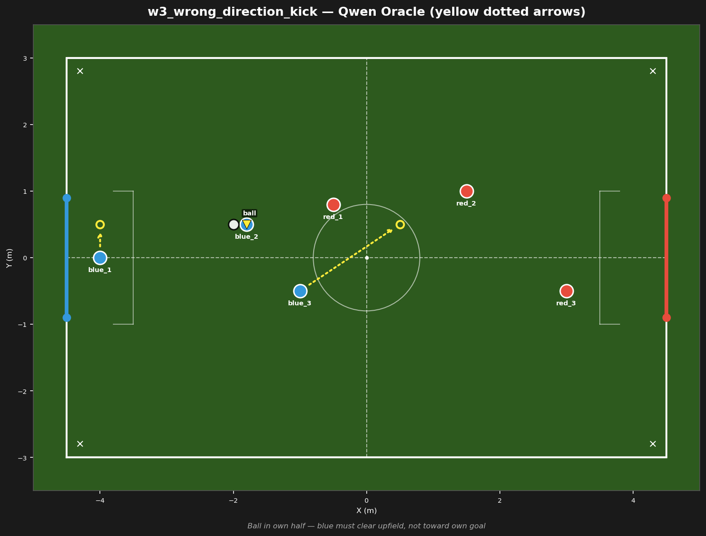

# w3_wrong_direction_kick



## Failure mode
Wrong-direction kick — LLM kicks toward own goal or holds instead of clearing

## Expert (Analysis)
Ball at (-2.0, 0.5) in own half. blue_2 (-1.8, 0.5) is on the ball — 0.2m away. red_1 (-0.5, 0.8) is pressing, 1.5m away. Blue must clear the ball upfield (toward +X), NOT toward own goal (-X).

## Oracle (Strategy)
To escape pressure: blue_2 has the ball in own half with red_1 pressing. blue_2 kicks the ball upfield toward the opponent half. blue_3 moves forward to receive the clearance. blue_1 holds the goal line.

```
blue_1 cover the goal line at (-4.0, 0.5)
blue_2 kick
blue_3 move to (0.5, 0.5)
```

## Output to bridge

```
blue_1 move to (-4.0, 0.5)
blue_2 kick
blue_3 move to (0.5, 0.5)
```

## Score delta


