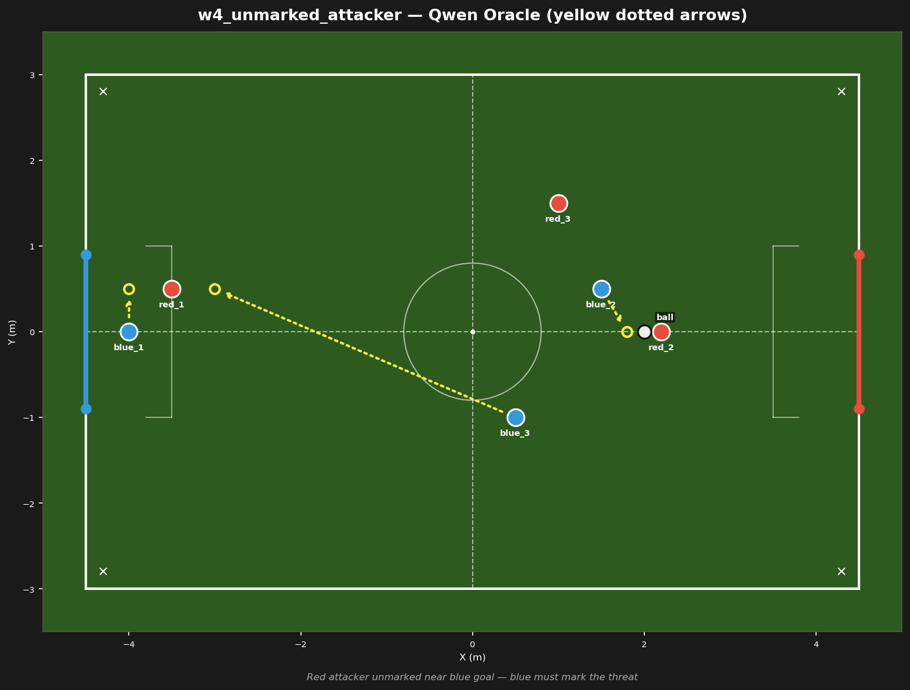

# w4_unmarked_attacker



## Failure mode
Unmarked attacker — LLM ignores red_1 near goal, keeps all bots ball-focused

## Expert (Analysis)
Ball at (2.0, 0.0) in opponent half. red_1 (-3.5, 0.5) is unmarked near blue goal — 0.5m from the goal line. blue_2 (1.5, 0.5) and blue_3 (0.5, -1.0) are upfield, ball-focused. blue_1 (-4.0, 0.0) is the goalie, 0.5m from red_1. Red has a free attacker in the box — blue must mark the threat.

## Oracle (Strategy)
To prevent a counter-attack goal: red_1 is unmarked at (-3.5, 0.5), 0.5m from blue goal. blue_3 must drop back to mark red_1. blue_2 continues pressing the ball. blue_1 holds the goal line.

```
blue_1 cover the goal line at (-4.0, 0.5)
blue_2 move to (1.8, 0.0)
blue_3 move to (-3.0, 0.5)
```

## Output to bridge

```
blue_1 move to (-4.0, 0.5)
blue_2 move to (1.8, 0.0)
blue_3 move to (-3.0, 0.5)
```

## Score delta


