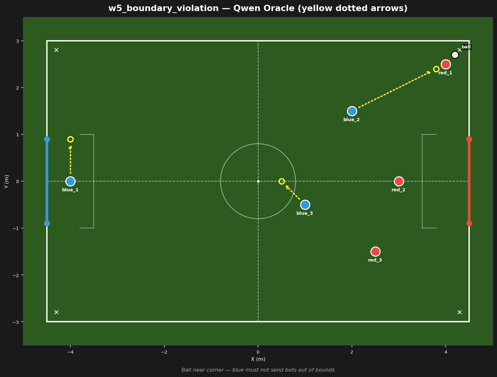

# w5_boundary_violation



## Failure mode
Boundary violation — LLM sends bot to (4.5, 3.0) or beyond, out of bounds

## Expert (Analysis)
Ball at (4.2, 2.7) near the corner of the opponent half. red_1 (4.0, 2.5) is 0.3m from the ball. blue_2 (2.0, 1.5) is 2.5m away. The ball is 0.3m from the sideline (Y=3.0) and 0.3m from the goal line (X=4.5). Bots must not be sent past field bounds.

## Oracle (Strategy)
To challenge the ball near the corner: blue_2 advances toward the ball but stays within field bounds. blue_3 covers the center. blue_1 holds the goal line. Do not send bots past X=4.5 or Y=3.0.

```
blue_1 cover the goal line at (-4.0, 0.9)
blue_2 move to (3.8, 2.4)
blue_3 move to (0.5, 0.0)
```

## Output to bridge

```
blue_1 move to (-4.0, 0.9)
blue_2 move to (3.8, 2.4)
blue_3 move to (0.5, 0.0)
```

## Score delta


