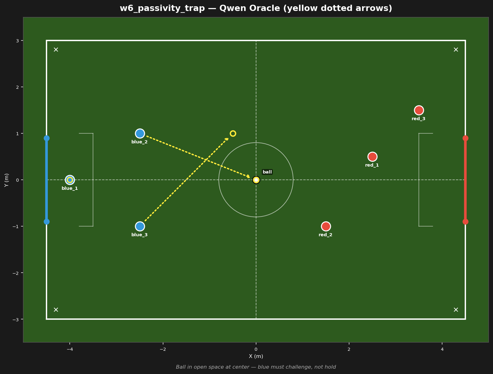

# w6_passivity_trap



## Failure mode
Passivity trap — LLM holds all bots in position, nobody challenges the ball

## Expert (Analysis)
Ball at (0.0, 0.0) at center. blue_2 (-2.5, 1.0) and blue_3 (-2.5, -1.0) are 2.7m from the ball. red_1 (2.5, 0.5) is 2.5m away — red is closer. No one has possession. Blue must challenge for the ball, not hold position.

## Oracle (Strategy)
To contest possession: the ball is in open space at center. blue_2 must advance to challenge the ball. blue_3 provides support. blue_1 holds the goal line. Do not hold — challenge for possession.

```
blue_1 cover the goal line at (-4.0, 0.0)
blue_2 move to (0.0, 0.0)
blue_3 move to (-0.5, 1.0)
```

## Output to bridge

```
blue_1 move to (-4.0, 0.0)
blue_2 move to (0.0, 0.0)
blue_3 move to (-0.5, 1.0)
```

## Score delta


