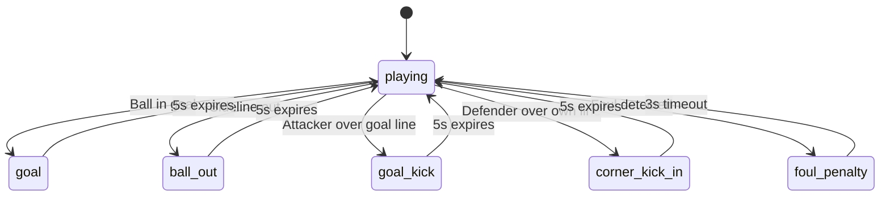
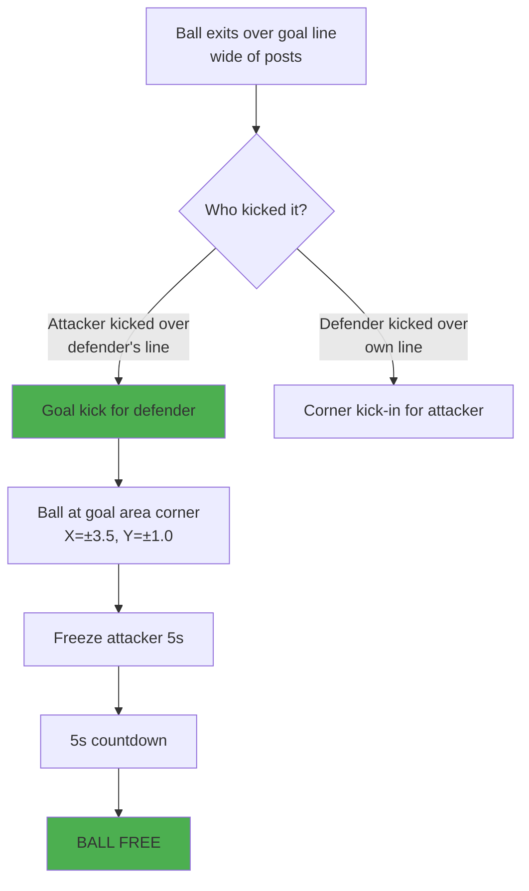
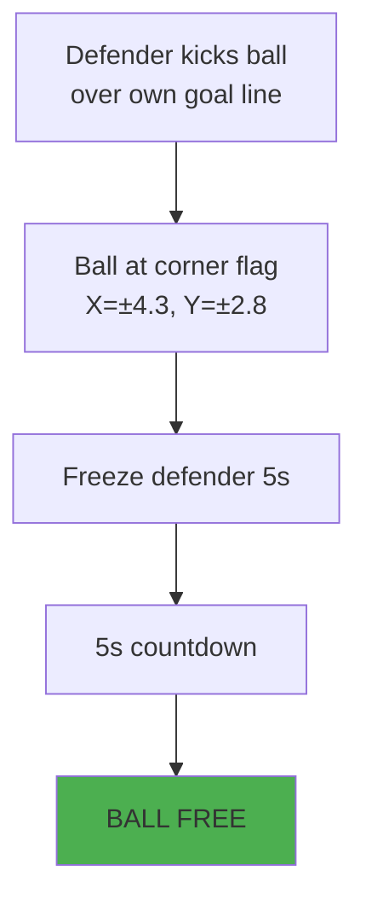
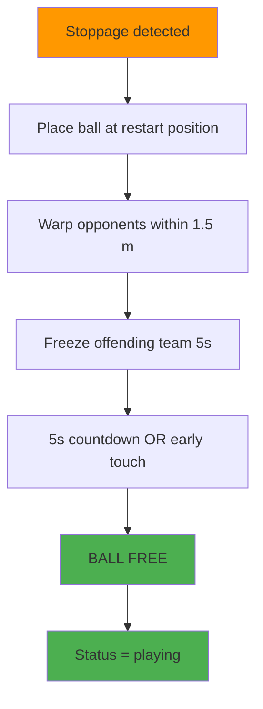
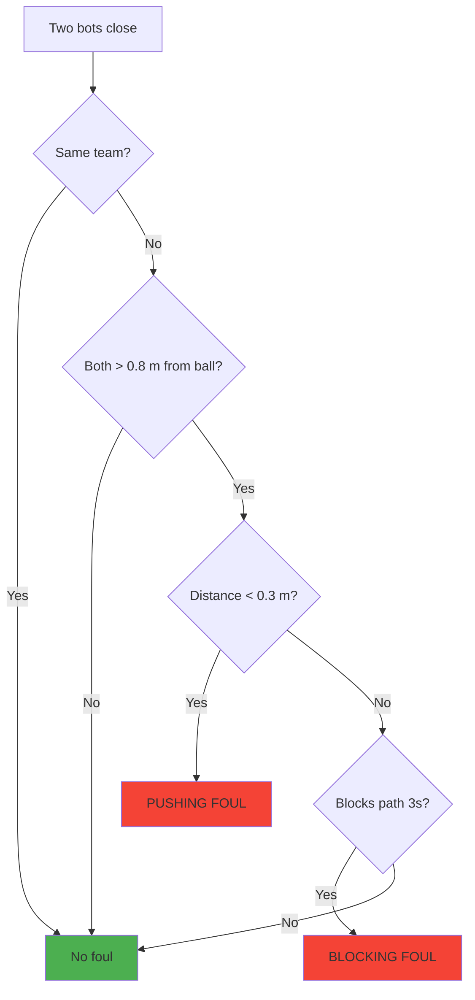
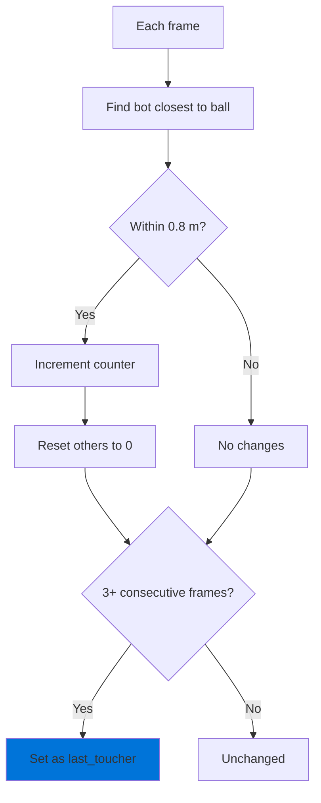
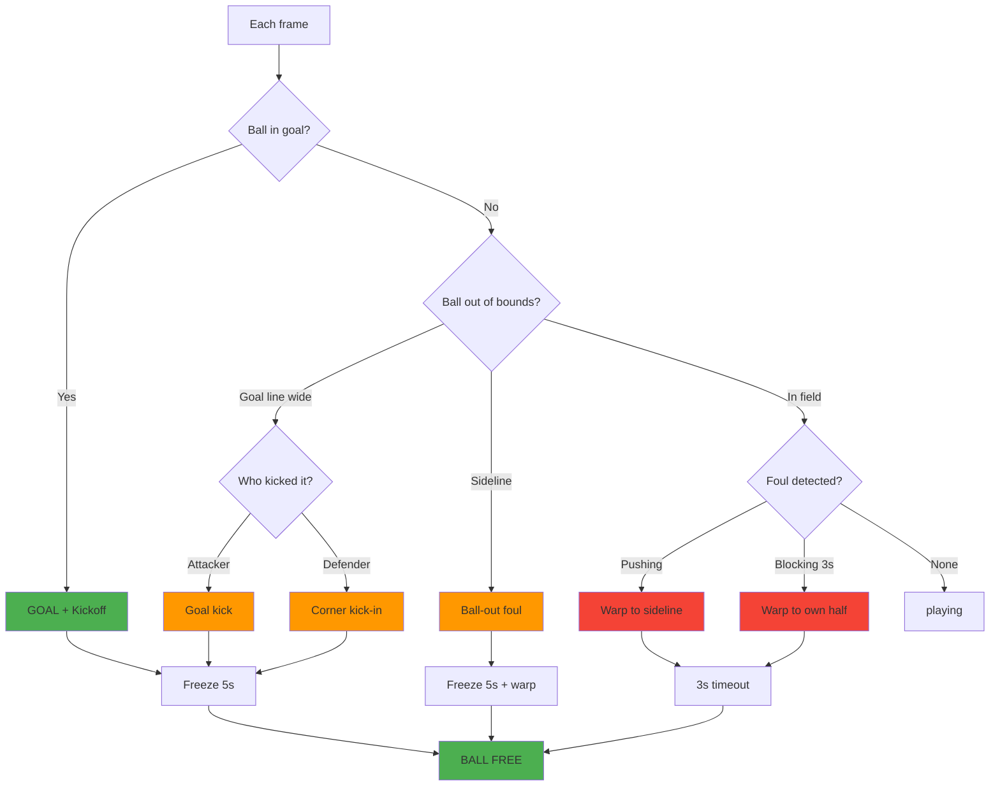

# Referee Decisions — ROS2K V6 Rulebook

> **Version:** v6.1  
> **Date:** 2026-07-14  
> **Status:** Active — single source of truth for referee rules  
> **Code:** `referee_node.py`, `score_node.py`, `reward_node.py`

> [!info] Purpose
> Authoritative reference for every referee decision in ROS2K: what triggers it,
> what consequence it has, and how it affects gameplay, scoring, and timing.
> Written for **human developers** and **LLMs** (team-red and team-blue AI).
> Use this as the single source of truth for code improvements and rule changes.

> [!warning] Code locations
> All thresholds, timeouts, and field dimensions live in `referee_node.py:__init__`.
> Scoring lives in `score_node.py`. Reward penalties live in `reward_node.py`.
> If you change a value here, update the code AND this document.

---

## Table of Contents

- [1. Field Layout](#1-field-layout)
- [2. Referee Statuses — State Machine](#2-referee-statuses--state-machine)
- [3. Decision Catalog](#3-decision-catalog)
  - [3.1 Goal](#31-goal)
  - [3.2 Ball Out (Sideline)](#32-ball-out-sideline)
  - [3.3 Goal Kick](#33-goal-kick)
  - [3.4 Corner Kick-In](#34-corner-kick-in)
  - [3.5 Foul — Pushing](#35-foul--pushing)
  - [3.6 Foul — Blocking Without Ball](#36-foul--blocking-without-ball)
  - [3.7 Ball Free](#37-ball-free)
- [4. Unified Restart Pattern](#4-unified-restart-pattern)
- [5. Foul Detection Thresholds](#5-foul-detection-thresholds)
- [6. Last-Touch Tracking](#6-last-touch-tracking)
- [7. Tactical Scoring](#7-tactical-scoring)
- [8. Reward System](#8-reward-system)
- [9. Match Score](#9-match-score)
- [10. Freeze Enforcement](#10-freeze-enforcement)
- [11. Published Match State](#11-published-match-state)
- [12. Quick Reference — Visualizer Event Labels](#12-quick-reference--visualizer-event-labels)
- [13. Decision Flow](#13-decision-flow)

---

## 1. Field Layout

The field is 9 m (X) × 6 m (Y), centered at (0, 0). Blue attacks +X (upward in diagram), Red attacks −X (downward). Drawn vertically to match standard soccer field orientation.

```
                      Red goal line  X = +4.5
          ╔═════════════════════════════════════╗
          ║          ┌─────────────────────┐     ║
          ║          │   Red goal area     │     ║
          ║          │   X = +3.5          │     ║
     ●────╫          │   Y = ±1.0          │     ╫────●
  (+4.3    ║          └─────────────────────┘     ║  (+4.3
  +2.8)    ║                ┌───┐                 ║  +2.8)
          ║                │ ● │ goal post       ║       Y = +0.9
          ║                └───┘                 ║
          ║                                      ║
          ║          ┌─────────────────────┐     ║
          ║          │                     │     ║
          ║          │      center         │     ║
  Sideline ║          │       ● (0,0)      │     ║ Sideline
  Y=+3.0  ║          │    center spot      │     ║ Y=+3.0
          ║          │                     │     ║
          ║          └─────────────────────┘     ║
          ║                                      ║
          ║                ┌───┐                 ║
          ║                │ ● │ goal post       ║       Y = -0.9
          ║                └───┘                 ║
     ●────╫          ┌─────────────────────┐     ╫────●
  (+4.3    ║          │   Blue goal area    │     ║  (+4.3
  -2.8)   ║          │   X = -3.5          │     ║  -2.8)
          ║          │   Y = ±1.0          │     ║
          ║          └─────────────────────┘     ║
          ╚═════════════════════════════════════╝
                     Blue goal line  X = -4.5
```

### Field dimensions

| Parameter | Value | Code reference |
|-----------|-------|----------------|
| `FIELD_X_MIN` | -4.5 m | `referee_node.py:33` |
| `FIELD_X_MAX` | +4.5 m | `referee_node.py:34` |
| `FIELD_Y_MIN` | -3.0 m | `referee_node.py:35` |
| `FIELD_Y_MAX` | +3.0 m | `referee_node.py:36` |
| `GOAL_Y_MIN` | -0.9 m | `referee_node.py:37` |
| `GOAL_Y_MAX` | +0.9 m | `referee_node.py:38` |
| `GOAL_AREA_X` | ±3.5 m | `referee_node.py:59` |
| `GOAL_AREA_Y` | ±1.0 m | `referee_node.py:60` |
| Corner flag X | ±4.3 m | `referee_node.py:484` |
| Corner flag Y | ±2.8 m | `referee_node.py:485` |

### Restart positions — quick guide

| Restart type | Ball position | Trigger |
|--------------|---------------|---------|
| Kickoff | (0, 0) center | After goal |
| Goal kick | (±3.5, ±1.0) goal area corner | Attacker kicks over defender's goal line |
| Corner kick-in | (±4.3, ±2.8) corner flag | Defender kicks over own goal line |
| Sideline kick-in | (exit_x, ±3.0) on sideline | Ball crosses sideline |

### Field Exit Exception

A bot MAY temporarily leave the field boundary (up to **1.0 m** beyond the line) to approach the ball from behind during a restart (kick-in, goal kick, corner kick-in). This is the **only** case where leaving the field is allowed.

| Scenario | Allowed margin | Condition |
|----------|---------------|----------|
| Restart approach | 1.0 m beyond boundary | Bot is the restart team's closest bot, status is `ball_out`, `goal_kick`, or `corner_kick_in` |
| Normal play (turning back) | 0.5 m beyond boundary | Any bot maneuvering near the edge |

After the kick, the bot MUST return inside the field. The referee does NOT penalize temporary field exits during restarts.

> [!note] Implementation
> `rule_evaluator_red.py` expands the boundary clamp from ±0.5 m to ±1.0 m when `restart_active` is true (red has the restart). The blue LLM prompt (`rules_core.txt`) includes this exception in the kick-in rule text.

---

## 2. Referee Statuses — State Machine

The referee has exactly **6 statuses**.



### Status reference table

| Status | Duration | Trigger | Code reference |
|--------|----------|---------|---------------|
| `playing` | indefinite | Normal play, all countdowns expired | `referee_node.py:73` |
| `goal` | 5.0 s | Ball crosses goal line within posts (Y between -0.9 and +0.9) | `referee_node.py:143-152` |
| `ball_out` | 5.0 s | Ball crosses sideline (Y > ±3.0), known toucher | `referee_node.py:447` |
| `goal_kick` | 5.0 s | Attacker kicks ball over defender's goal line (wide of posts) | `referee_node.py:391,515` |
| `corner_kick_in` | 5.0 s | Defender kicks ball over own goal line (wide of posts) | `referee_node.py:381,515` |
| `foul_penalty` | 3.0 s | Pushing or blocking foul detected | `referee_node.py:353` |

### Timeout constants

| Constant | Value | Applies to | Code reference |
|----------|-------|------------|---------------|
| `SET_PIECE_COUNTDOWN` | 5.0 s | `goal`, `goal_kick`, `corner_kick_in` | `referee_node.py:58` |
| `BALL_OUT_TIMEOUT` | 3.0 s | `ball_out`, `foul_penalty` | `referee_node.py:48` |
| `BALL_OUT_FREEZE_TIME` | 5.0 s | Sideline ball-out: offending team frozen | `referee_node.py:54` |
| `BLOCKING_MIN_DURATION` | 3.0 s | Sustained blocking before foul is called | `referee_node.py:30` |
| `DEBOUNCE_FRAMES` | 5 frames | Ball-out detection (prevents flicker) | `referee_node.py:39` |
| `foul_cooldown` | 5.0 s | Per-bot cooldown after any foul | `referee_node.py:322` |

---

## 3. Decision Catalog

### 3.1 Goal

**Trigger:** Ball X crosses ±4.5 AND ball Y is between -0.9 and +0.9 (within goal posts).

| Aspect | Detail |
|--------|--------|
| **Status** | `goal` |
| **Duration** | 5.0 s (`SET_PIECE_COUNTDOWN`) |
| **Score** | Blue +1 if ball crosses X=+4.5; Red +1 if ball crosses X=-4.5 |
| **Ball** | Reset to center (0, 0), stationary |
| **Bots** | All bots warped to **standard kickoff formation** (not scenario start positions) |
| **Freeze** | **Scoring team** frozen for 5.0 s (cannot move) |
| **Restart team** | Conceding team (opposite of scoring team) |
| **Kickoff** | Conceding team kicks off — freeze ends on touch or 5s countdown |
| **Code** | `referee_node.py` `_kickoff_reset()` |

**Visualizer display:**
- Event: `GOAL: Blue 1 - 0 Red`
- Event: `KICKOFF: Red` (conceding team)
- Popup: `KICKOFF Red` (shown for 5s)

> [!note] Kickoff formation rule (RoboCup standard)
> At kickoff (after a goal), ALL bots of BOTH teams must be in their own half:
> - Blue bots: X < 0
> - Red bots: X > 0
>
> The center circle (radius 1.5m from center) is reserved for the kickoff team.
> All opponents must be >=1.5m from the ball at (0, 0).
>
> The referee warps bots to a **standard formation** (not the scenario start
> positions) to enforce this rule. The standard formation is defined by
> `KICKOFF_FORMATIONS` in `referee_node.py`:
>
> | Bot | 3vs3 | 2vs2 |
> |---|---|---|
> | blue_1 (goalie) | (-4.2, 0.0) | (-4.2, 0.0) |
> | blue_2 | (-1.5, 1.5) | (-1.5, 0.0) |
> | blue_3 | (-1.5, -1.5) | — |
> | red_1 (goalie) | (4.2, 0.0) | (4.2, 0.0) |
> | red_2 | (1.5, 1.5) | (1.5, 0.0) |
> | red_3 | (1.5, -1.5) | — |
>
> All positions are >=1.5m from center (blue_2/red_2 at 2.12m in 3vs3, 1.5m in 2vs2).
> The freeze mechanism (scoring team frozen 5s) is sufficient to enforce
> the center circle rule — no additional opponent-distance check needed.

> [!note] Kickoff semantics
> The **scoring** team is frozen, the **conceding** team takes the kickoff.
> This prevents the scoring team from immediately pressing the ball.

---

### 3.2 Ball Out (Sideline)

**Trigger:** Ball Y exceeds ±3.0 (sideline), sustained for 5 consecutive frames, with a known last toucher.

| Aspect | Detail |
|--------|--------|
| **Status** | `ball_out` |
| **Duration** | 5.0 s (`SET_PIECE_COUNTDOWN`, aligned with `BALL_OUT_FREEZE_TIME`) |
| **Offender** | `last_toucher` (bot closest to ball for 3+ consecutive frames within 0.8 m) |
| **Offender penalty** | Warped 2 m inward from the sideline |
| **Team penalty** | Entire offending team frozen for 5.0 s (`BALL_OUT_FREEZE_TIME`) |
| **Ball** | Placed on the sideline where it exited, stationary |
| **Restart** | Opposing team gets the kick-in |
| **Reward** | -0.5 (reduced penalty vs other fouls) |
| **Code** | `referee_node.py:399-454` |

**Visualizer display:**
- Event: `BALL OUT: red_1 kick-in Blue`

> [!important] No neutral fallback
> The no-toucher fallback was removed (dead code). `last_toucher` is always set
> after the first few seconds of play and never cleared.
> See `referee_node.py:361-369` — if `last_toucher` is somehow `None`,
> the method returns early and no penalty is applied.

---

### 3.3 Goal Kick

**Trigger:** Attacker kicks ball over defender's goal line (X crosses ±4.5, Y outside goal posts), with a known last toucher.

**Classification:** Attacker = last toucher, goal_line_owner = defending team.

| Aspect | Detail |
|--------|--------|
| **Status** | `goal_kick` |
| **Duration** | 5.0 s (`SET_PIECE_COUNTDOWN`) |
| **Ball placement** | Nearer corner of goal area: (±3.5, ±1.0) nearest to ball exit Y |
| **Opponent warp** | Opponent bots within 1.5 m of ball warped 2.0 m radially away |
| **Opponent freeze** | Offending team (attacker) frozen for 5.0 s |
| **Restart** | Defending team (goal line owner) gets the goal kick |
| **Reward** | None (not a foul) |
| **Code** | `referee_node.py:388-396, 476-480` |

**Visualizer display:**
- Event: `GOAL KICK: Blue`
- Event: `BALL FREE` (when countdown ends)



---

### 3.4 Corner Kick-In

**Trigger:** Defender kicks ball over own goal line (X crosses ±4.5, Y outside goal posts, no goal scored), with a known last toucher.

**Classification:** Defender = last toucher, goal_line_owner = defender's own goal.

| Aspect | Detail |
|--------|--------|
| **Status** | `corner_kick_in` |
| **Duration** | 5.0 s (`SET_PIECE_COUNTDOWN`) |
| **Ball placement** | Corner flag just inside field: (±4.3, ±2.8) nearest to ball exit corner |
| **Opponent warp** | Opponent bots within 1.5 m of ball warped 2.0 m radially away |
| **Opponent freeze** | Offending team (defender) frozen for 5.0 s |
| **Restart** | Attacking team gets the corner kick-in |
| **Reward** | None (not a foul) |
| **Code** | `referee_node.py:377-386, 482-486` |

**Visualizer display:**
- Event: `CORNER: Blue`
- Event: `BALL FREE` (when countdown ends)



---

### 3.5 Foul — Pushing

**Trigger:** Two opposing bots within 0.3 m of each other, both more than 0.8 m from the ball.

| Aspect | Detail |
|--------|--------|
| **Status** | `foul_penalty` |
| **Duration** | 3.0 s (`BALL_OUT_TIMEOUT`) |
| **Thresholds** | `PUSHING_DISTANCE_THRESHOLD = 0.3 m`, `BALL_PROXIMITY_THRESHOLD = 0.8 m` |
| **Offender penalty** | Warped to own sideline (X = ±4.0, random Y between -2.0 and +2.0) |
| **Team penalty** | None (only offender warped, no team freeze) |
| **Cooldown** | 5.0 s per bot (`foul_cooldown`) |
| **Reward** | -1.0 |
| **Code** | `referee_node.py:236-272, 320-359` |

**Visualizer display:**
- Event: `FOUL: PUSHING red_1`

> [!note] Same-team exemption
> Pushing only applies to **opposing** bots. Two blue bots close together
> is NOT a foul (defensive clustering allowed). See `referee_node.py:253`.

---

### 3.6 Foul — Blocking Without Ball

**Trigger:** A bot blocks an opponent's path to the ball for 3.0+ seconds, while the blocker is more than 0.8 m from the ball.

| Aspect | Detail |
|--------|--------|
| **Status** | `foul_penalty` |
| **Duration** | 3.0 s (`BALL_OUT_TIMEOUT`) |
| **Thresholds** | `BLOCKING_DISTANCE_THRESHOLD = 0.5 m`, `BLOCKING_MIN_DURATION = 3.0 s`, `OBSTRUCTION_ANGLE = 30°` |
| **Offender penalty** | Warped to random position in own half (own goal direction) |
| **Team penalty** | None (only offender warped, no team freeze) |
| **Cooldown** | 5.0 s per bot (`foul_cooldown`) |
| **Reward** | -1.0 |
| **Code** | `referee_node.py:274-318, 320-359` |

**Visualizer display:**
- Event: `FOUL: BLOCK red_1`

**Block detection geometry:**

```
     Ball
      ●
      ↑
      │  path to ball
      │
   ┌─┴───────┐
   │ blocker │  ← within 0.5 m of opponent, in front of opponent
   └─────────┘    must be > 0.8 m from ball (not contesting)
      ↑
      │
   ┌─┴───────┐
   │opponent │  ← trying to reach ball
   └─────────┘

   Must persist for 3.0 s to trigger foul.
```

---

### 3.7 Ball Free

**Trigger:** The freeze ends when **either** of these conditions is met:
1. The restart countdown expires (5.0 s for `goal`, `ball_out`, `goal_kick`, `corner_kick_in`; 3.0 s for `foul_penalty`).
2. **Early termination:** A bot from the restart team comes within **0.3 m** of the ball. The freeze lifts immediately.

| Aspect | Detail |
|--------|--------|
| **Status** | `playing` (transition) |
| **Consequence** | All freezes lifted, ball is live, normal play resumes |
| **Early termination** | Any bot whose ID contains `restart_team` (e.g. `"red"` or `"blue"`) within 0.3 m of ball → `_end_restart()` called, `frozen_bots` cleared immediately |
| **Code** | `referee_node.py:118-125` (timeout), `referee_node.py:113-119` (early termination), `referee_node.py:_end_restart()` |

**Visualizer display:**
- Event: `BALL FREE` (shown after restart ends — either by countdown or touch)

> [!note] Early termination design
> The restart team is incentivized to reach the ball quickly — the sooner they touch it,
> the sooner the freeze lifts and normal play resumes. The opponent (frozen team) cannot
> trigger early termination — only the restart team's touch counts. The 0.3 m threshold
> matches `PUSHING_DISTANCE_THRESHOLD` (close enough to kick).

---

## 4. Unified Restart Pattern

All three restart types (kickoff, goal kick, corner kick-in) follow the same flow:



> [!note] Early termination
> The freeze ends immediately if the restart team's bot comes within 0.3 m of the ball.
> This means the 5s countdown is a maximum, not a fixed duration. See §3.7.

### Restart constants

| Constant | Value | Purpose | Code reference |
|----------|-------|---------|----------------|
| `SET_PIECE_COUNTDOWN` | 5.0 s | Countdown for all restarts | `referee_node.py:58` |
| `GOAL_AREA_X` | ±3.5 m | Goal kick ball placement X | `referee_node.py:59` |
| `GOAL_AREA_Y` | ±1.0 m | Goal kick ball placement Y | `referee_node.py:60` |
| `SET_PIECE_WARP_RADIUS` | 1.5 m | Opponents within this distance get warped | `referee_node.py:61` |
| `WARP_AWAY_DISTANCE` | 2.0 m | How far opponents are warped from ball | `referee_node.py:62` |

---

## 5. Foul Detection Thresholds

All thresholds are in `referee_node.py:24-30`.



| Threshold | Value | Code reference |
|-----------|-------|----------------|
| `PUSHING_DISTANCE_THRESHOLD` | 0.3 m | `referee_node.py:26` |
| `PUSHING_VELOCITY_THRESHOLD` | 0.5 m/s | `referee_node.py:25` |
| `BALL_PROXIMITY_THRESHOLD` | 0.8 m | `referee_node.py:27` |
| `BLOCKING_DISTANCE_THRESHOLD` | 0.5 m | `referee_node.py:28` |
| `OBSTRUCTION_ANGLE` | 30° | `referee_node.py:29` |
| `BLOCKING_MIN_DURATION` | 3.0 s | `referee_node.py:30` |

---

## 6. Last-Touch Tracking

The referee tracks which bot last touched the ball to assign ball-out responsibility.



| Parameter | Value | Code reference |
|-----------|-------|----------------|
| `PROXIMITY_THRESHOLD` | 0.8 m | `referee_node.py:42` |
| `HYSTERESIS_FRAMES` | 3 frames | `referee_node.py:43` |

> [!warning] Stale toucher behavior
> Once `last_toucher` is set, it **never decays** — the counter is only
> reset when a *different* bot becomes closest within 0.8 m. If a bot
> kicks the ball and no other bot touches it for 3+ frames, the kicker
> remains the `last_toucher` indefinitely. This is by design (the kicker
> is responsible for the kick), but may produce surprising results if
> the ball deflects off a bot for < 3 frames (no re-registration).

---

## 7. Tactical Scoring

The score node (`score_node.py`) computes a numerical tactical score every frame,
representing which team has the tactical advantage. Range: **-10 to +10** (positive = Blue advantage).

### Score computation (score_node.py:47-98)

| Component | Formula | Points | Code reference |
|-----------|---------|--------|----------------|
| Ball position | `ball.x × 1.5` | ±6.75 | `score_node.py:59` |
| Blue ball proximity | `+2.0` if blue bot within 1.0 m of ball | +2.0 | `score_node.py:65-68` |
| Red ball proximity | `-2.0` if red bot within 1.0 m of ball | -2.0 | `score_node.py:69-72` |
| Clamp | `max(-10, min(10, score))` | -10..+10 | `score_node.py:75` |

### Published data (score_node.py:88-98)

| Field | Type | Description |
|-------|------|-------------|
| `current_numerical_score` | float | Instantaneous tactical score (-10..+10) |
| `average_numerical_score` | float | Running average since match start |
| `momentum_30s` | float | OLS regression slope × 10, clamped -10..+10 |
| `momentum_trend` | string | `ascending`, `improving`, `stable`, `declining`, `collapsing` |
| `fact_label` | string | Human-readable tactical fact |
| `ball_possession_fact` | string | `Blue Team`, `Red Team`, or `Contested` |

### Momentum trend classification (score_node.py:39-43)

| Trend | Momentum range |
|-------|---------------|
| `ascending` | > +2.0 |
| `improving` | +0.5 to +2.0 |
| `stable` | -0.5 to +0.5 |
| `declining` | -2.0 to -0.5 |
| `collapsing` | < -2.0 |

### Momentum window

| Parameter | Value | Code reference |
|-----------|-------|----------------|
| `momentum_window` | `deque(maxlen=300)` | `score_node.py:16` |
| `MOMENTUM_MIN_SAMPLES` | 10 | `score_node.py:17` |
| `MOMENTUM_SCALE_FACTOR` | 10.0 | `score_node.py:18` |

---

## 8. Reward System

The reward node (`reward_node.py`) publishes rewards at 1 Hz. Two sources:

### 8.1 Foul penalties (reward_node.py:34-63)

| Foul type | Reward | Code reference |
|-----------|--------|----------------|
| `ball_out` | **-0.5** | `reward_node.py:41` |
| `pushing` | **-1.0** | `reward_node.py:43` |
| `blocking_without_ball` | **-1.0** | `reward_node.py:43` |

### 8.2 Decision rewards (reward_node.py:65-134)

Every time the LLM produces a new strategy, the reward node measures the tactical
score change after a timeout:

| Action | Timeout | Code reference |
|--------|---------|----------------|
| `Move` | 5.0 s | `reward_node.py:101` |
| `Kick` | 2.0 s | `reward_node.py:101` |

**Reward formula:** `reward = score_after - score_before`

**Classification** (reward_node.py:108-109):

| Classification | Reward range |
|---------------|-------------|
| `positive` | > +1.0 |
| `neutral` | -1.0 to +1.0 |
| `negative` | < -1.0 |

---

## 9. Match Score

The match score (goals) is tracked by the referee, separate from the tactical score.

| Event | Score change | Code reference |
|-------|-------------|----------------|
| Blue scores (ball crosses X=+4.5 within posts) | `score_blue += 1` | `referee_node.py:141` |
| Red scores (ball crosses X=-4.5 within posts) | `score_red += 1` | `referee_node.py:148` |

Published in `/match_state` as `"blue": int, "red": int`.

---

## 10. Freeze Enforcement

The referee enforces freezes by publishing zero-twist (`Twist()`) messages on `/{bot_id}/cmd_vel`
for each frozen bot. This overrides any movement commands from the LLM or rule evaluator.

| Freeze type | Duration | Scope | Code reference |
|-------------|----------|-------|----------------|
| Kickoff (scoring team) | 5.0 s | Scoring team only | `referee_node.py:173-174` |
| Sideline ball-out | 5.0 s | Offending team only | `referee_node.py:422-426` |
| Restart (goal kick, corner) | 5.0 s | Offending team only | `referee_node.py:514` |
| Foul penalty (pushing, blocking) | None | Only offender warped, no team freeze | `referee_node.py:320-359` |

> [!warning] K1 hardware limitation
> The freeze mechanism publishes `Twist` on `/{bot_id}/cmd_vel`. The Booster K1
> hardware ignores `cmd_vel` (uses `RpcReqMsg` on `LocoApiTopicReq` instead).
> Therefore, **restart freezes are sim-only** — K1 bots cannot be frozen
> by the referee. The warp-away mechanism (Gazebo `set_entity_state`) still
> works for K1, but freeze enforcement does not.

---

## 11. Published Match State

The referee publishes `/match_state` (JSON) every frame via `referee_node.py:567-580`:

| Field | Type | Description |
|-------|------|-------------|
| `blue` | int | Blue team goal count |
| `red` | int | Red team goal count |
| `status` | string | Current referee status (see §2) |
| `ball_out_event` | object\|null | `{type, position}` when ball is out |
| `restart_team` | string\|null | Team that gets the restart kick |
| `restart_pos` | object\|null | `{x, y}` where ball was placed for restart |
| `last_toucher` | string\|null | Bot ID that last touched the ball |
| `foul` | object\|null | Foul details (see below) |

### Foul event structure (referee_node.py:345-351, 433-441)

| Field | Type | Description |
|-------|------|-------------|
| `type` | string | `pushing`, `blocking_without_ball`, or `ball_out` |
| `offender` | string | Bot ID that committed the foul |
| `victim` | string\|null | Bot ID fouled against (null for ball_out) |
| `position` | object | `{x, y}` of offender at foul time |
| `penalty` | string | `sideline_warp`, `own_half_warp`, or `warp_2m_freeze_5s` |
| `out_type` | string | For `ball_out` only: `sideline` or `goal_line` |
| `restart_team` | string | For `ball_out` only: team that gets the restart |

---

## 12. Quick Reference — Visualizer Event Labels

All labels shown in the referee panel of `r2k_visualizer.py`.

| Event label | Detail format | Color | When |
|-------------|---------------|-------|------|
| `GOAL` | `Blue {n} - {m} Red` | green | Goal scored |
| `KICKOFF` | `Red` or `Blue` (conceding team) | orange | After goal, kickoff starts |
| `FOUL` | `PUSHING {offender}` | red | Pushing foul |
| `FOUL` | `BLOCK {offender}` | red | Blocking foul |
| `BALL OUT` | `{offender} kick-in {team}` | orange | Sideline ball-out with toucher |
| `GOAL KICK` | `Red` or `Blue` (defending team) | orange | Goal kick restart |
| `CORNER` | `Red` or `Blue` (attacking team) | orange | Corner kick-in restart |
| `BALL FREE` | _(empty)_ | green | Restart countdown expired |

### Naming conventions
- Event labels: **CAPS**, no hyphens, no spaces within label
- Team names: `Red`, `Blue` (capitalized, not ALL CAPS)
- Bot names: `blue_1`, `red_2`, etc. (lowercase with underscore)
- Panel title: `Referee Decisions` (ordinary English)

---

## 13. Decision Flow

