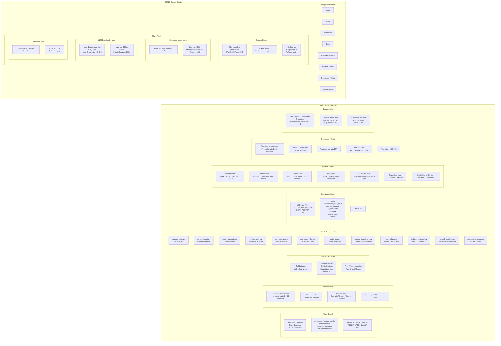

# ROS2K GUI Concept — Control Center for New Team Members

## Implementation Notes

- **Technology:** Web-based (Python Flask + HTML/CSS/JS) — runs on localhost, no internet needed
- **Architecture:** Flask server reads trace files, runs tools, launches matches; browser frontend renders results
- **Scope:** Viewer + launcher + regression runner (not a replacement for the visualizer or annotator)
- **Priority:** Nice-to-have for onboarding, not blocking tournament preparation
- **Target audience:** New team members who need to understand the system without reading 4+ changelog entries or memorizing 15+ CLI flags