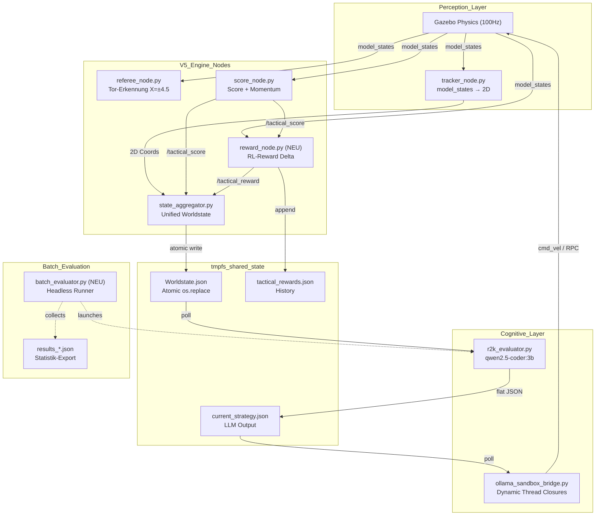
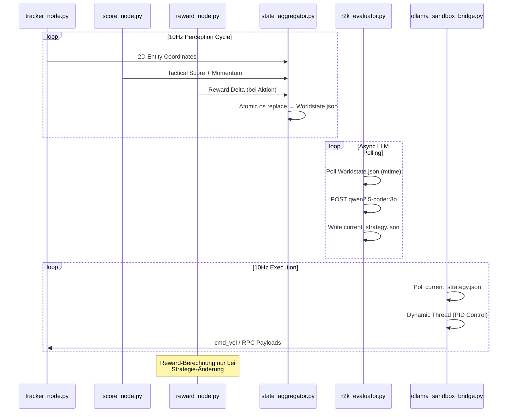
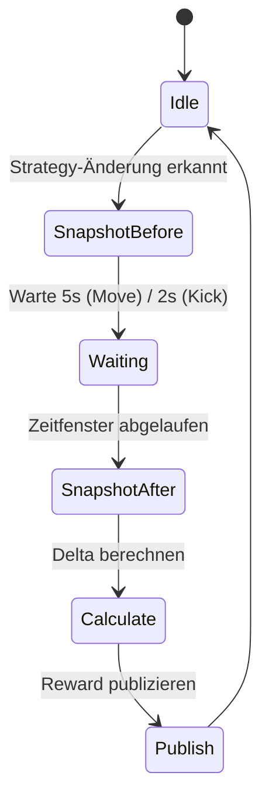
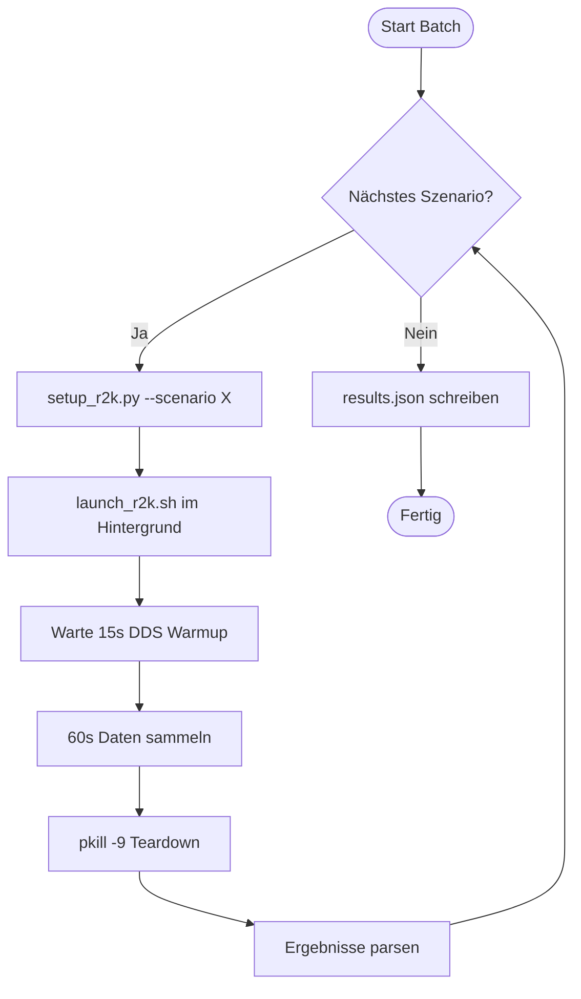

> **⚠️ SUPERSEDED by `optimization_spec_v6.md` (v6.1, 2026-07-13)**
> Diese Datei wird nur als historisches Team-Dokument behalten.
> §6 "Offene Entscheidungen" enthält Design-Entscheidungs-Tabellen
> (Momentum-Fenstergröße, Reward-Zeitfenster, Batch-Parallelisierung,
> Speicherort), deren Begründung in der v6.1-Spec nicht vollständig
> enthalten ist. Alle technischen Details wurden in v6.1 integriert.

# Technische Spezifikation: Taktische Evaluierung mit Game Momentum

**Projekt:** ROS2K Hybrid Robotics Environment (HSL)
**Version:** 1.0
**Datum:** 2026-07-06
**Autor:** ROS2K Principal Technical Architect
**Status:** Superseded — siehe `optimization_spec_v6.md` (v6.1)

---

## 1. Architektur-Übersicht

### 1.1 System-Kontext

Diese Spezifikation erweitert die bestehende ROS2K V5-Architektur um eine taktische Evaluierungspipeline mit Game Momentum-Analyse, RL-ähnlicher Reward-Berechnung und Headless Batch-Processing für automatisierte Szenario-Evaluierung.

**Bestehende V5-Architektur (unverändert):**

- **Perception:** `tracker_node.py` reduziert `/gazebo/model_states` auf 2D-Koordinaten (10Hz)
- **Engine:** `referee_node.py` (Tor-Erkennung), `score_node.py` (taktischer Score), `state_aggregator.py` (Unified Worldstate)
- **Cognitive:** `r2k_evaluator.py` (LLM-Polling via tmpfs), `ollama_sandbox_bridge.py` (Dynamic Thread Closures, keine OOP HALs)
- **Lifecycle:** `launch_r2k.sh` mit 0.2s Asynchronous Watchdog, `.bashrc Immunity`

**Neue Komponenten (V5.1):**

| Komponente | Typ | Datei | Beschreibung |
|------------|------|-------|-------------|
| Momentum-Analyse | Modify | `score_node.py` | Gleitende Fenster-Regression für Trend-Erkennung |
| Reward-Node | New | `reward_node.py` | RL-ähnliche Delta-Berechnung pro LLM-Entscheidung |
| Batch-Evaluator | New | `batch_evaluator.py` | Headless Szenario-Runner mit Statistik-Export |

### 1.2 Erweiterte System-Topologie (V5.1)



### 1.3 Datenfluss der Evaluierungspipeline



### 1.4 Architektur-Constraints (unverändert aus V5)

> **CRITICAL AXIOMS - NIEMALS VERLETZEN:**

1. **Keine OOP HALs:** Hardware-Abstraktion ausschließlich via dynamische Thread-Closures (`def task`). Keine Vererbung, keine `BaseBotDriver`-Klassen.
2. **Absolute Ground Truth:** Räumliche Wahrnehmung ausschließlich aus `/gazebo/model_states`. Keine `/odom`-Topics, keine TF2-Bäume.
3. **Entkoppelte Nebenläufigkeit:** LLM-Kommunikation ausschließlich via tmpfs-File-Polling. ROS 2 Nodes führen NIEMALS blockierende HTTP-Requests aus.
4. **Race Condition Mitigation:** Ausschließlich POSIX `os.replace()` für atomare Datei-Swaps. Kein `fcntl`-Locking.
5. **Domain-Synchronität:** `ROS_DOMAIN_ID=0`, `rmw_fastrtps_cpp`, `.bashrc Immunity`.
6. **User-Space Exklusivität:** Ollama (`qwen2.5-coder:3b`) läuft zwingend im User-Space. Keine systemd-Dienste.

---

## 2. Komponenten-Spezifikation

### 2.1 Game Momentum Analyse (Erweiterung `score_node.py`)

#### 2.1.1 Zielsetzung

Der bestehende `score_node.py` liefert nur eine Momentaufnahme (`current_numerical_score`) und einen Running Average seit Systemstart (`average_numerical_score`). Für taktische Evaluierung fehlt die **Trend-Erkennung**: Verbessert oder verschlechtert sich die Position des Teams über die Zeit?

#### 2.1.2 Algorithmus

**Ringbuffer-Implementierung:**

- **Fenstergröße:** 300 Samples (30 Sekunden bei 10Hz)
- **Speicherstruktur:** `collections.deque(maxlen=300)`
- **Sample-Format:** `(timestamp, score_value)`

**Lineare Regression (Numpy-frei):**

Berechnung der Steigung `m` über das gleitende Fenster mittels Ordinary Least Squares (OLS):

```
m = (n * Σ(xy) - Σx * Σy) / (n * Σ(x²) - (Σx)²)
```

wobei:
- `x` = Sample-Index (0, 1, 2, ..., n-1) als Zeit-Proxy
- `y` = `current_numerical_score` pro Sample
- `n` = aktuelle Fenstergröße

**Normalisierung:**

```python
# Roh-Steigung auf Momentum-Skala [-10, +10] abbilden
# Faktor 10: typische Steigung über 30s liegt im Bereich [-1.0, +1.0]
momentum_30s = max(-10.0, min(10.0, slope * 10))
```

**Trend-Klassifikation:**

| Momentum-Wert | Trend-Label | Bedeutung |
|---------------|-------------|-----------|
| `> +2.0` | `"ascending"` | Team verbessert Position stark |
| `+0.5 bis +2.0` | `"improving"` | Leichte Verbesserung |
| `-0.5 bis +0.5` | `"stable"` | Stagnation / Neutral |
| `-2.0 bis -0.5` | `"declining"` | Leichte Verschlechterung |
| `< -2.0` | `"collapsing"` | Team verliert Kontrolle stark |

#### 2.1.3 Code-Interface

```python
# Neue Imports in score_node.py
from collections import deque
import time

class ScoreNode(Node):
    def __init__(self):
        # ... bestehende Initialisierung ...
        self.momentum_window = deque(maxlen=300)  # 30s bei 10Hz

    def _calculate_momentum(self):
        """Berechnet Momentum-Steigung via OLS über gleitendes Fenster."""
        n = len(self.momentum_window)
        if n < 10:  # Mindest-Samples für valide Regression
            return 0.0, "stable"

        sum_x = sum(i for i in range(n))
        sum_y = sum(score for _, score in self.momentum_window)
        sum_xy = sum(i * score for i, (_, score) in enumerate(self.momentum_window))
        sum_x2 = sum(i * i for i in range(n))

        denominator = n * sum_x2 - sum_x * sum_x
        if abs(denominator) < 1e-9:
            return 0.0, "stable"

        slope = (n * sum_xy - sum_x * sum_y) / denominator
        momentum = max(-10.0, min(10.0, slope * 10))

        if momentum > 2.0:
            trend = "ascending"
        elif momentum > 0.5:
            trend = "improving"
        elif momentum > -0.5:
            trend = "stable"
        elif momentum > -2.0:
            trend = "declining"
        else:
            trend = "collapsing"

        return round(momentum, 2), trend

    def pos_callback(self, msg):
        # ... bestehende Score-Berechnung ...

        # Momentum-Update
        self.momentum_window.append((time.time(), score))
        momentum_val, momentum_trend = self._calculate_momentum()

        out_data = {
            "current_numerical_score": round(score, 2),
            "average_numerical_score": round(avg_score, 2),
            "momentum_30s": momentum_val,          # NEU
            "momentum_trend": momentum_trend,       # NEU
            "fact_label": fact,
            "ball_possession_fact": poss
        }
```

#### 2.1.4 Erweitertes Output-Schema (`/tactical_score`)

```json
{
  "current_numerical_score": -9.36,
  "average_numerical_score": -6.49,
  "momentum_30s": -2.1,
  "momentum_trend": "collapsing",
  "fact_label": "Red attacking",
  "ball_possession_fact": "Red Team"
}
```

#### 2.1.5 Konfigurationsparameter

| Parameter | Default | Beschreibung |
|-----------|---------|-------------|
| `MOMENTUM_WINDOW_SIZE` | 300 | Fenstergröße in Samples (30s bei 10Hz) |
| `MOMENTUM_MIN_SAMPLES` | 10 | Mindest-Samples für valide Regression |
| `MOMENTUM_SCALE_FACTOR` | 10.0 | Normalisierungsfaktor für Momentum-Skala |

---

### 2.2 Reward Node (`reward_node.py`)

#### 2.2.1 Zielsetzung

RL-ähnliche Bewertung jeder LLM-Entscheidung durch Delta-Berechnung des taktischen Scores vor und nach der Aktionsausführung. Dies ermöglicht:

1. **Few-Shot-Learning:** Erfolgreiche Aktionen als Beispiele in den LLM-Prompt einbetten
2. **Modell-Benchmarking:** Verschiedene LLM-Modelle (qwen, llama, nemotron) objektiv vergleichen
3. **Debugging:** Identifikation systematisch schlechter Entscheidungsmuster

#### 2.2.2 Algorithmus

**Phasen der Reward-Berechnung:**



**Reward-Formel:**

```python
reward = score_after - score_before
```

**Klassifikation:**

| Reward-Wert | Klassifikation | Bedeutung |
|-------------|----------------|-----------|
| `> +1.0` | `"positive"` | Gute Entscheidung, Position verbessert |
| `-1.0 bis +1.0` | `"neutral"` | Keine klare Wirkung |
| `< -1.0` | `"negative"` | Schlechte Entscheidung, Position verschlechtert |

**Zeitfenster-Strategie:**

| Aktionstyp | Wartezeit | Begründung |
|------------|-----------|------------|
| `Move` | 5.0 Sekunden | PID-Regelung benötigt Zeit für Wegstrecke |
| `Kick` | 2.0 Sekunden | Kick ist instant (Phantom Kick via set_entity_state) |

#### 2.2.3 Code-Interface

```python
import rclpy
import json
import time
import os
from rclpy.node import Node
from std_msgs.msg import String

BASE_DIR = os.path.abspath(os.path.join(os.path.dirname(__file__), '..'))
STRATEGY_PATH = os.path.join(BASE_DIR, "shared_state", "current_strategy.json")

class RewardNode(Node):
    def __init__(self):
        super().__init__('reward_node')
        self.sub_score = self.create_subscription(
            String, '/tactical_score', self.score_callback, 10)
        self.pub_reward = self.create_publisher(
            String, '/tactical_reward', 10)

        self.current_score = 0.0
        self.score_before = None
        self.last_strategy_mtime = 0
        self.action_start_time = None
        self.pending_action = None
        self.reward_history = []

        self.get_logger().info("Reward Node Online: Delta-Tracking aktiv")

    def score_callback(self, msg):
        try:
            data = json.loads(msg.data)
            self.current_score = data.get("current_numerical_score", 0.0)
        except Exception:
            pass

    def _check_strategy_change(self):
        """Pollt current_strategy.json auf Änderungen."""
        if not os.path.exists(STRATEGY_PATH):
            return None

        mtime = os.path.getmtime(STRATEGY_PATH)
        if mtime == self.last_strategy_mtime:
            return None

        self.last_strategy_mtime = mtime
        try:
            with open(STRATEGY_PATH, 'r') as f:
                return json.load(f)
        except Exception:
            return None

    def _get_wait_time(self, action_type):
        """Bestimmt Wartezeit basierend auf Aktionstyp."""
        return 5.0 if action_type == "Move" else 2.0

    def _publish_reward(self, reward, classification, action_data):
        """Publiziert Reward auf /tactical_reward Topic."""
        out = {
            "timestamp": time.time(),
            "action_type": action_data.get("action", "unknown"),
            "target_x": action_data.get("x"),
            "target_y": action_data.get("y"),
            "score_before": round(self.score_before, 2),
            "score_after": round(self.current_score, 2),
            "reward": round(reward, 2),
            "classification": classification,
            "bot_id": action_data.get("bot_id", "unknown")
        }
        msg = String()
        msg.data = json.dumps(out)
        self.pub_reward.publish(msg)
        self.reward_history.append(out)

    def spin_once(self):
        """Haupt-Logik: Snapshot → Warten → Berechnen → Publizieren."""
        # Phase 1: Snapshot bei neuer Strategie
        if self.score_before is None:
            strategy = self._check_strategy_change()
            if strategy:
                assignments = strategy.get("assignments", {})
                for bot_id, cmd in assignments.items():
                    if cmd.get("action") in ("Move", "Kick"):
                        self.score_before = self.current_score
                        self.pending_action = {**cmd, "bot_id": bot_id}
                        self.action_start_time = time.time()
                        self.get_logger().info(
                            f"Snapshot: score={self.score_before:.2f} "
                            f"vor {cmd.get('action')} von {bot_id}")
                        break  # Nur erste Aktion tracken
            return

        # Phase 2: Warten auf Zeitfenster
        wait_time = self._get_wait_time(
            self.pending_action.get("action", "Move"))
        if time.time() - self.action_start_time < wait_time:
            return

        # Phase 3: Reward berechnen und publizieren
        reward = self.current_score - self.score_before
        if reward > 1.0:
            classification = "positive"
        elif reward < -1.0:
            classification = "negative"
        else:
            classification = "neutral"

        self._publish_reward(reward, classification, self.pending_action)
        self.get_logger().info(
            f"Reward: {reward:+.2f} ({classification}) "
            f"für {self.pending_action.get('bot_id')}")

        # Reset für nächste Aktion
        self.score_before = None
        self.pending_action = None
        self.action_start_time = None

def main():
    rclpy.init()
    node = RewardNode()
    try:
        while rclpy.ok():
            rclpy.spin_once(node, timeout_sec=0.1)
            node.spin_once()
    except KeyboardInterrupt:
        pass
    finally:
        node.destroy_node()
        rclpy.shutdown()

if __name__ == '__main__':
    main()
```

#### 2.2.4 Output-Schema (`/tactical_reward`)

```json
{
  "timestamp": 1782986654.74,
  "action_type": "Move",
  "target_x": 2.3,
  "target_y": -1.1,
  "score_before": -6.5,
  "score_after": -4.2,
  "reward": 2.3,
  "classification": "positive",
  "bot_id": "blue_1"
}
```

#### 2.2.5 Reward-History (`tactical_rewards.json`)

```json
{
  "session_start": 1782986600.0,
  "total_decisions": 47,
  "positive_count": 18,
  "neutral_count": 21,
  "negative_count": 8,
  "avg_reward": 0.34,
  "rewards": [
    {
      "timestamp": 1782986654.74,
      "action_type": "Move",
      "reward": 2.3,
      "classification": "positive",
      "bot_id": "blue_1"
    }
  ]
}
```

---

### 2.3 Batch Evaluator (`batch_evaluator.py`)

#### 2.3.1 Zielsetzung

Automatisierte Evaluierung mehrerer Szenarien ohne GUI/Visualizer. Ermöglicht:

1. **Modell-Vergleich:** Verschiedene LLM-Modelle unter identischen Bedingungen testen
2. **Prompt-Optimierung:** Auswirkung von Prompt-Änderungen messen
3. **Regression-Testing:** Sicherstellen, dass Architektur-Änderungen die Performance nicht verschlechtern

#### 2.3.2 CLI-Interface

```bash
# Einfacher Batch-Run
python3 batch_evaluator.py --scenarios 1vs0,2vs1,3vs3 --runs 5

# Mit spezifischem Modell und Output-Pfad
python3 batch_evaluator.py \
    --scenarios 1vs0,2vs2 \
    --runs 10 \
    --model qwen2.5-coder:3b \
    --duration 60 \
    --output results_qwen_10runs.json

# Nur ein Szenario mit Debug-Output
python3 batch_evaluator.py --scenarios 1vs1 --runs 3 --verbose
```

**CLI-Parameter:**

| Flag | Typ | Default | Beschreibung |
|------|-----|---------|-------------|
| `--scenarios` | str | `"2vs2_default"` | Komma-separierte Szenario-Namen |
| `--runs` | int | `5` | Wiederholungen pro Szenario |
| `--model` | str | `"qwen2.5-coder:3b"` | Ollama-Modell |
| `--duration` | int | `60` | Laufzeit pro Run in Sekunden |
| `--output` | str | `"results_{timestamp}.json"` | Ausgabedatei |
| `--verbose` | flag | `False` | Detaillierte Log-Ausgabe |
| `--headless` | flag | `True` | Kein Visualizer (immer an) |

#### 2.3.3 Ablauf pro Szenario-Run



#### 2.3.4 Code-Interface

```python
#!/usr/bin/env python3
"""
batch_evaluator.py - Headless Batch-Runner für ROS2K Szenario-Evaluierung.

Führt mehrere Szenarien mehrfach aus und sammelt taktische Metriken:
- Avg Reward (aus /tactical_reward)
- Avg Momentum (aus /tactical_score)
- Win-Rate (aus /match_state)
- Entscheidungsanzahl (LLM-Outputs pro Run)
"""

import argparse
import json
import os
import subprocess
import time
import signal
import sys
from datetime import datetime

BASE_DIR = os.path.dirname(os.path.abspath(__file__))
LAUNCH_SCRIPT = os.path.join(BASE_DIR, "launch_r2k.sh")
RESULTS_DIR = os.path.join(BASE_DIR, "eval_results")


def parse_args():
    parser = argparse.ArgumentParser(
        description="ROS2K Headless Batch Evaluator")
    parser.add_argument("--scenarios", type=str, default="2vs2_default",
                        help="Komma-separierte Szenario-Namen")
    parser.add_argument("--runs", type=int, default=5,
                        help="Wiederholungen pro Szenario")
    parser.add_argument("--model", type=str, default="qwen2.5-coder:3b",
                        help="Ollama-Modell")
    parser.add_argument("--duration", type=int, default=60,
                        help="Laufzeit pro Run in Sekunden")
    parser.add_argument("--output", type=str, default=None,
                        help="Ausgabedatei (default: results_TIMESTAMP.json)")
    parser.add_argument("--verbose", action="store_true",
                        help="Detaillierte Log-Ausgabe")
    return parser.parse_args()


def run_scenario(scenario, model, duration, verbose):
    """Führt ein Szenario aus und sammelt Metriken."""
    if verbose:
        print(f"  Starte Szenario: {scenario}")

    env = os.environ.copy()
    env["R2K_OLLAMA_MODEL"] = model

    cmd = [
        "bash", LAUNCH_SCRIPT,
        "--scenario", scenario,
        "--model", model,
        "--relay", "only_sim_bots"
    ]

    proc = subprocess.Popen(
        cmd, env=env,
        stdout=subprocess.DEVNULL if not verbose else None,
        stderr=subprocess.DEVNULL if not verbose else None,
        preexec_fn=os.setsid
    )

    # Warmup: DDS-Routen etablieren
    time.sleep(15)

    # Datensammlung
    time.sleep(duration)

    # Teardown
    os.killpg(os.getpgid(proc.pid), signal.SIGTERM)
    time.sleep(2)
    subprocess.run(["pkill", "-9", "-f", "gazebo|ros2|ollama|python3"],
                   capture_output=True)
    time.sleep(3)

    return collect_metrics()


def collect_metrics():
    """Sammelt Metriken aus den Log-Dateien."""
    metrics = {
        "avg_reward": 0.0,
        "avg_momentum": 0.0,
        "total_decisions": 0,
        "positive_decisions": 0,
        "neutral_decisions": 0,
        "negative_decisions": 0,
        "score_blue": 0,
        "score_red": 0
    }

    # Reward-History einlesen
    reward_path = os.path.join(
        BASE_DIR, "src", "shared_state", "tactical_rewards.json")
    if os.path.exists(reward_path):
        try:
            with open(reward_path, 'r') as f:
                reward_data = json.load(f)
            metrics["total_decisions"] = reward_data.get("total_decisions", 0)
            metrics["positive_decisions"] = reward_data.get("positive_count", 0)
            metrics["neutral_decisions"] = reward_data.get("neutral_count", 0)
            metrics["negative_decisions"] = reward_data.get("negative_count", 0)
            metrics["avg_reward"] = reward_data.get("avg_reward", 0.0)
        except Exception:
            pass

    # Match-State einlesen (letzter Stand)
    ws_path = os.path.join(
        BASE_DIR, "src", "shared_state", "Worldstate.json")
    if os.path.exists(ws_path):
        try:
            with open(ws_path, 'r') as f:
                ws = json.load(f)
            match = ws.get("match_state", {})
            metrics["score_blue"] = match.get("blue", 0)
            metrics["score_red"] = match.get("red", 0)
        except Exception:
            pass

    return metrics


def main():
    args = parse_args()
    scenarios = [s.strip() for s in args.scenarios.split(",")]

    timestamp = datetime.now().strftime("%Y%m%d_%H%M%S")
    output_file = args.output or f"results_{timestamp}.json"
    output_path = os.path.join(RESULTS_DIR, output_file)

    os.makedirs(RESULTS_DIR, exist_ok=True)

    all_results = {
        "meta": {
            "timestamp": timestamp,
            "model": args.model,
            "duration_per_run": args.duration,
            "runs_per_scenario": args.runs,
            "scenarios": scenarios
        },
        "results": {}
    }

    print(f"ROS2K Batch Evaluator")
    print(f"  Szenarien: {scenarios}")
    print(f"  Runs pro Szenario: {args.runs}")
    print(f"  Modell: {args.model}")
    print(f"  Dauer pro Run: {args.duration}s")
    print(f"  Output: {output_path}")
    print()

    for scenario in scenarios:
        print(f"[{scenario}]")
        scenario_runs = []

        for run_idx in range(args.runs):
            if args.verbose:
                print(f"  Run {run_idx + 1}/{args.runs}...")
            else:
                print(f"  Run {run_idx + 1}/{args.runs}...", end=" ", flush=True)

            metrics = run_scenario(
                scenario, args.model, args.duration, args.verbose)
            scenario_runs.append(metrics)

            if not args.verbose:
                print(f"Reward={metrics['avg_reward']:+.2f} "
                      f"Decisions={metrics['total_decisions']} "
                      f"Score={metrics['score_blue']}:{metrics['score_red']}")

        # Aggregierte Statistik pro Szenario
        avg_reward = sum(r["avg_reward"] for r in scenario_runs) / len(scenario_runs)
        total_decisions = sum(r["total_decisions"] for r in scenario_runs)
        total_positive = sum(r["positive_decisions"] for r in scenario_runs)
        total_negative = sum(r["negative_decisions"] for r in scenario_runs)
        win_count = sum(
            1 for r in scenario_runs if r["score_blue"] > r["score_red"])

        all_results["results"][scenario] = {
            "runs": scenario_runs,
            "aggregate": {
                "avg_reward": round(avg_reward, 2),
                "total_decisions": total_decisions,
                "positive_rate": round(
                    total_positive / max(total_decisions, 1), 2),
                "negative_rate": round(
                    total_negative / max(total_decisions, 1), 2),
                "win_rate": round(win_count / args.runs, 2)
            }
        }
        print(f"  → Avg Reward: {avg_reward:+.2f} | "
              f"Win Rate: {win_count}/{args.runs} | "
              f"Decisions: {total_decisions}")
        print()

    # Ergebnisse exportieren
    with open(output_path, 'w') as f:
        json.dump(all_results, f, indent=2)

    print(f"Ergebnisse exportiert nach: {output_path}")

    # Zusammenfassung
    print("\n=== ZUSAMMENFASSUNG ===")
    for scenario, data in all_results["results"].items():
        agg = data["aggregate"]
        print(f"  {scenario}: "
              f"Reward={agg['avg_reward']:+.2f} | "
              f"Win={agg['win_rate']:.0%} | "
              f"Pos={agg['positive_rate']:.0%} | "
              f"Neg={agg['negative_rate']:.0%} | "
              f"N={agg['total_decisions']}")


if __name__ == "__main__":
    main()
```

#### 2.3.5 Output-Schema (`results_*.json`)

```json
{
  "meta": {
    "timestamp": "20260706_143022",
    "model": "qwen2.5-coder:3b",
    "duration_per_run": 60,
    "runs_per_scenario": 5,
    "scenarios": ["1vs0", "2vs1", "3vs3"]
  },
  "results": {
    "1vs0": {
      "runs": [
        {
          "avg_reward": 1.8,
          "avg_momentum": 3.2,
          "total_decisions": 12,
          "positive_decisions": 8,
          "neutral_decisions": 3,
          "negative_decisions": 1,
          "score_blue": 3,
          "score_red": 0
        }
      ],
      "aggregate": {
        "avg_reward": 1.8,
        "total_decisions": 60,
        "positive_rate": 0.67,
        "negative_rate": 0.08,
        "win_rate": 1.0
      }
    },
    "2vs1": {
      "runs": [],
      "aggregate": {
        "avg_reward": -0.4,
        "total_decisions": 89,
        "positive_rate": 0.31,
        "negative_rate": 0.42,
        "win_rate": 0.4
      }
    },
    "3vs3": {
      "runs": [],
      "aggregate": {
        "avg_reward": -1.2,
        "total_decisions": 134,
        "positive_rate": 0.22,
        "negative_rate": 0.55,
        "win_rate": 0.2
      }
    }
  }
}
```

---

## 3. Daten-Schemas (Zusammenfassung)

### 3.1 `/tactical_score` (Erweitert)

| Feld | Typ | Quelle | Beschreibung |
|------|-----|--------|-------------|
| `current_numerical_score` | float | Bestand | Aktueller taktischer Score (-10 bis +10) |
| `average_numerical_score` | float | Bestand | Running Average seit Systemstart |
| `momentum_30s` | float | **NEU** | Gleitende 30s-Momentum-Steigung |
| `momentum_trend` | string | **NEU** | Trend-Label (ascending/improving/stable/declining/collapsing) |
| `fact_label` | string | Bestand | Textuelle Spielbeschreibung |
| `ball_possession_fact` | string | Bestand | Ballbesitz (Blue Team/Red Team/Contested) |

### 3.2 `/tactical_reward` (Neu)

| Feld | Typ | Beschreibung |
|------|-----|-------------|
| `timestamp` | float | Unix-Timestamp der Berechnung |
| `action_type` | string | Move oder Kick |
| `target_x` | float | Ziel-X-Koordinate (nur bei Move) |
| `target_y` | float | Ziel-Y-Koordinate (nur bei Move) |
| `score_before` | float | Score vor Aktionsausführung |
| `score_after` | float | Score nach Aktionsausführung |
| `reward` | float | Delta (score_after - score_before) |
| `classification` | string | positive / neutral / negative |
| `bot_id` | string | Bot-Identifier (blue_1, blue_2, ...) |

### 3.3 `tactical_rewards.json` (History)

| Feld | Typ | Beschreibung |
|------|-----|-------------|
| `session_start` | float | Startzeit der Session |
| `total_decisions` | int | Anzahl aller bewerteten Entscheidungen |
| `positive_count` | int | Anzahl positiver Rewards |
| `neutral_count` | int | Anzahl neutraler Rewards |
| `negative_count` | int | Anzahl negativer Rewards |
| `avg_reward` | float | Durchschnittlicher Reward |
| `rewards` | array | Liste aller Reward-Objekte |

### 3.4 `results_*.json` (Batch-Export)

| Feld | Typ | Beschreibung |
|------|-----|-------------|
| `meta.timestamp` | string | Zeitstempel des Batch-Runs |
| `meta.model` | string | Verwendetes Ollama-Modell |
| `meta.duration_per_run` | int | Laufzeit pro Run in Sekunden |
| `meta.runs_per_scenario` | int | Wiederholungen pro Szenario |
| `meta.scenarios` | array | Liste der getesteten Szenarien |
| `results.<scenario>.runs` | array | Einzelne Run-Metriken |
| `results.<scenario>.aggregate` | object | Aggregierte Statistik |

---

## 4. Implementierungs-Reihenfolge

### Phase 1: Momentum (score_node.py)

**Grund:** Fundament für alle weiteren Metriken. Ohne Momentum keine Trend-Erkennung.

**Änderungen:**
- `score_node.py`: Ringbuffer + OLS-Regression hinzufügen
- Output-Schema um `momentum_30s` und `momentum_trend` erweitern
- Keine neuen Dependencies (nur `collections.deque`)

**Test:** Manueller Run mit `--scenario 2vs2_default`, Momentum-Trend im Visualizer beobachten.

### Phase 2: Reward (reward_node.py)

**Grund:** Baut auf Momentum auf. Benötigt `score_node.py` als Datenquelle.

**Änderungen:**
- Neue Datei: `src/reward_node.py`
- Neues Topic: `/tactical_reward`
- `launch_r2k.sh`: Reward-Node in Boot-Sequenz aufnehmen
- `state_aggregator.py`: `/tactical_reward` Subscription hinzufügen

**Test:** Einzelner Run, Reward-History in `tactical_rewards.json` prüfen.

### Phase 3: Batch (batch_evaluator.py)

**Grund:** Nutzt alle vorherigen Komponenten. Benötigt stabile Momentum- und Reward-Pipeline.

**Änderungen:**
- Neue Datei: `batch_evaluator.py`
- Neues Verzeichnis: `eval_results/`
- `launch_r2k.sh`: `--headless` Flag für Batch-Mode

**Test:** `python3 batch_evaluator.py --scenarios 1vs0 --runs 2 --verbose`

---

## 5. Integration in launch_r2k.sh

### 5.1 Boot-Sequenz (Erweitert)

```bash
# Bestehende Nodes (unverändert)
ros2 run r2k_world_model tracker > /dev/null 2>&1 &
python3 referee_node.py > /dev/null 2>&1 &
python3 score_node.py > /dev/null 2>&1 &
python3 state_aggregator.py > /dev/null 2>&1 &
python3 rule_evaluator_red.py > /dev/null 2>&1 &
python3 ai_tactics/ollama_sandbox_bridge.py > /dev/null 2>&1 &

# NEU: Reward Node
python3 reward_node.py > /dev/null 2>&1 &

# Bestehend: Team Blue AI
python3 -u ai_tactics/r2k_evaluator.py &

# Bedingt: Visualizer (nur wenn nicht --headless)
if [ "$HEADLESS" != "true" ]; then
    python3 r2k_visualizer.py
fi
```

### 5.2 Neues CLI-Flag

```bash
--headless) HEADLESS="true"; shift ;;
```

---

## 6. Offene Entscheidungen

### 6.1 Momentum-Fenstergröße

| Option | Samples | Reaktionszeit | Glättung | Empfehlung |
|--------|---------|---------------|----------|------------|
| Kurz | 100 (10s) | Schnell | Gering | Für schnelle Szenarien (1vs0) |
| Mittel | 300 (30s) | Ausgewogen | Mittel | **Default** |
| Lang | 600 (60s) | Langsam | Stark | Für lange Matches (3vs3) |

**Entscheidung:** 300 Samples (30s) als Default, per Konstante überschreibbar.

### 6.2 Reward-Zeitfenster

| Aktion | Fenster | Begründung |
|--------|---------|------------|
| Move | 5.0s | PID braucht ~2-3s für Wegstrecke + 2s Puffer |
| Kick | 2.0s | Phantom Kick ist instant, nur Ball-Flug abwarten |

**Entscheidung:** 5s für Move, 2s für Kick. Als Konstanten definiert.

### 6.3 Batch-Parallelisierung

| Modus | Vorteil | Nachteil |
|-------|---------|----------|
| Sequentiell | Einfach, keine Domain-Konflikte | Langsamer (N × Dauer) |
| Parallel | Schneller | Benötigt ROS_DOMAIN_ID-Isolation |

**Entscheidung:** Sequentiell für V1. Parallel als `--parallel` Flag für V2.

### 6.4 Speicherort für Ergebnisse

| Pfad | Vorteil | Nachteil |
|------|---------|----------|
| `core/eval_results/` | Im Repo, versionierbar | Kann groß werden |
| `/tmp/r2k_batch/` | RAM-Disk, schnell | Flüchtig nach Reboot |

**Entscheidung:** `core/eval_results/` als Default, per `--output` überschreibbar.

---

## 7. Risiken & Mitigation

| Risiko | Wahrscheinlichkeit | Auswirkung | Mitigation |
|--------|-------------------|------------|------------|
| Momentum-Regression instabil bei <10 Samples | Mittel | Falsche Trend-Klassifikation | `MOMENTUM_MIN_SAMPLES=10` Guard |
| Reward-Node verpasst Strategie-Änderung | Niedrig | Fehlende Reward-Daten | mtime-Polling mit 0.1s Intervall |
| Batch-Runner hinterlässt Zombie-Prozesse | Mittel | Port-Blockaden, Ressourcen-Leak | `os.killpg()` + `pkill -9` im Teardown |
| `shared_state/` existiert nicht | Hoch | Silent Crash (FileNotFoundError) | `os.makedirs()` im Batch-Runner vor Start |
| LLM-Latenz > Batch-Duration | Niedrig | Keine Entscheidungen im Run | `--duration` ≥ 60s empfohlen |

---

## 8. Test-Plan

### 8.1 Unit-Tests (manuell)

| Komponente | Test | Erwartetes Ergebnis |
|------------|------|---------------------|
| Momentum | 30s Run, Ball Richtung Tor schieben | `momentum_trend = "ascending"` |
| Momentum | 30s Run, Ball Richtung eigenes Tor | `momentum_trend = "collapsing"` |
| Reward | Move-Aktion → 5s warten | Reward publiziert mit `classification` |
| Reward | Kick-Aktion → 2s warten | Reward publiziert mit `classification` |
| Batch | `--scenarios 1vs0 --runs 2` | 2 Runs, `results_*.json` existiert |

### 8.2 Integrationstest

```bash
# Vollständiger Integrationstest
python3 batch_evaluator.py \
    --scenarios 1vs0,1vs1,2vs2 \
    --runs 3 \
    --duration 45 \
    --verbose
```

**Erwartet:**
- 9 Runs (3 Szenarien × 3 Wiederholungen)
- `results_*.json` mit aggregierten Metriken
- Keine Zombie-Prozesse nach Abschluss
- `tactical_rewards.json` pro Run mit >0 Entscheidungen

---

## 9. Glossar

| Begriff | Definition |
|---------|------------|
| **Momentum** | Gleitende Steigung des taktischen Scores über 30s. Positiv = Team verbessert Position. |
| **Reward** | Delta des Scores vor/nach einer LLM-Entscheidung. Positiv = gute Aktion. |
| **OLS** | Ordinary Least Squares. Lineare Regression ohne externe Bibliotheken. |
| **Headless** | Betrieb ohne GUI/Visualizer. Nur ROS 2 Nodes + Datensammlung. |
| **Batch-Run** | Automatisierte Ausführung mehrerer Szenario-Durchläufe. |
| **tmpfs** | RAM-gestützte Partition für `shared_state/`. Verhindert SSD-Verschleiß bei 10Hz-Schreibzyklen. |
| **Atomic Swap** | `os.replace()` für race-condition-freie Datei-Updates. |
| **Dynamic Thread Closure** | `def task` + `threading.Event()` statt OOP-Vererbung für PID-Steuerung. |

---

*Ende der Spezifikation. Nächster Schritt: Review und Freigabe zur Implementierung.*
