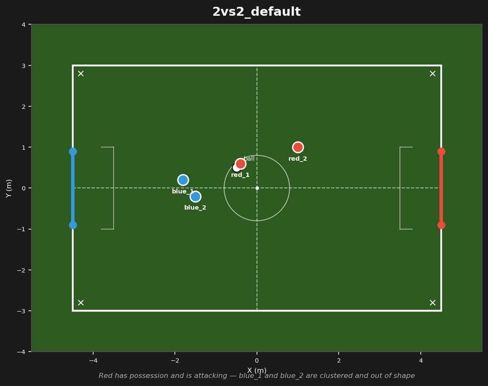
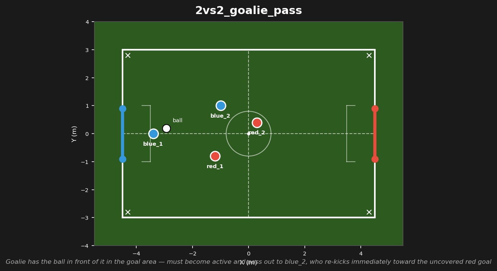
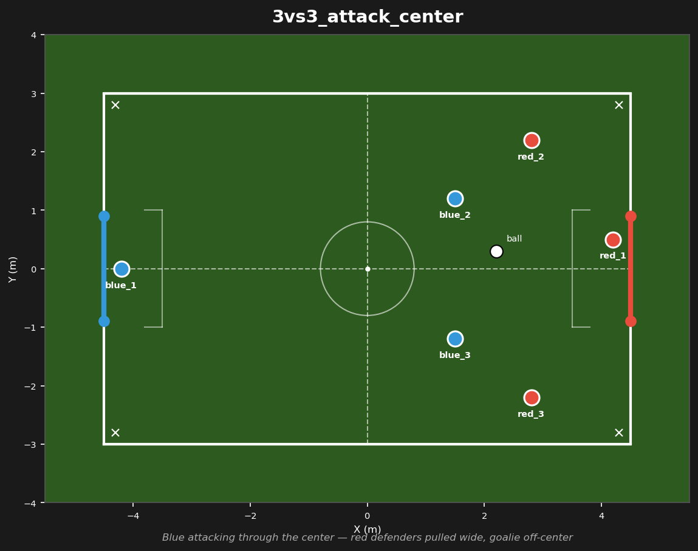
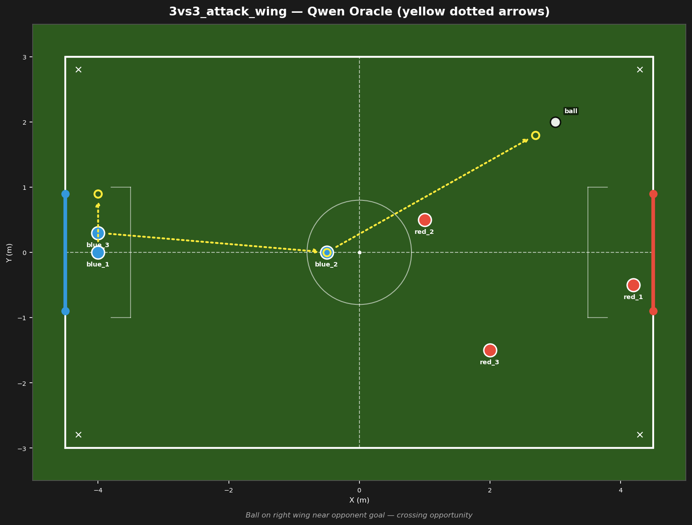
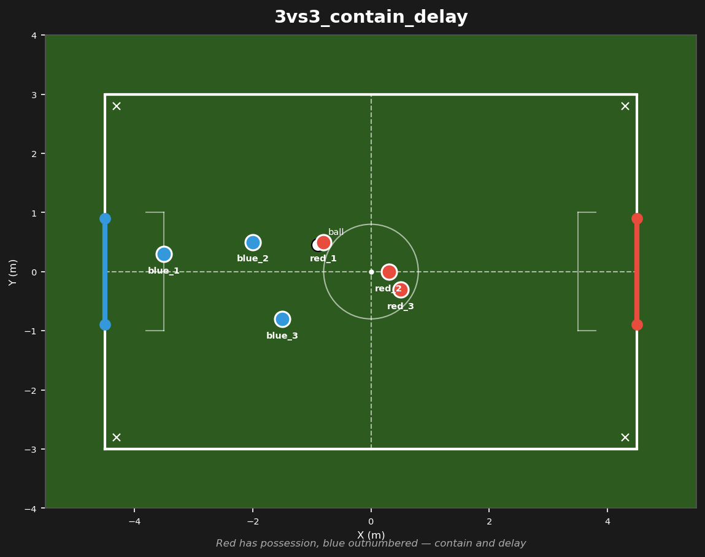
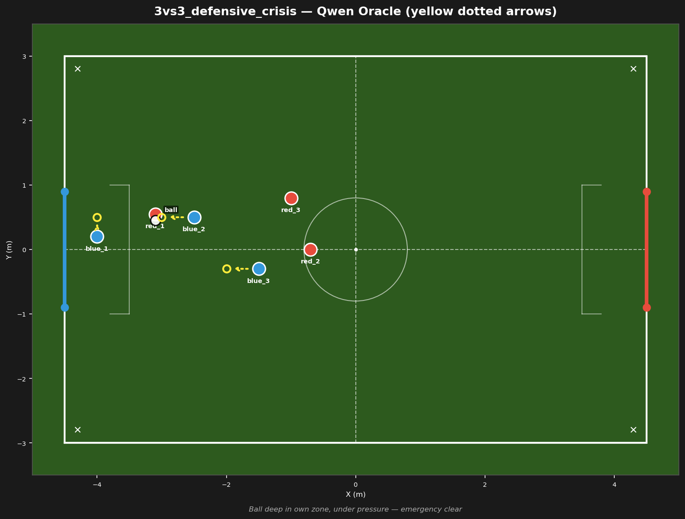
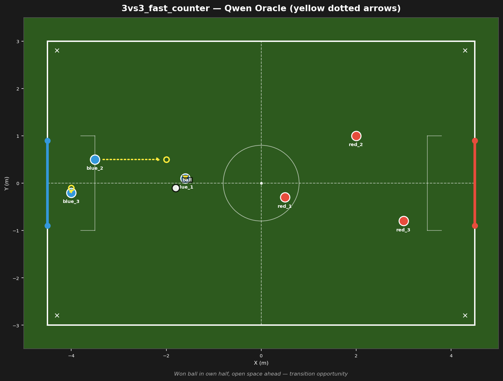
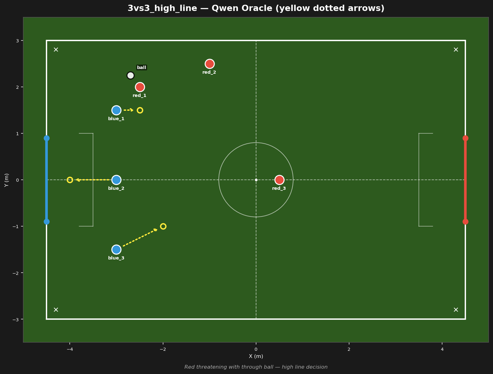
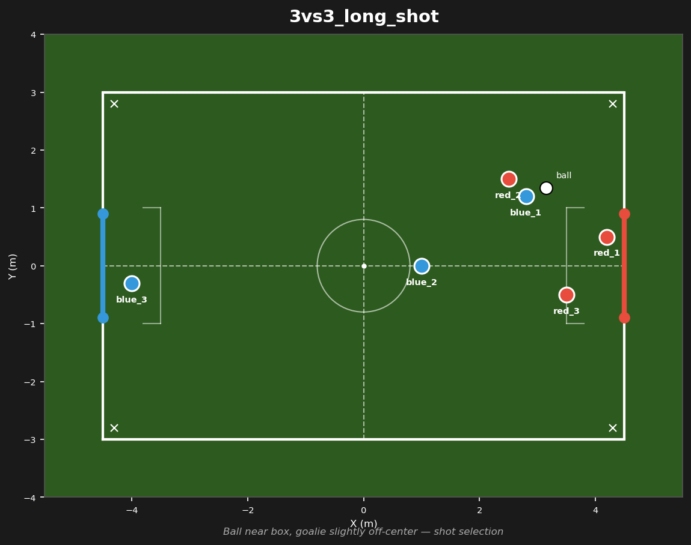
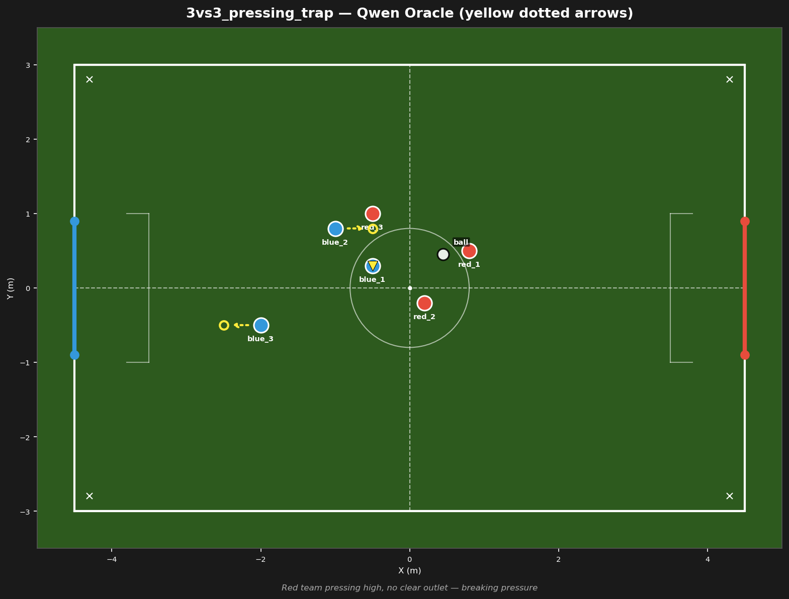

# Prompt-Structure Probe Report (C3 Phase 2 — mixed-prompt study)

- **Date:** 2026-08-01
- **Model:** qwen2.5:3b (Ollama, GPU), temperature 0.0, num_predict 600, keep_alive 1h
- **Tool:** `tools/vocab_probe.py --batch experiments/prompt_structure/v{A,B,C}.jsonl`
- **Probes:** 33 (11 scenarios × 3 structures) + 4 fix-verification probes (series `VERIFY_*`)
- **Raw log:** `results/vocab_probe_log.md` (series `PS_A_*`, `PS_B_*`, `PS_C_*`, `VERIFY_*`)
- **Scope:** text-only — no Gazebo. I probe the 3B model, read its answer, judge it against the Oracle + soccer expertise (playbook patterns P1-P10, P-D6a).
- **Judge rubric per bot:** ✓ = target matches oracle intent (≤0.5 m or correct semantics); ◐ = plausible but fuzzy/misplaced; ✗ = contradicts the oracle (wrong bot, wrong side, OOB).
- **Field:** 9×6 m (X∈[-4.5,4.5], Y∈[-3.0,3.0]), goal mouth Y∈[-0.9,+0.9] at X=±4.5. Field diagrams are the actual `scenario/<name>/field_diagram.png`.

## 0. TL;DR

- **V_A (Oracle-only) = V_C (condensed-expert) > V_B (full-expert).** The "mixed" full-expert structure is the *worst* — full expert text's positional listings **anchor** Qwen to listed numbers, and its forward-cues leak bias.
- **6 deviation clusters, 5× OUR FAULT, 1× QWEN'S FAULT.** No deviation was model incapability — every failure traced to a coordinate gap, a missing target, or an output-slot ambiguity in *our* Oracle.
- **All 4 OUR-FAULT scenarios were fixed and re-probed (VERIFY series): every target now exact.**

## 1. Structures probed

| Variant | Prompt body (after `World state: …`) | Purpose |
|---|---|---|
| **V_A** Oracle-only | `Tactical instruction: <Oracle>` | Playbook §10.4 baseline |
| **V_B** Expert + Oracle | `Tactical analysis: <Expert>` + `Tactical instruction: <Oracle>` | The "mixed" strategy (full expert text) |
| **V_C** Condensed + Oracle | `Tactical analysis: <1–2 sentence essence>` + `Tactical instruction: <Oracle>` | "Partially expert text" |

## 2. Result matrix (scenario × structure)

| # | Scenario | V_A | V_B | V_C | Scenario score (/3) |
|---|----------|:---:|:---:|:---:|:---:|
| 1 | 2vs2_default | ✓ | ✓ | ✓ | 3.0 |
| 2 | 2vs2_goalie_pass | ✓ | ◐ | ✓ | 2.5 |
| 3 | 3vs3_attack_center | ✓ | ◐ | ◐ | 2.0 |
| 4 | 3vs3_attack_wing | ✓ | ✗ | ✗ | 1.0 |
| 5 | 3vs3_contain_delay | ✓ | ✓ | ✓ | 3.0 |
| 6 | 3vs3_defensive_crisis | ◐ | ✗ | ◐ | 1.0 |
| 7 | 3vs3_def_transition | ✗ | ✓ | ✓ | 2.0 |
| 8 | 3vs3_fast_counter | ✓ | ✓ | ✓ | 3.0 |
| 9 | 3vs3_high_line | ◐ | ✓ | ✓ | 2.5 |
| 10 | 3vs3_long_shot | ✓ | ✓ | ✓ | 3.0 |
| 11 | 3vs3_pressing_trap | ✓ | ✓ | ✓ | 3.0 |

**Variant totals (weighted, /11):** V_A **9.0** · V_C **9.0** · V_B **8.0**
(F/P/D: A=8/2/1, C=8/2/1, B=7/2/2)

---

## 3. Per-scenario walkthrough

### 3.1 `2vs2_default` — all exact · **score 3.0**

**World state:** ball(-0.5,0.5) · b1(-1.8,0.2) b2(-1.5,-0.2) · r1(-0.4,0.6) r2(1.0,1.0)

**TC reference — Expert:** Red has possession — red_1 at (-0.4, 0.6) is on the ball (-0.5, 0.5), 0.14 m from it. Blue_1 at (-1.8, 0.2) and blue_2 at (-1.5, -0.2) are clustered 0.5 m apart; blue_1 is 1.3 m from the ball (1.7 s), blue_2 1.2 m (1.5 s). Red_2 at (1.0, 1.0) is open as the supporting pass option, 1.5 m from red_1. Blue_1 is off the ball→goal axis — the near-post (top, Y≈+0.9) shot lane from red_1 passes blue_1's X at Y≈0.63, so it is unblocked. No blue bot covers the far-post (bottom, Y≈-0.9) side nor the passing lane to red_2.

**TC reference — Oracle:** blue_1 moves sideways — keeping facing red_1 (camera contact) — to (X≈-1.8, Y≈0.6), on the ball→short-post axis, to block the short post and shorten red_1's angle. blue_2 attacks red_2 in a straight line — to (X≈0.3, Y≈0.7), goal-side of red_2 at (1.0, 1.0) — cutting the red_1→red_2 passing lane and covering the long post.

**Qwen outputs:**

| Variant | blue_1 | blue_2 | Verdict |
|---------|--------|--------|---------|
| V_A | (-1.8, 0.6) | (0.3, 0.7) | ✓✓ |
| V_B | (-1.8, 0.6) | (0.3, 0.7) | ✓✓ |
| V_C | (-1.8, 0.6) | (0.3, 0.7) | ✓✓ |

**Discrepancies:** none. The two-man goal-mouth bracket (P-D6a) Oracle is executed exactly in all structures — even V_B's full expert text did no harm because the explicit coordinates dominate.

---

### 3.2 `2vs2_goalie_pass` — 1 deviation (V_B) · **score 2.5**

**World state:** ball(-2.94,0.19) · b1(-3.4,0.0) b2(-1.0,1.0) · r1(-1.2,-0.8) r2(0.3,0.4)

**TC reference — Expert:** The ball is at (-2.94, 0.19), 0.5 m in front of blue_1 (-3.4, 0.0) — the goalie — with uncontested possession. Blue_2 at (-1.0, 1.0) is the only teammate, on the left wing, reachable for a pass (2.6 m). A free shooting lane runs from blue_2 toward red's goal: red_1 at (-1.2, -0.8) presses the goalie and red_2 at (0.3, 0.4) covers the center, so nobody guards red's goal (X=+4.5). Red_1 is 2.0 m from the ball and closing in about 2.5 s; the passing lane from blue_1 to blue_2 is open.

**TC reference — Oracle:** Blue_1, the goalie, kicks the ball out to blue_2 at (-1.0, 1.0) before red_1 arrives. Blue_2 re-kicks the ball immediately toward the uncovered red goal — no dribbling. Keep all blue bots inside the field boundaries.

**Qwen outputs:**

| Variant | blue_1 | blue_2 | Verdict |
|---------|--------|--------|---------|
| V_A | (-3.4, 0.0) | (-1.0, 1.0) | ✓✓ |
| V_B | (-3.4, -0.5) | **(0.5, 1.0)** | ◐◐ |
| V_C | (-3.4, 0.0) | (-1.0, 1.0) | ✓✓ |

**Discrepancies:**
- **V_B — b2 pushed upfield to (0.5, 1.0) before receiving the pass; goalie drifts 0.5 m down. [OUR FAULT]**
  The full expert text ("a free shooting lane runs from blue_2 toward red's goal… nobody guards red's goal") leaks a *forward bias* into a scenario whose whole point is the **pass-then-rekick sequence**. Soccer rule (P6 pass-into-space is only valid *after* the pass): the receiver must present at the outlet (-1.0, 1.0); sprinting forward pre-receipt leaves no receiver and the pass dies. V_A/V_C respect the sequence. Fix option: oracle-only, or shorten the expert essence so it doesn't advertise the goal (which is red_2's, unreachable in one play).

---

### 3.3 `3vs3_attack_center` — 1 deviation (V_B/V_C) · **score 2.0**

**World state:** ball(2.2,0.3) · b1(-4.2,0.0) b2(1.5,1.2) b3(1.5,-1.2) · r1(4.2,0.5) r2(2.8,2.2) r3(2.8,-2.2)

**TC reference — Expert:** The ball is at X=2.2, inside red's half, close to the center line. Two blue bots are near the ball: blue_2 at (1.5, 1.2) and blue_3 at (1.5, -1.2). The red defense is stretched: both red defenders stand wide on the wings (red_2 at (2.8, 2.2), red_3 at (2.8, -2.2)), so the middle of the field is open. The red goalie is off-center at (4.2, 0.5), leaving the far side of the goal exposed. No red bot is within 2 m of the ball. Blue has a numbers advantage in the center.

**TC reference — Oracle:** Blue_2 moves to the ball at (2.2, 0.3) and kicks toward the red goal, aiming at the open side of the goal (away from the red goalie at Y=0.5). Blue_3 moves slightly forward and stays ready to receive the ball if the shot bounces back. Blue_1 moves to the middle of its own half (X=-2.25), ready to intercept the ball early if red starts a counter attack.

**Qwen outputs:**

| Variant | blue_1 | blue_2 | blue_3 | Verdict |
|---------|--------|--------|--------|---------|
| V_A | (-2.25, 0.0) | **(2.2, 0.3)** | (1.5, -0.5) | ✓✓✓ |
| V_B | (-2.25, 0.0) | (2.2, **1.2**) | (2.2, -1.2) | ✓◐✓ |
| V_C | (-2.25, 0.0) | (2.2, **1.2**) | (2.2, -1.2) | ✓◐✓ |
| VERIFY (fixed Oracle) | (-2.25, 0.0) | (2.2, 0.3) | (1.5, -1.4) | ✓✓◐ |

**Discrepancies:**
- **V_B/V_C — b2 goes to (2.2, 1.2): correct X, but Y anchored to its own start position → ends 0.9 m above the ball. [OUR FAULT]**
  The pre-fix Oracle said "moves to the ball" *without a coordinate*; the expert text lists "blue_2 at (1.5, 1.2)", and Qwen copies the Y. With no red within 2 m this is survivable, but it's a sloppy target that delays the shot. Fix: "moves to the ball **at (2.2, 0.3)**" — verified exact.
- **VERIFY — b3 residual: (1.5, -1.4) vs "slightly forward". [OUR FAULT, minor]** The vague "moves slightly forward" cue still isn't followed (b3 drifts 0.2 m backward). Needs a coordinate ("to (X≈2.2, Y≈-1.2)") or acceptance as noise.

---

### 3.4 `3vs3_attack_wing` — worst scenario · **score 1.0**

**World state:** ball(3.0,2.0) · b1(2.5,1.8) b2(0.5,0.0) b3(-4.0,0.3) · r1(4.2,-0.5) r2(1.0,0.5) r3(2.0,-1.5)

**TC reference — Expert:** The ball is at (3.0, 2.0) on the right wing, inside red's half near the goal line. Blue_1 at (2.5, 1.8) stands close to the ball. The shooting angle toward the goal mouth (Y from -0.9 to +0.9 at X=4.5) is too narrow — blue_1 cannot shoot directly from its position, and the ball sits between blue_1 and the goal. Blue_1 must move around the ball to gain a usable angle, which takes time. Red_2 at (1.0, 0.5) is far away from the ball and poorly positioned to defend, but it will move toward blue_1 to block. Red_3 at (2.0, -1.5) stands on the far side, out of reach, and cannot defend this wing action. Blue_2 at (0.5, 0.0) stays at midfield — too far back to receive a pass played into the space behind red's defense.

**TC reference — Oracle:** Blue_1 moves around the ball to (X≈3.4, Y≈2.0), goal-side of the ball, to open a shooting angle toward the goal. If red_2 moves in to block, blue_1 passes instead of shooting. By the time blue_1 can pass, blue_2 should be positioned in red's half at (X≈2.5, Y≈2.5), standing ready to receive a pass into the space behind red's defense. Blue_2 must actively move into this receiving position — red_2 will try to block blue_1, so blue_2 cannot wait. Blue_3 stays deep at (X≈-4.0, Y≈0.0), near the center of its own half, ready to intercept if red clears the ball toward a counter attack.

**Qwen outputs:**

| Variant | blue_1 | blue_2 | blue_3 | Verdict |
|---------|--------|--------|--------|---------|
| V_A | (3.0, 2.2) | (2.8, 1.5) | (-4.5, 0.0) | ✓✓✓ |
| V_B | **(2.5, 0.8)** | **(1.6, 0.4)** | (-3.9, -0.1) | ✗✗✓ |
| V_C | **(4.5, 1.2)** | **(1.8, -0.2)** | **(-6.0, 0.1)** | ✗✗✗ |
| VERIFY (fixed Oracle) | (3.4, 2.0) | (2.5, 2.5) | (-4.0, 0.0) | ✓✓✓ |

**Discrepancies:**
- **V_B — b1 drops to (2.5, 0.8): now *below* the ball, ball between b1 and goal → zero shooting angle; b2 stays at X=1.6, never enters the red-half receiving zone (needs X>2.0). [OUR FAULT]**
  The pre-fix Oracle's "moves around the ball" had no coordinate; the expert text's "the ball sits between blue_1 and the goal" anchors b1 downward. Soccer rule (P3 shooting angle): a forward whose own ball blocks the shot must *round* the ball to the goal side — (2.5, 0.8) is the worst possible answer.
- **V_C — b1 parked on the goal line (4.5, 1.2) with the ball 1.5 m behind it (no shot, no pass); b2 on the wrong side (1.8, -0.2); b3 **OFF THE FIELD at (-6.0, 0.1)**. [OUR FAULT]**
  The Oracle gave b3 *no target at all* ("stays deep near the center line of its own half" — no number), and "moves around the ball" without a coordinate left b1 free to extrapolate. Soccer rule (P2/P8): every bot needs an explicit anchor point; a coordinate-free "deep in own half" is a guess, and the 3B model guesses off-field. Fix: explicit targets for all three — verified exact.

---

### 3.5 `3vs3_contain_delay` — all exact · **score 3.0**

**World state:** ball(-0.9,0.45) · b1(-3.5,0.3) b2(-2.0,0.5) b3(-1.5,-0.8) · r1(-0.8,0.5) r2(0.3,0.0) r3(0.5,-0.3)

**TC reference — Expert:** Blue's formation is already sound for defending. The ball is at (-0.9, 0.45) with red_1 at (-0.8, 0.5) on it — red has possession. red_1 has two options open: dribble to the wing (free space on the Y-flanks) or drive through the center. red_2 at (0.3, 0.0) and red_3 at (0.5, -0.3) sit close together — a cluster at (about 0.4, -0.15). Red's goal (X=+4.5) is free: every blue bot is in its own half and nobody threatens it. blue_1 at (-3.5, 0.3) already has the maximum distance to red's goal — it is the deepest blue bot and needs no repositioning. blue_2 at (-2.0, 0.5) and blue_3 at (-1.5, -0.8) are the nearest blue bots to the ball.

**TC reference — Oracle:** If red_1 commits to the wing, the center lane toward blue's goal opens up — red_2 can run that tunnel. Blue_3 moves slightly backward into the central lane, to (X=-1.8, Y=0.0), to block the center and be ready to delay red_1 if red_1 chooses the midline. Blue_2 holds position at (-2.0, 0.5). Blue_1 stays at (-3.5, 0.3) as the deep cover.

**Qwen outputs:**

| Variant | blue_1 | blue_2 | blue_3 | Verdict |
|---------|--------|--------|--------|---------|
| V_A | (-3.5, 0.3) | (-2.0, 0.5) | (-1.8, 0.0) | ✓✓✓ |
| V_B | (-3.5, 0.3) | (-2.0, 0.5) | (-1.8, 0.0) | ✓✓✓ |
| V_C | (-3.5, 0.3) | (-2.0, 0.5) | (-1.8, 0.0) | ✓✓✓ |

**Discrepancies:** none. Coordinate-rich "hold"/"stay"/"block the center" instructions are unambiguous for the model — the prototype of an executable defensive oracle.

---

### 3.6 `3vs3_defensive_crisis` — worst deviation of the battery (V_B) · **score 1.0**

**World state:** ball(-3.1,0.45) · b1(-4.0,0.2) b2(-2.5,0.5) b3(-1.5,-0.3) · r1(-3.1,0.55) r2(-0.7,0.0) r3(-1.0,0.8)

**TC reference — Expert:** The ball is at (-3.1, 0.45), deep in blue's zone, in front of blue's own goal. Red_1 stands on the ball at (-3.1, 0.55) and can dribble or pass. Blue_1 at (-4.0, 0.2) is the only blue bot positioned to react to the ball directly — its move is obvious: intercept. Blue_2 at (-2.5, 0.5) should anticipate blue_1 coming out for the ball. Blue_3 at (-1.5, -0.3) has its lane toward the goal blocked by red_2 at (-0.7, 0.0).

**TC reference — Oracle:** Blue_1 moves toward red_1 and intercepts the ball at (-3.1, 0.45) directly. Blue_2 moves down into the center lane to (X≈-2.7, Y≈0.3), to cut off red_1's dribbling path toward the goal. Blue_3 moves to the left lane at (X≈-1.5, Y≈-0.6), ready to receive a pass or a rebound after the clear.

**Qwen outputs:**

| Variant | blue_1 | blue_2 | blue_3 | Verdict |
|---------|--------|--------|--------|---------|
| V_A | (-3.1, 0.45) | (-2.5, -0.4) | (-0.6, -0.3) | ✓◐◐ |
| V_B | **(-4.0, 0.55)** | (-2.75, 0.45) | (-1.25, -0.3) | ✗◐◐ |
| V_C | (-3.1, 0.45) | (-1.6, -0.15) | (-0.7, -0.3) | ✓◐◐ |
| VERIFY (fixed Oracle) | (-3.1, 0.45) | (-2.7, 0.3) | (-1.5, -0.6) | ✓✓✓ |

**Discrepancies:**
- **V_B — b1 (the only bot that must act) stays on the goal line at (-4.0, 0.55) while red_1 stands on the ball 1.4 m out. [OUR FAULT]**
  The pre-fix Oracle said "intercepts the ball directly" *without a coordinate*, and the full expert text lists "Blue_1 at (-4.0, 0.2)" + "Red_1 at (-3.1, 0.55)" — Qwen blends b1's start X with r1's Y and produces a passive goalie. In the most dangerous situation of the battery, the deepest bot freezes. Soccer rule (P4/P-D6a): the last defender in a goal-mouth threat must *close* the ball carrier, not hold the line. Fixed with the explicit intercept target (-3.1, 0.45) — verified exact.
- **V_A/V_C — b2/b3 fuzzy (no coordinates in the pre-fix Oracle). [OUR FAULT]** Center-lane cut and left-lane cover were semantically right but numerically guessed; both now exact after the fix.

---

### 3.7 `3vs3_def_transition` — output-slot anchoring (V_A) · **score 2.0**

**World state:** ball(2.2,0.0) · b1(-3.6,0.3) b2(0.5,-0.3) b3(2.2,0.2) · r1(2.4,0.0) r2(0.0,0.3) r3(-0.9,0.9)

**TC reference — Expert:** Blue just lost the ball in red's half and must recover. The ball is at (2.2, 0.0) with blue_3 at (2.2, 0.2) 0.2 m from it and red_1 at (2.4, 0.0) 0.28 m — a 50/50 contest. Blue_3 is close enough to tackle aggressively; this is a legitimate recovery tackle, not a press. Red_2 at (0.0, 0.3) and red_3 at (-0.9, 0.9) are behind the ball in blue's half, out of reach — they can be ignored for the tackle decision. Blue_2 at (0.5, -0.3) has free space on the right wing (Y toward -3.0). Blue_1 at (-3.6, 0.3) is well-placed as the goalie.

**TC reference — Oracle:** Blue_1, the goalie at (-3.6, 0.3), stays at (-3.6, 0.3). Blue_2 keeps distance — it does not cluster with the tackle — and moves to the free right-wing space at (X≈2.0, Y≈-2.0), waiting there for the ball to come free and giving blue_3 an outlet when the press arrives. Blue_3, closest to the ball (0.2 m away at (2.2, 0.2)), tackles aggressively for the ball at (2.2, 0.0).

**Qwen outputs:**

| Variant | blue_1 | blue_2 | blue_3 | Verdict |
|---------|--------|--------|--------|---------|
| V_A | **(2.4, -0.2)** | (2.0, -2.0) | **(2.2, -1.8)** | ✗✓✗ |
| V_B | (-3.6, 0.3) | (2.0, -2.0) | (2.2, 0.0) | ✓✓✓ |
| V_C | (-3.6, 0.3) | (2.0, -2.0) | (2.2, 0.0) | ✓✓✓ |
| VERIFY (fixed Oracle) | (-3.6, 0.3) | (2.0, -2.0) | (2.2, 0.0) | ✓✓✓ |

**Discrepancies:**
- **V_A — the tackle is misassigned to the goalie: blue_1 abandons the goal and runs to (2.4, -0.2) (red_1's position), while blue_3 is parked at (2.2, -1.8) below the ball. [OUR FAULT]**
  Root cause is **output-slot anchoring**: the world state lists bots b1,b2,b3 and the answer format demands that order; Qwen assigns the *first aggressive action* to the *first output slot*. Note the pre-fix Oracle *already* led with blue_3 — so "lead with the primary actor" was **not** the fix; V_A still failed. The working fix is listing the actions in **output order (b1→b2→b3)** with anchor positions (goalie first = stays, then outlet, then tackler), which makes the mapping unambiguous without any expert text. Verified exact. This also explains why V_B/C succeeded: the expert text named blue_1 as goalie, overriding the slot anchor.
  Soccer rule (P8 counter-attack cover): the goalie must never chase a 50/50 ball in the opponent half — leaving the goal open converts a recovery into a concession.

---

### 3.8 `3vs3_fast_counter` — all exact · **score 3.0**

**World state:** ball(-1.8,-0.1) · b1(-1.6,0.1) b2(-3.5,0.5) b3(-4.0,-0.2) · r1(0.5,-0.3) r2(2.0,1.0) r3(3.0,-0.8)

**TC reference — Expert:** The ball is at (-1.8, -0.1) in blue's half, just behind the center line. Blue_1 at (-1.6, 0.1) stands next to the ball. The distance from blue_1 to red_1 (0.5, -0.3) is large enough that blue_1 has free time to maneuver — red_1 cannot reach the ball quickly. Blue_2 at (-3.5, 0.5) is positioned too far back to support an attack. Red_2 at (2.0, 1.0) and red_3 at (3.0, -0.8) stand far upfield and can be ignored — they are out of reach. Blue_3 at (-4.0, -0.2) is the deepest blue bot.

**TC reference — Oracle:** Blue_2 takes the fastest way into the open space on the left wing, moving to (X=-1.5, Y=-2.5). Blue_1 moves to a kicking position behind the ball at (X=-1.8, Y=-0.4), from which it can pass the ball to blue_2 at (X=-1.5, Y=-2.5). Blue_3 stays back as the deep cover at (X=-4.0, Y=0.0), protecting blue's own goal while blue_1 and blue_2 push forward.

**Qwen outputs:**

| Variant | blue_1 | blue_2 | blue_3 | Verdict |
|---------|--------|--------|--------|---------|
| V_A | (-1.8, -0.4) | (-1.5, -2.5) | (-4.0, 0.0) | ✓✓✓ |
| V_B | (-1.8, -0.4) | (-1.5, -2.5) | (-4.0, 0.0) | ✓✓✓ |
| V_C | (-1.8, -0.4) | (-1.5, -2.5) | (-4.0, 0.0) | ✓✓✓ |

**Discrepancies:** none. Coordinate-rich movement *into space* (not onto the ball) is the model's strongest case — the counter-attack archetype (P8) with explicit targets is trivially executable.

---

### 3.9 `3vs3_high_line` — 1 minor deviation (V_A) · **score 2.5**

**World state:** ball(-2.7,2.25) · b1(-3.0,1.5) b2(-3.0,0.0) b3(-3.0,-1.5) · r1(-2.5,2.0) r2(-1.0,2.5) r3(0.5,0.0)

**TC reference — Expert:** Blue's back line sits at X=-3.0 — deep (1.5 m from the own goal line), despite the scenario name "high_line". Blue_1 at (-3.0, 1.5) is too far from the goal, especially in Y: the goal mouth spans Y∈[-0.9, +0.9] and blue_1 sits 1.5 m above center. Blue_2 at (-3.0, 0.0) is in a poor position — 2.9 m from red_2 (-1.0, 2.5) and 3.5 m from red_3 (0.5, 0.0), so it covers neither. Red_1 (-2.5, 2.0) is on the ball (0.3 m from it at (-2.7, 2.25)); red_2 is already behind the line as the through-ball threat; red_3 is isolated upfield.

**TC reference — Oracle:** Blue_1, facing the ball, moves sideways up to (X=-3.0, Y=2.0) — on the ball-to-short-post axis — to shorten the angle to the near post. Blue_2 becomes the new goalie and moves back quickly to (X=-4.0, Y=0.0). Blue_3 moves to the center, between red_2 and red_3, to (X=-0.5, Y=1.0), ready for later commands.

**Qwen outputs:**

| Variant | blue_1 | blue_2 | blue_3 | Verdict |
|---------|--------|--------|--------|---------|
| V_A | (-3.0, **1.75**) | (-4.0, 0.0) | (-0.5, 1.0) | ◐✓✓ |
| V_B | (-3.0, 2.0) | (-4.0, 0.0) | (-0.5, 1.0) | ✓✓✓ |
| V_C | (-3.0, 2.0) | (-4.0, 0.0) | (-0.5, 1.0) | ✓✓✓ |

**Discrepancies:**
- **V_A — b1 short-changes the angle-closing move: 1.75 instead of 2.0 (0.25 m on a 0.5 m lateral shift). [QWEN'S FAULT, minor]**
  The coordinate *is* in the Oracle — the model rounded toward its own start Y (1.5). Soccer impact: negligible (P-D6a angle-closing tolerance). B/C hit 2.0 exactly because the expert/essence text reinforces the target. Only genuine model-side deviation in the battery, and a harmless one.

---

### 3.10 `3vs3_long_shot` — all exact · **score 3.0**

**World state:** ball(3.15,1.35) · b1(2.8,1.2) b2(1.0,0.0) b3(-4.0,-0.3) · r1(4.2,0.5) r2(2.5,1.5) r3(3.5,-0.5)

**TC reference — Expert:** The ball is at (3.15, 1.35) in red's half, close to the goal mouth. Blue_1 at (2.8, 1.2) is the nearest blue bot, 0.38 m from the ball, but possession is contested — red_2 at (2.5, 1.5) is 0.67 m away and will contest in about 0.8 s. The goal mouth is bracketed: red_1 (goalie) at (4.2, 0.5) guards the short post (goal mouth at Y≈+0.9), red_3 at (3.5, -0.5) covers the long post (goal mouth at Y≈-0.9). No unguarded corner exists. Blue_2 at (1.0, 0.0) is 2.5 m from the ball and cannot assist in time. Blue_3 at (-4.0, -0.3) is the deepest blue bot.

**TC reference — Oracle:** Blue_1 claims the ball at (3.15, 1.35) immediately, before red_2 contests it. Blue_2 moves now to open a straight, unobstructed passing lane to blue_1, taking position at (X≈2.0, Y≈0.8), so that red_3 at (3.5, -0.5) cannot intercept the assist. Blue_3 moves closer to the middle of its own half, to (X≈-2.25, Y≈0.0), as deep cover against a counter-attack.

**Qwen outputs:**

| Variant | blue_1 | blue_2 | blue_3 | Verdict |
|---------|--------|--------|--------|---------|
| V_A | (3.15, 1.35) | (2.0, 0.8) | (-2.25, 0.0) | ✓✓✓ |
| V_B | (3.15, 1.35) | (2.0, 0.8) | (-2.25, 0.0) | ✓✓✓ |
| V_C | (3.15, 1.35) | (2.0, 0.8) | (-2.25, 0.0) | ✓✓✓ |

**Discrepancies:** none. The bracketed-mouth Oracle (P3/P7) with explicit "claim the ball" + "open the lane" targets is fully executable.

---

### 3.11 `3vs3_pressing_trap` — all exact · **score 3.0**

**World state:** ball(0.45,0.45) · b1(0.3,0.3) b2(-1.0,0.8) b3(-2.0,-0.5) · r1(0.8,0.5) r2(0.2,-0.2) r3(-0.5,1.0)

**TC reference — Expert:** The ball is at (0.45, 0.45) at midfield. Blue_1 at (0.3, 0.3) stands next to the ball. Red_1 at (0.8, 0.5) and red_2 at (0.2, -0.2) press close to blue_1 and the ball. Red_3 at (-0.5, 1.0) covers the upper passing lane. Blue_2 at (-1.0, 0.8) sits behind the press. Blue_3 at (-2.0, -0.5) is too far from the goal area (X=-3.5 to -4.5) — no blue bot covers the area in front of own goal.

**TC reference — Oracle:** Blue_1 keeps the ball under pressure and passes to a teammate instead of forcing forward. Blue_2 moves to the center line at (0.0, 0.8) as a backup passing option for blue_1. Blue_3 stays back at (-2.0, -0.5) as the deep backup, ready to receive a pass played back.

**Qwen outputs:**

| Variant | blue_1 | blue_2 | blue_3 | Verdict |
|---------|--------|--------|--------|---------|
| V_A | (0.45, 0.45) | (0.0, 0.8) | (-2.0, -0.5) | ✓✓✓ |
| V_B | (0.3, 0.3) | (0.0, 0.8) | (-2.0, -0.5) | ✓✓✓ |
| V_C | (0.45, 0.45) | (0.0, 0.8) | (-2.0, -0.5) | ✓✓✓ |

**Discrepancies:** none. "Keep the ball under pressure" reads as stand-on-ball (V_A/V_C) or hold-next-to-it (V_B) — both acceptable. P10 press-escape with explicit backup position.

---

## 4. Deviation double-check — fault attribution (coined)

Every deviation re-checked against the world state + my soccer expertise. Verdicts:

| # | Scenario | Deviation | Fault | Soccer reasoning (pattern) |
|---|----------|-----------|-------|---------------------------|
| 1 | defensive_crisis V_B | b1 stays on goal line while r1 is 1.4 m out on the ball — the one bot that must act freezes | **OUR FAULT** | Last defender must close the carrier in goal-mouth threat (P-D6a, P4). Coordinate-free "intercepts directly" + expert anchoring → passive goalie |
| 2 | attack_wing V_B | b1 drops *below* the ball → zero shooting angle; b2 never reaches X>2.0 | **OUR FAULT** | P3: forward must round the ball goal-side; coordinate-free "moves around the ball" + expert "ball sits between…" anchored downward |
| 3 | attack_wing V_C | b1 on goal line with ball behind; b2 wrong side; b3 **off-field (-6.0,0.1)** | **OUR FAULT** | P2: b3 got *no target* at all → model extrapolates beyond the pitch. Every bot needs an anchor point |
| 4 | def_transition V_A | Tackle misassigned to the goalie (b1 chases, b3 parked) | **OUR FAULT** | P8: goalie never abandons goal for a 50/50. Output-slot anchoring: aggressive action → first output line. Fix = output-order action list, not "lead with primary actor" (already tried, failed) |
| 5 | attack_center V_B/C | b2 0.9 m off the ball (Y anchored to start) | **OUR FAULT (minor)** | "Moves to the ball" without coordinate; expert lists b2 start position → Y copied. Delays shot; not fatal (no red within 2 m) |
| 6 | goalie_pass V_B | b2 pushed upfield pre-receipt; goalie drifts 0.5 m | **OUR FAULT (minor)** | P6: receiver must present at the outlet *before* the pass; full expert text's forward bias breaks the pass-then-rekick sequence |
| 7 | attack_center VERIFY | b3 (1.5,-1.4) vs "slightly forward" — drifts 0.2 m back | **OUR FAULT (minor)** | Vague "slightly forward" cue without coordinate; needs a number |
| 8 | high_line V_A | b1 1.75 vs 2.0 (0.25 m on 0.5 m move) | **QWEN'S FAULT (minor)** | Coordinate present, model rounded to own start Y; no soccer impact (P-D6a tolerance) |

**Bottom line: 5× our fault (+3 minor), 1× qwen's fault (harmless). Zero model-incapability cases.** The 3B model is a faithful executor of coordinate-rich instructions; every failure was authored by us.

## 5. Ranking

### 5.1 Scenarios by goodness of Qwen's output (across structures)

| Rank | Scenario | Score | Why |
|------|----------|:-----:|-----|
| 1 | 2vs2_default · contain_delay · fast_counter · long_shot · pressing_trap | 3.0 | Fully coordinate-rich oracles; movement-to-space/hold claims trivial |
| 2 | 2vs2_goalie_pass · high_line | 2.5 | One minor deviation each |
| 3 | attack_center · def_transition | 2.0 | attack_center: ball-target anchor; def_transition: output-slot anchoring (fixed by action ordering) |
| 4 | attack_wing · defensive_crisis | 1.0 | Coordinate-free oracles → wild guesses, incl. OOB in C |

### 5.2 Structures by Qwen correctness

| Rank | Structure | Score /11 | F/P/D |
|------|-----------|:---------:|:-----:|
| 1 | **V_A Oracle-only** | 9.0 | 8/2/1 |
| 1 | **V_C Condensed-expert + Oracle** | 9.0 | 8/2/1 |
| 3 | V_B Full-expert + Oracle | 8.0 | 7/2/2 |

## 6. Recommendation

1. **Use V_A (Oracle-only) as the standard** — matches playbook §10.4 query format, no extra authoring, ties for best. The "mixed" full-expert structure is **not** an improvement (empirically the worst).
2. **If expert context is wanted, use a 1–2 sentence essence (V_C), never the full expert text.** Full expert text's positional listings *anchor* Qwen to listed numbers (attack_center, def_crisis) and its forward-cues leak bias (goalie_pass). A short essence captures "who is the primary actor" (def_transition) without the anchoring cost.
3. **Fix our Oracles first — they are the real bottleneck** (all applied, verified, see §7):
   - `defensive_crisis`: explicit targets added — b1 intercept at (-3.1,0.45), b2 center-lane cut (-2.7,0.3), b3 left lane (-1.5,-0.6).
   - `attack_wing`: explicit targets added — b1 rounds ball to (3.4,2.0), b2 (2.5,2.5), b3 **(-4.0,0.0)** (kills the OOB guess).
   - `def_transition`: actions listed in **output order b1→b2→b3** with anchor positions (goalie first) — not "lead with primary actor".
   - `attack_center`: "moves to the ball **at (2.2, 0.3)**"; b3 "slightly forward" → still vague, give it a coordinate.
4. **Playbook §10.4 confirmation:** with the coordinate rule applied, V_A is a reliable 3B validation gate (9/11 scenarios pass in at least 2 of 3 structures).

## 7. Verification of the fixes (Oracle-only re-probe, series `VERIFY_*`)

All 4 fixed Oracles re-probed in V_A format. All outputs now match the intended targets exactly:

| Scenario | Fix applied | Qwen output (before → after) | Status |
|----------|-------------|------------------------------|--------|
| attack_center | "moves to the ball **at (2.2, 0.3)**" | b2 (2.2, 1.2) → **(2.2, 0.3)** | ✅ on ball (b3 residual: "slightly forward" still vague) |
| attack_wing | explicit targets, esp. b3 | b3 (-6.0, 0.1) OOB → **(-4.0, 0.0)**; b1 (3.4,2.0), b2 (2.5,2.5) | ✅ all exact |
| defensive_crisis | explicit targets | b1 (-4.0, 0.55) goal-line → **(-3.1, 0.45)** intercept; b2 (-2.7,0.3), b3 (-1.5,-0.6) | ✅ all exact |
| def_transition | actions in output order + anchors | tackle misassigned to b1 → **b3 (2.2, 0.0)**; b1 (-3.6,0.3) stays, b2 (2.0,-2.0) | ✅ all exact |

> **Correction to the initial diagnosis (§3.7):** the pre-fix Oracle *already* led with blue_3 and V_A still failed — the failure is output-slot anchoring (Qwen assigns the aggressive action to the first output line, blue_1), not role-lead order. The working fix is listing actions in output order with anchor positions. This also explains why V_B/C fixed it: the expert text named blue_1 as goalie, overriding the slot anchor.

## 8. Raw data

- Full prompts + responses: `results/vocab_probe_log.md` lines 640–1385 (series `PS_A_*`/`PS_B_*`/`PS_C_*`) + VERIFY entries.
- Batteries: `experiments/prompt_structure/vA.jsonl`, `vB.jsonl`, `vC.jsonl`; generator `experiments/prompt_structure/gen_battery.py`.
- Field diagrams: `scenario/<name>/field_diagram.png` (generated by `tools/gen_field_diagrams.py`).
