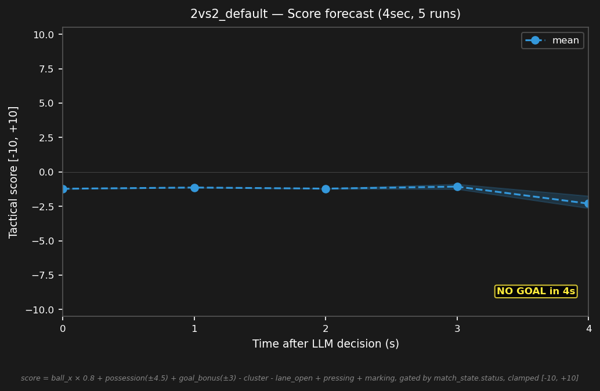

# 2vs2_default


## Expert (Analysis)

Ball at (-0.5, 0.5) near midfield. red_1 (-0.4, 0.6) has the ball — 0.1m away. blue_2 (-1.5, -0.2) is 1.2m from the ball, blue_1 (-1.8, 0.2) is 1.3m. Red has possession. blue bots are clustered 0.5m apart — must separate.

## Oracle (Strategy)

blue_2 challenges red_1 for the ball. blue_1 drops to the goal line to block the shot lane. Prevent a quick red shot on goal.

```
blue_1 cover the goal line at (-4.0, 0.5)
blue_2 move to (-0.5, 0.5)
```

## Output to bridge

```
blue_1 move to (-4.0, 0.5)
blue_2 move to (-0.5, 0.5)
```

## Score delta


