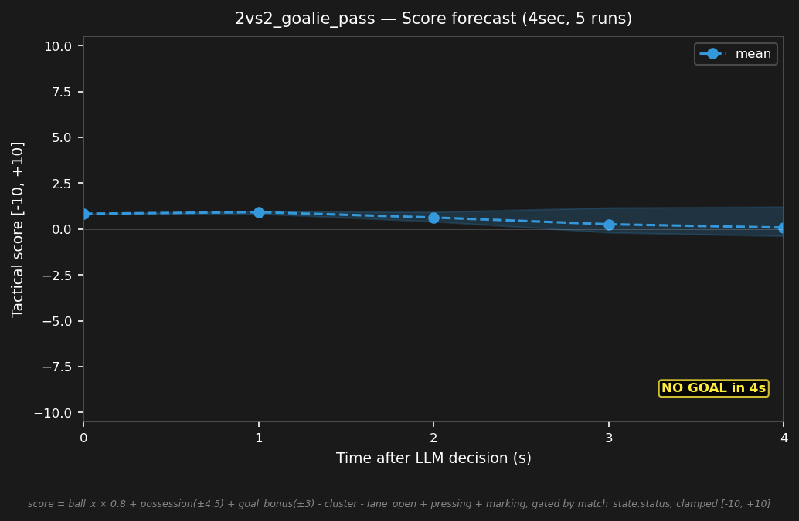

# 2vs2_goalie_pass


## Expert (Analysis)

Ball at (-2.9, 0.2) near blue's goal. blue_1 (-3.4, 0.0) is the goalie, 0.5m from the ball — has possession. blue_2 (-1.0, 1.0) is on the wing, 2.1m away. red_1 (-1.2, -0.8) is 2.0m away. Goalie distribution opportunity — red is too far to press immediately.

## Oracle (Strategy)

blue_1 (goalie) has the ball and distributes to blue_2 on the wing. blue_2 moves to a receiving position. Transition from defense to attack.

```
blue_1 kick
blue_2 move to (-0.5, 1.0)
```

## Output to bridge

```
blue_1 kick
blue_2 move to (-0.5, 1.0)
```

## Score delta


