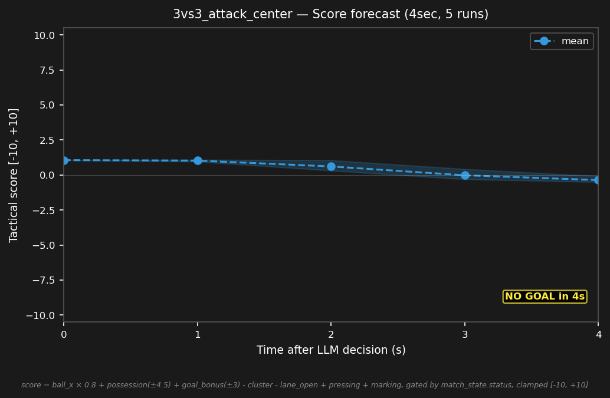

# 3vs3_attack_center


## Expert (Analysis)

Ball at (2.2, 0.3) in red's half. red_1 (4.2, 0.5) and red_2 (2.8, 2.2) are both 2.0m from the ball — marginally closer than blue_2 (-0.5, 1.2) at 2.8m, so red can reach the ball first. blue_3 (-0.5, -1.2) is 3.1m. Red's defense is stretched wide, center is open. Red goalie off-center at Y=0.5.

## Oracle (Strategy)

blue_2 advances toward the ball to close the distance and set up a possession challenge. blue_3 shifts toward center to cover the passing lane. blue_1 tracks ball Y on the goal line.

```
blue_1 cover the goal line at (-4.0, 0.3)
blue_2 move to (1.8, 0.3)
blue_3 move to (-0.5, -0.5)
```

## Output to bridge

```
blue_1 move to (-4.0, 0.3)
blue_2 move to (1.8, 0.3)
blue_3 move to (-0.5, -0.5)
```

## Score delta


