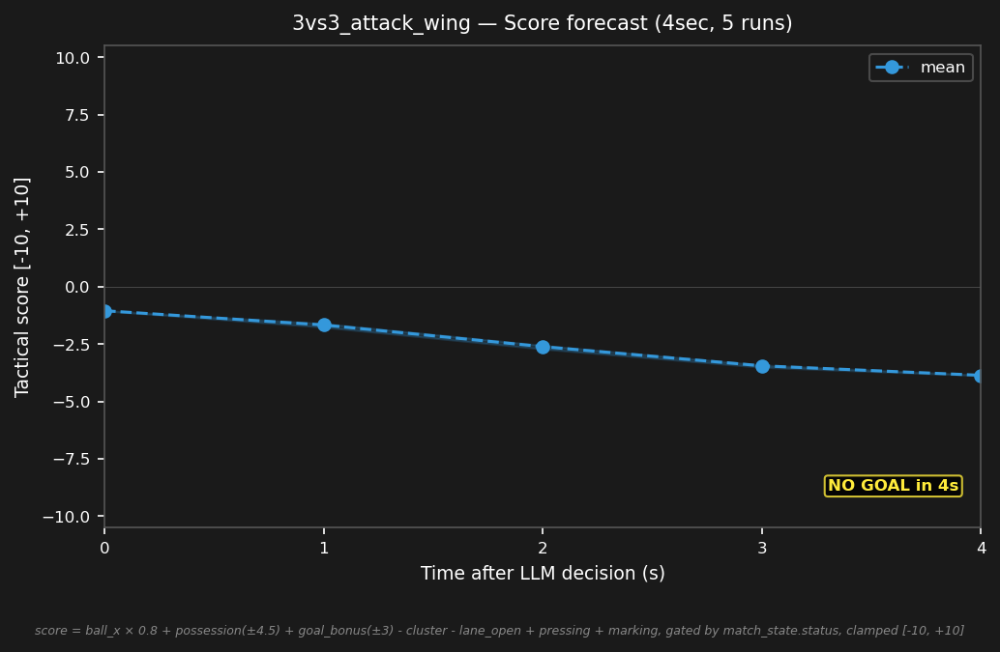

# 3vs3_attack_wing


## Expert (Analysis)

Ball at (3.0, 2.0) on the left wing, deep in red's half. red_2 (1.0, 0.5) is closest at 2.5m. blue_2 (-0.5, 0.0) is 4.0m away — too far to challenge this cycle. blue_1 and blue_3 are on the goal line. The shooting angle from the wing is narrow.

## Oracle (Strategy)

blue_2 advances upfield toward the ball on the wing. blue_3 shifts to cover the center. blue_1 holds the goal line. Close distance before red can organize.

```
blue_1 cover the goal line at (-4.0, 0.9)
blue_2 move to (2.7, 1.8)
blue_3 move to (-0.5, 0.0)
```

## Output to bridge

```
blue_1 move to (-4.0, 0.9)
blue_2 move to (2.7, 1.8)
blue_3 move to (-0.5, 0.0)
```

## Score delta


