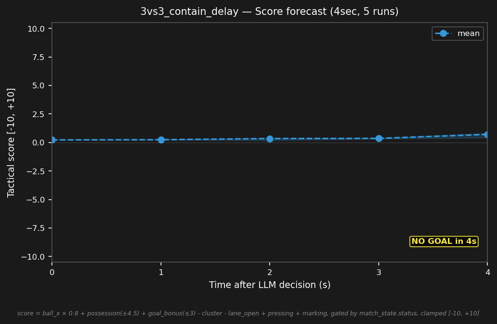

# 3vs3_contain_delay


## Expert (Analysis)

Ball at (-0.9, 0.5) at midfield. red_1 (-0.8, 0.5) has the ball — 0.1m away. blue_2 (-2.0, 0.5) is 1.1m from the ball, blue_3 (-1.5, -0.8) is 1.4m. Red has possession and is pressing through the center. blue must contain without overcommitting.

## Oracle (Strategy)

blue_2 presses red_1 who has the ball at midfield. blue_3 covers the passing lane to delay the attack. blue_1 holds the goal line. Contain without overcommitting.

```
blue_1 cover the goal line at (-4.0, 0.5)
blue_2 move to (-1.5, 0.5)
blue_3 move to (-1.0, -0.5)
```

## Output to bridge

```
blue_1 move to (-4.0, 0.5)
blue_2 move to (-1.5, 0.5)
blue_3 move to (-1.0, -0.5)
```

## Score delta


