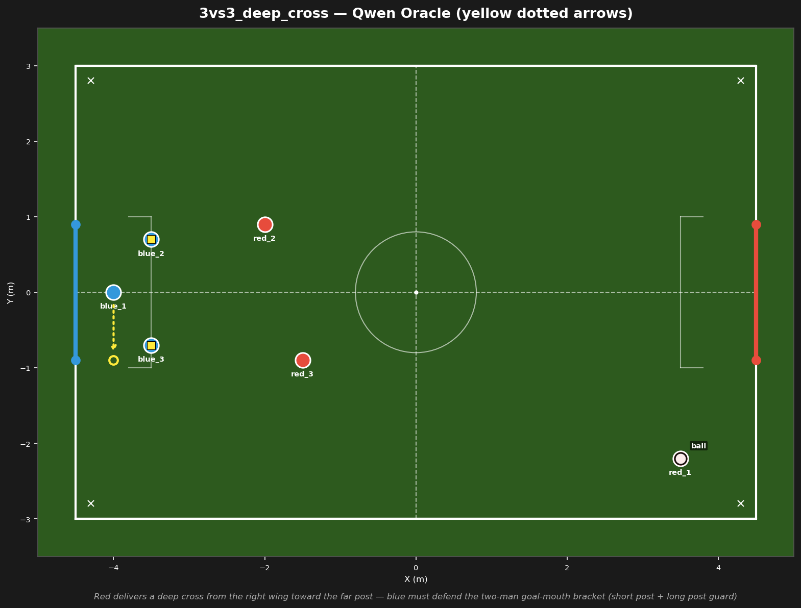
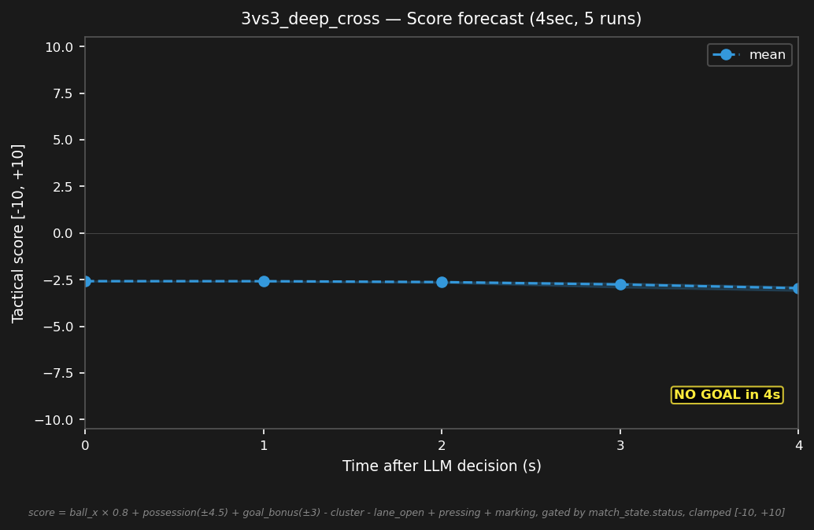

# 3vs3_deep_cross



## Expert (Analysis)

Ball at (3.5, -2.2) at the corner. red_1 is on the ball — about to cross. red_2 (-2.0, 0.9) attacks the short post, red_3 (-1.5, -0.9) attacks the long post. blue_2 (-3.5, 0.7) and blue_3 (-3.5, -0.7) are goal-side of their markers. blue_1 (-4.0, 0.0) is on the goal line. Defensive crisis — the cross is incoming.

## Oracle (Strategy)

red_1 has the ball at the corner and is about to cross. blue_2 and blue_3 hold their goal-side positions marking red_2 and red_3. blue_1 tracks the ball Y on the line. Defend the bracket — do not chase the ball.

```
blue_1 cover the goal line at (-4.0, -0.9)
blue_2 hold position
blue_3 hold position
```

## Output to bridge

```
blue_1 move to (-4.0, -0.9)
blue_2 hold position
blue_3 hold position
```

## Score delta


