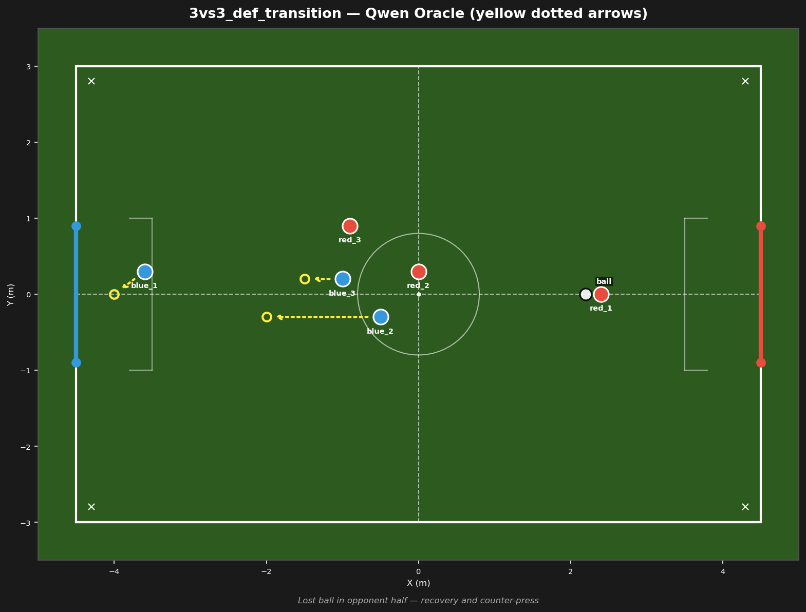
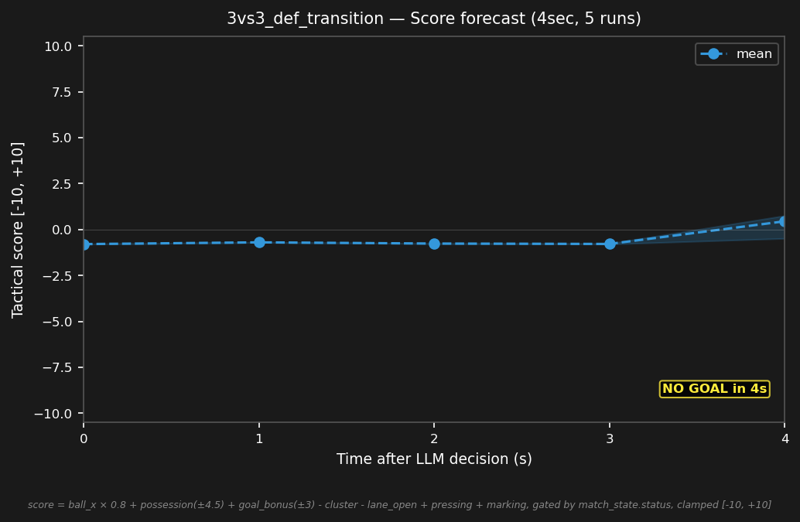

# 3vs3_def_transition



## Expert (Analysis)

Ball at (2.2, 0.0) in red's half. red_1 (2.4, 0.0) has the ball — 0.2m away. blue_2 (-0.5, -0.3) is 2.7m away, blue_3 (-1.0, 0.2) is 3.2m. Both blue bots are caught upfield. blue_1 (-3.6, 0.3) is the goalie, 5.8m from play. Defensive transition — blue must sprint back.

## Oracle (Strategy)

blue lost possession — red_1 has the ball. blue_2 and blue_3 must drop back behind the ball to cover the goal. blue_1 holds the goal line. Transition from attack to defense.

```
blue_1 cover the goal line at (-4.0, 0.0)
blue_2 move to (-2.0, -0.3)
blue_3 move to (-1.5, 0.2)
```

## Output to bridge

```
blue_1 move to (-4.0, 0.0)
blue_2 move to (-2.0, -0.3)
blue_3 move to (-1.5, 0.2)
```

## Score delta


