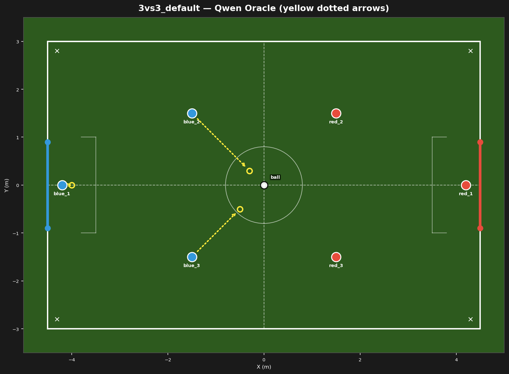
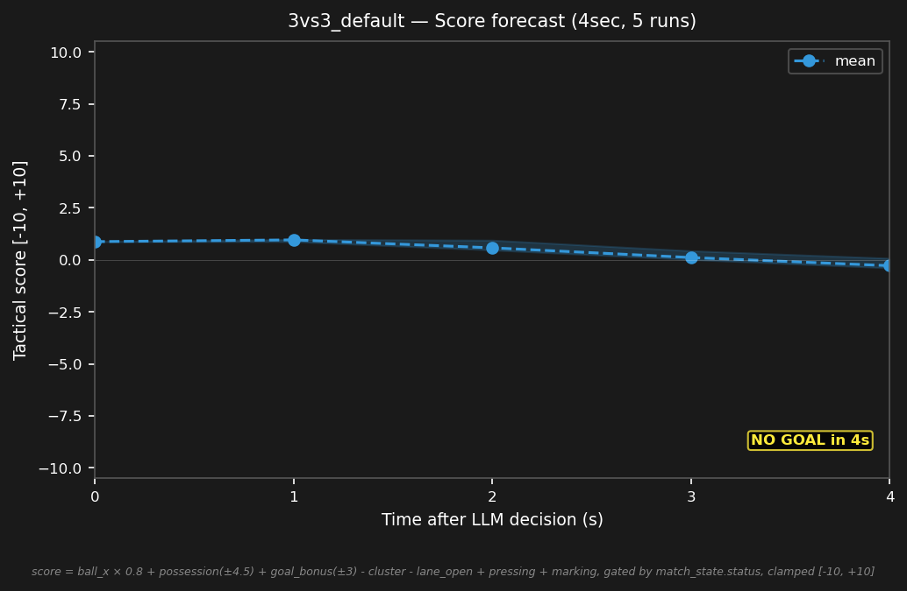

# 3vs3_default



## Expert (Analysis)

Standard 3vs3 kickoff. Ball at center (0.0, 0.0). Both teams in their own half, equidistant from the ball. blue_2 (-1.5, 1.5) and blue_3 (-1.5, -1.5) are 2.1m from the ball. red_2 (1.5, 1.5) and red_3 (1.5, -1.5) mirror. Even setup — contest at midfield.

## Oracle (Strategy)

Standard kickoff. blue_2 advances toward the ball at center. blue_3 holds midfield. blue_1 on the goal line. Contest possession at midfield.

```
blue_1 cover the goal line at (-4.0, 0.0)
blue_2 move to (-0.3, 0.3)
blue_3 move to (-0.5, -0.5)
```

## Output to bridge

```
blue_1 move to (-4.0, 0.0)
blue_2 move to (-0.3, 0.3)
blue_3 move to (-0.5, -0.5)
```

## Score delta


