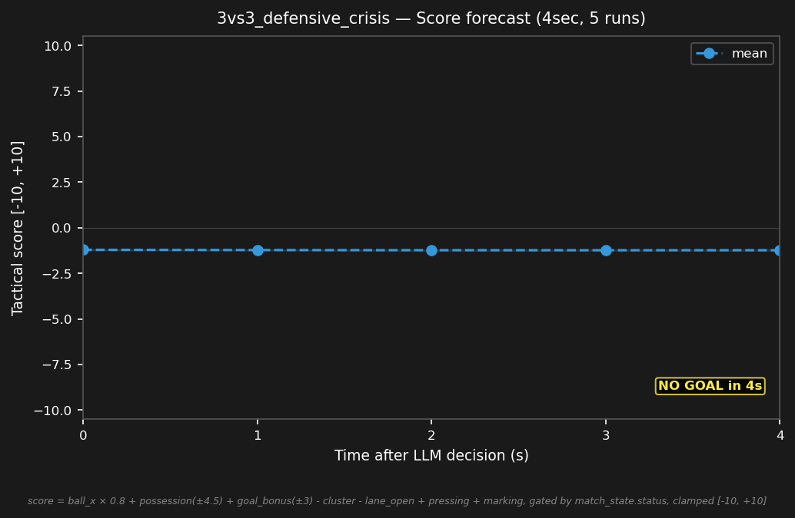

# 3vs3_defensive_crisis


## Expert (Analysis)

Ball at (-3.1, 0.5) — 1.4m from blue's goal. red_1 (-3.1, 0.6) is on the ball — 0.1m away. blue_1 (-4.0, 0.2) is the goalie, 0.9m from the ball. blue_2 (-2.5, 0.5) is 0.6m from the ball. red is about to shoot — immediate crisis.

## Oracle (Strategy)

red_1 has the ball 0.1m away — imminent shot. blue_2 challenges the ball carrier. blue_1 stays on the goal line to block the shot. blue_3 drops to cover the deflection. Prevent a goal.

```
blue_1 cover the goal line at (-4.0, 0.5)
blue_2 move to (-3.0, 0.5)
blue_3 move to (-2.0, -0.3)
```

## Output to bridge

```
blue_1 move to (-4.0, 0.5)
blue_2 move to (-3.0, 0.5)
blue_3 move to (-2.0, -0.3)
```

## Score delta


