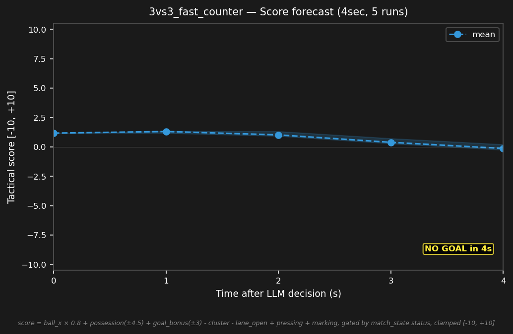

# 3vs3_fast_counter


## Expert (Analysis)

Ball at (-1.8, -0.1) in blue's half. blue_1 (-1.6, 0.1) is on the ball — 0.3m away — has possession. red_1 (0.5, -0.3) is 2.3m away. red_2 and red_3 are far upfield. blue_1 has free time — counter-attack opportunity.

## Oracle (Strategy)

blue_1 has the ball and a counter-attack opportunity — red is far away. blue_1 kicks the ball forward toward the opponent half. blue_2 supports the counter. blue_3 holds the goal line. Exploit the free time.

```
blue_1 kick
blue_2 move to (-2.0, 0.5)
blue_3 cover the goal line at (-4.0, -0.1)
```

## Output to bridge

```
blue_1 kick
blue_2 move to (-2.0, 0.5)
blue_3 move to (-4.0, -0.1)
```

## Score delta


