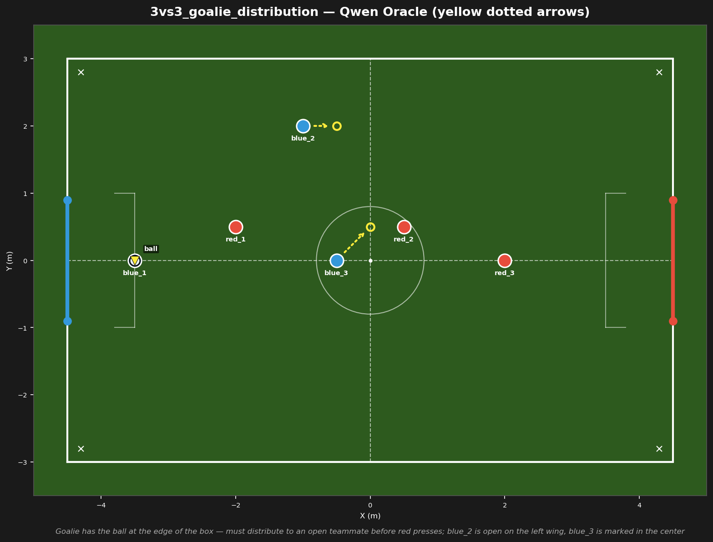
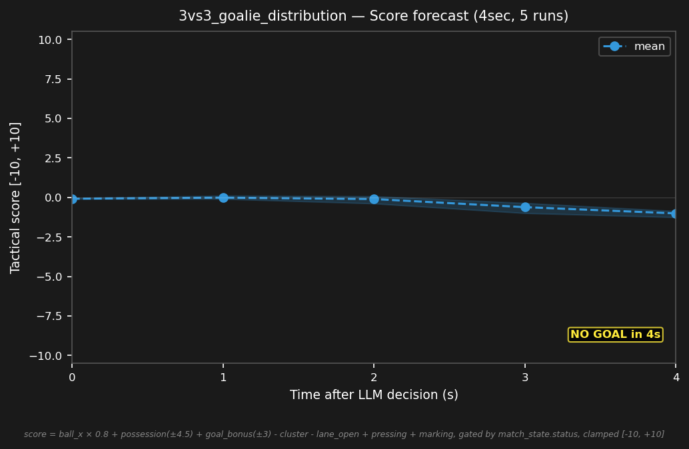

# 3vs3_goalie_distribution



## Expert (Analysis)

Ball at (-3.5, 0.0) — 1m from blue's goal. blue_1 (-3.5, 0.0) is the goalie, on the ball — has possession. red_1 (-2.0, 0.5) is pressing, 1.6m away. blue_2 (-1.0, 2.0) is unmarked on the left wing. blue_3 (-0.5, 0.0) is in midfield. Goalie must distribute before red_1 arrives.

## Oracle (Strategy)

blue_1 (goalie) has the ball. red_1 is pressing, 1.6m away. blue_1 distributes to blue_2 on the left wing — the open lane. blue_3 moves to a secondary outlet. Quick transition from defense to attack.

```
blue_1 kick
blue_2 move to (-0.5, 2.0)
blue_3 move to (0.0, 0.5)
```

## Output to bridge

```
blue_1 kick
blue_2 move to (-0.5, 2.0)
blue_3 move to (0.0, 0.5)
```

## Score delta


