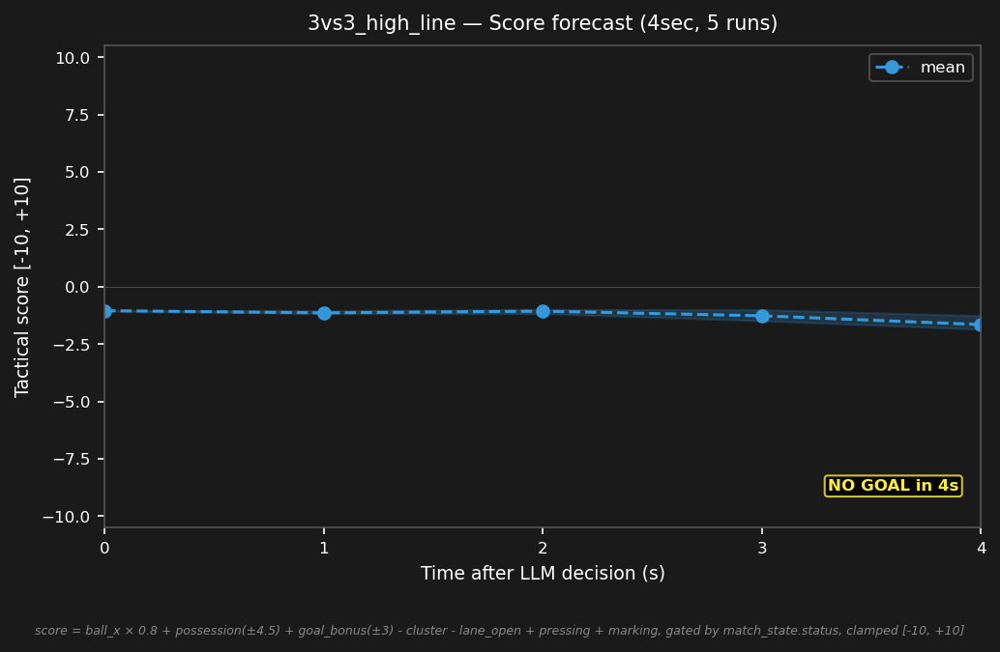

# 3vs3_high_line


## Expert (Analysis)

Ball at (-2.7, 2.2) — deep in blue's half, left wing. red_1 (-2.5, 2.0) is on the ball — 0.3m away. blue_1 (-3.0, 1.5) is 0.8m from the ball but too high in Y. blue_2 (-3.0, 0.0) covers center. blue_3 (-3.0, -1.5) is on the far post. red_2 (-1.0, 2.5) is a through-ball threat. The line is too deep — blue must press and reorganize.

## Oracle (Strategy)

red_1 has the ball near blue's penalty area. blue_1 steps up to press the ball carrier — the line is too deep. blue_2 drops to the goal line as cover. blue_3 marks the through-ball threat. Press and reorganize the defense.

```
blue_1 move to (-2.5, 1.5)
blue_2 move to (-4.0, 0.0)
blue_3 move to (-2.0, -1.0)
```

## Output to bridge

```
blue_1 move to (-2.5, 1.5)
blue_2 move to (-4.0, 0.0)
blue_3 move to (-2.0, -1.0)
```

## Score delta


