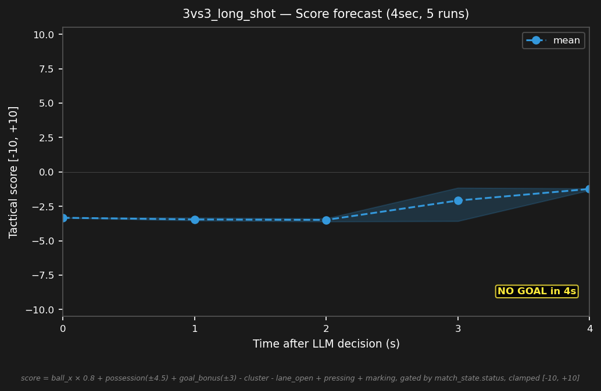

# 3vs3_long_shot


## Expert (Analysis)

Ball at (3.1, 1.4) in red's half. red_2 (2.5, 1.5) is closest at 0.7m — red has possession. blue_2 (-0.5, 0.0) is 3.9m away. blue_1 and blue_3 are on the goal line. The shooting distance is short for red — blue must close distance to challenge.

## Oracle (Strategy)

blue_2 advances toward the ball for a long shot opportunity — the goal is 3.9m away. blue_3 shifts to midfield support. blue_1 holds the goal line. Close the distance for a shot.

```
blue_1 cover the goal line at (-4.0, 0.9)
blue_2 move to (2.8, 1.2)
blue_3 move to (-0.5, 0.0)
```

## Output to bridge

```
blue_1 move to (-4.0, 0.9)
blue_2 move to (2.8, 1.2)
blue_3 move to (-0.5, 0.0)
```

## Score delta


