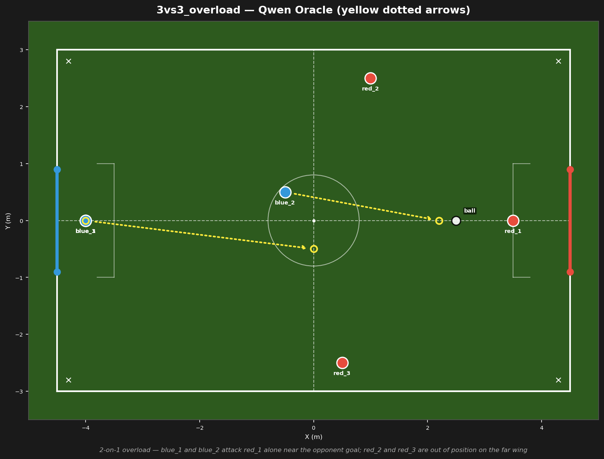
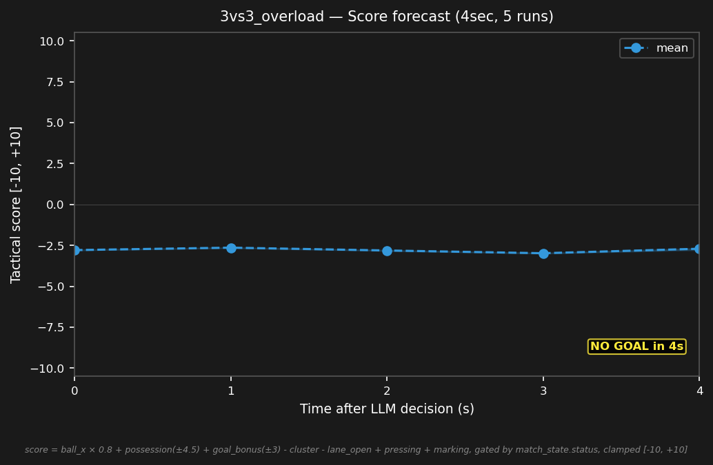

# 3vs3_overload



## Expert (Analysis)

Ball at (2.5, 0.0) in red's half. red_1 (3.5, 0.0) is the sole defender, 1.0m from the ball. red_2 and red_3 are on the far wings — 2.9m and 3.2m away. blue_2 (-0.5, 0.5) is 3.0m from the ball. blue_1 (-4.0, 0.0) is the goalie. 2v1 overload — blue has a numbers advantage near the ball.

## Oracle (Strategy)

blue has a 2v1 overload — only red_1 defends. blue_2 advances toward the ball to draw red_1 out. blue_3 moves wide as the free man for a pass. blue_1 holds the goal line. Exploit the numbers advantage.

```
blue_1 cover the goal line at (-4.0, 0.0)
blue_2 move to (2.2, 0.0)
blue_3 move to (0.0, -0.5)
```

## Output to bridge

```
blue_1 move to (-4.0, 0.0)
blue_2 move to (2.2, 0.0)
blue_3 move to (0.0, -0.5)
```

## Score delta


