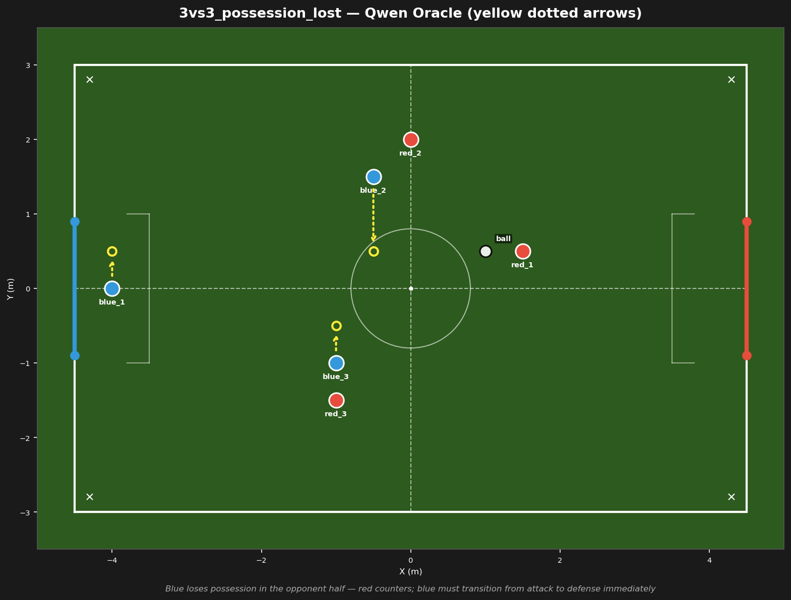
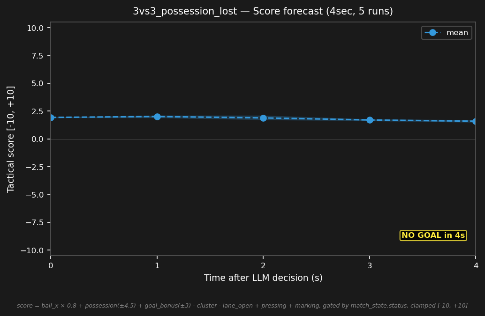

# 3vs3_possession_lost



## Expert (Analysis)

Ball at (1.0, 0.5) in red's half. red_1 (1.5, 0.5) has the ball — 0.5m away. blue_2 (-0.5, 1.5) is 1.8m away, blue_3 (-1.0, -1.0) is 2.5m. Both blue bots are caught upfield. blue_1 (-4.0, 0.0) is the goalie, 5.0m from play. Red is counter-attacking — blue must recover.

## Oracle (Strategy)

red_1 won the ball — blue is caught upfield. blue_2 and blue_3 sprint back behind the ball. blue_1 holds the goal line. Recover defensive shape.

```
blue_1 cover the goal line at (-4.0, 0.5)
blue_2 move to (-0.5, 0.5)
blue_3 move to (-1.0, -0.5)
```

## Output to bridge

```
blue_1 move to (-4.0, 0.5)
blue_2 move to (-0.5, 0.5)
blue_3 move to (-1.0, -0.5)
```

## Score delta


