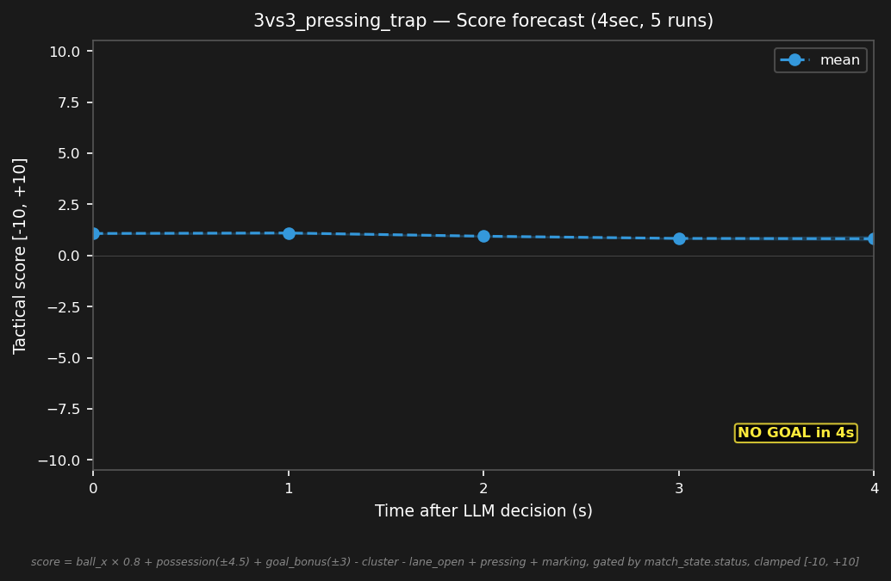

# 3vs3_pressing_trap


## Expert (Analysis)

Ball at (0.5, 0.5) at midfield. red_1 (0.8, 0.5) is 0.4m from the ball, red_2 (0.2, -0.2) is 0.7m — double-team. blue_1 (-0.5, 0.3) is 1.0m away, under pressure. blue_2 (-1.0, 0.8) is 1.5m. blue_3 (-2.0, -0.5) is deep. red_3 (-0.5, 1.0) blocks the passing lane. blue_1 is trapped — must escape.

## Oracle (Strategy)

blue_1 is under double-team pressure from red_1 and red_2. blue_1 passes back to blue_2 to escape the press. blue_3 holds deep cover. Reset possession and play wide.

```
blue_1 kick
blue_2 move to (-0.5, 0.8)
blue_3 move to (-2.5, -0.5)
```

## Output to bridge

```
blue_1 kick
blue_2 move to (-0.5, 0.8)
blue_3 move to (-2.5, -0.5)
```

## Score delta


