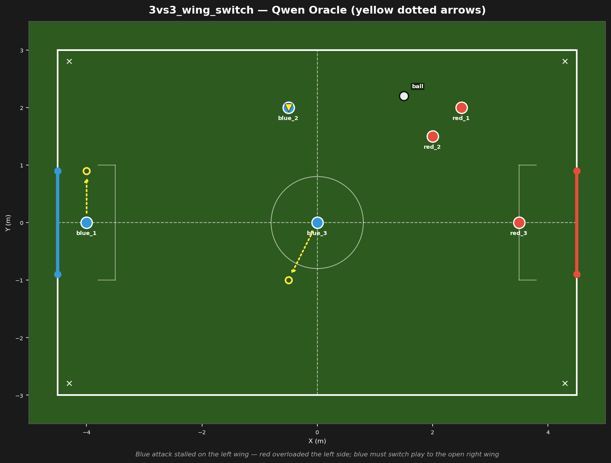
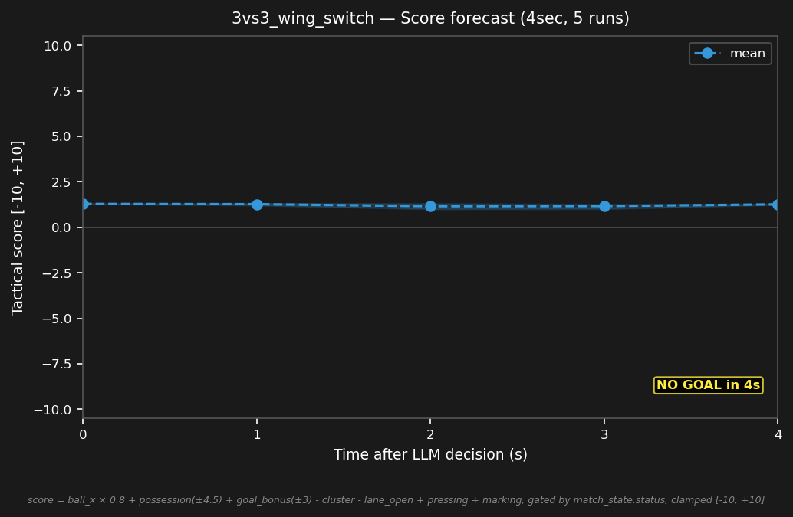

# 3vs3_wing_switch



## Expert (Analysis)

Ball at (1.5, 2.2) on the left wing. blue_2 (-0.5, 2.0) is 2.0m from the ball but double-teamed by red_1 (2.5, 2.0) and red_2 (2.0, 1.5). The right wing (Y<0) is open. blue_3 (0.0, 0.0) is at center. blue_1 (-4.0, 0.0) holds the goal line. The switch pass is not executable — double-team is too tight.

## Oracle (Strategy)

blue_2 is double-teamed on the wing — the switch pass is not executable. blue_2 kicks the ball deep toward the opponent half to escape pressure. blue_3 moves to block the resulting set-piece. blue_1 holds the goal line. Escape the double-team.

```
blue_1 cover the goal line at (-4.0, 0.9)
blue_2 kick
blue_3 move to (-0.5, -1.0)
```

## Output to bridge

```
blue_1 move to (-4.0, 0.9)
blue_2 kick
blue_3 move to (-0.5, -1.0)
```

## Score delta


