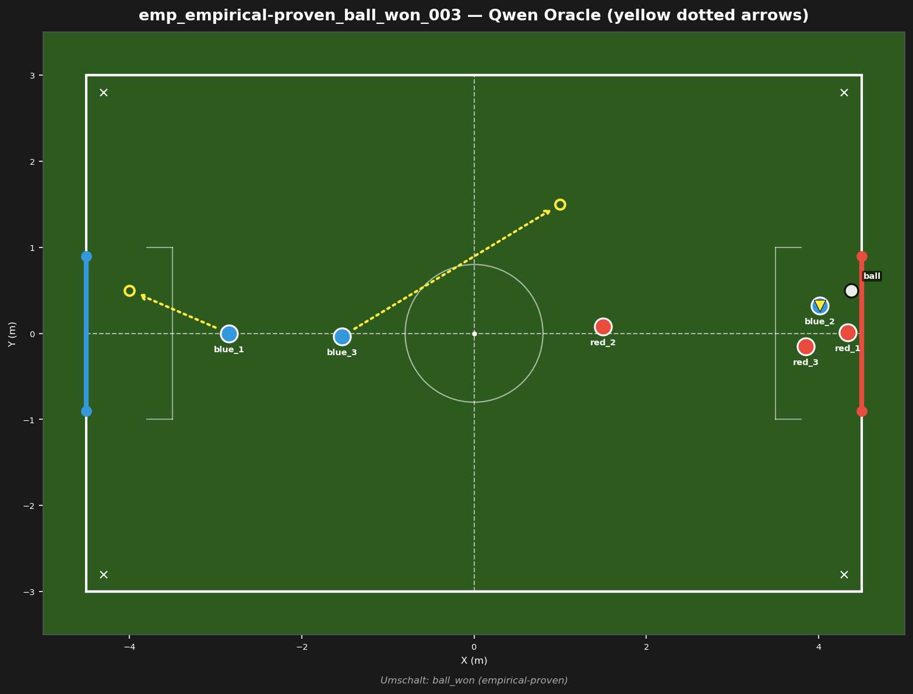
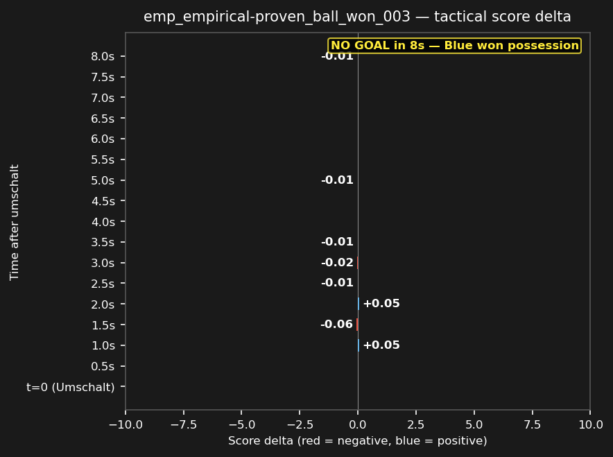

# emp_empirical-proven_ball_won_003



## Source
- Original match: 3vs3_attack_center_strat_aggro_20260729_231259
- Umschalt type: ball_won — Blue won possession
- Tag: empirical-proven (blue scored)
- Cluster: 5 similar fragments reduced to this representative

## Scope
Blue won a ball_won deep in the opponent half — test whether Blue capitalizes on the turnover and scores.

## Expert (Analysis)
Ball at (4.4, 0.5), deep in the opponent half. Closest blue: blue_2 (0.4m). Closest red: red_1 (0.5m). Possession: BLUE. Umschalt type: ball_won. Blue scored — this was a successful transition.

## Oracle (Strategy)
To capitalize on the turnover in the opponent half: the nearest blue (blue_2) kicks on goal, another blue provides a passing option by moving to open space, and the goalie covers the goal line for counter-attack safety.

```
blue_2 kick
blue_3 move to (1.0, 1.5)
blue_1 cover the goal line at (-4.0, 0.5)
```

## Output to bridge

```
blue_2 kick
blue_3 move to (1.0, 1.5)
blue_1 move to (-4.0, 0.5)
```

## Qwen's decision at t_umschalt

```
{
  "assignments": {
    "blue_1": {
      "role": "goalie",
      "action": "Move",
      "x": -4.0,
      "y": 0.0
    },
    "blue_2": {
      "role": "attacker",
      "action": "Kick"
    },
    "blue_3": {
      "role": "defender",
      "action": "Move",
      "x": -1.5,
      "y": 0.0
    }
  }
}
```

## Regression metrics
- Score before: 8.57
- Score after (t+5s): 0.00
- Score delta: -8.57 (negative = bad for blue)
- Red behavior: red_deep
- Match result: blue scored (goal #1)

## Score delta



## Test specification
- Duration: 8s
- Expected outcome: score increases (blue advantage)
- Prediction: ON (matches production)
- Pass criterion: score delta direction matches expected
