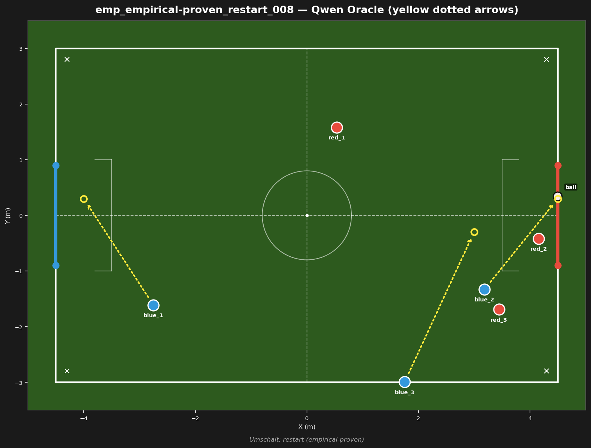
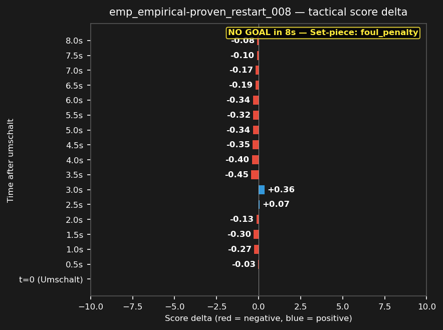

# emp_empirical-proven_restart_008



## Source
- Original match: 3vs3_attack_center_strat_aggro_20260730_032818
- Umschalt type: restart — Set-piece: foul_penalty
- Tag: empirical-proven (blue scored)
- Cluster: 1 similar fragments reduced to this representative

## Scope
Blue won a restart deep in the opponent half — test whether Blue capitalizes on the turnover and scores.

## Expert (Analysis)
Ball at (4.5, 0.3), deep in the opponent half. Closest blue: blue_2 (2.1m). Closest red: red_2 (0.8m). Possession: RED. Red has a numbers advantage near the ball (1 red vs 0 blue within 2m) — Blue is outnumbered defensively. Umschalt type: restart. Blue scored — this was a successful transition.

## Oracle (Strategy)
To regain possession deep in the opponent half: the nearest blue (blue_2) presses the ball carrier, another blue cuts off the passing lane, and the goalie holds the goal line.

```
blue_2 move to (4.5, 0.3)
blue_3 move to (3.0, -0.3)
blue_1 cover the goal line at (-4.0, 0.3)
```

## Output to bridge

```
blue_2 move to (4.5, 0.3)
blue_3 move to (3.0, -0.3)
blue_1 move to (-4.0, 0.3)
```

## Qwen's decision at t_umschalt

```
{
  "assignments": {
    "blue_1": {
      "role": "goalie",
      "action": "Move",
      "x": -4.0,
      "y": -1.8
    },
    "blue_2": {
      "role": "attacker",
      "action": "Kick"
    },
    "blue_3": {
      "role": "defender",
      "action": "Move",
      "x": 2.0,
      "y": -1.8
    }
  }
}
```

## Regression metrics
- Score before: 4.74
- Score after (t+5s): 0.00
- Score delta: -4.74 (negative = bad for blue)
- Red behavior: red_deep
- Match result: blue scored (goal #1)

## Score delta



## Test specification
- Duration: 8s
- Expected outcome: score increases (blue advantage)
- Prediction: ON (matches production)
- Pass criterion: score delta direction matches expected
