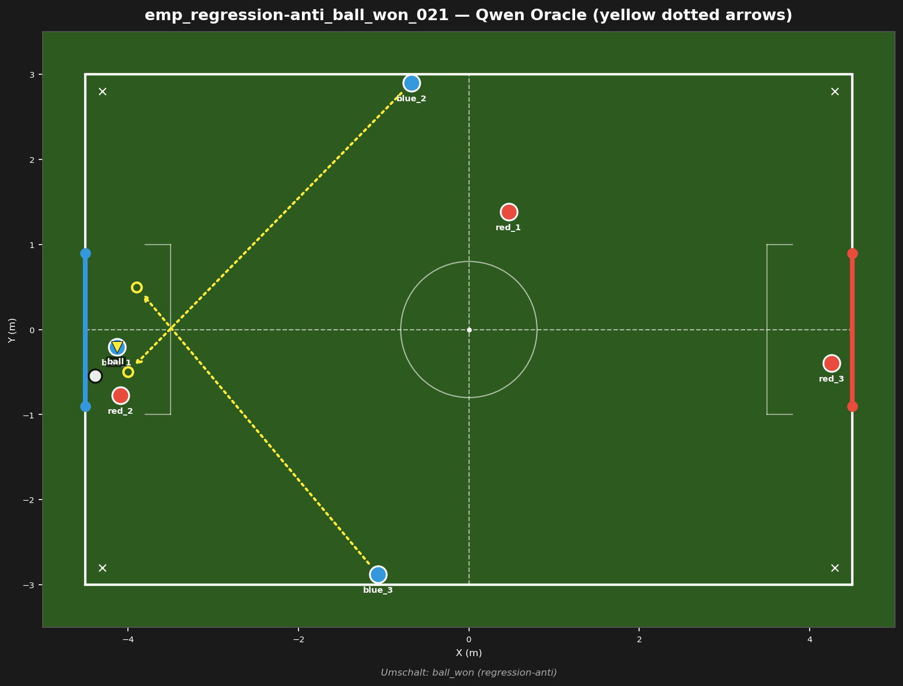
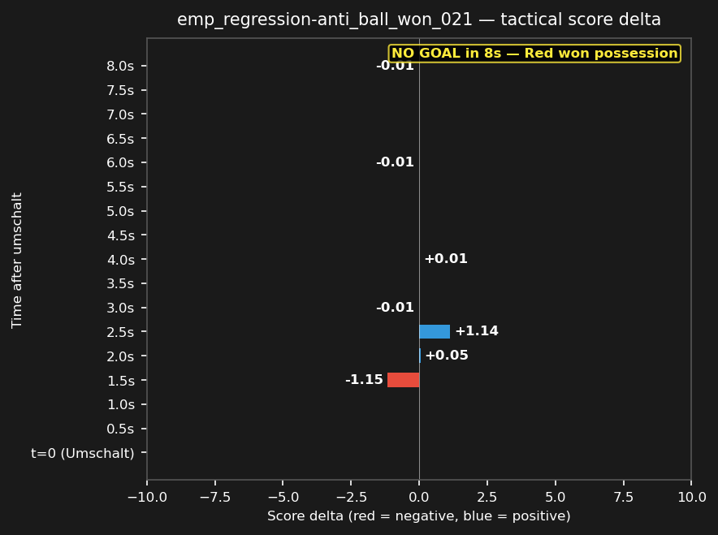

# emp_regression-anti_ball_won_021



## Source
- Original match: 3vs3_attack_center_strat_aggro_20260730_041137
- Umschalt type: ball_won — Red won possession
- Tag: regression-anti (red scored)
- Cluster: 1 similar fragments reduced to this representative

## Scope
Red won a ball_won deep in Blue's half — test whether Blue can recover defensively and prevent the concession.

## Expert (Analysis)
Ball at (-4.4, -0.5), deep in Blue's own half, near Blue's goal. Closest blue: blue_1 (0.4m). Closest red: red_2 (0.4m). Possession: RED. Umschalt type: ball_won. Red scored — this was a defensive failure for Blue.

## Oracle (Strategy)
To prevent a goal: Red is within 0.4m of the ball deep in Blue's half. The nearest blue (blue_1) must kick the ball clear immediately, another blue covers the goal line, and the third blue blocks the passing lane to the shooter.

```
blue_1 kick
blue_3 move to (-3.9, 0.5)
blue_2 cover the goal line at (-4.0, -0.5)
```

## Output to bridge

```
blue_1 kick
blue_3 move to (-3.9, 0.5)
blue_2 move to (-4.0, -0.5)
```

## Qwen's decision at t_umschalt

```
{
  "assignments": {
    "blue_1": {
      "role": "goalie",
      "action": "Move",
      "x": -4.0,
      "y": -0.7
    },
    "blue_2": {
      "role": "attacker",
      "action": "Kick"
    },
    "blue_3": {
      "role": "defender",
      "action": "Move",
      "x": 1.5,
      "y": -0.7
    }
  }
}
```

## Regression metrics
- Score before: -8.58
- Score after (t+5s): -8.75
- Score delta: -0.17 (negative = bad for blue)
- Red behavior: red_midfield
- Match result: red scored (goal #2)

## Score delta



## Test specification
- Duration: 8s
- Expected outcome: score decreases (red advantage)
- Prediction: ON (matches production)
- Pass criterion: score delta direction matches expected
