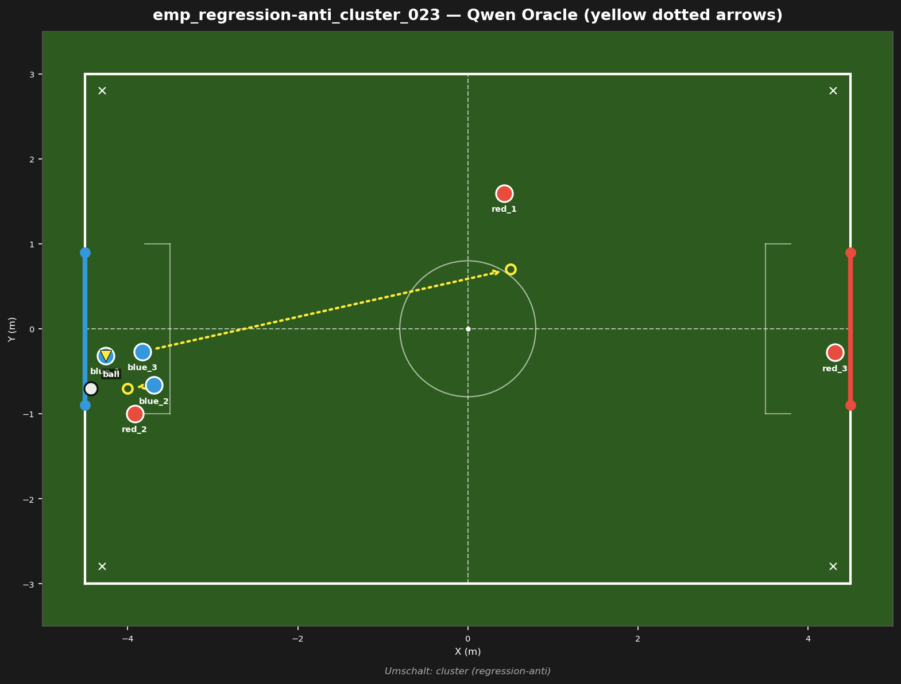
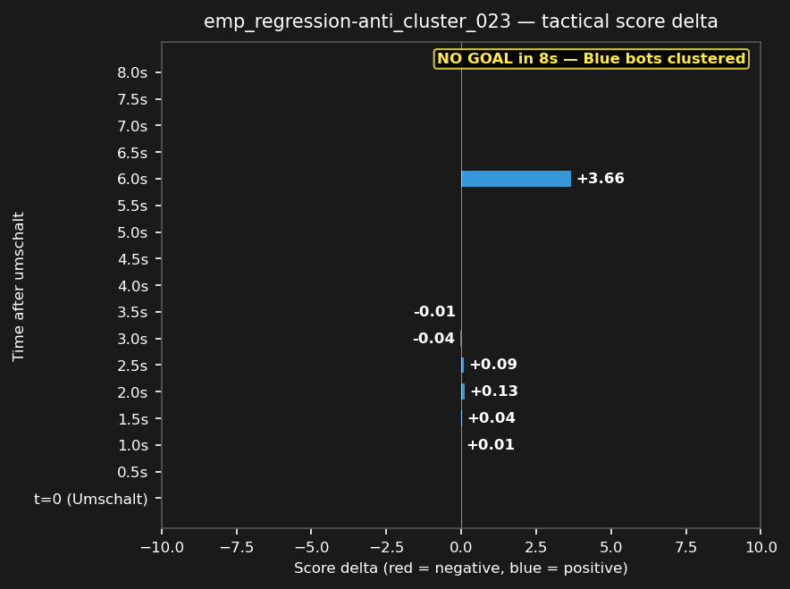

# emp_regression-anti_cluster_023



## Source
- Original match: 3vs3_attack_center_strat_aggro_20260729_223100
- Umschalt type: cluster — Blue bots clustered
- Tag: regression-anti (red scored)
- Cluster: 3 similar fragments reduced to this representative

## Scope
Red won a cluster deep in Blue's half — test whether Blue can recover defensively and prevent the concession.

## Expert (Analysis)
Ball at (-4.4, -0.7), deep in Blue's own half, near Blue's goal. Closest blue: blue_1 (0.4m). Closest red: red_2 (0.6m). Possession: BLUE. Blue clustering: blue_2 and blue_3 are 0.4m apart — tactical congestion limiting options. Blue has a numbers advantage near the ball (3 blue vs 1 red within 2m). Umschalt type: cluster. Red scored — this was a defensive failure for Blue.

## Oracle (Strategy)
To escape the dangerous position: Blue has the ball deep in own half. The nearest blue (blue_1) clears the ball upfield immediately, another blue drops to cover the goal line, and the third blue moves to midfield to receive the clearance.

```
blue_1 kick
blue_3 move to (0.5, 0.7)
blue_2 cover the goal line at (-4.0, -0.7)
```

## Output to bridge

```
blue_1 kick
blue_3 move to (0.5, 0.7)
blue_2 move to (-4.0, -0.7)
```

## Qwen's decision at t_umschalt

```
{
  "assignments": {
    "blue_1": {
      "role": "goalie",
      "action": "Move",
      "x": -4.0,
      "y": -0.5
    },
    "blue_2": {
      "role": "attacker",
      "action": "Kick"
    },
    "blue_3": {
      "role": "defender",
      "action": "Move",
      "x": -4.1,
      "y": -0.5
    }
  }
}
```

## Regression metrics
- Score before: -4.66
- Score after (t+5s): 0.00
- Score delta: +4.66 (positive = good for blue)
- Red behavior: red_midfield
- Match result: red scored (goal #1)

## Score delta



## Test specification
- Duration: 8s
- Expected outcome: score decreases (red advantage)
- Prediction: ON (matches production)
- Pass criterion: score delta direction matches expected
