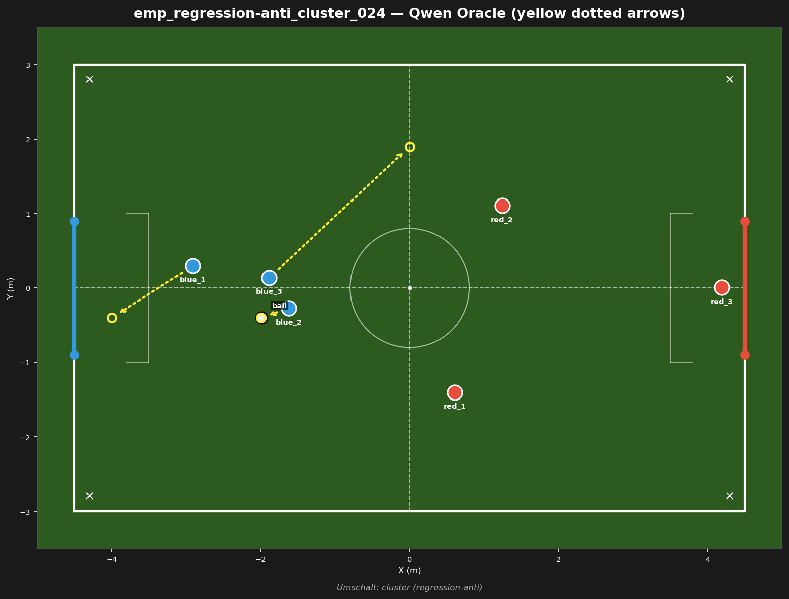
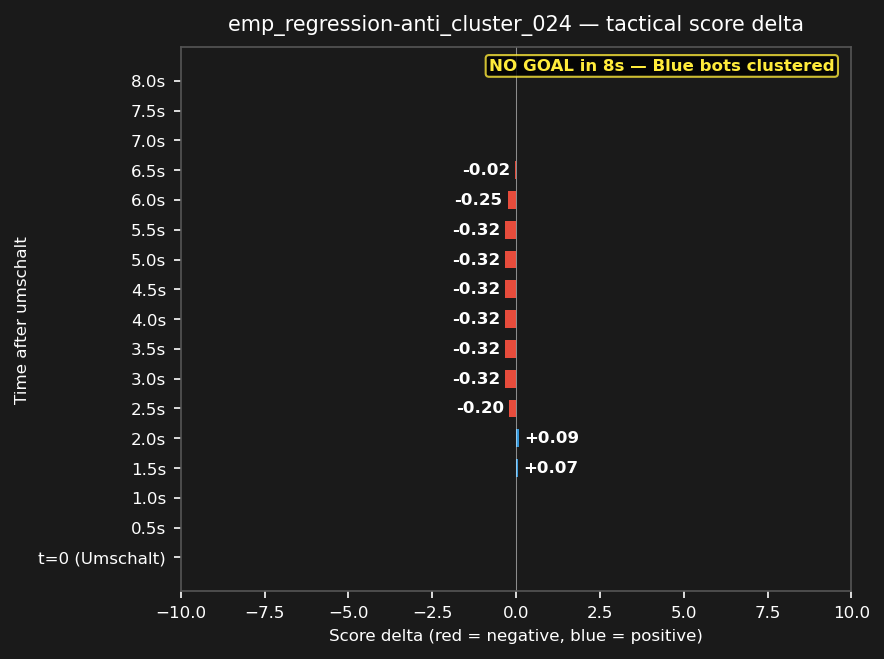

# emp_regression-anti_cluster_024



## Source
- Original match: 3vs3_attack_center_strat_aggro_20260729_231259
- Umschalt type: cluster — Blue bots clustered
- Tag: regression-anti (red scored)
- Cluster: 1 similar fragments reduced to this representative

## Scope
Red won a cluster — test whether Blue can regain defensive shape and prevent a goal.

## Expert (Analysis)
Ball at (-2.0, -0.4), in Blue's own half. Closest blue: blue_2 (0.4m). Closest red: red_1 (2.8m). Possession: BLUE. Blue clustering: blue_2 and blue_3 are 0.5m apart — tactical congestion limiting options. Blue has a numbers advantage near the ball (3 blue vs 0 red within 2m). Umschalt type: cluster. Red scored — this was a defensive failure for Blue.

## Oracle (Strategy)
To break the cluster: two blue bots are within 0.5m of each other. The nearest blue to the ball (blue_2) challenges for possession, the clustered partner spreads wide to open space, and the goalie secures the goal line.

```
blue_2 move to (-2.0, -0.4)
blue_3 move to (0.0, 1.9)
blue_1 cover the goal line at (-4.0, -0.4)
```

## Output to bridge

```
blue_2 move to (-2.0, -0.4)
blue_3 move to (0.0, 1.9)
blue_1 move to (-4.0, -0.4)
```

## Qwen's decision at t_umschalt

```
{
  "assignments": {
    "blue_1": {
      "role": "goalie",
      "action": "Move",
      "x": -4.0,
      "y": 0.0
    },
    "blue_2": {
      "role": "attacker",
      "action": "Kick"
    },
    "blue_3": {
      "role": "defender",
      "action": "Move",
      "x": -1.6,
      "y": 0.7
    }
  }
}
```

## Regression metrics
- Score before: -0.99
- Score after (t+5s): 0.00
- Score delta: +0.99 (positive = good for blue)
- Red behavior: red_deep
- Match result: red scored (goal #1)

## Score delta



## Test specification
- Duration: 8s
- Expected outcome: score decreases (red advantage)
- Prediction: ON (matches production)
- Pass criterion: score delta direction matches expected
