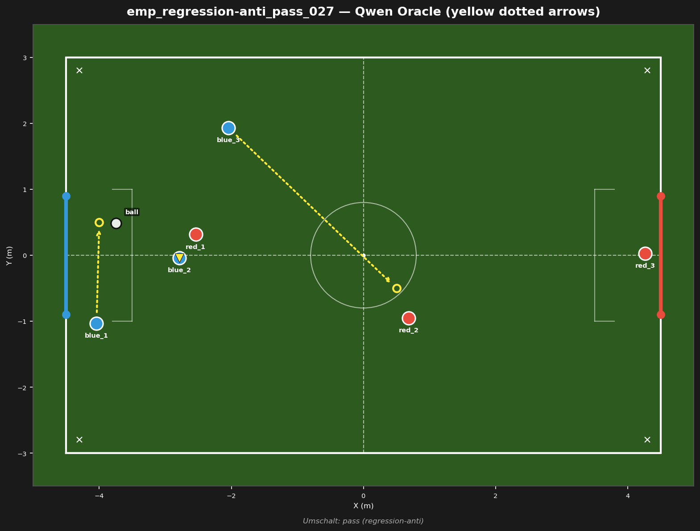
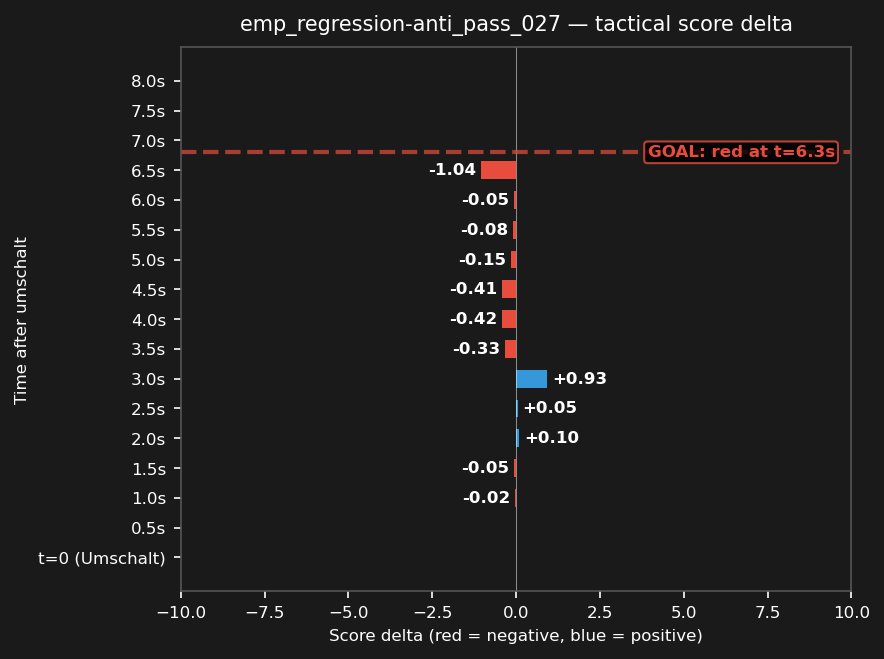

# emp_regression-anti_pass_027



## Source
- Original match: 3vs3_attack_center_strat_aggro_20260730_033730
- Umschalt type: pass — Ball reached the kicker
- Tag: regression-anti (red scored)
- Cluster: 1 similar fragments reduced to this representative

## Scope
Red won a pass deep in Blue's half — test whether Blue can recover defensively and prevent the concession.

## Expert (Analysis)
Ball at (-3.7, 0.5), deep in Blue's own half, near Blue's goal. Closest blue: blue_2 (1.1m). Closest red: red_1 (1.2m). Possession: BLUE. Blue has a numbers advantage near the ball (2 blue vs 1 red within 2m). Umschalt type: pass. Red scored — this was a defensive failure for Blue.

## Oracle (Strategy)
To escape the dangerous position: Blue has the ball deep in own half. The nearest blue (blue_2) clears the ball upfield immediately, another blue drops to cover the goal line, and the third blue moves to midfield to receive the clearance.

```
blue_2 kick
blue_3 move to (0.5, -0.5)
blue_1 cover the goal line at (-4.0, 0.5)
```

## Output to bridge

```
blue_2 kick
blue_3 move to (0.5, -0.5)
blue_1 move to (-4.0, 0.5)
```

## Qwen's decision at t_umschalt

```
{
  "assignments": {
    "blue_1": {
      "role": "goalie",
      "action": "Move",
      "x": -4.0,
      "y": -1.0
    },
    "blue_2": {
      "role": "attacker",
      "action": "Kick"
    },
    "blue_3": {
      "role": "defender",
      "action": "Move",
      "x": -2.3,
      "y": 1.9
    }
  }
}
```

## Regression metrics
- Score before: -5.62
- Score after (t+5s): -6.78
- Score delta: -1.16 (negative = bad for blue)
- Red behavior: red_midfield
- Match result: red scored (goal #2)

## Score delta



## Test specification
- Duration: 8s
- Expected outcome: score decreases (red advantage)
- Prediction: ON (matches production)
- Pass criterion: score delta direction matches expected
