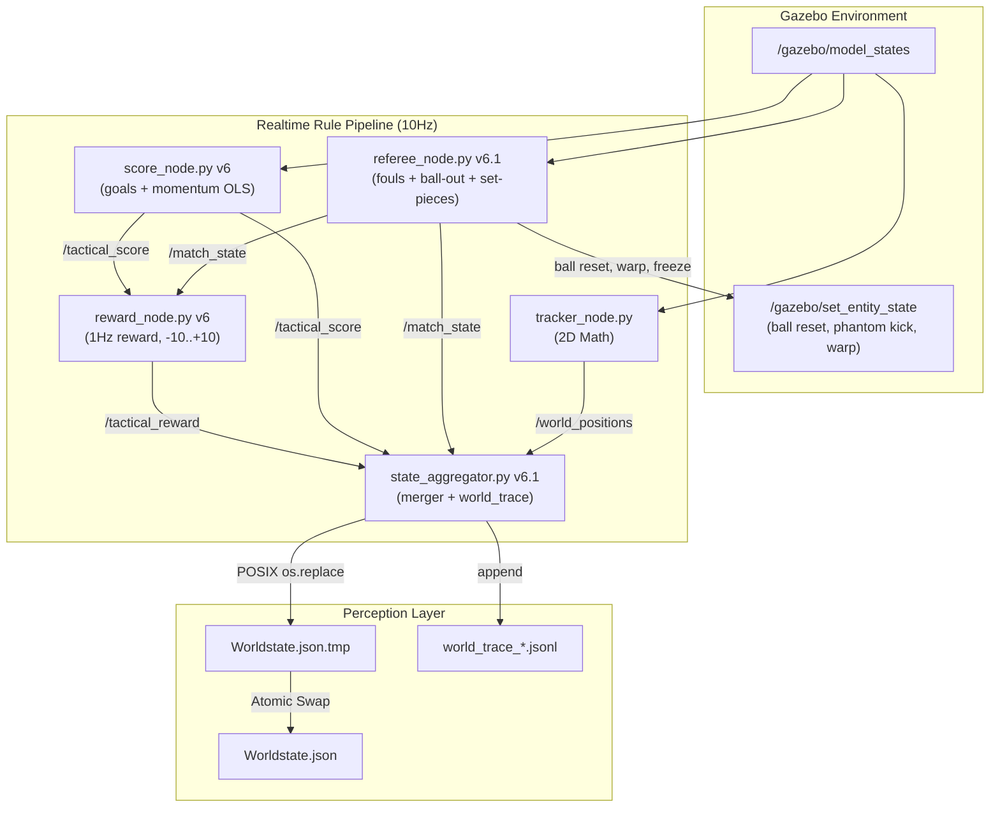

# 2.04 ARCHITECTURE: Engine Nodes (Referee, Score, Reward, Aggregator)

> [!info] Human Summary
> Dieses Dokument beschreibt die ROS 2 Echtzeit-Knoten, die den Spielablauf automatisieren:
> Regelüberwachung (Fouls, Ball-Out, Set-Pieces), Punktestand (Tore + Momentum), Reward
> (1Hz, -10..+10) und Aggregation. V6.1 erweitert den V5-Referee massiv um Foul-Detection,
> einheitliche Set-Pieces und Early Termination.

> [!abstract] LLM Context Anchor
> Das System verlässt sich für den Spielablauf nicht auf manuelle Skripte. Der
> `referee_node.py` überwacht Fouls, Ball-Out und Set-Pieces, der `score_node.py`
> registriert Tore und berechnet Momentum (OLS-Regression), der `reward_node.py` published
> 1Hz Rewards, und der `state_aggregator.py` bündelt alles zu einer einheitlichen JSON-Sicht.
> **[NEW in v5]:** Atomarer POSIX-Rename (`Worldstate.json.tmp` -> `Worldstate.json`).
> **[NEW in v6]:** Foul-Detection (Pushing, Blocking), Ball-Out-Klassifikation, Reward-Node (1Hz), Momentum (OLS).
> **[NEW in v6.1]:** Unified Set-Pieces (Goal Kick, Corner Kick-In, Kickoff), Early Termination, Trace-Logging.
> **Autoritativer Regelkatalog:** `core/docs/referee_rulebook.md` — vor jeder Regeländerung lesen!

## 1. Engine Pipeline Topology (V6.1)



## 2. The Referee Node (referee_node.py)

Der Referee-Knoten fungiert als automatischer Schiedsrichter. V6.1 erweitert ihn massiv.

### 2.1 Tor-Erkennung
* Ball kreuzt X=±4.5 innerhalb der Torbreite (Y=±0.9)
* Kickoff: Score-Team 5s eingefroren, Ball ins Zentrum, `restart_team` = conceding team

### 2.2 Ball-Out-Erkennung
* **Sideline:** `|ball_y| > 3.0`
* **Goal-line (kein Tor):** `|ball_x| > 4.5` UND `|ball_y| > 0.9`
* **Debounce:** 5 consecutive frames (0.5s bei 10Hz)
* **Last-Touch-Tracking:** Hysterese 3 Frames, kein Decay
* **Penalty:** Täter wird 2m nach innen gewarpt, Team 5s eingefroren

### 2.3 Foul-Detection
**Pushing:**
* Distanz: Bot-Zentren innerhalb 0.3m (`PUSHING_DISTANCE_THRESHOLD`)
* Ball-Distanz: Kein Bot innerhalb 0.8m des Balls (`BALL_PROXIMITY_THRESHOLD`)
* Same-Team ausgeschlossen
* **Penalty:** Sideline-Warp (X=±4.0, random Y), Reward -1.0, Cooldown 5s

**Blocking-without-ball:**
* Distanz: Blocking-Bot innerhalb 0.5m des Gegners
* Ball-Distanz: Blocking-Bot NICHT innerhalb 0.8m des Balls
* Obstruktion: Bot innerhalb 30° des Gegner-zu-Ball-Pfads
* Dauer: 3.0s aufrechterhalten (`BLOCKING_MIN_DURATION`)
* **Penalty:** Own-half-Warp, Reward -1.0, Cooldown 5s

### 2.4 Unified Set-Pieces (V6.1)
Alle Restart-Typen folgen `_start_set_piece()`:
1. Ball an Restart-Position platzieren
2. Gegner innerhalb 1.5m radial 2m wegwarpen
3. Gegner-Team 5s einfrieren
4. Status setzen, 5s Countdown starten
5. Countdown endet ODER Restart-Team berührt Ball (< 0.3m) → `BALL FREE`

**Goal Kick** (Verteidiger kicked über eigene Torlinie):
* Ball an Torarea-Ecke: (±3.5, ±1.0)
* Verteidiger bekommt den Restart

**Corner Kick-In** (Angreifer kicked über gegnerische Torlinie):
* Ball an Eckflagge: (±4.3, ±2.8)
* Angreifer bekommt den Restart

**Kickoff** (nach Tor):
* Ball ins Zentrum (0, 0)
* Score-Team 5s eingefroren, Conceding-Team nimmt den Kickoff

### 2.5 `/match_state` V6 Schema
```json
{
  "blue": 0,
  "red": 0,
  "status": "playing",
  "ball_out_event": null,
  "restart_team": null,
  "restart_pos": null,
  "last_toucher": null,
  "foul": null
}
```

Gültige Status: `playing`, `goal`, `ball_out`, `goal_kick`, `corner_kick_in`, `foul_penalty`.

> **Vollständiger Regelkatalog:** `core/docs/referee_rulebook.md` (700 Zeilen, 2D-Felddiagramme,
> State-Machine, alle Thresholds, Visualizer-Labels). Siehe auch [[7_01_INTRODUCTION_Scoring_Referee_Gamestate]].

## 3. The Score Node (score_node.py)

Überwacht Torlinien und berechnet den taktischen Score + Momentum.

### 3.1 Goal Detection
* Überwacht X/Y-Koordinaten des Balls auf Torraum-Durchbruch
* Published Punktestand auf `/tactical_score` (V5: `/v4/match_score`)

### 3.2 Momentum (V6 — OLS Regression)
* `deque(maxlen=300)` Ringbuffer (30s bei 10Hz)
* OLS lineare Regression über das Fenster → Steigung × `MOMENTUM_SCALE_FACTOR=10.0`
* Geclamped auf `-10..+10`
* Minimum 10 Samples vor Trend-Klassifikation (Cold-Start: erste 3s = "stable")
* Trend: `>2.0` ascending, `>0.5` improving, `>-0.5` stable, `>-2.0` declining, else collapsing

### 3.3 Output Schema (`/tactical_score`)
```json
{
  "current_numerical_score": -5.24,
  "average_numerical_score": -0.82,
  "momentum_30s": -2.1,
  "momentum_trend": "collapsing",
  "fact_label": "Red attacking",
  "ball_possession_fact": "Red Team"
}
```

## 4. The Reward Node (reward_node.py — NEW in V6)

Published 1Hz Rewards auf einer `-10..+10` Skala. Zwei Code-Pfade (nicht vermischen!):

* **Decision Reward:** Pollt `current_strategy.json` mtime. Snapshot vor Aktion, warte 5s (Move)
  / 2s (Kick), Snapshot nach. Delta = Reward.
* **Foul Penalty:** Abonniert `/match_state` für Foul-Events. Fixer `-1.0` Penalty.
* **Klassifikation:** `> +1.0` positive, `-1.0..+1.0` neutral, `< -1.0` negative.

## 5. The State Aggregator (state_aggregator.py)

Bündelt Koordinaten, Match-State, Score und Reward in die zentrale `Worldstate.json`
(via atomarem `os.replace` von `Worldstate.json.tmp`) im `shared_state/` tmpfs.

**[V6.1]:** Schreibt zusätzlich `world_trace_<run_id>.jsonl` (append-only, non-blocking,
gitignored). Fehlt der Ordner `shared_state/` beim Systemstart, führt dies zu einem
lautlosen `FileNotFoundError` in den Evaluator-Daemons.

### Example Output: Worldstate.json (V6.1)
```json
{
  "timestamp_ms": 1779222655448,
  "entities": {
    "soccer_ball": {"x": 1.2, "y": 0.0},
    "blue_1": {"x": -0.5, "y": 0.5, "yaw": 1.1},
    "red_1": {"x": 2.5, "y": -1.0, "yaw": -3.14}
  },
  "match_state": {"blue": 0, "red": 0, "status": "playing", "restart_team": null, "foul": null},
  "tactical_score": {"current_numerical_score": -0.5, "momentum_30s": 0.3, "momentum_trend": "stable"}
}
```

## 6. Known Issues & Limitations
* **Service Deadlocks:** Bei Gazebo-Überlast kann der Service-Call des Referee Nodes in einen Timeout laufen.
* **Ghost Goals:** Bei sehr hohen Ballgeschwindigkeiten (>10 m/s) können zwischen zwei 10Hz-Ticks Kollisionen mit der Torlinie übersprungen werden.
* **K1 Freeze Limitation:** Der Referee friert Bots via `/cmd_vel` Twist-zero ein. K1 ignoriert `cmd_vel` — Set-Piece-Freezes sind sim-only.
* **Momentum Cold-Start:** Ringbuffer resetet beim Node-Neustart. Erste 3s produzieren `momentum_trend: "stable"`.

## 7. Related Documentation

| Topic | Document |
|-------|----------|
| Scoring & Gamestate Overview | [[7_01_INTRODUCTION_Scoring_Referee_Gamestate]] |
| World Model Components | [[7_02_ARCHITECTURE_World_Model_Components]] |
| Data Schemas (all topics) | [[6_01_SPECIFICATION_Data_Schemas]] |
| Referee Rulebook (authoritative) | `core/docs/referee_rulebook.md` |
| RAG: Referee & Fouls | `ros2k_knowledge/2_ROS2_PROTOCOLS_AND_FRAMES.md` §V6 Addendum |
| RAG: Momentum & Reward | `ros2k_knowledge/3_AI_LOGIC_AND_EDGE_CASES.md` §V6 Addendum |