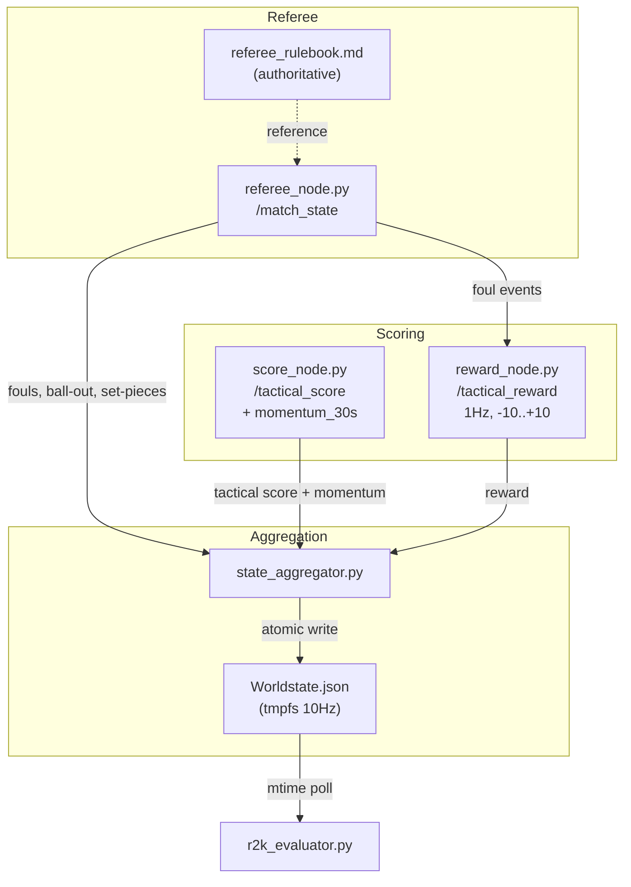

# Scoring, Referee & Game State Overview

> [!info] Zusammenfassung
> Dieses Dokument gibt einen einheitlichen Überblick über das Scoring-System, den
> Schiedsrichter und den Spielzustand (Game State). Es erklärt, wie die drei Komponenten
> interagieren, welche Daten wo published werden, und welche Tradeoffs bei der
> Prompt-Gestaltung beachtet werden müssen.

> [!abstract] LLM Context Anchor
> Die v6-Architektur erweitert den V5-Referee ( einfache Grenzerkennung) um Foul-Detection,
> Ball-Out-Klassifikation, einheitliche Set-Pieces (Goal Kick, Corner Kick-In, Kickoff),
> Momentum-Scoring (OLS-Regression) und einen 1Hz-Reward-Node. Der vollständige
> Regelkatalog liegt in `core/docs/referee_rulebook.md`.

---

## 1. Die drei Komponenten



### 1.1 Referee (`referee_node.py`)

Der Referee ist ein ROS 2 Node, der `/gazebo/model_states` abonniert und Spielregeln
in Echtzeit (10Hz) durchsetzt.

**Was er macht:**
- **Tor-Erkennung:** Ball kreuzt X=±4.5 innerhalb der Torbreite (Y=±0.9)
- **Ball-Out-Erkennung:** Sideline (`|Y| > 3.0`) oder Goal-line (`|X| > 4.5` und `|Y| > 0.9`)
- **Foul-Detection:** Pushing (0.3m Distanz, 0.8m Ball-Distanz) und Blocking-without-ball
  (0.5m Distanz, 30° Obstruktion, 0.8m Ball-Distanz, 3s Dauer)
- **Last-Touch-Tracking:** Hysterese 3 Frames, kein Decay (Täter bleibt Täter)
- **Set-Pieces:** Goal Kick (Ball an Torarea-Ecke ±3.5/±1.0), Corner Kick-In (Ball an
  Eckflagge ±4.3/±2.8), Kickoff (Ball ins Zentrum, Score-Team 5s gefroren)
- **Early Termination:** Freeze endet sofort wenn Restart-Team-Bot innerhalb 0.3m des Balls
- **Penalties:** Sideline-Warp (Pushing), Own-half-Warp (Blocking), 2m-Inward-Warp (Ball-Out)

**Autoritative Referenz:** `core/docs/referee_rulebook.md` — 700-Zeilen-Regelwerk mit
2D-Felddiagrammen, State-Machine, allen Thresholds und Visualizer-Labels. Vor jeder
Regeländerung lesen!

### 1.2 Score Node (`score_node.py`)

Verfolgt den Torstand und berechnet einen taktischen Score (positiv = Blue-Vorteil).

**Momentum (V6):**
- `deque(maxlen=300)` Ringbuffer (30s bei 10Hz)
- OLS lineare Regression über das Fenster → Steigung × `MOMENTUM_SCALE_FACTOR=10.0`
- Geclamped auf `-10..+10`
- Minimum 10 Samples vor Trend-Klassifikation (Cold-Start: erste 3s = "stable")
- Trend-Klassifikation: `>2.0` ascending, `>0.5` improving, `>-0.5` stable,
  `>-2.0` declining, else collapsing

**Output (`/tactical_score`):**
```json
{
  "current_numerical_score": -5.24,
  "average_numerical_score": -0.82,
  "momentum_30s": -2.1,
  "momentum_trend": "collapsing",
  "fact_label": "Red attacking",
  "ball_possession_fact": "Red Team"
}
```

### 1.3 Reward Node (`reward_node.py`)

Published 1Hz Rewards auf einer `-10..+10` Skala. Zwei Code-Pfade (nicht vermischen!):

- **Decision Reward:** Pollt `current_strategy.json` mtime. Snapshot vor Aktion,
  warte 5s (Move) / 2s (Kick), Snapshot nach. Delta = Reward.
- **Foul Penalty:** Abonniert `/match_state` für Foul-Events. Fixer `-1.0` Penalty.

**Klassifikation:** `> +1.0` positive, `-1.0..+1.0` neutral, `< -1.0` negative.

---

## 2. Game State (`/match_state`)

Der Referee published den Spielzustand auf dem `/match_state` Topic. Der
`state_aggregator.py` bündelt ihn in die `Worldstate.json`.

**V6 Schema:**
```json
{
  "blue": 0,
  "red": 0,
  "status": "playing",
  "ball_out_event": null,
  "restart_team": null,
  "restart_pos": null,
  "last_toucher": null,
  "foul": null
}
```

**Gültige Status-Werte:**
| Status | Bedeutung | Dauer |
|--------|----------|-------|
| `playing` | Normales Spiel | — |
| `goal` | Tor gefallen, Kickoff folgt | 5s Countdown |
| `ball_out` | Ball Out-of-Bounds (Sideline) | 5s |
| `goal_kick` | Goal Kick (Verteidiger gekickt) | 5s Countdown |
| `corner_kick_in` | Corner Kick-In (Angreifer gekickt) | 5s Countdown |
| `foul_penalty` | Foul erkannt, Penalty aktiv | bis Penalty fertig |

**Foul-Objekt (wenn `foul` nicht null):**
```json
{
  "type": "pushing",
  "offender": "blue_2",
  "victim": "red_1",
  "position": {"x": -1.5, "y": 0.3},
  "penalty": "sideline_warp"
}
```

Penalty-Werte: `sideline_warp` (Pushing), `own_half_warp` (Blocking),
`warp_2m_freeze_5s` (Ball-Out Sideline).

---

## 3. Interaktion der Komponenten

Der Datenfluss für ein Foul-Beispiel:

1. `referee_node.py` erkennt Pushing zwischen blue_2 und red_1
2. Referee warpt blue_2 zur Sideline (`/gazebo/set_entity_state`)
3. Referee published `match_state` mit `status: "foul_penalty"`, `foul: {...}`
4. `reward_node.py` empfängt foul-Event → published `reward: -1.0`
5. `state_aggregator.py` bündelt alles in `Worldstate.json`
6. `r2k_evaluator.py` pollt `Worldstate.json` → LLM erhält aktualisierte Positionen
7. Nach Penalty: Status → `playing`, `foul: null`

**Für Set-Pieces (Goal Kick / Corner Kick-In / Kickoff):**
1. Referee platziert Ball an Restart-Position
2. Referee warpt Gegner innerhalb 1.5m auf 2m Entfernung
3. Gegner-Team wird 5s eingefroren (Twist-zero)
4. `restart_team` wird gesetzt (Team, das den Restart ausführt)
5. Early Termination: Restart-Team-Bot berührt Ball (< 0.3m) → `BALL FREE` → `playing`

---

## 4. Tradeoffs und Erkenntnisse

### 4.1 Wie viele Samples?

Aus der B-Studie (2026-07-15, 11 Experimente × 3 Runs):

| Samples | Goals B:R | OOB% | Lat p50 | Fazit |
|---------|-----------|------|---------|-------|
| 0 (nur Rules) | 0.0:2.0 | 0% | 320ms | **Totaler Ausfall** — leeres JSON |
| 1 | 1.7:1.0 | 16% | 742ms | **Sweet Spot** — bester Scorer |
| 3 (Baseline) | 0.7:1.0 | 31% | 827ms | Mehr Varianz, mehr OOB |
| 6 | 0.3:1.7 | 15% | 792ms | Diminishing returns |

**Fazit:** 1 Sample ist optimal. Der 3B-Model kopiert ein Muster; er lernt nicht
von Diversität. Mehr Samples verwässern den Fokus und erhöhen die Latenz.

### 4.2 `--explain` vs Latenz

| Modus | OOB% | Lat p50 | Tokens |
|-------|------|---------|--------|
| `--no-explain` (150 tokens) | 16-31% | 815ms | 76 |
| `--explain` (600 tokens) | 1.9% | 1190ms | ~300 |

**Fazit:** Explain-Mode reduziert OOB drastisch (1.9%!), kostet aber +44% Latenz.
Die konsolidierte v6.2 verwendet `--no-explain` + expliziten "STAY INSIDE FIELD"-Text
statt `--explain`.

### 4.3 Goalie Idle — Strukturelle Grenze

Goalie-Idle-Rate: 80-100% in ALLEN Experimenten. **Nicht per Prompt fixbar.**

**Root Cause:** Der Bridge-PD-Controller verfolgt einen jittery ball-Y-Setpoint. Die
`smooth_membership` + Low-Pass-Filter reagieren überempfindlich auf Ballpositionsrauschen.
Ergebnis: Mikro-Oszillationen, der Goalie "bewegt sich" ohne echte Positionsfortschritte.

**Implikation:** Goalie-Verhalten NICHT durch Prompt-Änderungen versuchen zu fixen.
Die Lösung muss im Bridge-PD-Controller liegen (Smoothing-Faktor, Deadband) — siehe
v6.2 Phase 5.1 (Kalman-Filter).

---

## 5. Weiterführende Dokumentation

| Thema | Dokument |
|-------|----------|
| Vollständiger Regelkatalog | `core/docs/referee_rulebook.md` |
| Engine-Node-Architektur | [[2_04_ARCHITECTURE_Engine_Nodes]] |
| Daten-Schemas (alle Topics) | [[6_01_SPECIFICATION_Data_Schemas]] |
| Team Red Foul-Logik | [[3_05_ARCHITECTURE_TeamRed_Algorithmic]] |
| Prompt-Architektur | [[7_04_SPECIFICATION_Prompt_Architecture]] |
| Weltmodell-Komponenten | [[7_02_ARCHITECTURE_World_Model_Components]] |
| RAG: Referee & Fouls | `ros2k_knowledge/2_ROS2_PROTOCOLS_AND_FRAMES.md` §V6 Addendum |
| RAG: Momentum & Reward | `ros2k_knowledge/3_AI_LOGIC_AND_EDGE_CASES.md` §V6 Addendum |