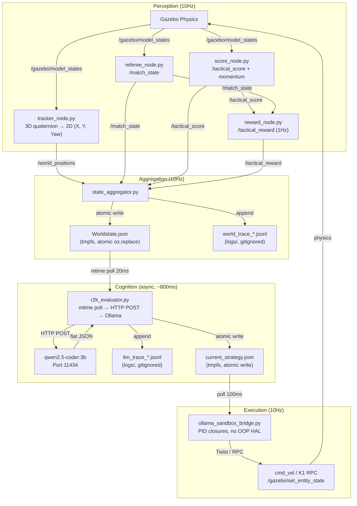

# World Model: Components & Data Flow

> [!info] Human Summary
> This document explains the full pipeline from physical perception (Gazebo) through
> cognition (LLM) to execution (motor commands). It answers the question: "What does
> the LLM actually see, and how does its decision reach the robots?"

> [!abstract] LLM Context Anchor
> The world model is built from a single ground truth (`/gazebo/model_states`), flattened
> to 2D by `tracker_node.py`, enriched by referee/score/reward nodes, and written to
> `Worldstate.json` via atomic `os.replace` on tmpfs. The LLM sees a stripped-down version
> (X/Y coordinates only by default). V6.1 adds a trace logging layer that observes the
> entire pipeline without interfering with it.

---

## 1. The Pipeline



---

## 2. What the LLM Sees

### 2.1 Default (what the LLM receives)

`r2k_evaluator.py:88` strips the worldstate to `min_ents` — a flat dict of entity
positions rounded to 1 decimal:

```json
{
  "blue_1": {"x": -1.5, "y": 0.3},
  "blue_2": {"x": 0.0, "y": 2.1},
  "blue_3": {"x": -4.0, "y": -0.2},
  "red_1": {"x": 2.1, "y": -0.2},
  "red_2": {"x": 1.5, "y": 1.5},
  "red_3": {"x": 1.5, "y": -1.5},
  "soccer_ball": {"x": 0.0, "y": 0.1}
}
```

**What's stripped out:**
- `match_state` (score, status, fouls, restart_team)
- `tactical_score` (momentum, trend, possession)
- `tactical_reward` (reward values, classification)
- All yaw angles
- All velocities

### 2.2 With `R2K_INCLUDE_MATCH_STATE=1`

Setting the env var `R2K_INCLUDE_MATCH_STATE=1` injects a `match_state` object into
the LLM payload:

```json
{
  "blue_1": {"x": -1.5, "y": 0.3},
  "...": "...",
  "match_state": {
    "status": "ball_out",
    "restart_team": "blue"
  }
}
```

> [!warning] B-study finding: inconclusive
> Experiment B3 tested `R2K_INCLUDE_MATCH_STATE=1` and found no improvement over
> baseline. The 3B model may not effectively use game-state information in its
> reasoning. Dynamic prompt selection (v6.2 Phase 5.5) may be a better approach
> than injecting state into the payload.

### 2.3 System Prompt

The LLM also receives the assembled system prompt from `strategy/fragments/` (see
[[7_04_SPECIFICATION_Prompt_Architecture]]). This is static within a run — it does
not change based on game state (unless dynamic prompt selection is implemented).

---

## 3. Ground Truth: `/gazebo/model_states` Only

> [!warning] Architectural Axiom
> ROS2K uses **only** `/gazebo/model_states` as spatial ground truth. Never assume
> per-bot `/odom` topics or TF2 transform trees for basic spatial awareness.
>
> `tracker_node.py` flattens 3D quaternions to 2D (X, Y, Yaw). There is no velocity
> estimation, no Kalman filter, no sensor fusion. This is a known limitation —
> see §5 Future Work.

### 3.1 Why Not Per-Bot Odometry?

- Sim bots don't publish `/odom` — only Gazebo knows their position
- Physical bots (ESP32, K1) have unreliable odometry (slip, drift)
- A single source of truth (`/gazebo/model_states`) prevents consistency issues
- The referee, score, and reward nodes all subscribe to the same tracker output

### 3.2 What This Means for the LLM

The LLM receives **stale** positions — the world state is from when
`state_aggregator.py` last wrote `Worldstate.json` (up to 100ms ago). By the time
the LLM responds (~800ms later), the world has moved. This is the **latency
problem** that Phase 5.2 (Predictive World Model) aims to solve.

---

## 4. Trace Logging: The Observability Layer (V6.1)

V6.1 adds a third decoupled channel alongside tmpfs state sync and ROS 2 topics:

| Channel | Purpose | Direction |
|---------|---------|-----------|
| tmpfs state sync | Runtime state (Worldstate.json, current_strategy.json) | bidirectional |
| ROS 2 topics | Real-time communication | bidirectional |
| **Trace logging** | Offline observability | **write-only** |

### 4.1 Two Trace Files

- `logs/llm_trace_<run_id>.jsonl` — one JSON line per LLM call (world snapshot,
  raw response, parse_code, latency_ms, model, explain flag). Written by
  `r2k_evaluator.py:25-42`.
- `logs/world_trace_<run_id>.jsonl` — one JSON line per 10Hz world-state write
  (entities, match_state, tactical_score). Written by `state_aggregator.py:60-71`.

### 4.2 Design Constraints

- **Non-blocking:** all trace writes are `try/except` with bare `pass` on failure.
  A trace error NEVER crashes the 10Hz loop or the LLM evaluator.
- **Append-only JSONL:** no reads, no locks, no atomic swaps. Each line is
  self-contained JSON.
- **Decoupled:** trace logging happens AFTER the atomic Worldstate.json swap and
  AFTER the LLM response is parsed. It observes the outcome, never influences it.
- **Gitignored:** `logs/` is not tracked. Not wiped on boot. Accumulates across runs.
- **Correlated:** both files share `R2K_RUN_ID` (env var from `launch_r2k.sh:82`).

### 4.3 Offline Analysis

`tools/analyze_trace.py --run-id <ID>` joins both trace files by timestamp and
computes 14 KPIs. See [[7_03_CHEATPAGE_Tools_and_Utils]].

---

## 5. Future Work (v6.2 Phase 5)

The current world model has known limitations that the v6.2 spec addresses as
research directions:

### 5.1 Kalman Filter (Phase 5.1)
Replace raw positions with Kalman-filtered estimates. Smooth noise, derive
velocity without finite-difference amplification. Would also address the goalie
idle problem (smoother ball-Y setpoint → less PD jitter).

### 5.2 Predictive World Model (Phase 5.2)
Forward-simulate world state by N ms (matching LLM latency ~800ms). Feed the LLM
the *predicted* future state. Reduces effective latency to near-zero from the
LLM's perspective. Requires velocity estimates (5.1).

### 5.3 Deviation Watchdog (Phase 5.3)
Compare predicted vs actual world state at each 10Hz tick. Flag anomalies
(bots flying, ball warping, model drift). Trigger failsafe if critical.

### 5.4 Failsafe Fallback (Phase 5.4)
If LLM latency > 5000ms or parse error rate > 20% → switch blue to rule-based
behavior (mirror `rule_evaluator_red.py`). System never hangs, never produces
dangerous commands.

See `core/docs/optimization_spec_v6.2.md` §7 Phase 5 for the full roadmap.

---

## 6. Related Documentation

| Topic | Document |
|-------|----------|
| Scoring, Referee, Gamestate | [[7_01_INTRODUCTION_Scoring_Referee_Gamestate]] |
| Data Schemas (all topics) | [[6_01_SPECIFICATION_Data_Schemas]] |
| State Sync & File I/O | [[1_04_SPECIFICATION_State_Sync_FileIO]] |
| Trace file schemas | [[6_01_SPECIFICATION_Data_Schemas]] §Trace Files |
| RAG: Architecture & Sync | `ros2k_knowledge/1_CORE_ARCHITECTURE_AND_SYNC.md` |
| RAG: Trace logging | `ros2k_knowledge/6_DATA_SCHEMAS_AND_LIFECYCLE.md` §V6.1 Addendum |