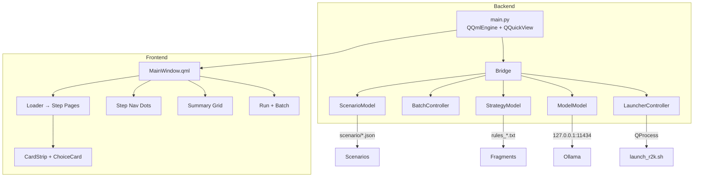
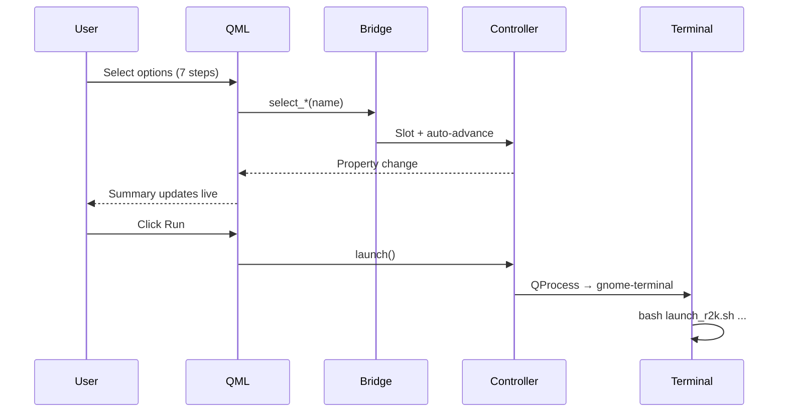

# ROS2K GUI Launcher

PySide6 + QML launcher wrapping `launch_r2k.sh`. Single-screen, 7-step config wizard with batch execution.

**Stack:** PySide6 6.11.1 · QML (Basic Dark) · Python 3.10

---

## Quick Start

```bash
cd poc/GuiMockup && python3 main.py
```

---

## Architecture



### Data Flow



---

## Structure

```
GuiMockup/
├── main.py                    # Entry point
├── bridge.py                  # QObject → QML context property
├── Theme/                     # Dark theme singleton
├── window/MainWindow.qml      # Shell: loader, dots, summary, actions
├── panel/CardStrip.qml        # Scrollable card strip
├── components/ChoiceCard.qml  # 160×96 button
├── pages/                     # 7 step pages (one QML each)
├── models/                    # Data discovery (scenarios, strategies, models)
├── controllers/               # State, CLI assembly, QProcess launch
└── tests/                     # 57 tests (pytest-qt)
```

---

## Key Design Decisions

| Decision | Choice | Why |
|----------|--------|-----|
| Framework | PySide6 (not PyQt6) | LGPL, bundled QML tools, no license cost |
| Engine | `QQmlEngine` + `QQuickView` (not `QQmlApplicationEngine`) | PySide6 6.11.1 bug workaround |
| Style | Basic (not Material) | Material breaks Button rendering |
| QML root | `Item` (not `ApplicationWindow`) | `QQuickView` constraint |
| Launch | Terminal emulator (gnome-terminal → xterm → konsole) | Avoids subprocess stdio issues |

---

## Config Steps

| # | Step | Source | Items |
|---|------|--------|-------|
| 1 | SCENARIO | `scenario/*.json` + packages | ~18 |
| 2 | STRATEGY | `rules_*.txt` fragments | 8 |
| 3 | MODEL | Ollama `/api/tags` | ~2-5 |
| 4 | RELAY | Hardcoded enum | 2 |
| 5 | EXPLAIN | Toggle buttons | 2 |
| 6 | HEADLESS | Toggle buttons | 2 |
| 7 | DURATION | Slider + input | — |

---

## Dependencies

PySide6 ≥ 6.11.1, requests. No ROS 2 / Gazebo / Ollama needed to launch the GUI.
