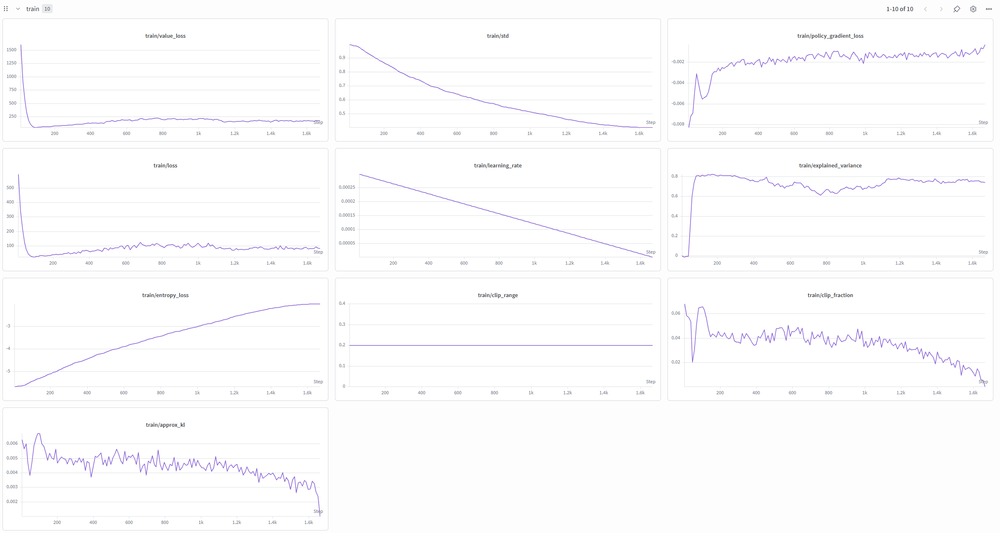

# Projekt-Dokumentation: Booster-K1 RL mit MuJoCo

Diese Dokumentation dient als technischer Leitfaden für das Framework des Roboters **Booster-K1**. Ziel ist es, die Architektur transparent zu machen und sicherzustellen, dass Weiterentwicklungen, insbesondere in der GPU-Pipeline, fehlerfrei und performant umgesetzt werden können.

---

## 1. Projektüberblick

### Kurze Beschreibung

Dieses Repository enthält das Simulations-, Steuerungs- und Reinforcement-Learning-Framework für den Roboter Booster-K1. Es steuert die Beindynamik des Roboters in einer physikalischen Umgebung, um ein stabiles, periodisches Schwingen der Beine in einer sitzenden Pose zu erlernen.


### Ziel des Projekts

Das primäre Ziel ist es, dem Roboter über Reinforcement Learning (RL) eine robuste Steuerung der Hüft- und Kniegelenke beizubringen. Er soll einer vorgegebenen Sinus-Sollbewegung folgen, ohne das Gleichgewicht zu verlieren oder vom Tisch zu fallen.


### MuJoCo-Modell

Als physikalische Basis dient das XML-Modell `assets/K1_sitting.xml`. Der Torso (`Trunk`) ist über einen `freejoint` mit 7 Freiheitsgraden im Raum verankert (3D-Position + Quaternion-Rotation). Der Roboter verfügt über 22 Gelenke (Motoren), wovon vier angesteuert werden: `Left_Hip_Pitch`, `Right_Hip_Pitch`, `Left_Knee_Pitch` und `Right_Knee_Pitch`. Die Geometrie und das visuelle Erscheinungsbild werden über externe 3D-Meshes (`.stl`-Dateien) im `assets`-Ordner geladen.


### Verwendete RL-Algorithmen

Es wird ausschließlich **PPO (Proximal Policy Optimization)** verwendet. PPO ist ein On-Policy Actor-Critic Algorithmus, der durch sein Clipping-Verfahren eine stabile und konvergente Anpassung der Steuerungspolicies bei kontinuierlichen Action Spaces garantiert.


### Projektstruktur

```bash
booster-k1
├── assets              # Enthält die Simulationswelt
│   ├── K1_22dof.xml    # K1-Modell mit 22 Freiheitsgraden
│   ├── K1_sitting.xml  # Keyframe für die Startposition
│   └── meshes          # Glieder des K1-Modells
│       └── ...
├── src
│   ├── control             # Direkte Python-Steuerung für Demos und Tests
│   │   ├── legswing.py     # Demo für die Soll-Bewegung der Beine
│   │   └── test_mujoco.py  # Testskript für den MuJoCo-Viewer
│   └── rl
│       ├── cpu                  # CPU-Pipeline (Stable-Baselines3)
│       │   ├── evaluate.py      # Viewer um Modell zu testen
│       │   ├── legswing_env.py  # Environment
│       │   └── train.py         # Trainingsskript
│       └── gpu                          # GPU-Pipeline (MJX)
│           ├── evaluate_v1_explicit.py  # Testskript für native Modelle
│           ├── legswing_mjx_env.py      # Environment
│           ├── train_v1_explicit.py     # Native JAX-Implementierung
│           └── train_v2_brax.py         # Trainingsskript mit Brax-Framework
└── sweep.yaml
```


### Bereichserklärung

- `control/`: Dient dem schnellen Testen von Hardware-Limits, der Verifizierung des XML-Modells oder Keyframes und visuellen Kontrollen ohne KI-Einfluss. Nutzt CPU-Umgebung: `conda activate k1_env_cpu`

- `rl/cpu/`: Nutzt Stable-Baselines3 (PyTorch) auf der CPU. Perfekt geeignet zum schnellen Debuggen der Reward-Logik, da Python-Strukturen nicht kompiliert werden und print() direkt genutzt werden kann. Nutzt CPU-Umgebung: `conda activate k1_env_cpu`

- `rl/gpu/`: Die Hochleistungs-Pipeline. Nutzt Google Brax und MuJoCo MJX unter JAX. Ermöglicht das gleichzeitige Simulieren von tausenden Robotern auf der GPU. Nutzt GPU-Umgebung: `conda activate k1_env_gpu`

---

## 2. Entwicklungsstatus

| Bereich | Status | Beschreibung |
|---------|--------|--------------|
| control | aktiv | Voll funktionsfähig für beliebige, schnelle Tests und Überprüfungen |
| cpu (SB3) | stabil | Dient als mathematische Referenz, besonders Validierung von Rewardfunktionen |
| gpu explicit | Legacy | Expliziter JAX-Loop. Zeigt interne Funktion und bietet volle Kontrolle |
| gpu brax | Hauptentwicklung | Fokus für zukünftige Erweiterung. Nutzt optimierte Google-Schnittstelle |

<br>

Für die Weiterentwicklung des Legswings oder anderen Skills sollte Brax verwendet werden.

---

## 3. Environment

### Observation Space (Size: 12)

Das neuronale Netz erhält in jedem Zeitschritt einen flachen, auf 1D skalierten Vektor bestehend aus 12 Float-Werten.

| Index | Feature | Format | Beschreibung |
|-------|---------|--------|--------------|
| `0` | `qpos` Left Hip | `data.qpos[lhp:lhp+1]` | Aktueller Winkel der linken Hüfte
| `1` | `qvel` Left Hip | `data.qvel[lhp:lhp+1]` | Winkelgeschwindigkeit der linken Hüfte
| `2` | `qpos` Right Hip | `data.qpos[rhp:rhp+1]` | Aktueller Winkel der rechten Hüfte
| `3` | `qvel` Right Hip | `data.qvel[rhp:rhp+1]` | Winkelgeschwindigkeit der rechten Hüfte
| `4` | `qpos` Left Hip | `data.qpos[lkp:lkp+1]` | Aktueller Winkel des linken Knies
| `5` | `qvel` Left Hip | `data.qvel[lkp:lkp+1]` | Winkelgeschwindigkeit des linken Knies
| `6` | `qpos` Right Hip | `data.qpos[rkp:rkp+1]` | Aktueller Winkel des rechten Knies
| `7` | `qvel` Right Hip | `data.qvel[rkp:rkp+1]` | Winkelgeschwindigkeit des rechten Knies
| `8` | Angular-velocity | `data.sensordata[adr:adr+1]` | Gyro-Messwert des Torsos (Winkelgeschwindigkeit)
| `9` | Uprightness | `jnp.atleast_1d(uprightness)` | Torsowinkel zur Z-Achse
| `10` | Target sin | `jnp.array([jnp.sin(...)])` | Angestrebter Zielwinkel der Knie
| `11` | Target cos | `jnp.array([jnp.cos(...)])` | Phasenverschobene Kurve zur Orientierung

<br>

Der Vektor wird über `jnp.concatenate` zusammengesetzt. Mit Slicing (`[adr:adr+1]`) oder `jnp.atleast_1d` wird die 1D-Eigenschaft erzeugt.


### Action Space (Size: 4)

Das Netzwerk gibt einen Vektor mit 4 kontinuierlichen Werten im Bereich `[-1.0, 1.0]` aus.  
Die Werte steuern die Aktuatoren für Hüfte links/rechts und Knie links/rechts.


### Reward Function

Die totale Belohnung pro Zeitschritt berechnet sich wie folgt:

**`total_reward = swing_reward + termination_penalty + energy_penalty`**

#### 1. Stability Term

- **Formel:** `stability = jax.numpy.exp(-20.0 * ((1.0 - uprightness)**2))`

- **Grund & Wirkung:** Misst die Neigung des Torsos. Steht der Roboter perfekt aufrecht (`uprightness = 1.0`), ist `stability = 1.0`. Kippt er leicht, bricht der Wert exponentiell ein. Er dient als Multiplikator für den Hauptreward.

#### 2. Swing Reward

- **Formel:** `swing_reward = stability * (jax.numpy.exp(-5.0 * error_left**2) + jax.numpy.exp(-5.0 * error_right**2))`

- **Grund & Wirkung:** Berechnet den quadratischen Fehler (`error`) zwischen der Soll-Sinuskurve und dem echten Knie-Winkel. Eine Bell-Curve wandelt den Fehler in Punkte um (Maximum = 2.0 pro Schritt). Da er mit `stability` multipliziert wird, bekommt der Roboter nur dann Punkte für das Beinschwingen, wenn er gleichzeitig stabil sitzt.

#### 3. Termination Penalty

- **Formel:** `jax.numpy.where(terminated > 0.0, -1.0, 0.0)`

- **Grund & Wirkung:** Wenn der Roboter zu stark kippt (`uprightness < 0.95`) oder vom Tisch fällt (`qpos[2] < 0.5`), wird die Episode abgebrochen. In diesem letzten Schritt kassiert er eine Strafe von -1.0.

#### 4. Energy Penalty

- **Formel:** `-0.01 * jax.numpy.sum(jax.numpy.square(action))`

- **Grund & Wirkung:** Bestraft heftiges, unkontrolliertes Ruckeln, Zittern und maximale Motorausschläge. Zwingt das Netz zu einer weichen, gleichmäßigen Bewegung.

---

## 4. Trainingspipeline

### CPU-Pipeline (Stable-Baselines3)

Das Training läuft leicht parallelisiert (SB3: SubprocVecEnv) auf 16 Kernen / 16 gleichzeitige Simulationen.

`train.py (Main) --> legswing_env.py (Gymnasium) --> SB3 PPO Algorithm --> WandB Metrics`


### GPU-Pipeline (Brax)

Das Training läuft stark parallelisiert (Standard: 1024 simultane Umgebungen) und vollständig innerhalb des Grafikspeichers ab.

`train_brax.py --> legswing_mjx_env.py (MJX) --> Brax PPO-Engine --> JAX XLA-Kompilierung --> GPU VRAM --> WandB Metrics`

JAX Compilation: Beim Aufruf von make_train_run() wird der gesamte Ablauf über XLA in hocheffizienten Maschinencode für die GPU übersetzt und an einem Stück ausgeführt.

Beide Pipelines nutzen einen linear-scheduler, um die `learning_rate` über das Training hinweg von initialen `0.0004` linear auf `0.0` zu reduzieren, um anfangs Exploration und zuletzt Präzision zu fördern.

---

## 5. Weights & Biases (WandB)

### Projektstruktur

Das Dashboard im WandB-projekt `booster-k1` gliedert sich in:

- **Runs:** Einzelne Trainingsdurchläufe. Jeder Durchlauf erhält eine eindeutige ID, unter der während des Runs auch Checkpoints erstellt werden.

- **Sweeps:** Sammlungen von koordinierten Einzelläufen zur automatischen Hyperparametersuche.




### Wichtige Metriken & Interpretation

- `explained_variance`: Misst, wie gut das Value-Netzwerk die zukünfigen Rewards vorhersagt. (1.0 = perfekte Vorhersage, 0.0 = reines Raten)

- `approx_kl`: Misst, wie stark sich die neue Policy von der alten unterscheidete. (0.002 bis 0.02 optimal)

- `clip_fraction`: Anteil der Samples, bei denen PPO clippen muss. (1% bis 10% optimal)

- `std`: Exploration der Policy. (hohe std = viel Zufall, niedrige std = deterministischer, gleichmäßiger Abfall optimal)

- `policy_gradient_loss`: Gradientenbeitrag der eigentlichen Policy. (keine zu starken Ausreißer)

- `entropy_loss`: Misst die Zufälligkeit der Policy. (sollte gleichmäßig Richtung 0 gehen, ähnlich wie std)

- `value_loss`: Fehler des Value-Netzwerks. Sollte anfangs schnell fallen, niemals stark ansteigen. Leichter Anstieg nach dem Einbruch ist bei PPO normal.

---

## 6. Sweeps (Hyperparameter-Optimierung)

Um automatisierte Experimente durchzuführen, wird die Variable `sweep = True` in `train.py` (cpu) oder `train_brax.py` (gpu) gesetzt. Die Steuerung erfolgt über eine sweep.yaml.

### Wichtige Sweep-Parameter & Suchräume

- `learning_rate`: Suchraum min: `0.00002`, max: `0.0005`

- `entropy_coefficient`: Suchraum min: `0.005`, max:`0.04`

- `layer-size`: Suchraum `[128, 256, 512]`


### Zielmetrik

Als primäre Optimierungsmetrik ist `train/reward_mean` (Maximierung) definiert. Ein Sweep-Agent wertet nach jedem Run aus, welche Parameter die stabilste Schwingbewegung ohne Umkippen erzeugt haben.

---

## 7. GPU-Version (Hauptarchitektur & Workflow)

### 1. Normales Standalone-Training

Führe das Brax-Trainingsskript direkt aus. Es nutzt die vordefinierten Konstanten aus dem Skript als Hyperparameter:

```bash
cd Workspace/booster-k1
python src/rl/gpu/train_brax.py
```


### 2. Einen Hyperparameter-Sweep initialisieren

Füge die gewünschten Suchbereiche in die `sweep.yaml` ein, oder erstelle eine neue und initialisiere den Sweep auf den WandB-Servern:

```bash
wandb sweep sweep.yaml
```

Das Terminal gibt eine `SWEEP_ID` zurück.


### 3. Einen Sweep-Agenten starten

Um die GPU nun die Kombinationen abarbeiten zu lassen (setze `sweep = True` im Skript) und starte den Agenten mit der generierten ID:

```bash
wandb agent SWEEP_ID
```

Durch `sweep = True` wird die Kontrolle der Hyperparameter an den Sweep abgegeben. Zudem werden keine Checkpoints mehr erstellt, um die Speicherbelastung bei langen Sweeps zu reduzieren.


### 4. Checkpoints laden und verwalten

Die trainierten Modelle werden automatisch über `pathlib` im Ordner `models/gpu/{run_id}` gespeichert. Für die Checkpoints wird in dem Verzeichnis der Unterordner `checkpoints` erstellt.
Die Modelle aus Stable-Baselines3 werden analog zu den GPU-Modellen unter `models/cpu` gespeichert. Am Ende des Trainings wird das finale Modell unter `models/gpu/{run_id}/k1_legswing_rl_final.pkl` (GPU) bzw. `models/cpu/{run_id}/k1_legswing_rl_final.zip` (CPU) gesichert.

---

## 8. Bekannte Probleme & Troubleshooting

### 1. JAX: Der Code hängt beim Start

- **Ursache:** Das ist kein Bug, sondern die JAX-Kompilierung. Bei 1024 Envs und dem komplexen Rechengraphen von Brax dauert das "Hochladen" aus dem Arbeitsspeicher in die GPU ca. 30 bis 90 Sekunden.

- **Lösung:** Abwarten, bis im Terminal `=== Start Training ===` erscheint. Danach läuft das Training komplett auf der GPU mit voller Auslastung.


### 2. Python-Logik in JAX

- **Ursache:** Nutzt man klassische Python-Logik (wie `if`, oder `while`) in einer der JAX-Methoden (v. a. reset(), step(), _get_obs(), _calculate_reward()) stürzt das Training ab, weil JAX nur ein abstraktes Symbol und keinen echten Wert sieht.

- **Lösung:** Stattdessen nutzt man mathematische JAX-Operationen wie `jax.numpy.where(Bedingung, True-Wert, False-Wert)` statt `if-else`, oder `jax.numpy.maximum()` statt `or`. Zudem sollten alle Variablen vom Typ `float` sein, um aufwendige Typkonvertierungen auf der GPU zu vermeiden


### 3. MuJoCo Viewer in Zeitraffer

- **Ursache:** Beim Testen eines fertigen Modells mit einem Evaluationsskript und MuJoCo-Viewer lastet das Skript den Kern komplett aus und die Simulation läuft so schnell, wie der Kern es berechnen kann.

- **Lösung:** In die Viewer-Schleife muss ein bedingtes `sleep()` eingebaut werden, das immer aufgerufen wird, wenn die Simulationszeit schneller als Echtzeit ist. So wird die Simulation auf Echtzeit synchronisiert.

---

## 9. Roadmap (Nächste Schritte)

### Kurzfristig (geplant)

- `evaluate_brax.py` fertigstellen: Ein Skript schreiben, das eine `.pkl`-Datei lädt, die Gewichte in das Actor-Netzwerk einspeist und den gelernten Schwing-Erfolg visuell im MuJoCo-Viewer präsentiert.

- Sobald die GPU-Umgebung vollständig auf Brax umgestellt ist, können die nativen JAX-Implementierungen (`explicit`-Dateien) entfernt, oder archiviert werden.

- Ausführliches Training und lange Sweeps durchführen, um mit einem erfolgreichen Modell die ganze Umgebung zu validieren.


### Langfristig (optional)

- Domain Randomization hinzufügen: Kleine Abweichungen der Gelenkreibung und Massenwerte bei jedem `reset` einbauen, damit die gelernte KI robuster wird.

- Curriculum Learning: Das Training mit einer kleinen Schwing-Amplitude beginnen und diese automatisch steigern, sobald der Roboter stabil sitzt.

- Sim-to-Real Transfer: Vorbereitung der finalen `.pkl`-Gewichte für den Export auf die reale Steuerungs-Hardware des Booster-K1.